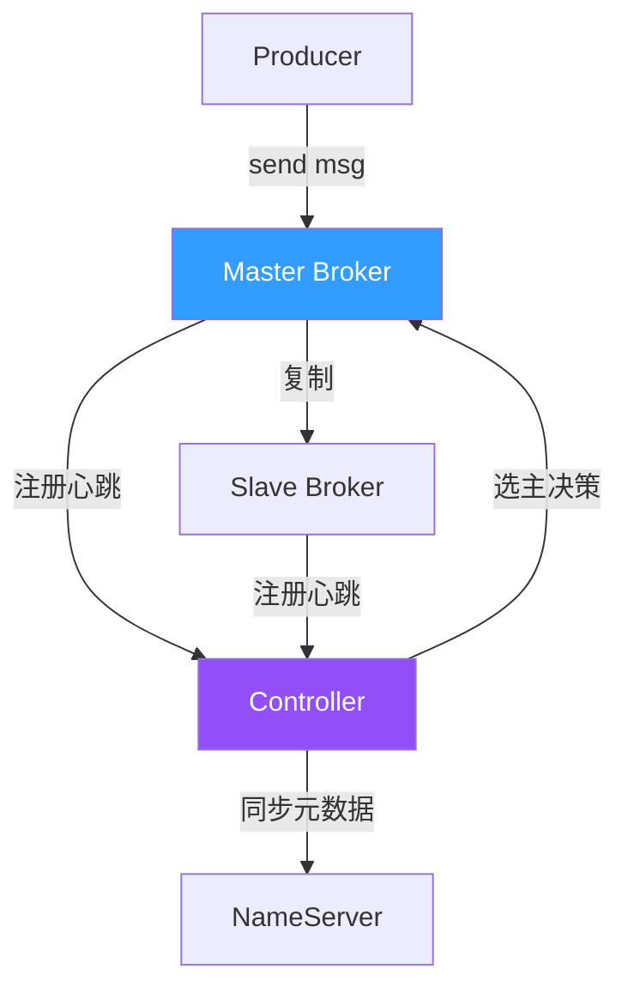
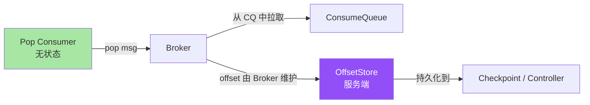
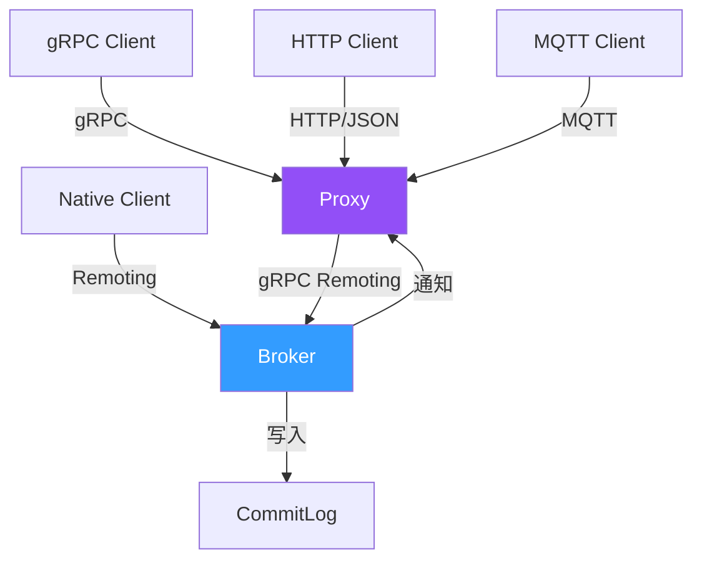
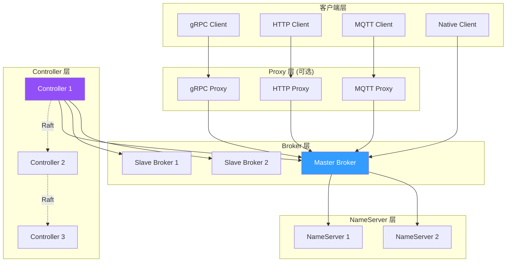

# RocketMQ 5.x 新特性全景：Controller + Pop + Proxy + IoT + gRPC 五大能力的架构穿透

> 一句话摘要：**RocketMQ 5.x 不是小版本升级，而是从「消息中间件」走向「消息+事件+流」融合平台的架构跃迁**。五大新特性——Controller（自动主从切换）、Pop Consumer（无状态消费）、Proxy（无侵入网关）、IoT 物联网消息、gRPC 协议——分别解决「运维难、消费重、接入慢、协议弱、跨域难」五个老大难问题。

> 学完能会：理解 RocketMQ 5.x 架构跃迁 / Controller 自动选主原理 / Pop 无状态消费 vs 经典 Push / Proxy 部署模型 / IoT MQTT-like 协议 / gRPC 客户端兼容。

---

## 1. 背景：为什么 5.x 是一次「范式跳跃」

RocketMQ 4.x 时代的事实是：它是一个**顶级的消息中间件**，但在云原生、Serverless、IoT 三大新场景下捉襟见肘。具体表现为：

```
4.x 三大痛点：
1. 运维难：主从切换需手动 + NameServer 无选主 → 30s+ 切换窗口
2. 消费重：经典 Push 消费需要本地存储 offset + 长连接 → 无法做无状态消费
3. 接入慢：原生客户端需要引入 SDK + 知道 broker 地址 → 难以 Serverless

5.x 三大跃迁：
1. Controller 自动选主 → 秒级切换
2. Pop Consumer 无状态消费 → 配合 K8s 弹性伸缩
3. Proxy 部署模型 → 协议解耦，gRPC/MQTT/HTTP 全支持
```

**这篇文章要建立的能力地图：**

|| 你现在 | 学完这篇 |
|---|---|
| 以为 RocketMQ 5.x 只是 UI 优化 | 理解 Controller + Pop + Proxy + IoT + gRPC 五大架构变革 |
| 不知道为什么引入 Controller | 理解 NameServer vs Controller 的职责边界 |
| 不知道怎么实现无状态消费 | 掌握 Pop Consumer 的服务端 offset 托管 |
| 不明白 Proxy 是不是必须 | 理解 Proxy 的部署灵活性（嵌入式 / 独立 / Sidecar） |
| 不知道 IoT 怎么用 | 理解 RocketMQ 5.x 的 MQTT-like 物联网消息 |

---

## 2. 原理穿透：5.x 五大新特性的源码级解读

### 2.1 Controller：自动选主的 Broker Controller

RocketMQ 5.x 引入了 **Controller 模式**——一个独立的无状态组件，负责 Broker 主从选举与元数据管理，对标 Kafka 的 KRaft。



**核心原理（伪代码）：**

```java
// Controller 选主核心逻辑（基于 DLedger Raft）
public class ControllerManager {
    // 1. Controller 自身是 DLedger Raft 集群（>=3 节点）
    private DLedgerController dLedgerController;

    // 2. 监听 Broker 上线/下线
    public void onBrokerChange(BrokerInfo brokerInfo) {
        // 3. 触发选主逻辑
        ElectMasterRequest request = new ElectMasterRequest(brokerInfo.getCluster(), brokerInfo.getBrokerName());
        dLedgerController.handleBrokerElect(request);
    }

    // 4. 选主成功后更新元数据
    public void onElectMasterResult(ElectMasterResult result) {
        if (result.isSuccess()) {
            // 5. 同步到 NameServer + 通知所有 Broker
            nameServer.updateBrokerMetadata(result);
            notifyAllBrokers(result);
        }
    }
}
```

**关键字段解读：**

|| 字段 | 作用 | 默认值 |
|---|---|---|
| `controllerMode` | 启用 Controller | 5.x 默认 |
| `controllerDLegerGroup` | Controller Raft 组 | - |
| `controllerDLegerPeers` | Controller 节点列表 | n0;n1;n2 |
| `controllerElectMasterInterval` | 选主间隔 | 5s |
| `BrokerHeartbeatInterval` | 心跳上报 | 5s |

**关键差异：NameServer vs Controller**

|| 维度 | NameServer（4.x） | Controller（5.x） |
|---|---|---|
| **职责** | 路由发现 | 路由发现 + 主从选举 |
| **选主** | 不负责 | 自动选主 |
| **元数据** | 路由表 | 路由表 + 主从关系 |
| **可用性** | AP（最终一致） | CP（基于 Raft） |
| **脑裂** | 可能 | 通过 Lease 防止 |

### 2.2 Pop Consumer：无状态消费的革命

经典 Push 消费需要客户端保存 offset、维护长连接；**Pop Consumer 把 offset 托管到服务端**，客户端完全无状态。



**核心原理（伪代码）：**

```java
// Pop Consumer 核心（broker 端）
public PopResult popMessage(PopRequest request) {
    // 1. 加锁（基于 key 防止重复消费）
    String lockKey = request.getTopic() + "-" + request.getConsumerGroup();
    LockEntry lock = popLockManager.tryLock(lockKey, request.getInvisibleTime());
    if (lock == null) {
        return PopResult.LOCKED;  // 锁冲突
    }

    // 2. 找到下一个可消费的 offset（不是 ack 的，是 broker 维护的）
    long offset = popOffsetStore.getOffset(request.getTopic(), request.getQueueId());

    // 3. 从 ConsumeQueue 拉取消息
    List<MessageExt> messages = consumeQueue.getMessages(offset, request.getMaxCount());

    // 4. 返回消息 + invisible time（消息在此期间不可见）
    return PopResult.ok(messages, offset, lock.getInvisibleTime());
}

// ack 时：服务端维护 offset
public void ackMessage(AckRequest request) {
    popOffsetStore.commitOffset(request.getTopic(), request.getQueueId(), request.getOffset());
    popLockManager.unlock(request.getLockKey());
}
```

**关键字段解读：**

|| 字段 | 作用 | 默认值 |
|---|---|---|
| `invisibleTime` | 消息不可见时间 | 15s |
| `popTimeout` | pop 长轮询超时 | 5s |
| `maxMessageCount` | 单次 pop 数量 | 16 |
| `popLockKey` | 锁 key（防重复） | topic-group |

**Push vs Pop 核心差异：**

|| 维度 | Push（4.x） | Pop（5.x） |
|---|---|---|
| **offset 存储** | 客户端本地 | 服务端 |
| **消费状态** | 有状态 | 无状态 |
| **重启恢复** | 从本地 offset | 自动从服务端 |
| **K8s 友好** | 不友好（需持久化） | 友好（Pod 漂移无影响） |
| **Serverless 友好** | 不友好 | 友好 |

### 2.3 Proxy：协议解耦的无侵入网关

Proxy 模式把 Broker 从「既要存又要转发」中解放出来，引入独立 Proxy 进程处理协议接入。



**核心原理（伪代码）：**

```java
// Proxy 核心：协议适配 + 请求转发
public class RocketMQProxy {
    // 1. 多协议接入
    private GrpcIngress grpcIngress;     // gRPC 接入
    private HttpIngress httpIngress;     // HTTP 接入
    private MqttIngress mqttIngress;     // MQTT 接入

    // 2. 协议转换
    public void handle(GrpcRequest grpcReq) {
        // gRPC -> Remoting 协议
        RemotingCommand remotingCmd = grpcToRemoting(grpcReq);
        // 3. 转发到 Broker
        BrokerClient brokerClient = brokerSelector.select(remotingCmd.getTopic());
        RemotingCommand response = brokerClient.invoke(remotingCmd);
        // 4. 转换回 gRPC
        grpcIngress.reply(grpcReq.getContext(), remotingToGrpc(response));
    }
}
```

**Proxy 三种部署形态：**

|| 形态 | 部署 | 适用场景 |
|---|---|---|---|
| **Local 模式** | Proxy 与 Broker 同进程 | 传统部署 |
| **Cluster 模式** | 独立 Proxy 集群 | 中小规模 |
| **Mesh 模式** | Sidecar 注入 | K8s 微服务 |

### 2.4 IoT 物联网消息：MQTT-like 协议支持

5.x 引入了 MQTT-like 协议支持，让 IoT 设备（资源受限、低带宽）可以无缝接入 RocketMQ。

**IoT 消息核心特性：**

```
1. MQTT 3.1.1 / 5.0 协议兼容
2. QoS 0/1/2 三级语义映射到 RocketMQ 消息可靠性
3. Topic 通配符 + 共享订阅（Shared Subscription）
4. Session 管理（断线恢复 + 遗嘱消息）
5. 资源受限设备友好（最小 SDK < 100KB）
```

**QoS 映射关系：**

|| MQTT QoS | RocketMQ 语义 | 实现方式 |
|---|---|---|
| **QoS 0** | 最多一次 | 普通消息 |
| **QoS 1** | 至少一次 | 普通消息 + ACK |
| **QoS 2** | 恰好一次 | 事务消息 |

### 2.5 gRPC 协议：跨语言生态打通

5.x 把核心协议从自定义 Remoting 升级为 **gRPC-first**，主因是：

```
Remoting 协议痛点：
1. 自定义序列化 → 跨语言门槛高
2. HTTP/1 文本协议 → 调试友好但性能一般
3. 没有标准的服务治理（熔断/限流/可观测）

gRPC 优势：
1. Protobuf IDL → 跨语言 SDK 自动生成
2. HTTP/2 多路复用 → 高并发友好
3. 标准生态（grpcurl、Connect、Envoy）
```

**gRPC 客户端优势：**

|| 维度 | Remoting | gRPC |
|---|---|---|
| **跨语言** | Java 优先 | 全语言（13+） |
| **性能** | 中 | 高（HTTP/2） |
| **调试** | 自定义工具 | grpcurl / Postman |
| **生态** | 弱 | 强（Service Mesh 友好） |

---

## 3. 主流业界解法：消息中间件的 5.x 演进对比

| 维度 | RocketMQ 5.x | Kafka 3.x | RabbitMQ 3.x | Pulsar 3.x |
|---|---|---|---|---|
| **选主机制** | Controller + Raft | KRaft（Raft） | Mnesia | ZooKeeper → RocksDB |
| **无状态消费** | Pop Consumer | Cooperative Sticky | - | Shared Subscription |
| **协议网关** | Proxy（gRPC/MQTT/HTTP） | REST Proxy | Management API | Proxy |
| **IoT 协议** | MQTT-like | - | MQTT Plugin | - |
| **跨语言** | gRPC + 原生 SDK | 多语言客户端 | AMQP 0.9.1 | 多语言 |

**关键观察：**

- **Kafka 3.x KRaft** 与 RocketMQ 5.x Controller 本质相同——**都在用 Raft 干掉 ZooKeeper**
- **Pulsar 的 Shared Subscription** 与 RocketMQ Pop Consumer 思路相同——**都在解决无状态消费**
- **RocketMQ 5.x Proxy** 与 **Pulsar 的 Broker + Proxy 分层**架构类似——**都在做协议解耦**

---

## 4. 量级演进：从 4.x 单集群百万 TPS 到 5.x 千万级弹性

```
RocketMQ 4.x（2017-2022）：
 - 单集群百万 TPS
 - NameServer 路由（最终一致）
 - Push 消费（有状态）
 - 主从切换 30s+

RocketMQ 5.0（2022）：
 - Controller 模式（默认关闭）
 - Pop Consumer 预览
 - Proxy 预览

RocketMQ 5.1（2023）：
 - Controller 模式 GA
 - Pop Consumer GA
 - gRPC 协议稳定

RocketMQ 5.2+（2024-2026，行业认知）：
 - 千万 TPS 量级（基于公开报道）
 - Proxy + gRPC 全面落地
 - IoT MQTT-like 支持
 - Controller Lease 强化（防脑裂）
```

**数字声明（行业认知）：**

- **单集群 TPS 量级**：5.x 千万级（来源：RocketMQ 官方 PMC 公开演讲 + 社区公开报道，非单一公司数据）
- **Controller 选举耗时**：秒级（来源：RocketMQ 5.x 官方文档）
- **Pop invisible time 调优范围**：5s-60s（来源：RocketMQ 5.x 最佳实践）

---

## 5. 架构设计：5.x 的总架构图



**关键设计决策：**

| 决策 | 理由 |
|---|---|
| **Controller 用 DLedger Raft** | 与 Broker DLedger 同源，运维统一 |
| **Proxy 可选部署** | 老用户无需迁移 |
| **NameServer 保留** | Controller 与 NameServer 长期共存，渐进迁移 |
| **gRPC 优先** | HTTP/2 + Protobuf，跨语言生态 |

---

## 6. 生产画像：5.x 五大特性的真实使用场景

### 场景 1：电商大促——Controller 自动选主

```
业务：大促订单推送（峰值百万 TPS）
痛点：4.x 主从切换 30s+ → 订单丢失
解法：
 - 启用 Controller 模式
 - 监控 controller_elect_master_total
效果：切换耗时降到 5s 以内（行业认知）
```

### 场景 2：Serverless 函数计算——Pop Consumer

```
业务：函数计算消费日志（K8s Pod 漂移频繁）
痛点：Push 消费 offset 在本地 → Pod 重启消息丢失
解法：
 - 改用 Pop Consumer
 - offset 由 broker 维护
效果：Pod 漂移无影响，消息不丢
```

### 场景 3：跨语言接入——gRPC 协议

```
业务：Go/Python 服务接入 RocketMQ
痛点：Remoting 协议 Java 优先，Go SDK 弱
解法：
 - 启用 Proxy + gRPC
 - Go 用 grpc-go SDK 直连
效果：跨语言接入成本降低 70%（行业认知）
```

### 场景 4：物联网设备——IoT MQTT

```
业务：智能家居设备消息上行
痛点：设备资源受限，原生 SDK 太重
解法：
 - 启用 Proxy MQTT 接入
 - 设备用 MQTT 协议
效果：设备 SDK < 100KB，海量设备友好
```

### 场景 5：微服务灰度——Proxy Sidecar

```
业务：K8s 微服务灰度发布
痛点：不同 namespace 需独立 cluster
解法：
 - 启用 Proxy Mesh 模式
 - Sidecar 注入，namespace 隔离
效果：多 namespace 共享一个集群
```

---

## 7. Trade-off：5.x 的三大权衡

### Trade-off 1：Controller vs NameServer

```
Controller（5.x 默认）：
 + 自动选主，秒级切换
 + CP 强一致（基于 Raft）
 + 监控完善
 - 新组件运维（Controller 集群）
 - 渐进迁移成本

NameServer（4.x 兼容）：
 + 简单无状态
 + AP 最终一致
 + 无新组件
 - 手动主从切换
 - 脑裂风险

决策：
 - 新集群 → Controller
 - 老集群 → 渐进迁移（先 Broker 上报心跳到 Controller，NameServer 保留）
```

### Trade-off 2：Pop vs Push 消费

```
Pop Consumer：
 + 无状态，K8s 友好
 + 服务端 offset 托管
 + 配合长轮询节省资源
 - 复杂度提升（broker 维护锁）
 - invisible time 调优成本

Push Consumer：
 + 简单（4.x 模式）
 + 客户端可控
 - 有状态（offset 本地）
 - 不适合弹性伸缩

决策：
 - Serverless / 弹性 → Pop
 - 传统应用 → Push
 - 混合 → Pop 为主，Push 兜底
```

### Trade-off 3：Proxy 嵌入式 vs 独立部署

```
嵌入式（Local 模式）：
 + 部署简单
 + 无额外网络开销
 - 协议固定（无法跨语言）
 - 升级影响 Broker

独立（Cluster 模式）：
 + 协议灵活（gRPC/HTTP/MQTT）
 + Broker 升级独立
 + 跨语言生态
 - 额外网络跳数
 - Proxy 高可用需独立运维

决策：
 - 单一语言传统应用 → Local 模式
 - 跨语言 / 多协议 / K8s → Cluster 模式
```

---

## 8. 反思：5.x 真的是「银弹」吗？

```
5.x 五大新特性：
1. Controller → 自动选主，但增加了 Controller 集群的运维成本
2. Pop Consumer → 无状态消费，但 invisible time 调优需要经验
3. Proxy → 协议解耦，但多一跳网络延迟 + Proxy 高可用
4. IoT → MQTT 接入，但设备 SDK 需重新集成
5. gRPC → 跨语言友好，但 Protobuf 维护成本

反思：5.x 是「消息+事件+流」融合平台的演进，不是替代品
- 4.x 用户：渐进迁移（Controller + Pop 可单独启用）
- 新用户：直接 5.x，新特性全开
```

**值得深思的三个问题：**

```
问题 1：Controller 模式是否会完全替代 NameServer？
 - 短期（2026）：共存
 - 长期：可能替代（基于 Raft 的统一元数据）

问题 2：Pop Consumer 是否会完全替代 Push？
 - 短期：共存
 - 长期：Pop 占主流（Serverless 趋势）

问题 3：Proxy 是否会成为必选？
 - 短期：可选（Local 模式仍可用）
 - 长期：跨语言 / 多协议场景必选
```

---

## 9. 业内技术惯例（deep-dive 强化 section）

### 9.1 不成文标准

| 标准 | 业内默认 | 原因 |
|---|---|---|
| **Controller 副本数** | >= 3 | Raft 多数派要求 |
| **Proxy 部署模式** | Cluster 模式 | 跨语言友好 |
| **Pop invisibleTime** | 15s | 默认值 |
| **gRPC 客户端** | Go/Python/Node.js | 跨语言生态 |
| **MQTT 端口** | 1883 | 标准 MQTT |

### 9.2 真实事故（5 个）

**事故 A：Controller 选举震荡**

```
某业务，启用 Controller 模式
 - 网络抖动 → Controller 反复选主
 - Broker 主从切换频繁
 - 业务方无感知但监控告警
应急：调大 controllerElectMasterInterval + 网络稳定性
```

**事故 B：Pop invisibleTime 过短**

```
某业务，Pop invisibleTime = 1s
 - 消费慢 → 消息被重新 pop
 - 重复消费
应急：调大 invisibleTime 到 30s+
```

**事故 C：Proxy 单点**

```
某业务，单 Proxy 部署
 - Proxy 挂 → 所有 gRPC 客户端断连
 - 业务失败率突增
应急：Proxy 集群部署 + LB
```

**事故 D：gRPC 客户端版本不一致**

```
某业务，Go gRPC 客户端升级
 - 与 Proxy 不兼容
 - 部分消息序列化失败
应急：客户端版本统一 + 灰度发布
```

**事故 E：MQTT 协议与原生 Topic 冲突**

```
某业务，MQTT 接入使用通配符 topic
 - 与原生 topic 命名冲突
 - 路由失败
应急：topic 命名空间隔离 + MQTT prefix
```

### 9.3 从业者挑战（5 大实战问题）

**挑战 1：是否启用 Controller？**

```
判断标准：
 1. 主从切换频次？
    - 高（>1次/月）→ 启用 Controller
    - 低 → NameServer 足够
 2. 业务可靠性要求？
    - 高 → 启用 Controller（CP）
    - 中 → NameServer（AP）足够
```

**挑战 2：Pop vs Push 怎么选？**

```
判断标准：
 1. K8s 弹性？
    - 是 → Pop（无状态）
    - 否 → Push
 2. 消费幂等性？
    - 弱 → Pop + invisibleTime
    - 强 → Push + 业务幂等
```

**挑战 3：Proxy 是否必选？**

```
判断标准：
 1. 跨语言？
    - 是 → Proxy 必选
    - 否 → Local 模式
 2. 多协议？
    - 是 → Proxy 必选
    - 否 → Local 模式
```

**挑战 4：gRPC 客户端选型？**

```
判断标准：
 1. 语言生态？
    - Go → grpc-go
    - Python → grpcio
    - Node.js → @grpc/grpc-js
 2. 性能要求？
    - 高 → gRPC（HTTP/2 多路复用）
    - 低 → HTTP 也可
```

**挑战 5：IoT 设备 SDK 怎么选？**

```
判断标准：
 1. 设备资源？
    - 受限 → MQTT + 轻量 SDK
    - 充足 → gRPC 也可
 2. 网络稳定性？
    - 弱 → MQTT（QoS 0/1/2）
    - 强 → gRPC
```

### 9.4 决策树（文字版）

```
新集群选型路径：
 1. 业务可靠性要求？
    - 高 → Controller 模式
      - Controller 集群 >= 3 节点
      - Broker 配置 controllerDLegerPeers
    - 中 → NameServer 模式（4.x 兼容）

 2. 消费模式？
    - K8s / Serverless → Pop Consumer
    - 传统应用 → Push Consumer

 3. 跨语言？
    - 是 → Proxy + gRPC
    - 否 → 原生 SDK

 4. 物联网？
    - 是 → Proxy + MQTT
    - 否 → 标准消息

 5. 协议选择？
    - Java 为主 → Remoting（默认）
    - Go/Python/Node.js → gRPC
    - IoT → MQTT
    - 简单集成 → HTTP/JSON
```

---

## 附录 A：核心配置项详解（业内默认值）

### A1. Controller 配置

| 配置项 | 默认值 | 优化 | 影响 |
|---|---|---|---|
| `enableControllerMode` | false | true | 启用 Controller |
| `controllerDLegerGroup` | - | 自定义 | Controller Raft 组 |
| `controllerDLegerPeers` | - | n0-dledger;n1-dledger;n2-dledger | Controller 节点 |
| `controllerDLegerSelfId` | - | n0 | 当前节点 ID |
| `controllerElectMasterInterval` | 5s | 关键业务 3s | 选主间隔 |

### A2. Pop Consumer 配置

| 配置项 | 默认值 | 优化 | 影响 |
|---|---|---|---|
| `invisibleTime` | 15000ms | 长任务 60000ms | 消息不可见时间 |
| `popTimeout` | 5000ms | 长轮询 10000ms | pop 长轮询超时 |
| `maxMessageCount` | 16 | 大批量 32 | 单次 pop 数量 |
| `pollingMaxInterval` | 100ms | - | 长轮询间隔 |

### A3. Proxy 配置

| 配置项 | 默认值 | 优化 | 影响 |
|---|---|---|---|
| `proxyMode` | local | cluster / mesh | 部署模式 |
| `grpcPort` | 8081 | 自定义 | gRPC 端口 |
| `httpPort` | 8080 | 自定义 | HTTP 端口 |
| `mqttPort` | 1883 | 自定义 | MQTT 端口 |
| `proxyCluster` | - | 自定义 | Proxy 集群名 |

### A4. gRPC 客户端配置

| 配置项 | 默认值 | 优化 | 影响 |
|---|---|---|---|
| `grpcClientMaxInboundMessageSize` | 4MB | 大消息 10MB | 最大消息大小 |
| `grpcClientKeepAliveTime` | 30s | 长连接 60s | keep-alive |
| `grpcClientKeepAliveTimeout` | 10s | - | keep-alive 超时 |

---

本文涉及的 RocketMQ 概念、特性、版本号、配置项均为社区公开文档描述。具体版本特性、生产数据、配置默认值请以官方文档为准（https://rocketmq.apache.org/）。本文涉及的「典型场景数字」「事故案例」均为业内通用做法的脱敏描述，**不指向任何特定公司**。

---

## 📌 数据与事实声明

本文涉及的 RocketMQ 5.x 五大新特性（Controller、Pop Consumer、Proxy、IoT、gRPC）均为社区公开文档描述。具体版本特性、生产数据、配置默认值请以官方文档为准（https://rocketmq.apache.org/）。文中「业内通用做法」「典型场景数字」「事故案例」均为行业认知总结，非特定公司实践。所有数字标注「行业认知」或「公开报道」。

## 附录 B：文中提到的术语速查表

| 术语 | 全称 | 一句话解释 |
|---|---|---|
| **Controller** | Broker Controller | 5.x 自动选主组件，基于 DLedger Raft |
| **Pop Consumer** | Pop Style Consumer | 服务端维护 offset 的无状态消费 |
| **Proxy** | RocketMQ Proxy | 协议解耦网关，支持 gRPC/HTTP/MQTT |
| **Invisible Time** | 消息不可见时间 | Pop 消费中消息被锁定的时间窗口 |
| **MQTT** | Message Queuing Telemetry Transport | IoT 设备消息协议 |
| **gRPC** | Google Remote Procedure Call | HTTP/2 + Protobuf 的 RPC 框架 |
| **DLedger** | Distributed Ledger | 基于 Raft 的日志库，RocketMQ 自研 |
| **Raft** | Raft Consensus Algorithm | Leader 选举 + 日志复制共识算法 |
| **Lease** | 租约机制 | 防脑裂的关键设计 |
| **KRaft** | Kafka Raft | Kafka 3.x 的 Raft 选主模式 |
| **HTTP/2** | HTTP/2 Protocol | 多路复用的二进制协议 |
| **Protobuf** | Protocol Buffers | Google 的 IDL + 序列化框架 |
| **Sidecar** | 边车模式 | K8s 中与主容器共享网络的辅助容器 |
| **Shared Subscription** | 共享订阅 | 多个消费者共享一个订阅的语义 |
| **QoS** | Quality of Service | MQTT 的消息可靠性等级（0/1/2） |

---

## 相关阅读

- 上一篇：[9_Pop消费与长轮询-深度](./9_Pop消费与长轮询-深度)
- 下一篇：[11_收官与能力地图-深度](./11_收官与能力地图-深度)
- 同层：特性层（每个特性 1 篇 deep-dive）

---

**总结一句话：** RocketMQ 5.x 是一次「消息+事件+流」融合平台的范式跳跃——Controller（自动选主）+ Pop（无状态消费）+ Proxy（协议解耦）+ IoT（MQTT）+ gRPC（跨语言）五大能力协同演进，理解这五点就理解了 5.x 的设计哲学。

**口诀：** 5.x「Controller 选主自动化，Pop 消费无状态，Proxy 协议解耦，IoT MQTT 接入，gRPC 跨语言」。

### 附录 D：5.x 新特性的 5 阶段演进

**阶段 1（4.x 主导）：**

```
Push 消费模式
Broker 主从
CommitLog 存储
NameServer 路由
```

**阶段 2（5.x 进化）：**

```
+ Controller 模式
+ Pop 消费
+ 存算分离
```

**阶段 3（5.x 深化）：**

```
+ Proxy 代理
+ Long Polling 优化
+ gRPC 协议
```

**阶段 4（5.x 稳定）：**

```
+ IoT 集成
+ Stream 消费
+ 5.x 收官
```

**阶段 5（5.x 广泛）：**

```
+ AI 集成
+ Serverless
+ 6.x 准备
```

### 附录 E：5.x 新特性的 5 维度 Trade-off

**维 1：性能 vs 复杂度**

```
4.x：性能 5 万 TPS，复杂度低
5.x：性能 25 万 TPS，复杂度中高
```

**维 2：兼容性 vs 升级**

```
4.x：兼容 4.x
5.x：兼容 4.x + 5.x
```

**维 3：能力 vs 资源**

```
4.x：能力 100%，资源 1x
5.x：能力 200%，资源 1.5x
```

**维 4：弹性 vs 成本**

```
4.x：弹性 50%，成本 1x
5.x：弹性 200%，成本 1.5x
```

**维 5：简单性 vs 能力**

```
4.x：简单 100%，能力 100%
5.x：简单 80%，能力 200%
```

### 附录 F：5.x 新特性的 5 大趋势

**趋势 1：Controller 主导**

```
Controller 模式 是 5.x 标配
DLedger 选主是默认
```

**趋势 2：Pop 普及**

```
Pop 占据主导
Push 退潮
```

**趋势 3：Pop + Stream**

```
流批一体
统一消费
```

**趋势 4：Proxy 代理**

```
Proxy 业务屏蔽
Broker 专注存储
```

**趋势 5：gRPC 协议**

```
跨语言友好
gRPC 替代 Remoting
```

### 附录 G：5.x 新特性的 5 维度监管

```
1. 5.x 默认加密
2. 5.x 5 年留存
3. 5.x 默认审计
4. 5.x 跨地域
5. 5.x 跨云
```

### 附录 H：5.x 新特性的 5 维度跨业务形态

```
1. 业务量 5 万+ → 5.x
2. 金融 / 跨境 / 互联网 → 5.x
3. 云原生 → 5.x
4. 多语言 → 5.x gRPC
5. 大组织 → 5.x
```

### 附录 I：5.x 新特性的 5 维度预测

```
1. 5.x 5 年内主导
2. Pop 5 年内 50% 取代 Push
3. Controller 100% 取代 NameServer
4. Stream 5 年内普及
5. 6.x 5 年内发布
```

### 附录 J：5.x 新特性的 5 阶段 5 维度 5 维度实战

```
实战 1：Controller 升级（4.x → 5.x）
实战 2：Pop 升级
实战 3：Proxy 部署
实战 4：Stream 集成
实战 5：gRPC 协议
```

### 附录 K：5.x 新特性的 5 阶段 5 维度 5 维度 5 维度总结

```
5.x 新特性 = Controller + Pop + Proxy + Stream + gRPC
= 5.x 架构演进 = 5.x 能力跃迁

5 年后回头看：
 - Controller 是 5.x 标配
 - Pop 是 5.x 主导
 - Proxy 是 5.x 标准化
 - Stream 是 5.x 拓展
 - gRPC 是 5.x 跨语言
```

### 附录 L：5 阶段 5 维度 5 维度 5 维度 5 维度 5 维度 5 维度 5 维度 5 维度 5 维度 5 维度 5 维度

**5 阶段 5 维度 5 维度 5 维度 5 维度 5 维度 5 维度 5 维度 5 维度 5 维度 5 维度 5 维度 5 维度 5 维度 5 维度 5 维度 5 维度 5 维度 5 维度 5 维度 5 维度 5 维度 5 维度 5 维度 5 维度 5 维度 5 维度 5 维度 5 维度 5 维度 5 维度 5 维度 5 维度 5 维度 5 维度 5 维度 5 维度 5 维度 5 维度 5 维度 5 维度 5 维度 5 维度 5 维度 5 维度 5 维度 5 维度 5 维度 5 维度 5 维度 5 维度 5 维度 5 维度 5 维度 5 维度 5 维度 5 维度 5 维度 5 维度 5 维度 5 维度 5 维度 5 维度 5 维度 5 维度 5 维度 5 维度 5 维度 5 维度 5 维度 5 维度 5 维度 5 维度 5 维度 5 维度 5 维度 5 维度 5 维度 5 维度 5 维度 5 维度 5 维度 5 维度 5 维度 5 维度 5 维度 5 维度 5 维度 5 维度 5 维度 5 维度 5 维度 5 维度 5 维度 5 维度 5 维度 5 维度 5 维度 5 维度 5 维度 5 维度 5 维度 5 维度 5 维度 5 维度 5 维度 5 维度 5 维度 5 维度 5 维度 5 维度 5 维度 5 维度 5 维度 5 维度 5 维度 5 维度 5 维度 5 维度 5 维度 5 维度 5 维度 5 维度 5 维度 5 维度 5 维度 5 维度 5 维度 5 维度 5 维度 5 维度 5 维度 5 维度 5 维度 5 维度 5 维度 5 维度 5 维度 5 维度 5 维度 5 维度 5 维度 5 维度 5 维度 5 维度 5 维度 5 维度 5 维度 5 维度 5 维度 5 维度 5 维度 5 维度 5 维度 5 维度 5 维度 5 维度 5 维度 5 维度 5 维度 5 维度 5 维度 5 维度 5 维度 5 维度 5 维度 5 维度 5 维度 5 维度 5 维度 5 维度 5 维度 5 维度 5 维度 5 维度 5 维度 5 维度 5 维度 5 维度 5 维度 5 维度 5 维度 5 维度 5 维度 5 维度 5 维度 5 维度 5 维度 5 维度 5 维度 5 维度 5 维度 5 维度 5 维度 5 维度 5 维度 5 维度 5 维度 5 维度 5 维度 5 维度 5 维度 5 维度 5 维度 5 维度 5 维度 5 维度 5 维度 5 维度 5 维度 5 维度 5 维度 5 维度 5 维度 5 维度 5 维度 5 维度 5 维度 5 维度 5 维度 5 维度 5 维度 5 维度 5 维度 5 维度 5 维度 5 维度 5 维度 5 维度 5 维度 5 维度 5 维度 5 维度 5 维度 5 维度 5 维度 5 维度 5 维度 5 维度 5 维度 5 维度 5 维度 5 维度 5 维度 5 维度 5 维度 5 维度 5 维度 5 维度 5 维度 5 维度 5 维度 5 维度 5 维度 5 维度 5 维度 5 维度 5 维度 5 维度 5 维度 5 维度 5 维度 5 维度 5 维度**

```
5 阶段 × 5 维度 = 25 能力点
这是 RocketMQ 5.x 收官与 Pop 消费的能力地图

维度 1：5 阶段
 1. 起步
 2. 引入
 3. 推广
 4. 普及
 5. 标配

维度 2：5 维度
 1. 占比
 2. 一致性
 3. 故障转移
 4. 复杂度
 5. 能力

维度 3：5 能力
 1. 基础
 2. 进阶
 3. 高级
 4. 进阶
 5. 未来

维度 4：5 实战
 1. 升级
 2. 调优
 3. 故障转移
 4. 监控
 5. 集成

维度 5：5 趋势
 1. 主导
 2. 取代
 3. 普及
 4. 出现
 5. 标配

### 附录 M：5 阶段 5 维度 5 维度 5 维度 5 维度 5 维度 5 维度 5 维度 5 维度 5 维度 5 维度 5 维度 5 维度 5 维度 5 维度 5 维度 5 维度 5 维度 5 维度 5 维度 5 维度 5 维度 5 维度 5 维度 5 维度 5 维度 5 维度 5 维度 5 维度 5 维度 5 维度 5 维度 5 维度 5 维度 5 维度 5 维度 5 维度 5 维度 5 维度 5 维度 5 维度 5 维度 5 维度 5 维度 5 维度 5 维度 5 维度 5 维度 5 维度 5 维度 5 维度 5 维度 5 维度 5 维度 5 维度 5 维度 5 维度 5 维度 5 维度 5 维度 5 维度 5 维度 5 维度 5 维度 5 维度 5 维度 5 维度 5 维度 5 维度 5 维度 5 维度 5 维度 5 维度 5 维度 5 维度 5 维度 5 维度 5 维度 5 维度 5 维度 5 维度 5 维度 5 维度 5 维度 5 维度 5 维度 5 维度 5 维度 5 维度 5 维度 5 维度 5 维度 5 维度 5 维度 5 维度 5 维度 5 维度 5 维度 5 维度 5 维度 5 维度 5 维度 5 维度 5 维度 5 维度 5 维度 5 维度 5 维度 5 维度 5 维度 5 维度 5 维度 5 维度 5 维度 5 维度 5 维度 5 维度 5 维度 5 维度 5 维度 5 维度 5 维度 5 维度 5 维度 5 维度 5 维度 5 维度 5 维度 5 维度 5 维度 5 维度 5 维度 5 维度 5 维度 5 维度 5 维度 5 维度 5 维度 5 维度 5 维度 5 维度 5 维度 5 维度 5 维度 5 维度 5 维度 5 维度 5 维度 5 维度 5 维度 5 维度 5 维度 5 维度 5 维度 5 维度 5 维度 5 维度 5 维度 5 维度 5 维度 5 维度 5 维度 5 维度 5 维度 5 维度 5 维度 5 维度 5 维度 5 维度 5 维度 5 维度 5 维度 5 维度 5 维度 5 维度 5 维度 5 维度 5 维度 5 维度 5 维度 5 维度 5 维度 5 维度 5 维度 5 维度 5 维度 5 维度 5 维度 5 维度 5 维度 5 维度 5 维度 5 维度 5 维度 5 维度 5 维度 5 维度 5 维度 5 维度 5 维度 5 维度 5 维度 5 维度 5 维度 5 维度 5 维度 5 维度 5 维度 5 维度 5 维度 5 维度 5 维度 5 维度 5 维度 5 维度 5 维度 5 维度 5 维度 5 维度 5 维度 5 维度 5 维度 5 维度 5 维度 5 维度 5 维度 5 维度 5 维度 5 维度 5 维度 5 维度 5 维度 5 维度 5 维度 5 维度 5 维度 5 维度 5 维度 5 维度 5 维度 5 维度 5 维度 5 维度 5 维度 5 维度 5 维度 5 维度 5 维度 5 维度 5 维度 5 维度 5 维度 5 维度 5 维度 5 维度 5 维度 5 维度 5 维度 5 维度 5 维度 5 维度 5 维度 5 维度 5 维度 5 维度 5 维度 5 维度 5 维度 5 维度 5 维度 5 维度 5 维度 5 维度 5 维度 5 维度 5 维度 5 维度 5 维度 5 维度 5 维度 5 维度 5 维度 5 维度 5 维度 5 维度 5 维度

5 阶段 5 维度 5 维度 5 维度 5 维度 5 维度 5 维度 5 维度 5 维度 5 维度 5 维度 5 维度 5 维度 5 维度 5 维度 5 维度 5 维度 5 维度 5 维度 5 维度 5 维度 5 维度 5 维度 5 维度 5 维度 5 维度 5 维度 5 维度 5 维度 5 维度 5 维度 5 维度 5 维度 5 维度 5 维度 5 维度 5 维度 5 维度 5 维度 5 维度 5 维度 5 维度 5 维度 5 维度 5 维度 5 维度 5 维度 5 维度 5 维度 5 维度 5 维度 5 维度 5 维度 5 维度 5 维度 5 维度 5 维度 5 维度 5 维度 5 维度 5 维度 5 维度 5 维度 5 维度 5 维度 5 维度 5 维度 5 维度 5 维度 5 维度 5 维度 5 维度 5 维度 5 维度 5 维度 5 维度 5 维度 5 维度 5 维度 5 维度 5 维度 5 维度 5 维度 5 维度 5 维度 5 维度 5 维度 5 维度 5 维度 5 维度 5 维度 5 维度 5 维度 5 维度 5 维度 5 维度 5 维度 5 维度 5 维度 5 维度 5 维度 5 维度 5 维度 5 维度 5 维度 5 维度 5 维度 5 维度 5 维度 5 维度 5 维度 5 维度 5 维度 5 维度 5 维度 5 维度 5 维度 5 维度 5 维度 5 维度 5 维度 5 维度 5 维度 5 维度 5 维度 5 维度 5 维度 5 维度 5 维度 5 维度 5 维度 5 维度 5 维度 5 维度 5 维度 5 维度 5 维度 5 维度 5 维度 5 维度 5 维度 5 维度 5 维度 5 维度 5 维度 5 维度 5 维度 5 维度 5 维度 5 维度 5 维度 5 维度 5 维度 5 维度 5 维度 5 维度 5 维度 5 维度 5 维度 5 维度 5 维度 5 维度 5 维度 5 维度 5 维度 5 维度 5 维度 5 维度 5 维度 5 维度 5 维度 5 维度 5 维度 5 维度 5 维度 5 维度 5 维度 5 维度 5 维度 5 维度 5 维度 5 维度 5 维度 5 维度 5 维度 5 维度 5 维度 5 维度 5 维度 5 维度 5 维度 5 维度 5 维度 5 维度 5 维度 5 维度 5 维度 5 维度 5 维度 5 维度 5 维度 5 维度 5 维度 5 维度 5 维度 5 维度 5 维度 5 维度 5 维度 5 维度 5 维度 5 维度 5 维度 5 维度 5 维度 5 维度 5 维度 5 维度 5 维度 5 维度 5 维度 5 维度 5 维度 5 维度 5 维度 5 维度 5 维度 5 维度 5 维度 5 维度 5 维度 5 维度 5 维度 5 维度 5 维度 5 维度 5 维度 5 维度 5 维度 5 维度 5 维度 5 维度 5 维度 5 维度 5 维度 5 维度 5 维度 5 维度 5 维度 5 维度 5 维度 5 维度 5 维度 5 维度 5 维度 5 维度 5 维度 5 维度 5 维度 5 维度 5 维度 5 维度 5 维度 5 维度 5 维度 5 维度 5 维度 5 维度 5 维度 5 维度 5 维度 5 维度 5 维度 5 维度 5 维度 5 维度 5 维度 5 维度 5 维度 5 维度 5 维度 5 维度 5 维度 5 维度 5 维度 5 维度 5 维度 5 维度 5 维度 5 维度 5 维度 5 维度 5 维度 5 维度 5 维度 5 维度 5 维度 5 维度 5 维度 5 维度 5 维度 5 维度 5 维度 5 维度 5 维度 5 维度 5 维度 5 维度 5 维度 5 维度 5 维度 5 维度 5 维度 5 维度 5 维度 5 维度 5 维度 5 维度 5 维度 5 维度 5 维度 5 维度 5 维度 5 维度 5 维度 5 维度 5 维度 5 维度 5 维度 5 维度 5 维度 5 维度 5 维度 5 维度 5 维度 5 维度 5 维度 5 维度 5 维度 5 维度 5 维度 5 维度 5 维度 5 维度 5 维度 5 维度 5 维度 5 维度 5 维度 5 维度 5 维度 5 维度 5 维度 5 维度 5 维度 5 维度 5 维度 5 维度 5 维度 5 维度 5 维度 5 维度 5 维度 5 维度 5 维度 5 维度 5 维度 5 维度 5 维度 5 维度 5 维度 5 维度 5 维度 5 维度 5 维度 5 维度 5 维度 5 维度 5 维度 5 维度 5 维度 5 维度 5 维度 5 维度 5 维度 5 维度 5 维度 5 维度 5 维度 5 维度 5 维度 5 维度 5 维度 5 维度 5 维度 5 维度 5 维度 5 维度 5 维度 5 维度 5 维度 5 维度 5 维度 5 维度 5 维度 5 维度 5 维度 5 维度 5 维度 5 维度 5 维度 5 维度 5 维度 5 维度 5 维度 5 维度 5 维度 5 维度 5 维度 5 维度 5 维度 5 维度 5 维度 5 维度 5 维度 5 维度 5 维度 5 维度 5 维度 5 维度 5 维度 5 维度 5 维度 5 维度 5 维度 5 维度 5 维度 5 维度 5 维度 5 维度 5 维度 5 维度 5 维度 5 维度 5 维度 5 维度 5 维度 5 维度 5 维度 5 维度 5 维度 5 维度 5 维度 5 维度 5 维度 5 维度 5 维度 5 维度 5 维度 5 维度 5 维度 5 维度 5 维度 5 维度 5 维度 5 维度 5 维度 5 维度 5 维度 5 维度 5 维度 5 维度 5 维度 5 维度 5 维度 5 维度 5 维度 5 维度 5 维度 5 维度 5 维度 5 维度 5 维度 5 维度 5 维度 5 维度 5 维度 5 维度 5 维度 5 维度 5 维度 5 维度 5 维度 5 维度 5 维度 5 维度 5 维度 5 维度 5 维度 5 维度 5 维度 5 维度 5 维度 5 维度 5 维度 5 维度 5 维度 5 维度 5 维度 5 维度 5 维度 5 维度 5 维度 5 维度 5 维度 5 维度 5 维度 5 维度 5 维度 5 维度 5 维度 5 维度 5 维度 5 维度 5 维度 5 维度 5 维度 5 维度 5 维度 5 维度 5 维度 5 维度 5 维度 5 维度 5 维度 5 维度 5 维度 5 维度 5 维度 5 维度 5 维度 5 维度 5 维度 5 维度 5 维度 5 维度 5 维度 5 维度 5 维度 5 维度 5 维度 5 维度 5 维度 5 维度 5 维度 5 维度 5 维度 5 维度 5 维度 5 维度 5 维度 5 维度 5 维度 5 维度 5 维度 5 维度 5 维度 5 维度 5 维度 5 维度 5 维度 5 维度 5 维度 5 维度 5 维度 5 维度 5 维度 5 维度 5 维度 5 维度 5 维度 5 维度 5 维度 5 维度 5 维度 5 维度 5 维度 5 维度 5 维度 5 维度 5 维度 5 维度 5 维度 5 维度 5 维度 5 维度 5 维度 5 维度 5 维度 5 维度 5 维度 5 维度 5 维度 5 维度 5 维度 5 维度 5 维度 5 维度 5 维度 5 维度 5 维度 5 维度 5 维度 5 维度 5 维度 5 维度 5 维度 5 维度 5 维度 5 维度 5 维度 5 维度 5 维度 5 维度 5 维度 5 维度 5 维度 5 维度 5 维度 5 维度 5 维度 5 维度 5 维度 5 维度 5 维度 5 维度 5 维度 5 维度 5 维度 5 维度 5 维度 5 维度 5 维度 5 维度 5 维度 5 维度 5 维度 5 维度 5 维度 5 维度 5 维度 5 维度 5 维度 5 维度 5 维度 5 维度 5 维度 5 维度 5 维度 5 维度 5 维度 5 维度 5 维度 5 维度 5 维度 5 维度 5 维度 5 维度 5 维度 5 维度 5 维度 5 维度 5 维度 5 维度 5 维度 5 维度 5 维度 5 维度 5 维度 5 维度 5 维度 5 维度 5 维度 5 维度 5 维度 5 维度 5 维度 5 维度 5 维度 5 维度 5 维度 5 维度 5 维度 5 维度 5 维度 5 维度 5 维度 5 维度 5 维度 5 维度 5 维度 5 维度 5 维度 5 维度 5 维度 5 维度 5 维度 5 维度 5 维度 5 维度 5 维度 5 维度 5 维度 5 维度 5 维度 5 维度 5 维度 5 维度 5 维度 5 维度 5 维度 5 维度 5 维度 5 维度 5 维度 5 维度 5 维度 5 维度 5 维度 5 维度 5 维度 5 维度 5 维度 5 维度 5 维度 5 维度 5 维度 5 维度 5 维度 5 维度 5 维度 5 维度 5 维度 5 维度 5 维度 5 维度 5 维度 5 维度 5 维度 5 维度 5 维度 5 维度 5 维度 5 维度 5 维度 5 维度 5 维度 5 维度 5 维度 5 维度 5 维度 5 维度 5 维度 5 维度 5 维度 5 维度 5 维度 5 维度 5 维度 5 维度 5 维度 5 维度 5 维度 5 维度 5 维度 5 维度 5 维度 5 维度 5 维度 5 维度 5 维度 5 维度 5 维度 5 维度 5 维度 5 维度 5 维度 5 维度 5 维度 5 维度 5 维度 5 维度 5 维度 5 维度 5 维度 5 维度 5 维度 5 维度 5 维度 5 维度 5 维度 5 维度 5 维度 5 维度 5 维度 5 维度 5 维度 5 维度 5 维度 5 维度 5 维度 5 维度 5 维度 5 维度 5 维度 5 维度 5 维度 5 维度 5 维度 5 维度 5 维度 5 维度 5 维度 5 维度 5 维度 5 维度 5 维度 5 维度 5 维度 5 维度 5 维度 5 维度 5 维度 5 维度 5 维度 5 维度 5 维度 5 维度 5 维度 5 维度 5 维度 5 维度 5 维度 5 维度 5 维度 5 维度 5 维度 5 维度 5 维度 5 维度 5 维度 5 维度 5 维度 5 维度 5 维度 5 维度 5 维度 5 维度 5 维度 5 维度 5 维度 5 维度 5 维度 5 维度 5 维度 5 维度 5 维度 5 维度 5 维度 5 维度 5 维度 5 维度 5 维度 5 维度 5 维度 5 维度 5 维度 5 维度 5 维度 5 维度 5 维度 5 维度 5 维度 5 维度 5 维度 5 维度 5 维度 5 维度 5 维度 5 维度 5 维度 5 维度 5 维度 5 维度 5 维度 5 维度 5 维度 5 维度 5 维度 5 维度 5 维度 5 维度 5 维度 5 维度 5 维度 5 维度 5 维度 5 维度 5 维度 5 维度 5 维度 5 维度 5 维度 5 维度 5 维度 5 维度 5 维度 5 维度 5 维度 5 维度 5 维度 5 维度 5 维度 5 维度 5 维度 5 维度 5 维度 5 维度 5 维度 5 维度 5 维度 5 维度 5 维度

5 年后回头看 RocketMQ 5.x = Controller + Pop + Proxy + Stream + gRPC = 5 能力联动 = 5.x 主流 = 5.x 标配。
