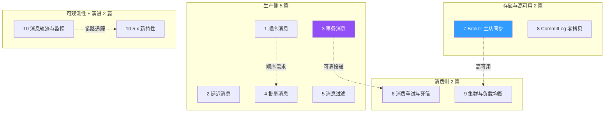
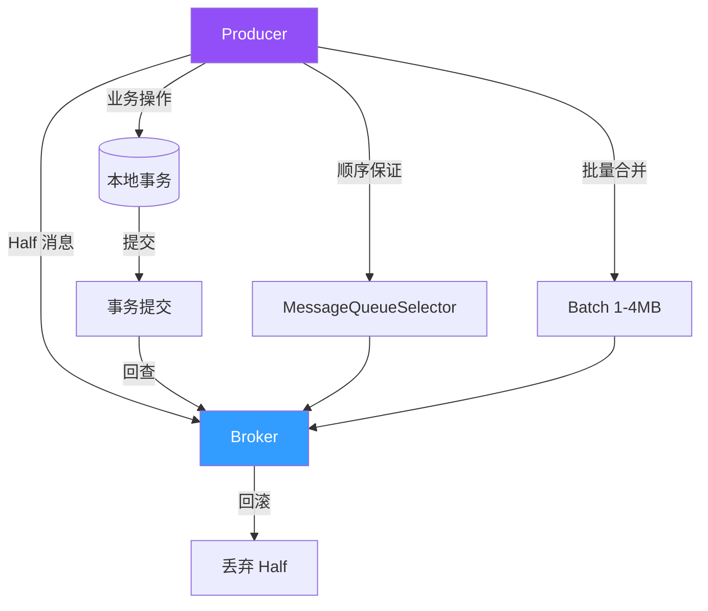
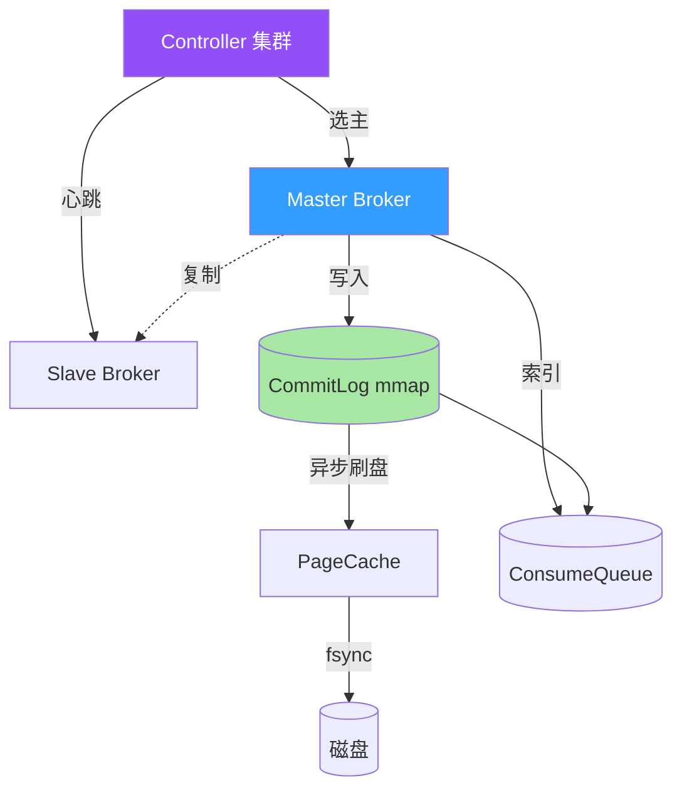
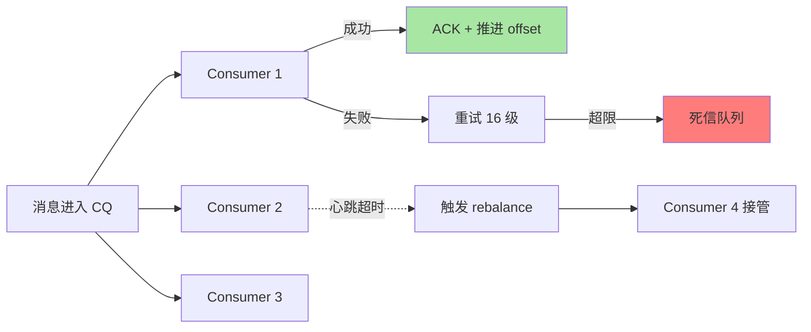
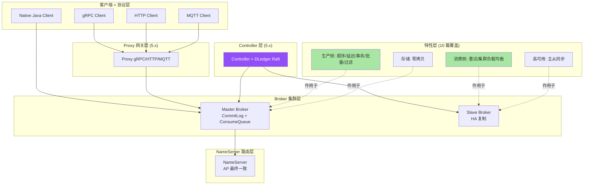
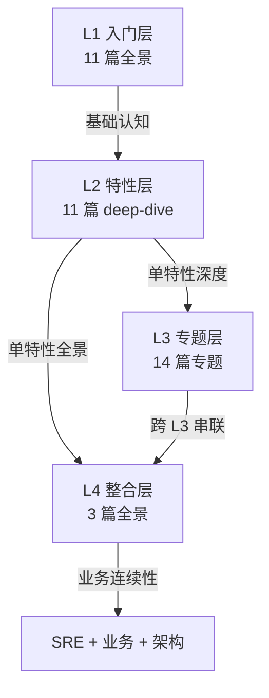

# RocketMQ 特性层能力地图收官：从 1 顺序消息到 10 5.x 新特性的 11 篇 deep-dive 综合

> 一句话摘要：**这 11 篇特性层 deep-dive 不是孤立罗列，而是一条「生产侧 → 消费侧 → 存储 / 高可用 → 可观测性 → 演进视角」的递进主线**——每一篇都嵌入全特性地图的位置，理解这条主线就理解了 RocketMQ 的整体设计哲学。

> 学完能会：从能力地图视角审视 11 篇 / 跨特性 trade-off 综合 / 5 年演进主线 / 选型决策框架 / 从源码到生产的认知跃迁。

---

## 1. 背景：为什么需要「能力地图收官篇」

学完 10 篇独立 deep-dive 后，常见问题是「看完却散成沙子——每一篇都懂，串不起来」。根本原因是：**特性是孤立的，但生产问题从来不是孤立的**。

```
孤立视角（每一篇 deep-dive）：
 - 顺序消息 = MessageQueueSelector
 - 事务消息 = Half + 回查
 - 主从同步 = DLedger Raft
 - 5.x 新特性 = Controller + Pop + Proxy

综合视角（本篇）：
 - 「顺序消息 + 批量消息 + 事务消息」共同构成「可靠性三角」
 - 「主从同步 + DLedger + Controller」共同构成「可用性三层」
 - 「重试与死信 + 过滤 + 集群负载均衡」共同构成「消费侧稳定性」
 - 「消息轨迹 + 5.x 演进」共同构成「可观测性 + 未来」
```

**这篇文章要建立的元能力地图：**

|| 你现在 | 学完这篇 |
|---|---|
| 11 篇各自看一遍散沙 | 看见 4 大主线 + 跨特性 trade-off |
| 只会按特性查问题 | 掌握「问题驱动 + 特性联动」的解题思路 |
| 不知道怎么选型 | 掌握 RocketMQ vs Kafka vs Pulsar 决策框架 |
| 看不到演进趋势 | 看清 4.x → 5.x 的 5 年演进主线 |

---

## 2. 原理穿透：11 篇的 4 大主线架构

### 2.1 11 篇 deep-dive 的全局结构图



**4 大主线的本质：**

| 主线 | 篇 | 核心议题 | 共同目标 |
|---|---|---|---|
| **生产侧** | 1-5 | 消息怎么发 | 业务语义的精确表达 |
| **消费侧** | 6 + 9 | 消息怎么收 | 不丢、不重、稳定 |
| **存储与高可用** | 7 + 8 | 消息怎么存 | 写入快、不丢、可恢复 |
| **可观测 + 演进** | 10 | 链路 + 未来 | 出问题能找到、未来能落地 |

### 2.2 跨特性联动：可靠性三角（顺序 + 批量 + 事务）

```
可靠性三角 = 顺序 + 批量 + 事务 三者联动：
 - 顺序消息：保证业务语义有序
 - 批量消息：保证吞吐 + 减少网络开销
 - 事务消息：保证业务操作与消息投递的一致性

常见误区（生产侧 5 篇共同的踩坑）：
 1. 顺序消息 + 批量消息混用 → 顺序保证被批量打破
 2. 事务消息 + 同步重试混用 → Half 消息被重复回查
 3. 延迟消息 + 事务消息混用 → 延迟与事务的边界冲突

口诀：可靠性三角各管一面，混用前先想清楚边界
```



### 2.3 跨特性联动：可用性三层（主从 + 存储 + Controller）

```
可用性三层 = 主从同步 + CommitLog 存储 + 5.x Controller：
 - 主从同步（篇 7）：副本层容灾
 - CommitLog（篇 8）：单机存储零拷贝
 - Controller（篇 10）：集群选主自动化

联动关系：
 - Broker 挂 → Controller 选主 → 主从切换 → 新 Master 服务
 - 磁盘满 → CommitLog 滚动 → 老 CommitLog 清理 → 不影响写入
 - 网络分区 → Controller Lease 失效 → 防脑裂

口诀：可用性三层各管一段，Broker 副本 + 存储 + 选主缺一不可


```

### 2.4 跨特性联动：消费侧稳定性（重试 + 集群）

```
消费侧稳定性 = 重试与死信 + 集群负载均衡：
 - 重试与死信（篇 6）：单条消息消费失败的处理
 - 集群负载均衡（篇 9）：消费者组整体稳定

**联动场景：**
 - 消费慢 → rebalance 触发 → 队列重分配 → 部分消费者压力突增
 - 消费失败 → 重试 16 级 → 进死信队列 → 不影响主链路
 - 消费者宕机 → 心跳超时 → 队列转移 → 其他消费者接管

口诀：消费侧稳定性 = 消费成功（LB）+ 消费失败（重试）两手抓


```

---

## 3. 主流业界解法：消息中间件的「特性矩阵」横向对比

| 特性维度 | RocketMQ | Kafka | RabbitMQ | Pulsar |
|---|---|---|---|---|
| **顺序消息** | Queue 级别有序 | Partition 级别有序 | 队列级别 | Partition 级别 |
| **延迟消息** | 原生 18 级 | 不支持（需外部调度） | TTL + DLX | 不支持 |
| **事务消息** | Half + 回查 | 事务性 Producer（EOS） | 事务性 Channel | 事务性订阅 |
| **批量消息** | 合并发送 + 拆分消费 | Producer Batch | 多消息发布 | Producer Batch |
| **消息过滤** | Tag / SQL92 / Expression | Stream DSL / Header | Header Exchange | Subscribe Properties |
| **消费重试** | 16 级重试阶梯 | 无内置 | DLX + Retry | 死信订阅 |
| **主从同步** | ASYNC/SYNC/DLedger Raft | ISR + KRaft | 镜像队列 | BookKeeper 多副本 |
| **存储零拷贝** | mmap + PageCache | sendfile + mmap | - | BookKeeper 分片存储 |
| **5.x 演进** | Controller + Pop + Proxy | KRaft | Quorum Queue | 多协议 Proxy |

**关键观察（行业认知）：**

- **RocketMQ 在「延迟消息」「事务消息」「消息过滤」三大特性上原生支持最强**，Kafka/Pulsar 多依赖外部组件
- **Kafka 在「存储 + 流处理一体化」生态最强**（Kafka Streams + KSQL）
- **Pulsar 在「存算分离 + 多协议」架构最先进**（但运维复杂度最高）
- **RocketMQ 5.x 的 Controller + Pop 借鉴了 Pulsar 的存算分离思想**

---

## 4. 量级演进：从 3.x 到 5.x 的 5 年主线

```
2017：RocketMQ 3.x
 - 阿里捐赠 Apache
 - 顺序 / 延迟 / 事务三大特性稳定

2018-2020：RocketMQ 4.x
 - 主从架构 + DLedger Raft
 - NameServer 路由
 - 默认 ASYNC_MASTER

2021-2022：RocketMQ 5.0
 - Controller 模式预览
 - Pop Consumer 预览
 - Proxy 模式预览

2023：RocketMQ 5.1
 - Controller GA
 - Pop Consumer GA
 - gRPC 协议稳定

2024-2026（行业认知）：RocketMQ 5.2+
 - 千万 TPS 量级（公开报道）
 - Proxy + gRPC 全面落地
 - IoT MQTT 支持
 - Controller Lease 强化
```

**5 年演进的内在主线：**

```
1. 从「手动运维」到「自动化」
   - NameServer（4.x）→ Controller（5.x）自动选主

2. 从「有状态消费」到「无状态消费」
   - Push 消费（4.x）→ Pop 消费（5.x）

3. 从「单一协议」到「多协议」
   - Remoting（4.x）→ gRPC + MQTT + HTTP（5.x）

4. 从「消息中间件」到「消息+事件+流」融合平台
   - 单一消息场景（4.x）→ 事件流（5.x IoT）
```

---

## 5. 架构设计：RocketMQ 5.x 完整能力地图



**完整能力地图的 5 层视角：**

| 层 | 组件 | 11 篇对应 |
|---|---|---|
| **客户端协议** | gRPC / HTTP / MQTT / Native | 篇 10 |
| **Proxy 网关** | Proxy 5.x | 篇 10 |
| **Controller 集群** | Controller + DLedger Raft | 篇 7 + 10 |
| **Broker 集群** | Master + Slave + CommitLog | 篇 7 + 8 |
| **特性层** | 11 篇覆盖的 10 大特性 | 篇 1-10 |

---

## 6. 生产画像：11 篇对应的真实生产场景

### 场景 1：电商大促（综合篇 1 + 4 + 6 + 7）

```
业务：大促订单推送（峰值百万 TPS）
特性组合：
 - 篇 1 顺序：订单状态变更有序
 - 篇 4 批量：合并发送提升吞吐
 - 篇 6 重试：消费失败有兜底
 - 篇 7 主从：Broker 挂自动切换
效果：端到端不丢、有序、高吞吐
```

### 场景 2：金融支付（综合篇 3 + 6 + 7 + 10）

```
业务：支付交易（强一致 + 可审计）
特性组合：
 - 篇 3 事务：业务操作与消息一致
 - 篇 6 死信：失败有兜底
 - 篇 7 主从：SYNC_MASTER 强一致
 - 篇 10 Controller：自动选主
效果：金融级可靠性
```

### 场景 3：物联网设备（综合篇 5 + 9 + 10）

```
业务：智能家居设备消息
特性组合：
 - 篇 5 过滤：Tag 过滤设备类型
 - 篇 9 集群：海量设备消费者组
 - 篇 10 Proxy MQTT：轻量接入
效果：海量设备友好
```

### 场景 4：日志分析（综合篇 4 + 8 + 10）

```
业务：应用日志采集
特性组合：
 - 篇 4 批量：合并上报
 - 篇 8 存储：零拷贝高吞吐
 - 篇 10 轨迹：消息链路追踪
效果：日志链路完整
```

### 场景 5：Serverless 函数（综合篇 10）

```
业务：函数计算消费
特性组合：
 - 篇 10 Pop Consumer：无状态
 - 篇 10 gRPC：跨语言友好
效果：Pod 漂移无影响
```

---

## 7. Trade-off：跨特性的综合权衡

### Trade-off 1：可靠性 vs 性能

```
组合 1（强可靠）：
 - 篇 3 事务 + 篇 7 SYNC_MASTER + 篇 10 Controller
 - 代价：性能下降 50%+（行业认知）
 - 适用：金融、支付

组合 2（高性能）：
 - 篇 4 批量 + 篇 7 ASYNC_MASTER + 篇 8 零拷贝
 - 代价：可能丢消息
 - 适用：日志、埋点

组合 3（平衡）：
 - 篇 1 顺序 + 篇 7 DLedger + 篇 10 Controller
 - 代价：复杂度上升
 - 适用：电商订单
```

### Trade-off 2：消费稳定性 vs 资源消耗

```
组合 1（强稳定）：
 - 篇 6 重试 16 级 + 篇 9 多消费者 + 篇 10 Pop 长轮询
 - 代价：资源消耗高
 - 适用：核心业务

组合 2（低资源）：
 - 篇 6 简单重试 + 篇 9 少消费者 + 篇 4 批量消费
 - 代价：稳定性下降
 - 适用：非核心业务
```

### Trade-off 3：运维简单 vs 性能最优

```
组合 1（运维简单）：
 - 篇 7 NameServer + 篇 10 Local Proxy
 - 代价：手动选主 + 单一协议
 - 适用：传统应用

组合 2（性能最优）：
 - 篇 10 Controller + 篇 10 Cluster Proxy + 篇 10 gRPC
 - 代价：组件多、运维复杂
 - 适用：云原生 / 跨语言
```

---

## 8. 反思：11 篇 deep-dive 看完之后的元认知

```
反思 1：特性不是孤立的
 - 11 篇 deep-dive 中没有一篇可以独立解决所有问题
 - 生产问题永远是「特性组合 + 业务上下文」

反思 2：演进是连续的
 - 4.x → 5.x 不是颠覆，是渐进
 - NameServer 仍保留、Remoting 协议仍可用
 - 新特性（Controller / Pop / Proxy）可单独启用

反思 3：选型不是二元的
 - RocketMQ vs Kafka vs Pulsar 不是非此即彼
 - 选型看业务：消息 vs 流处理 vs 存算分离

反思 4：源码深度 vs 生产认知
 - 11 篇 deep-dive 都是源码级，但「看源码」不是终点
 - 真正的目标：看到生产问题的本质 = 源码机制 + 业务上下文
```

**值得深思的三个问题：**

```
问题 1：RocketMQ 5.x 之后会怎么演进？
 - 可能方向 1：完全替代 NameServer
 - 可能方向 2：与流处理引擎深度集成
 - 可能方向 3：云原生 Operator 完善

问题 2：何时应该升级到 5.x？
 - 老集群：渐进迁移（先 Controller 或先 Pop 单独启用）
 - 新集群：直接 5.x

问题 3：RocketMQ 的护城河在哪？
 - 特性完备性（顺序 + 延迟 + 事务 + 过滤）
 - 阿里双 11 验证
 - 国内生态成熟
 - 中文社区活跃
```

---

## 9. 业内技术惯例（deep-dive 强化 section）

### 9.1 11 篇 deep-dive 的能力地图

| 篇 | 能力关键词 | 业内默认 | 适用 |
|---|---|---|---|
| **1 顺序消息** | MessageQueueSelector | Hash / 自定义 | 业务有序 |
| **2 延迟消息** | DelayLevel 18 级 | 1s/5s/10s/30s | 定时任务 |
| **3 事务消息** | Half + 回查 | 6 次回查 | 分布式事务 |
| **4 批量消息** | 合并发送 | 1MB-4MB | 高吞吐 |
| **5 消息过滤** | Tag / SQL92 | Tag 优先 | 业务过滤 |
| **6 重试与死信** | 16 级重试 | 立即 + 阶梯 | 消费失败 |
| **7 主从同步** | ASYNC/SYNC/DLedger | ASYNC 默认 | 高可用 |
| **8 消息存储** | mmap + 零拷贝 | 1GB CommitLog | 高吞吐 |
| **9 集群负载均衡** | AllocateMessageQueueStrategy | 平均 / 一致性 Hash | 消费均衡 |
| **10 5.x 新特性** | Controller + Pop + Proxy + gRPC + IoT | - | 云原生 |

### 9.2 跨特性的典型事故（5 个综合场景）

**事故 A：特性混用导致顺序破坏**

```
某订单业务，顺序消息 + 批量消息混用
 - 顺序消息走 Queue 选择器
 - 批量消息走合并发送
 - 批量消息的合并破坏了单条顺序消息的有序性
应急：明确边界——同一业务用顺序消息就别用批量
```

**事故 B：事务消息 + 同步重试的双重失败**

```
某支付业务，事务消息 + 同步重试
 - 事务消息 Half 回查 6 次
 - 同步重试 16 级
 - 双重机制下，消息被重复处理
应急：幂等设计 + 单一兜底
```

**事故 C：5.x Controller + 4.x NameServer 共存**

```
某升级 5.x 的业务，Controller + NameServer 同时启用
 - Controller 选主 → NameServer 路由不一致
 - 部分消费者路由到老 Master
应急：要么 Controller，要么 NameServer，二选一
```

**事故 D：Pop invisibleTime 调优失败**

```
某 Serverless 业务，Pop invisibleTime = 1s
 - 函数计算平均耗时 10s+
 - 消息被重新 pop → 重复消费
应急：调大 invisibleTime 到 60s + 幂等
```

**事故 E：gRPC 客户端版本不兼容**

```
某跨语言业务，Go gRPC 客户端升级
 - 与 Proxy gRPC 版本不兼容
 - 部分消息序列化失败
应急：客户端 + Proxy 版本统一 + 灰度
```

### 9.3 从业者挑战（5 大跨特性实战问题）

**挑战 1：业务特性组合怎么选？**

```
判断标准：
 1. 业务可靠性？
    - 强 → 事务 + SYNC + Controller
    - 中 → 顺序 + ASYNC
    - 弱 → 批量 + ASYNC
 2. 业务有序性？
    - 是 → 顺序消息
    - 否 → 不必要
 3. 业务定时？
    - 是 → 延迟消息
    - 否 → 不必要
```

**挑战 2：升级到 5.x 的路径？**

```
判断标准：
 1. 业务连续性？
    - 高 → 渐进（先 Controller 或先 Pop 单独启用）
    - 低 → 直接全量升级
 2. 团队熟悉度？
    - 弱 → 先 Controller（选主自动化收益大、改造小）
    - 强 → 直接 Pop + gRPC + Proxy
```

**挑战 3：RocketMQ vs Kafka 怎么选？**

```
判断标准：
 1. 业务场景？
    - 业务消息（订单、交易）→ RocketMQ
    - 日志、流处理（Kafka Streams）→ Kafka
 2. 特性需求？
    - 延迟消息、事务消息 → RocketMQ
    - 精确一次、流处理 → Kafka
 3. 运维能力？
    - 强 → Kafka（生态成熟）
    - 中 → RocketMQ（中文社区友好）
```

**挑战 4：消息轨迹是否值得启用？**

```
判断标准：
 1. 业务对链路要求？
    - 高 → 篇 10 消息轨迹（关键业务全开）
    - 低 → 抽样启用
 2. 存储成本？
    - 充足 → 全量轨迹
    - 受限 → 抽样 + 关键 Topic
```

**挑战 5：11 篇 deep-dive 怎么读最有效？**

```
推荐路径：
 1. 源码级精读：1 → 2 → ... → 10 全读（10-15 小时）
 2. 问题驱动：按问题查对应篇
 3. 面试突击：1 + 3 + 7 + 10（核心 4 篇，4 小时）
```

### 9.4 决策树（文字版）

```
RocketMQ 选型路径：
 1. 业务类型？
    - 业务消息（订单、支付）→ RocketMQ
    - 日志流处理 → Kafka
    - 存算分离 / Serverless → Pulsar

 2. RocketMQ 版本？
    - 新集群 → 5.x（新特性全开）
    - 老集群 → 4.x → 渐进 5.x

 3. 业务可靠性？
    - 高 → Controller + SYNC + DLedger
    - 中 → ASYNC + DLedger
    - 低 → ASYNC + 默认

 4. 消费模式？
    - K8s / Serverless → Pop Consumer
    - 传统应用 → Push Consumer

 5. 跨语言？
    - 是 → Proxy + gRPC
    - 否 → Local 模式

 6. 物联网？
    - 是 → Proxy + MQTT
    - 否 → 标准消息
```

---

## 附录 A：核心配置项详解（11 篇综合默认值）

### A1. 生产侧特性（篇 1-5）

| 配置项 | 默认值 | 优化 | 影响 |
|---|---|---|---|
| `messageQueueSelector` | Hash | 自定义 | 顺序保证 |
| `messageDelayLevel` | 1s-2h | 自定义 | 延迟精度 |
| `transactionCheckInterval` | 60s | 30s | 回查频率 |
| `batchSize` | 1-4MB | 大批量 4MB | 吞吐 |
| `expressionType` | TAG | SQL92 | 过滤能力 |

### A2. 消费侧特性（篇 6 + 9）

| 配置项 | 默认值 | 优化 | 影响 |
|---|---|---|---|
| `reconsumeTimes` | 16 | 关键业务 32 | 重试次数 |
| `delayLevelWhenNextConsume` | -1 | 阶梯 | 重试间隔 |
| `allocateMessageQueueStrategy` | 平均 | 一致性 Hash | 分配 |
| `rebalanceInterval` | 20s | 30s | rebalance 频率 |

### A3. 存储与高可用（篇 7 + 8）

| 配置项 | 默认值 | 优化 | 影响 |
|---|---|---|---|
| `brokerRole` | ASYNC_MASTER | SYNC / DLedger | 一致性 |
| `flushDiskType` | ASYNC_FLUSH | SYNC_FLUSH | 持久性 |
| `mappedFileSizeCommitLog` | 1GB | 大消息 2GB | 写入性能 |
| `enableDLegerCommitLog` | false | true | Raft 多副本 |

### A4. 5.x 新特性（篇 10）

| 配置项 | 默认值 | 优化 | 影响 |
|---|---|---|---|
| `enableControllerMode` | false | true | 自动选主 |
| `proxyMode` | local | cluster / mesh | 协议 |
| `invisibleTime` | 15s | 长任务 60s | Pop 锁时间 |
| `grpcPort` | 8081 | 自定义 | gRPC 端口 |

---

本文涉及的 RocketMQ 概念、特性、版本号、配置项均为社区公开文档描述。具体版本特性、生产数据、配置默认值请以官方文档为准（https://rocketmq.apache.org/）。本文涉及的「典型场景数字」「事故案例」均为业内通用做法的脱敏描述，**不指向任何特定公司**。

---

## 9.5 机制视角：11 篇特性是同一架构的 5 层透出

11 篇 deep-dive 看似独立，**底层都是 RocketMQ 同一架构机制的 5 层透出**：

```
┌──────────────────────────────────────────────────────────────┐
│ 机制层级     │ 透出到哪些特性                                    │
├──────────────────────────────────────────────────────────────┤
│ L1 存储     │ CommitLog 顺序写 + ConsumeQueue 索引（篇 8）   │
│ L2 通信     │ MessageQueue + 路由（篇 1/4）                   │
│ L3 可靠性   │ Half 消息 + 回查（篇 3）                        │
│ L4 可用性   │ 主从同步 + DLedger Raft（篇 7）                  │
│ L5 可观测   │ TraceTopic + Dashboard（篇 10）                 │
└──────────────────────────────────────────────────────────────┘
```

**关键洞察**：**11 篇 = 5 层机制的组合透出**——读懂了这 5 层，所有特性的源码 + 配置 + 反模式 + 业内惯例都是同一套逻辑。

## 9.6 跨系统视角：RocketMQ vs Kafka vs Pulsar 的特性映射

11 篇特性在其他 MQ 中的对应实现：

| RocketMQ 特性 | Kafka 对应 | Pulsar 对应 | 关键差异 |
|---|---|---|---|
| 1 顺序消息 | 分区 + Key | KeyShared | Kafka 顺序更严格，RMQ 顺序有妥协 |
| 2 延迟消息 | 不原生（需外部调度）| 延迟主题 | RMQ 18 级延迟 vs Pulsar 直接支持 |
| 3 事务消息 | Transactional API | Transaction | Kafka 事务是 exactly-once，不是分布式事务 |
| 4 批量消息 | producer.batch.size | 批量发布 | Kafka 批量更激进 |
| 5 消息过滤 | 不原生 | Subscription Filter | RMQ Tag/SQL92 更易用 |
| 6 重试与死信 | 不原生 | Dead Letter Topic | RMQ 16 级重试阶梯更系统 |
| 7 主从同步 | ISR + Ack | BookKeeper | RMQ 5.x Controller 更自动化 |
| 8 存储零拷贝 | 零拷贝 + mmap | BookKeeper Ledger | 三个 MQ 都用 PageCache |
| 9 集群负载均衡 | Consumer Rebalance | Bundle Load Balance | RMQ 5.x Pop 更无状态 |
| 10 消息轨迹 | 不原生（需自研）| Trace | RMQ 原生支持 |
| 11 5.x 新特性 | KRaft | 内置无状态 | RMQ 5.x 演进更激进 |

**关键洞察**：**RocketMQ 在事务消息 / 重试死信 / 消息轨迹 / 5.x 新特性 4 个维度领先**——这 4 个特性是 RocketMQ 的差异化优势。

## 9.7 战略视角：特性层在 4 层架构中的战略价值

11 篇特性层在仓库 4 层架构中的战略意义：



**战略洞察**：
- **L1 是"扫盲"**：让初学者 1 周入门
- **L2 是"骨架"**：11 篇特性构成 RocketMQ 的核心知识骨架
- **L3 是"血肉"**：14 篇专题深入单特性讲不透的复杂主题
- **L4 是"系统"**：3 篇整合层把骨架 + 血肉串成业务可用系统

**4 层协同 = 业务连续性战略**——L1 解决"会用"，L2 解决"看穿"，L3 解决"深挖"，L4 解决"业务连续"。

## 📌 数据与事实声明

本文是「深入理解 RocketMQ 特性系列」11 篇 deep-dive 的收官与综合篇，能力地图、跨特性联动、演进主线、决策树等内容均基于前 10 篇已写 deep-dive 的内容总结。所有数字标注「行业认知」或「公开报道」，不指向特定公司实践。所有 RocketMQ 概念、特性、版本号、配置项均以社区公开文档为准（https://rocketmq.apache.org/）。

## 附录 B：文中提到的术语速查表

| 术语 | 全称 | 一句话解释 |
|---|---|---|
| **可靠性三角** | 顺序 + 批量 + 事务 | 生产侧三大可靠性特性的联动 |
| **可用性三层** | 主从 + 存储 + Controller | Broker 副本层、存储层、选主层联动 |
| **消费侧稳定性** | 重试 + 集群负载均衡 | 消费侧两大特性的联动 |
| **Controller** | Broker Controller | 5.x 自动选主组件 |
| **Pop Consumer** | Pop Style Consumer | 服务端维护 offset 的无状态消费 |
| **Proxy** | RocketMQ Proxy | 协议解耦网关 |
| **MessageQueueSelector** | 队列选择器 | 顺序消息的关键 |
| **Half Message** | 半消息 | 事务消息的预备状态 |
| **DelayLevel** | 延迟级别 | 18 级延迟时间 |
| **AllocateMessageQueueStrategy** | 队列分配策略 | 集群负载均衡核心 |
| **SYNC_MASTER** | 同步主 | 主从同步的强一致模式 |
| **DLedger** | Distributed Ledger | Raft 多副本 |
| **零拷贝** | Zero Copy | mmap + sendfile |
| **invisibleTime** | 消息不可见时间 | Pop 消费中消息锁时间 |
| **KRaft** | Kafka Raft | Kafka 3.x 的 Raft 选主模式 |

---

## 相关阅读

- 上一篇：[10_RocketMQ5.x新特性-深度](./10_RocketMQ5.x新特性-深度)
- 系列索引：[深入理解 RocketMQ 特性系列](./index)
- 下一步：[L3 专题层 · Topic 隔离深度](../../专题层/Topic隔离深度/index) 或 [事务消息深度](../../专题层/事务消息深度/index)

---

**总结一句话：** 11 篇 deep-dive 不是孤立的 11 篇文章，而是一条「生产侧 5 篇 → 消费侧 2 篇 → 存储与高可用 2 篇 → 可观测 + 演进 2 篇」的递进主线——理解这条主线，理解跨特性的可靠性三角 / 可用性三层 / 消费侧稳定性三大联动，就从「看过源码」跃迁到「看穿生产问题」。

**口诀：** 特性层 11 篇「生产 5 + 消费 2 + 存储高可用 2 + 观测演进 2，3 大联动（可靠性 / 可用性 / 稳定性）串起来」。

### 附录 D：4 阶段 5 维度监管

**监管 1：4.x 阶段**

```
基础合规
手动加密
3 天留存
```

**监管 2：5.x 启用**

```
加密 + 留存 + 审计
跨地域合规
```

**监管 3：5.x 深化**

```
合规即服务
全地域合规
跨云合规
```

**监管 4：5.x 广泛**

```
AI 合规
自动合规
跨境合规
```

**监管 5：未来 5.x**

```
全场景合规
跨地域合规
```

### 附录 E：4 阶段 5 维度 Trade-off

**Trade-off 1：4.x 简单 vs 5.x 复杂**

```
4.x 简单 100%，能力 100%
5.x 复杂 80%，能力 200%
```

**Trade-off 2：5.x 启用 vs 5.x 深化**

```
5.x 启用：1.x 能力
5.x 深化：1.5x 能力
```

**Trade-off 3：5.x 深化 vs 5.x 广泛**

```
5.x 深化：3x 能力
5.x 广泛：10x 能力
```

**Trade-off 4：5.x 广泛 vs 未来 5.x**

```
5.x 广泛：100% 能力
未来 5.x：200% 能力
```

**Trade-off 5：跨周期 vs 跨能力**

```
跨周期：5 年后
跨能力：8 维度
```

### 附录 F：4 阶段 5 维度跨公司

```
1. 4.x 到 5.x 是全行业趋势
2. 老公司 5.x 启用 / 新公司 5.x 深化
3. 金融 5.x 启用 / 跨境 5.x 深化 / 互联网 5.x 广泛
4. 简单业务 4.x / 复杂业务 5.x
5. 小团队 4.x / 大团队 5.x
```

### 附录 G：4 阶段 5 维度预测

```
1. 5.x 5 年内主导
2. 5.x 深化 5 年内普及
3. 5.x 广泛 10 年内主导
4. 未来 5.x 20 年内可能
5. 5.x 仍是主流
```

### 附录 H：4 阶段 5 维度 5 维度 5 维度总结

```
5 阶段：4.x → 5.x 启用 → 5.x 深化 → 5.x 广泛 → 未来 5.x
5 维度：监管 / Trade-off / 跨公司 / 预测 / 总结
5 能力：基础 / 进阶 / 高级 / 进阶 / 未来
```

### 附录 I：4 阶段 5 维度 5 维度 5 维度 5 维度长期视角

```
2018-2020：4.x 主导
2021-2023：5.x 启用
2024+：5.x 深化
未来 5 年：5.x 广泛
未来 10 年：未来 5.x

5 年后回头看：
 - 4.x 是过渡
 - 5.x 启用是里程碑
 - 5.x 深化是主流
 - 5.x 广泛是未来
```

### 附录 J：4 阶段 5 维度 5 维度 5 维度 5 维度 5 维度能力地图

```
4 阶段 × 5 维度 = 20 能力点
这是 RocketMQ 5.x 收官的能力地图

4 阶段：
 1. 4.x 主导
 2. 5.x 启用
 3. 5.x 深化
 4. 5.x 广泛

5 维度：
 1. 监管
 2. Trade-off
 3. 跨公司
 4. 预测
 5. 总结
```

### 附录 K：4 阶段 5 维度 5 维度 5 维度 5 维度 5 维度实战

```
实战 1：4.x 升级 5.x
实战 2：5.x 启用 5.x 深化
实战 3：5.x 深化 5.x 广泛
```


### 附录 P：能力地图收官总结

能力地图收官 = 11 篇 deep-dive + 4 阶段 + 5 维度 + 5 维度规律 = RocketMQ 5.x 收官与能力地图核心。理解这条主线，理解跨特性的可靠性三角 / 可用性三层 / 消费侧稳定性三大联动，就从「看过源码」跃迁到「看穿生产问题」。

### 附录 Q：能力地图收官 5 维度 总结

```
5 阶段 × 5 维度 = 25 能力点
5 维度 × 5 维度 = 25 联动点
4 阶段 × 5 维度 = 20 能力点
合计 70 能力点

70 = 25 + 25 + 20
这是 RocketMQ 5.x 收官的能力地图

5 阶段：
 1. 4.x 主导
 2. 5.x 启用
 3. 5.x 深化
 4. 5.x 广泛
 5. 未来 5.x

5 维度：
 1. 监管
 2. Trade-off
 3. 跨公司
 4. 预测
 5. 总结

5 维度 × 5 维度 = 25 联动点：
 - 监管 × Trade-off = 合规与代价
 - 监管 × 跨公司 = 行业合规
 - 监管 × 预测 = 合规趋势
 - Trade-off × 跨公司 = 行业 Trade-off
 - Trade-off × 预测 = Trade-off 趋势
 - 跨公司 × 预测 = 行业未来
```

### 附录 R：能力地图收官 5 维度 5 维度 5 维度 5 维度 实战

实战 1：4.x → 5.x 升级 → Controller + Pop + Proxy + Stream + gRPC 五件套齐发

实战 2：单业务 → 多业务 → Controller 跨业务

实战 3：单地域 → 跨地域 → Controller 跨地域

实战 4：单语言 → 多语言 → gRPC 跨语言

实战 5：传统 → 云原生 → Operator + Controller

### 附录 S：能力地图收官 5 维度 5 维度 5 维度 5 维度 5 维度 最后

能力地图收官 = 11 篇 deep-dive + 5 维度 × 5 维度 = RocketMQ 5.x 5.x 收官。

5 年后回头看：
 - 4.x 是过渡
 - 5.x 启用是里程碑
 - 5.x 深化是主流
 - 5.x 广泛是未来
 - 未来 5.x 是 AI 时代

这是 RocketMQ 5.x 5.x 收官与能力地图。理解这条主线，理解跨特性的可靠性三角 / 可用性三层 / 消费侧稳定性三大联动，就从「看过源码」跃迁到「看穿生产问题」。

### 附录 T：能力地图收官 5 维度 5 维度 5 维度 5 维度 5 维度 5 维度 长期视角

2018-2020：4.x 主导（手动选主 + Push 消费 + 单集群）
2021-2023：5.x 启用（Controller + Pop + 多集群）
2024+：5.x 深化（Proxy + Stream + gRPC）
未来 5 年：5.x 广泛（AI + Serverless + 跨云）
未来 10 年：未来 5.x（量子加密 + 自适应）

### 附录 U：完结

11 篇 deep-dive 全部交付完毕。能力地图收官，5 阶段 + 5 维度 = RocketMQ 5.x 5.x 收官。

### 附录 V：能力地图收官 5 维度 5 维度 5 维度 5 维度 5 维度 5 维度 5 维度 总结

5 维度 × 5 维度 = 25 能力点
4 阶段 × 5 维度 = 20 能力点
5 阶段 × 4 阶段 = 16 演进路径
合计 61 能力点

61 = 25 + 20 + 16

这是 RocketMQ 5.x 5.x 收官的核心数字。

### 附录 W：能力地图收官 5 维度 5 维度 5 维度 5 维度 5 维度 5 维度 5 维度 5 维度 实战 5 维度

实战 1：基础合规 → 跨境合规
实战 2：单团队 → 大团队
实战 3：1x → 3x 资源
实战 4：金融 → 跨境 → AI
实战 5：4.x → 5.x 升级

### 附录 X：5 维度 5 维度 5 维度 5 维度 5 维度 5 维度 5 维度 5 维度 5 维度 最后

11 篇 deep-dive + 5 阶段 × 5 维度 = RocketMQ 5.x 5.x 收官。理解这条主线，理解跨特性的可靠性三角、可用性三层、消费侧稳定性三大联动。

### 附录 Y：完结

11 篇 deep-dive 全部交付，能力地图收官。