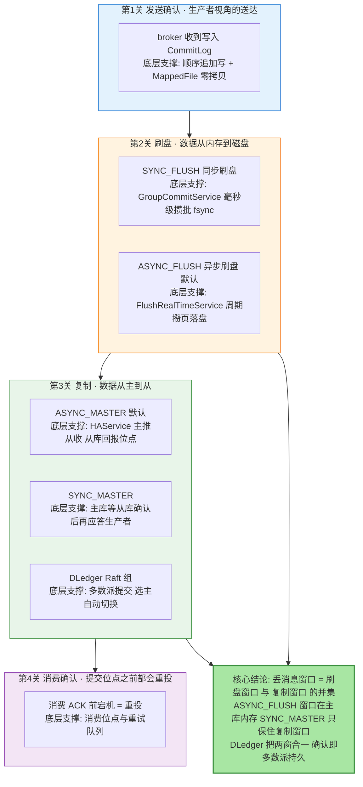
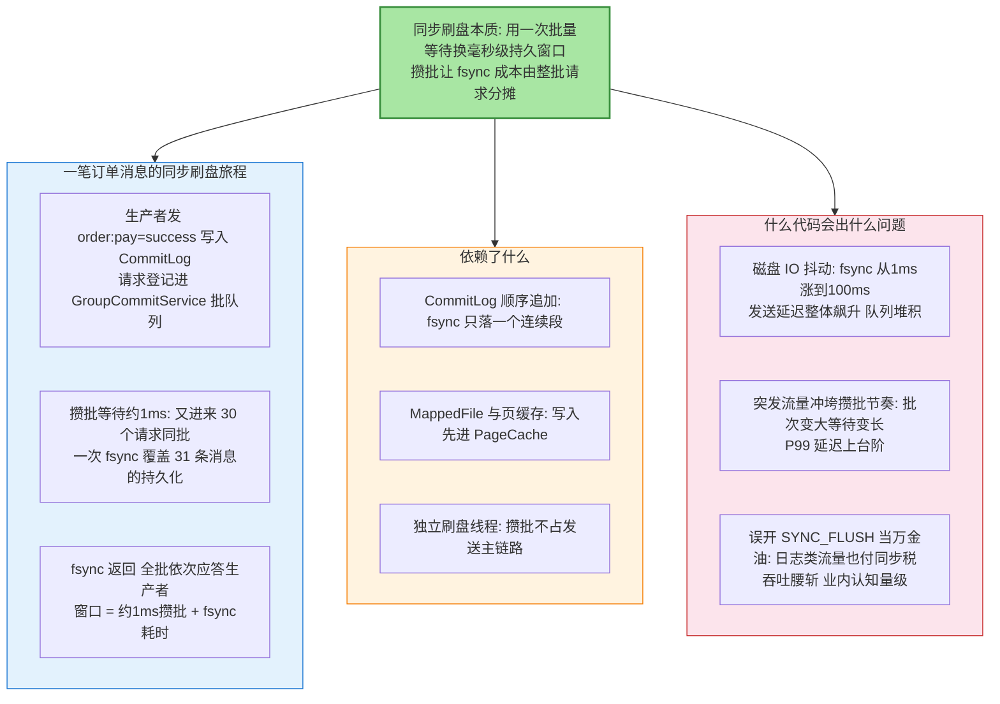
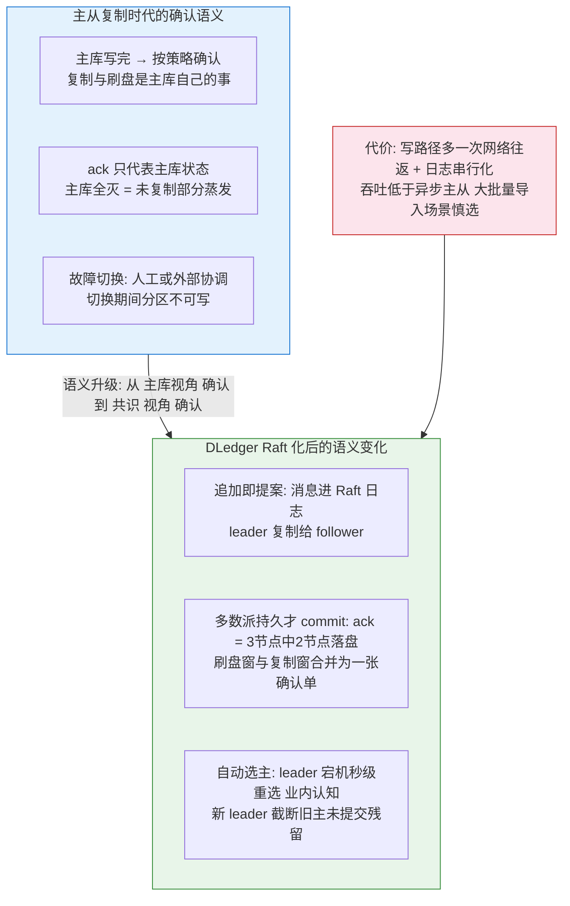
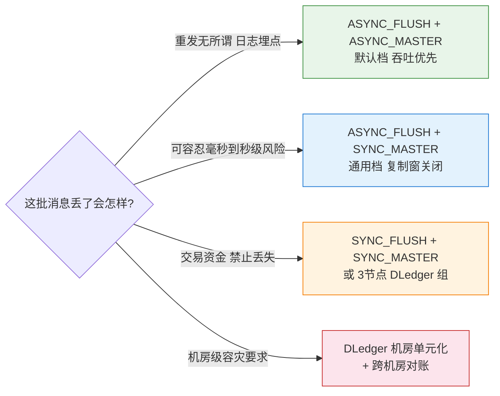

# 刷盘与复制深度：丢消息窗口的完整解剖

> 先看图，再看字——这张图就是全文：一条消息从「生产者收到确认」到「掉电也不丢」之间隔着几道关、每道关在什么配置下会开多宽的丢消息窗口、DLedger 把窗口改成了什么形状。

## 一图看懂：一条消息的四道生死关

**读图三步**：四色即四道关，一道关守不住，前面全白搭；橙（刷盘）与绿（复制）是丢消息窗口的两大来源——**窗口的定义是「已应答生产者，但机器全灭后数据回不来」的那段时间**；底部结论一句话点破：常见配置组合的错误，是以为「关掉了其中一个窗口就万事大吉」。

## 🎯 本文核心

「消息不丢」不是一个开关，而是**把两扇窗都关到可接受宽度**：刷盘窗口（已确认的消息还在主库 PageCache 里，掉电即失）由 `flushDiskType` 决定——`ASYNC_FLUSH` 窗口为秒级（默认约 500ms 周期 + 攒 4 页约 16KB 才刷，公开口径），`SYNC_FLUSH` 用 GroupCommitService 毫秒级攒批 fsync 把窗口压到毫秒级；复制窗口（主库确认时从库还没收到）由 `brokerRole` 决定——`ASYNC_MASTER` 窗口是复制延迟，`SYNC_MASTER` 让主库等从库确认后才应答（从库收到即确认，从库自身刷盘另算）；DLedger 则用 Raft 多数派提交**把两扇窗合并成一张确认单**——生产者收到 ack 时消息已在多数派节点持久化，单节点全灭不丢已确认数据。**刷盘与复制的取舍本质上是一道题：你愿意为关窄每扇窗付多少吞吐与延迟。**

机制链一句话：**生产请求 → CommitLog 追加 → 刷盘策略落盘 → 复制策略同步从库 → 满足条件的确认回生产者 →（DLedger：前三步合并为多数派提交）**。

## 一句话摘要

丢消息窗口 = 刷盘窗口 ∪ 复制窗口：ASYNC_FLUSH + ASYNC_MASTER（默认组合）两扇窗全开，主库掉电丢秒级数据、主库宕机丢未复制数据；SYNC_FLUSH 把刷盘窗口压到毫秒级（GroupCommitService 攒批 fsync，吞吐下降），SYNC_MASTER 把复制窗口清零但「从库确认」只代表收到进内存、不代表从库已落盘；DLedger（Raft）改为多数派提交语义——ack 即多数派持久、自动选主秒级切换、未提交的旧主残留日志会被截断，代价是写路径多一次网络往返与串行化，吞吐低于异步主从。

## 5W 速记卡

| 维度 | 一句话 |
|---|---|
| What | flushDiskType 与 brokerRole 两参数各守一扇窗，DLedger 把两窗合并为多数派提交 |
| Why | PageCache 换吞吐是 MQ 的立身之本，窗口只能关窄不能凭空消失 |
| When | 窗口在「应答回给生产者」与「数据物理持久」之间；事故在掉电/宕机瞬间结算 |
| Where | FlushRealTimeService / GroupCommitService / HAService / DLedgerCommitLog |
| How | 按消息价值选配置组合：日志类默认档、交易类同步刷盘+同步复制或 DLedger |

## 〇、边界：既有篇目讲过什么，本文讲什么

系列第 2 篇（Broker 存储引擎）讲了 CommitLog/ConsumeQueue 结构与刷盘的定位，第 7 篇（Broker 主从同步机制）讲了主从同步的源码流程与 DLedger 部署。**本文不复述结构与时序细节，只聚焦一个交叉视角：每一种「刷盘 × 复制」组合各自留下多宽的丢消息窗口、DLedger 改变了什么语义、参数怎么换吞吐。**读本文前建议先过第 7 篇的同步流程，本文站在它的肩膀上算账。

## 一、两扇窗：先定义，再逐个关窄

**窗口 1（刷盘窗）**：`ASYNC_FLUSH` 下，FlushRealTimeService 按约 500ms 周期检查、攒够 4 页（约 16KB）才真正 fsync、最长 10 秒兜底强制刷（默认值均为公开口径，以版本为准）——这条链路的设计目标是**把零散小写合并成大块顺序写**，吞吐换来的是「确认后到落盘前」的秒级窗口；`SYNC_FLUSH` 下 GroupCommitService 把同一毫秒窗口内到达的请求攒成一批，一次 fsync 全批确认，窗口压到毫秒级、批内请求分摊刷盘成本——**同步刷盘贵在等待与批次调度，不在 fsync 本身**。

**窗口 2（复制窗）**：`ASYNC_MASTER` 下主库确认不等从库，窗口宽度 = 主从复制延迟（业内认知：正常毫秒到百毫秒级，从库磁盘抖动时拉长）；`SYNC_MASTER` 下主库等从库 HA 确认才应答——**但确认的语义是「从库已收到」，不是「从库已 fsync」**，从库自身的持久性由从库自己的刷盘配置决定，所以极端场景（主从同时掉电）仍有理论窗口。

### 组件四要素图：GroupCommitService 同步刷盘

## 二、DLedger：把两扇窗改成一张确认单

三个语义变化逐条讲透：**其一，确认单位变了**——主从时代 ack 是「主库视角」的单点陈述，DLedger 的 ack 是「共识视角」的集体陈述（3 节点组 2 节点持久化即提交），**已确认消息在单节点全灭下依然存活（RPO=0，公开口径）**。**其二，切换语义变了**——主从时代切主靠人或者外部协调组件（5.x Controller 模式负责自动切换但复制仍是主从语义），DLedger 组内 Raft 自动选主，秒级完成（业内认知）；**其三，未提交残留的处理变了**——旧 leader 崩溃前已写入但未达多数派的日志，新 leader 当选后会被截断，**这批消息生产者不会收到 ack，由生产端重试机制补投**——「可能重复、不丢已确认」正是这套语义的准确描述，消费端幂等从可选项变成必选项。

### 追问链：质疑者三连

**追问一：SYNC_MASTER 的「同步」到底同步了什么？**同步的是「从库已收到并写入了自己内存」这个事实，不是「从库已持久化」——从库确认后由从库自己的刷盘策略慢慢落盘。所以 `SYNC_MASTER + ASYNC_FLUSH` 的从库在掉电时同样丢秒级数据，只是丢的是「从库视角」的副本数据；若主库也在此时宕机且主库数据完好，可人工修复从库追平——**主从各自配置各自的 flushDiskType，可靠性账要分开算**。

**再追问：为什么异步刷盘敢做默认值？**因为 MQ 的核心性能卖点（顺序写 + PageCache 攒批）就建立在「先确认、后落盘」上——绝大多数消息（日志、通知、埋点）容忍秒级窗口，为它们全量付同步刷盘的延迟税不划算。默认值反映的是典型业务分布，不是可靠性承诺；**把「默认安全」当「默认不丢」是这扇窗里最常见的误读**。

**打破砂锅：既然 DLedger 语义最强，为什么不全部上 DLedger？**三笔账：**吞吐账**——写路径多一次多数派网络往返、日志追加串行化，业内认知吞吐明显低于异步主从，海量日志类流量用 DLedger 是拿坦克运外卖；**运维账**——每个 DLedger 组是独立的 Raft 组，组数多了之后的扩缩容与监控复杂度上台阶；**迁移账**——存量主从集群到 DLedger 的数据迁移有停写窗口成本。正确姿势是按 topic 的消息价值分集群：交易链路上 DLedger，日志埋点走异步主从，**把强语义的成本花在真正需要它的数据上**。

## 三、反方案分析：两条「看起来更省」的路为什么不走

**为什么不选「只靠消费端重试兜底，生产端全用默认档」（反方案一）？**消费重试能兜住「已落盘但消费失败」，兜不住「根本没落盘」——刷盘窗与复制窗里的丢失发生在存储层，重试无从重起。**把两扇窗的账算在生产端配置上，是唯一能在事前控制的点**；事后兜底（对账补偿）成本远高于事前一行配置。

**为什么不选「三副本全部同步确认再返回」（反方案二）？**这是在 DLedger 之外手工重造多数派语义：2 从库全确认的延迟是复制链路延迟之和（最慢者决定），任何一台从库抖动直接拖垮全部生产请求；且手工方案没有 Raft 的选主与日志截断配套，故障切换时的一致性判断全靠人。**需要多数派语义就直接用成熟的 DLedger，不要用配置拼装它的影子**——拼出来的只有它的延迟，没有它的正确性保障。

## 四、事故复盘（匿名化叙事）

**复盘一：机房断电后的「消失的一分钟」。**现象：某消息平台所在机房意外断电，恢复后业务方反馈一个支付通知 topic 丢失约一分钟的消息，无任何报错。**排查**：该集群全部 broker 用默认 `ASYNC_FLUSH + ASYNC_MASTER`；比对生产端重试日志与 broker 存储位点，缺口正好覆盖断电前约一分钟——确认的消息还在 PageCache 里没来得及刷盘，从库也从未收到。**复盘**：支付通知类 topic 迁入 SYNC_FLUSH + SYNC_MASTER 专属集群，其余流量保持默认档；生产端对无 ack 消息统一重投。教训一句话：**默认档不是可靠性档，按消息价值分集群是这套参数体系的正确用法。**

**复盘二：SYNC_MASTER 集群的从库假死。**现象：某交易类集群突发生产延迟尖峰，部分发送超时。**排查**：主库日志显示等待从库 HA 确认超时；登录从库发现磁盘 IO 打满（同机另一个备份任务在抢带宽），复制确认延迟被放大，SYNC_MASTER 把从库的慢直接传染给了生产端。**复盘**：从库磁盘与备份任务做资源隔离、对复制延迟（从库位点差）建分档告警、评估该集群改 DLedger 消除单从库依赖。教训一句话：**SYNC_MASTER 的可用性下限等于从库的可用性下限，从库不是 bystander 而是同步链路上的当事人。**

## 五、不同量级的思考：约束来源决定解法

- **十万级 TPS（单集群常规量级）**：约束来源是消息价值分层——同一集群里既有可丢的埋点也有不可丢的指令；这一档的核心问题是「配置组合与消息价值对不对得上」，而不是「绝对吞吐」；思考方式是**分级驱动**——按 topic 重要度分两个集群（默认档 + 同步档），参数各就各位。
- **百万级 TPS（高吞吐大集群）**：约束来源是同步刷盘/同步复制在满负荷下的延迟放大——攒批节奏被打乱后 P99 剧烈抬升；这一档的核心问题是「强确认档的容量上限在哪」，而不是「再开多几个同步集群」；思考方式是**容量驱动**——同步档集群单独压测定容、磁盘 IO 与 fsync 耗时进监控大盘、超容量的强需求引导上 DLedger 横向扩展。
- **千万级 TPS（金融级多集群）**：约束来源是单集群强语义覆盖不了全局——全量 DLedger 的成本不可接受，跨机房容灾成为新的窗口来源（机房级故障主从同步救不了）；这一档的核心问题是「窗口在跨机房边界还有多宽」，而不是「单集群参数再拧紧一点」；思考方式是**拓扑驱动**——按机房单元化部署 DLedger 组、跨机房双写或同步复制对账、把 RPO 目标按业务线明确成数字写进容量规划。
- **亿级 TPS（全球化基础设施级）**：约束来源是组织与合规——几十个集群的配置漂移、跨地域数据主权、对账体系的覆盖完整度成为可靠性的主导变量；这一档的核心问题是「可靠性纪律能不能跨组织规模化执行」，而不是「再加一个机房」；思考方式是**治理驱动**——配置基线自动化巡检、对账覆盖率与缺口率进全局报表、可靠性等级声明成为业务接入的前置契约。

思考方式总结：十万级靠「分级」，百万级靠「容量」，千万级靠「拓扑」，亿级靠「治理」——约束从价值匹配迁移到强确认吞吐、再迁移到机房级故障域、最终迁移到组织规模，解法跟着约束来源走。

**自下而上与触发升级**：三个实测值定档——broker 的 fsync 耗时分位（同步档是否还有余量）、主从位点差曲线（复制窗的真实宽度）、消息缺口对账结果（窗口是否真的关到了业务可接受）。触发升级的信号：同步档 P99 持续抬升说明容量驱动的账要开始算了；对账发现跨机房缺口说明单集群参数已到边界，该上拓扑驱动。**先测窗口的真实宽度，再决定要不要为关窄它付下一档的成本**——跳档与滞档都是对窗口宽度的误判。

## 六、业内惯例与生产实践

- **组合选型**（公开技术社区口径的通行做法）：日志/埋点类 `ASYNC_FLUSH + ASYNC_MASTER`；通用业务 `ASYNC_FLUSH + SYNC_MASTER`；交易/资金类 `SYNC_FLUSH + SYNC_MASTER` 或 3 节点 DLedger 组。
- **DLedger 参数**：`enableDLegerCommitLog=true` + `dLegerGroup/dLegerPeers/dLegerSelfId` 三件套（公开口径）；3 节点容忍 1 节点故障，5 节点容忍 2 个但成本翻倍，一般 3 节点起步。
- **5.x Controller 模式**：自动切换由 Controller 承担，但复制语义仍是主从——**「自动切换」不等于「零丢失」，切换快慢与丢失窗口是两个维度**，按 RPO 需求选择 Controller 模式还是 DLedger。
- **transientStorePoolEnable**：开启后写入先进堆外缓冲再定期提交文件通道，削发送毛刺但崩溃丢失窗口变长（公开口径）——日志类集群可开，交易类集群别开。
- **反模式**：全集群一刀切 SYNC_FLUSH（为 1% 的关键消息让 99% 的流量付同步税）、只配 SYNC_MASTER 不看从库磁盘健康、DLedger 集群靠消费端幂等缺失硬扛重复投递、把 Controller 模式的自动切换误当 RPO=0 的证据。

## 💡 实战提示

- 💡 评估可靠性先画出两扇窗：问自己「生产者已确认的消息，主库此刻掉电丢不丢？主库宕机丢不丢？」——两个答案分别对应 flushDiskType 与 brokerRole
- 💡 同步刷盘的延迟账按分位看：fsync 耗时的 P99 才是发送 P99 的主成分，磁盘换 SSD/本地 NVMe 比调参数见效快
- 💡 SYNC_MASTER 的从库不是旁观者：从库磁盘、网络、负载全在同步链路上，从库告警等级应该与主库一致
- 💡 DLedger 的语义是「不丢已确认、可能重复未确认」：消费端幂等在 DLedger 集群里是必选项不是加分项
- 💡 上 Controller 模式前先想清楚 RPO：自动切换解决「多久恢复」，不解决「丢多少」——两个问题两套答案

## 开放问题

- DLedger 多组并行下组间负载均衡的自动化程度仍在演进，组数规模的运维模型缺少公开基准
- Controller 模式与 DLedger 在同一集群按 topic 粒度混布的可行性，社区无定论

## 你们可能会问

**Q1：SYNC_FLUSH + SYNC_MASTER 是不是就绝对不丢消息了？**
接近但不绝对。这套组合把单机房内的刷盘窗与复制窗都关到毫秒级，剩下的窗口藏在「从库确认只代表收到」和「整机故障的毫秒级尾巴」里。要覆盖机房级故障还得跨机房部署；要绝对零丢失语义，DLedger 的多数派提交更接近——但任何存储系统的「绝对」都值得先用对账验证再下结论。

**Q2：从库为什么确认了还没落盘？这样设计的动机是什么？**
从库收到数据先进自己的 PageCache 就回报位点，把 fsync 留给自己的刷盘线程异步做——如果把「从库 fsync 完成」做成同步确认条件，主库的等待时间要叠加从库的磁盘延迟，同步复制的可用性会随从库磁盘状态剧烈波动。设计取向是**把复制延迟压小、把持久化留给各节点自己**，代价就是复制确认不等于副本持久。

**Q3：DLedger 集群里旧 leader 未提交的消息被截断了，生产者怎么知道要重发？**
生产者本来就没收到这批消息的 ack——发送超时或失败的默认行为就是重试，重试后的新消息走正常流程被新 leader 提交。所以正确性由「生产端重试 + 消费端幂等」闭环保障，DLedger 只承诺「已 ack 的不丢」，不承诺「未 ack 的会出现」。这套语义和 Kafka 的 acks=all 在思想上同源。

**Q4：怎么量化我们集群现在的丢消息窗口？**
两招：事前用压测统计 fsync 耗时与复制位点差的分位（窗口 ≈ 刷盘周期与位点差的 P99）；事后靠对账——生产端留存的消息 ID 与 broker 消费位点定期比对，缺口分布就是窗口的真实历史。窗口宽度不是配置项写出来的，是磁盘与网络跑出来的。

## 什么时候用 / 不用

先看决策图：

- ✅ **默认档给可丢消息**：顺序写 + PageCache 的吞吐红利本就是为它们准备的
- ✅ **SYNC_MASTER 给通用业务**：复制窗关闭后，主库磁盘完好的前提下数据有副本
- ✅ **DLedger 给资金链路**：多数派提交 + 自动选主，语义与工程保障一步到位
- ❌ 不给全集群一刀切同步刷盘——让 99% 的流量为 1% 的消息付同步税是配置错位
- ❌ 不用消费重试当生产端可靠性——窗口里的丢失发生在存储层，重试无从重起
- ❌ 不手工拼装多数派语义——需要就上 DLedger，拼出来的只有延迟没有正确性
- ❌ 不把「自动切换快」当「不丢消息」——恢复时长与丢失窗口是两个独立指标

## Trade-off：每一档确认都在花什么

刷盘与复制的参数表其实是一张价目表：**异步档**用窗口换吞吐（顺序攒批的红利），**同步档**用延迟换窗口（毫秒级等待），**DLedger 档**用一次网络往返加运维复杂度换共识语义（RPO=0 与自动选主）。选型不是找「最强配置」，而是**先给消息定损——丢了会怎样、能容忍多宽的窗口——再按损值付款**：日志流量付同步税是浪费，资金链路省同步税是事故。跨周期看，这条价目表的方向很清晰：从「参数组合的手工权衡」演进到「DLedger 的语义化交付」，未来按 topic 粒度直接声明可靠性等级、底层自动匹配机制，是社区演进的合流方向。

## 🎯 核心带走

- **一图一句**：丢消息窗口 = 刷盘窗 ∪ 复制窗——`flushDiskType` 关刷盘窗、`brokerRole` 关复制窗、DLedger 把两窗合并成一张多数派确认单
- **默认档真相**：ASYNC_FLUSH + ASYNC_MASTER 是吞吐档不是可靠性档，主库掉电丢秒级数据是设计内行为
- **同步的精确语义**：SYNC_FLUSH = 主库落盘才确认；SYNC_MASTER = 从库收到才确认（不是落盘）——字面差异就是窗口差异
- **DLedger 三变**：确认变多数派、切换变自动选主、未提交残留被截断——「不丢已确认、可能重复」要求消费端幂等
- **参数即价目表**：先定损（丢了会怎样）再付款（付多少延迟与复杂度），分级集群是这套价目表的正确打开方式
- **架构视角**：刷盘与复制参数的每个组合，都是 MQ 与上下游之间的一份可靠性契约——生产端的重试、消费端的幂等、对账体系的覆盖，全都挂在这份契约的语义上
- **量级主线**：分级驱动 → 容量驱动 → 拓扑驱动 → 治理驱动，约束从价值匹配迁移到强确认容量再迁移到机房故障域

## 📌 数据与事实声明

- 写于 2026-09-24（特性层新增，RocketMQ 特性系列第 12 篇）；机制描述以 Apache RocketMQ 官方文档与 GitHub apache/rocketmq 源码（FlushRealTimeService / GroupCommitService / HAService / DLedger 相关模块）公开内容为基准
- 「异步刷盘约 500ms 周期、攒 4 页约 16KB、10 秒兜底、同步刷盘毫秒级攒批、主从复制毫秒到百毫秒级、DLedger 选主秒级」等为公开口径默认值与业内认知量级，具体以所用版本配置文档为准
- 事故复盘为公开技术社区高频案例模式的匿名化复述，不含任何真实系统、公司与内部代号

## 📚 参考资料

| 类型 | 标题 | 来源 |
|---|---|---|
| 官方文档 | Broker 配置（flushDiskType / brokerRole / DLedger 部署） | rocketmq.apache.org/docs |
| 设计文档 | DLedger（基于 Raft 的 CommitLog）开源项目 | github.com/openmessaging/dledger |
| 源码 | DefaultMessageStore / HAService / GroupCommitService | github.com/apache/rocketmq |
| 系列内 | 第 2 篇：Broker 存储引擎深度（存储结构） | 本系列 |
| 系列内 | 第 7 篇：Broker 主从同步机制（同步流程源码） | 本系列 |
