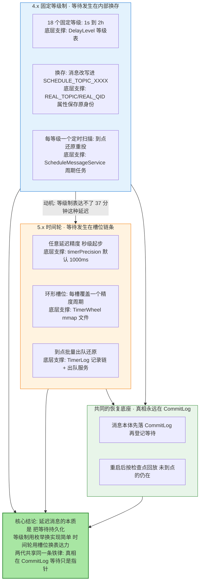
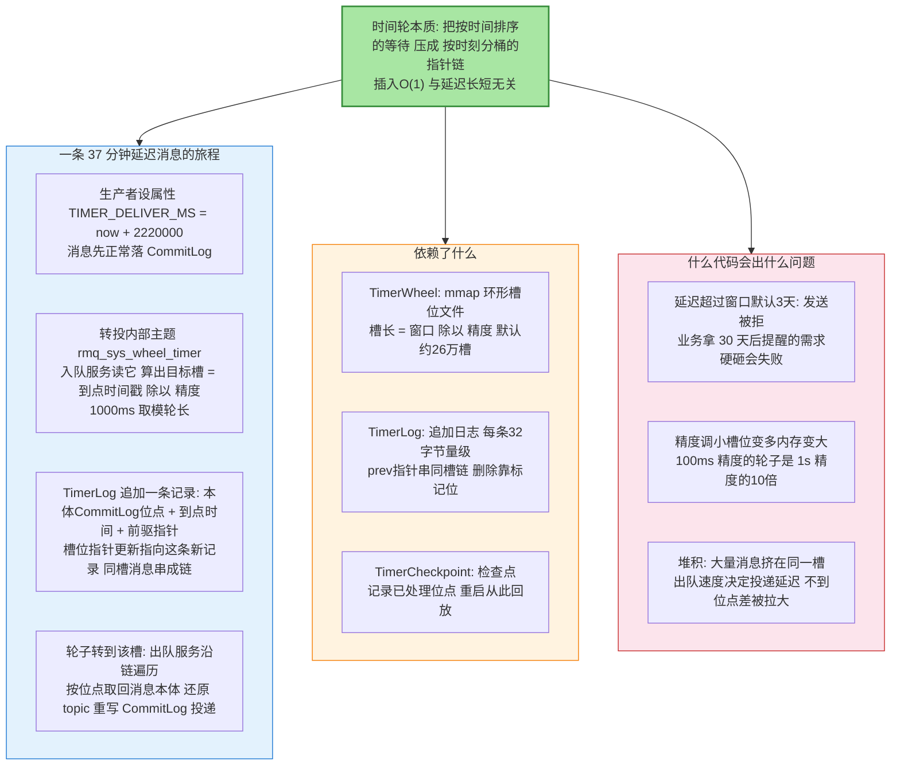
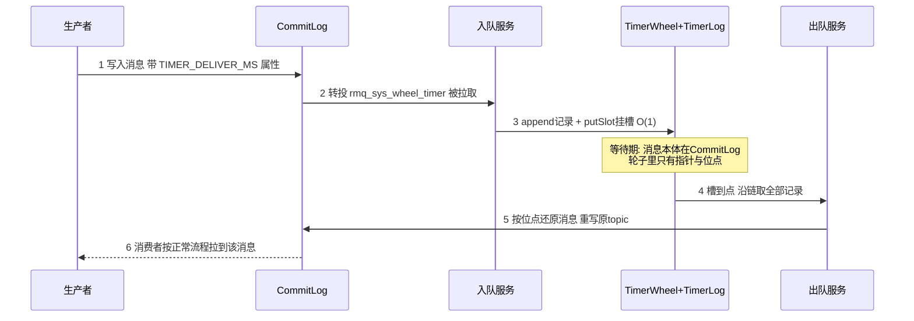
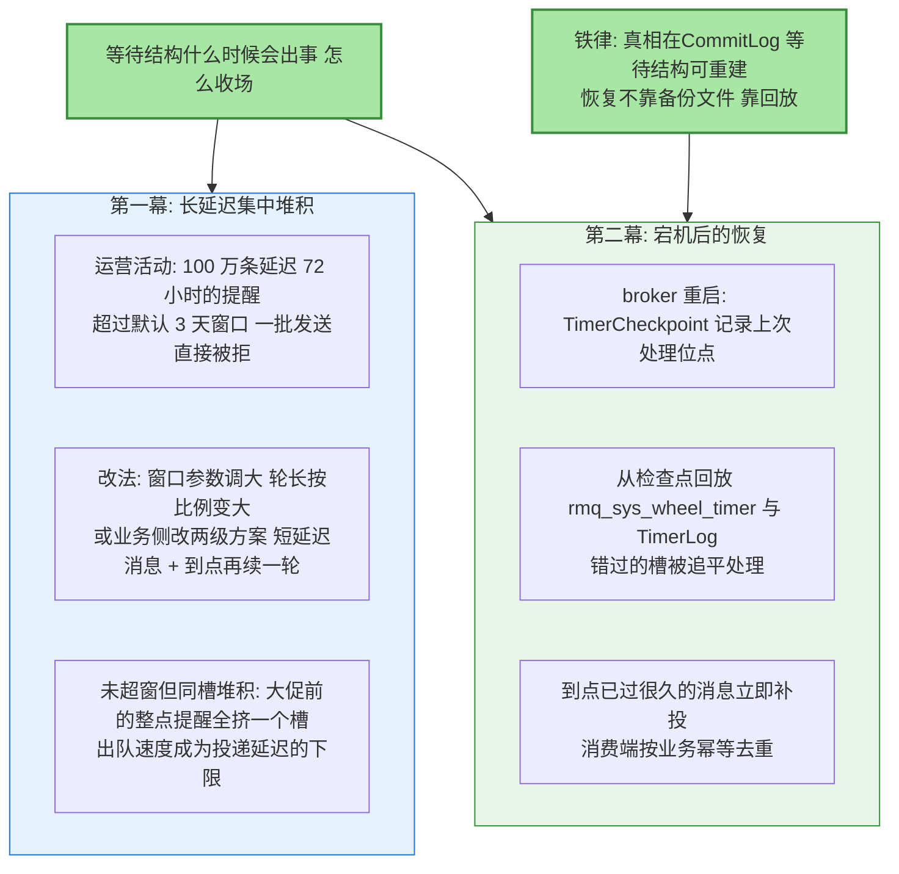
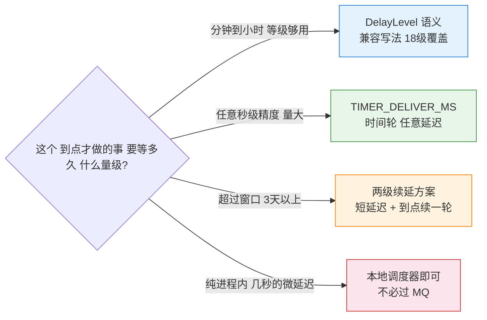

# 延迟消息与时间轮实现：从 18 个固定等级到任意精度

> 先看图，再看字——这张图就是全文：延迟消息的两代实现各把「等待」放在哪里、5.x 时间轮用三个文件怎么撑起任意精度、长延迟堆积与宕机恢复靠什么收场。

## 一图看懂：延迟消息的两代等待机制

**读图三步**：蓝（4.x）与橙（5.x）是两代实现的并排对照——差别不在「能不能延迟」，在「等待被组织成什么形状」（枚举等级 vs 槽位链）；绿是两代共享的恢复底座：**消息本体永远先落 CommitLog，等待结构里存的都是指针**，这是宕机不丢延迟任务的全部秘密。

## 🎯 本文核心

延迟消息的本质是**把「未来的投递」持久化**。4.x 用换存实现：消息被改写进内部主题 `SCHEDULE_TOPIC_XXXX`（原 topic/队列存进属性），18 个等级各由一个定时任务扫描，到点还原重投——实现极简，代价是等级外的延迟（如 37 分钟）表达不了。5.x 换成时间轮：环形槽位文件（TimerWheel）每槽覆盖一个精度周期（默认 1000ms），槽内用 TimerLog 的记录链串起所有「到点时刻相同」的消息，出队服务到点批量还原——**插入 O(1)、精度由参数定、延迟上限由轮子窗口定（默认 3 天，公开口径）**。两代共同的设计铁律：**CommitLog 是唯一真相，SCHEDULE_TOPIC 与时间轮都只是「带期限的指针集合」，任何宕机都能从真相重建等待。**

机制链一句话：**写入带延迟的消息 → 先落 CommitLog → 转投等待结构（换存主题 / 时间轮槽链）→ 到点扫描或出队 → 还原原 topic → 正常投递消费**。

## 一句话摘要

4.x：18 个等级固定枚举，消息换存进 SCHEDULE_TOPIC_XXXX（queueId=等级-1，REAL_TOPIC/REAL_QID 属性保存原身份），ScheduleMessageService 每等级一个定时任务扫描 ConsumeQueue、到点还原重投，简单但精度被锁死在 18 档；5.x：时间轮任意延迟（timerPrecision 默认 1 秒、timerMaxDelaySec 默认 3 天），消息转投内部主题 rmq_sys_wheel_timer 后由入队服务写 TimerLog 记录、挂进 TimerWheel 对应槽位链，到点出队还原——槽位插入 O(1)、精度参数化；长延迟与宕机恢复都靠「CommitLog 真相 + 检查点回放」收场。

## 5W 速记卡

| 维度 | 一句话 |
|---|---|
| What | 把未来投递持久化的两代实现：18 级换存制与时间轮槽链制 |
| Why | 服务端持久等待才能扛宕机，客户端定时器扛不住进程重启 |
| When | 订单超时关闭、预约提醒、重试退避——凡是「到点才该发生」的动作 |
| Where | 4.x: SCHEDULE_TOPIC_XXXX + ScheduleMessageService；5.x: TimerWheel/TimerLog/TimerCheckpoint |
| How | 等级够用选 4.x 语义（5.x 兼容），需要任意精度或超 2 小时用 TIMER_DELIVER_MS 属性 |

## 〇、边界：既有篇目讲过什么，本文讲什么

系列第 2 篇已完整讲过 4.x 的 18 级换存实现（DelayLevel 表、SCHEDULE_TOPIC_XXXX 内部结构、扫描投递流程）与三代方案对比。**本文只把 4.x 换存机制作为「引子」一笔带过，主体是第 2 篇未展开的 5.x 时间轮实现内幕：三个文件（TimerWheel/TimerLog/TimerCheckpoint）各自存什么、槽链怎么串、长延迟怎么堆积、宕机后怎么恢复。**两篇是接力关系，不是替代关系。

## 一、引子：18 个等级的换存，把等待持久化成主题

一条 4.x 延迟消息的旅程（细节见第 2 篇，这里只留骨架）：`setDelayTimeLevel(14)` 的消息写入 CommitLog 后被 broker 拦截改写——topic 换成 `SCHEDULE_TOPIC_XXXX`、queueId 换成 `等级-1`，原 topic 与队列存进 `REAL_TOPIC`/`REAL_QID` 属性；每个等级对应一个定时扫描任务，扫到「投递时间已到」的消息就还原身份重新写入 CommitLog，消费者才可见。**设计精髓：等待不是内存计时器，是一条普通消息躺在内部主题里——宕机不丢、可堆积、可恢复。**代价同样明显：18 个等级是写死在 `MessageSchedulerConst`/`ScheduleMessageService` 里的枚举（公开口径），37 分钟这种延迟表达不了，且每个等级一个扫描线程、粒度与负载强耦合。

**设计思想**：等级制是「用表达力换实现简单」的教科书交易——固定枚举让扫描任务数量、投递时间计算、监控口径全部静态化；但当业务开始要「5 分钟」「37 分钟」「明天 10 点」，枚举就变成了天花板。5.x 时间轮就是来拆天花板的。

## 二、5.x 时间轮：三个文件撑起任意精度

### 组件四要素图：TimerWheel 与 TimerLog 的槽链机制

**关键路径（源码级）**：入队侧 `TimerEnqueueGetService` 从 `rmq_sys_wheel_timer` 的队列拉取消息，`TimerEnqueuePutService` 执行 `TimerLog#append` 写记录并经 `TimerWheel#putSlot` 更新槽指针——同槽消息靠记录里的 prev 位点单向串联；出队侧 `TimerDequeueGetService` 按「轮子当前时刻对应的槽」取链，`TimerDequeuePutMessageService` 还原消息重写 CommitLog。槽位滚动（`TimerWheel#scrollSlots`）处理窗口边界：超出轮长的延迟靠滚动多圈消化（公开口径）；删除与幂等靠记录上的 magic 标记位。5.x 起 broker 端 timer 能力默认开启（`timerEnable`，公开口径），4.x 的 DelayLevel 写法被映射为对应毫秒值走同一条时间轮链路——**一个 broker，两套语义，一个轮子**。

### 入队与出队的完整时序

时序里最重要的认知在第 4 步之前的等待期：**时间轮里没有消息、只有「到点时刻 + CommitLog 位点」**——所以等待期不管多长、堆积不管多大，内存与文件占用都只是指针量级，真相始终在 CommitLog 里。

## 三、长延迟的堆积与恢复：两幕常见戏码

两幕各讲透一点：**堆积幕**——时间轮把「按时间排序」变成了「按时刻分桶」，桶内顺序无关紧要，所以堆积的代价不在插入端（O(1) 稳如老狗），在出队端：同槽百万条消息的还原重写速度决定这些延迟消息「准点多少」。容量规划的关键指标是**出队吞吐与同槽峰值**，业内认知：出队链路还原消息本质是再走一遍 CommitLog 写入，吞吐与正常写入同量级。**恢复幕**——重启后不是恢复「文件镜像」，而是从检查点回放日志：错过的槽逐个处理、已到点的消息立即补投。这条设计再次押中「CommitLog 是真相」的铁律——**等待结构是缓存，缓存丢了可以重建，真相丢了才是事故。**

## 四、追问链：质疑者三连

**追问一：为什么用时间轮，不用优先队列（最小堆）？**最小堆插入是 O(log N)，百万级延迟消息下每次插入的堆调整成本可观，且堆是纯内存结构、持久化要额外设计；时间轮插入 O(1)、槽位文件天然 mmap 持久化。时间轮的短板是「窗口外无法表达」与「同槽内无序」，前者用滚动/窗口参数解，后者恰好无关紧要——延迟消息不需要槽内按序，只需到点一起出。**数据结构选型对的需求先行：要的是「按时刻取批」，不是「全局排序」。**

**再追问：5.x 的 DelayLevel 写法还走 18 级换存吗？**不走了。5.x broker 把等级值换算成对应毫秒数写进 TIMER 属性，统一走时间轮链路（公开口径）——18 级换存语义被完整保留，实现被时间轮收编。这也是升级 5.x 时延迟消息行为兼容的原因：上层 API 不变，底层等待结构换代。

**打破砂锅：既然 CommitLog 里已有消息本体，为什么还要转投 rmq_sys_wheel_timer 再登记一遍？**因为需要「一个按到点时间排列的索引」。CommitLog 是按写入序组织的，从中找出「哪些消息到点了」只能全量扫描；rmq_sys_wheel_timer 这条中转队列 + 时间轮槽链，本质是为 CommitLog 建了一个「到期时刻」的倒排索引——多一次转投的写放大，换来出队时按槽直达。**用一次冗余写，买掉到点扫描的全量遍历**，这笔账在延迟消息量大时稳赚。

## 五、反方案分析：两条「直觉上更顺」的路为什么不走

**为什么不选「客户端本地定时器，到点再发普通消息」（反方案一）？**服务进程一重启，定时器里的等待全部蒸发；多实例部署下同一任务重复触发；延迟 1 小时的任务挂 59 分钟时扩容，任务归属一团乱。**「到点才该发生」的动作必须由有持久化保证的一方持有**——这就是服务端延迟消息存在的理由：等待被写进 CommitLog 与时间轮，进程生死与它无关。

**为什么不选「数据库定时表轮询」（反方案二）？**这是没有 MQ 时的经典做法（定时任务扫 delay 表），问题在量级：轮询频率决定精度（秒级精度 = 每秒全表扫索引）、堆积时 DB 扫描压力直接冲击业务库、高可用要自己扛。时间轮方案把等待的成本转移到 MQ 的顺序写与 mmap 文件上，**同一个需求，把负载从「业务库的随机读」搬到「MQ 的顺序写」**——量级一大，这是生死之别。

## 六、事故复盘（匿名化叙事）

**复盘一：跨天提醒批量被拒。**现象：某预约类服务接入 5.x 后发起「72 小时前提醒」功能压测，一部分发送报错。**排查**：错误码指向延迟超限——broker 窗口为默认 3 天（timerMaxDelaySec 公开口径默认值），72 小时整的延迟在窗口边界外；同时发现运营配置里还混着「7 天后提醒」的需求被一并拒收。**复盘**：评估后窗口调大到 8 天并相应规划轮子内存与出队容量；更长的「7 天」需求改为「延迟消息 + 到点续延」两级方案。教训一句话：**窗口是硬边界，接需求前先核对延迟上限，别让「被拒」成为发现方式。**

**复盘二：主从切换后的整点提醒迟到。**现象：某消息平台主从架构下主库故障切换，恢复后整点批量的延迟提醒集中迟到数分钟。**排查**：切换期间新主的时间轮槽链从检查点回放追平，回放速度追不上「同一槽内十几万条整点消息」的出队还原速度——堆积不是丢失，是出队吞吐不够。**复盘**：整点类提醒按业务打散到 ±30 秒区间（发送端加随机偏移）、出队线程数与还原吞吐纳入切换演练的检查项。教训一句话：**时间轮保证「不丢、最终到」，准点率是出队容量的函数——打散同槽堆积比事后扩容便宜得多。**

## 七、不同量级的思考：约束来源决定解法

- **十万级日延迟消息（常规业务量）**：约束来源是精度与等级够用——18 级语义或秒级精度足以覆盖订单超时等场景；这一档的核心问题是「选对 API 语义」，而不是「轮子参数」；思考方式是**语义驱动**——用 DelayLevel 写法保持 4.x 兼容，窗口默认值不动。
- **百万级日延迟消息（延迟任务平台化）**：约束来源是同槽堆积与出队吞吐开始成为准点率瓶颈；这一档的核心问题是「到点高峰的出队容量」，而不是「插入性能」；思考方式是**容量驱动**——整点打散、出队线程与 CommitLog 写入配比压测、堆积深度监控告警。
- **千万级日延迟消息（延迟即核心业务）**：约束来源是窗口边界与故障恢复的准点 SLA——长延迟集中、跨主从切换的追平速度都进入承诺范围；这一档的核心问题是「极端分布（超窗/同槽洪峰）与故障场景的确定性」，而不是「平均吞吐」；思考方式是**演练驱动**——窗口与精度按业务分布定制、主从切换追平演练常态化、两级续延方案成为长延迟的标配套路。
- **亿级日延迟消息（延迟任务平台化）**：约束来源是多租户与治理——几十条业务线共享时间轮，「谁在塞同槽洪峰」「谁在逼近窗口边界」成为准点 SLA 的主导变量；这一档的核心问题是「延迟容量的公平分配与治理」，而不是「单业务线再调优一点」；思考方式是**配额驱动**——按业务线分配延迟消息配额与打散规范、堆积与被拒按租户分账、窗口扩容进全局容量规划。

思考方式总结：十万级靠「选对语义」，百万级靠「管住峰值」，千万级靠「演练极端」，亿级靠「配额治理」——约束从 API 匹配迁移到出队容量、再迁移到极端场景确定性、最终迁移到多租户公平性，解法跟着约束来源走。

**自下而上与触发升级**：三个实测值定档——日延迟消息量与延迟值分布（有没有贴近窗口边界的）、同槽峰值与出队延迟分位（准点率的真实水位）、主从切换后追平时长（恢复能力）。触发升级的信号：出现「被拒」报错说明窗口该重新谈判了；同槽出队 P99 抬升说明打散策略要上了；切换演练追平超时说明该进演练驱动的档位。**量级不是消息总数，是「最挤的那个槽」与「最长的那条延迟」**——时间轮的账永远按峰值算。

## 八、业内惯例与生产实践

- **API 习惯**：新业务直接用 TIMER_DELIVER_MS（或 TIMER_DELAY_SEC/MS）属性表达任意延迟；存量 4.x 代码的 DelayLevel 写法在 5.x 平滑兼容（公开口径），不必批量改写。
- **窗口与精度定制**：默认窗口 3 天、精度 1 秒（公开口径）满足多数场景；窗口调大必须同步评估轮子内存（轮长与窗口成正比）与出队容量。
- **打散纪律**：整点/整分到点的延迟批量，发送端加随机偏移是公开口径的通行做法——同槽洪峰是准点率的第一杀手。
- **监控三件**：堆积深度（rmq_sys_wheel_timer 队列与槽位差）、出队延迟分位、超窗被拒计数——三个数字覆盖「进得来吗 / 准点吗 / 有没有被拒」。
- **反模式**：把延迟消息当秒级精度的定时任务系统用（精度与准点 SLA 要分清）、超长延迟硬砸窗口（该两级续延就两级续延）、主从切换演练不含时间轮追平检查、消费端不幂等（到点补投与重试叠加时重复投递是设计内行为）。

## 💡 实战提示

- 💡 接需求先问延迟上限：默认 3 天窗口是硬边界（公开口径默认值），超窗需求直接上两级续延方案，别等发送被拒
- 💡 整点批量延迟消息必打散：发送时间或到点时间加随机偏移，把「一个槽的洪峰」摊成「一段时间的坡」
- 💡 时间轮里只有指针，CommitLog 里才是消息——所以堆积再大内存也不慌，慌的应该是出队容量
- 💡 消费端幂等在延迟消息场景是必配：到点补投、重试、切换追平都会带来重复投递的可能
- 💡 监控三数字：堆积深度看出队跟不跟得上，出队延迟分位看准点率，被拒计数看窗口边界——三个都有了延迟消息才算可观测

## 开放问题

- 超长延迟（月级、年级）在 MQ 内沉淀还是上移到专门调度系统，社区实践分裂，主流意见倾向两级续延或外置调度
- 多级精度时间轮（分级轮减少内存）在 RocketMQ 内的演进方向，尚无公开定论

## 你们可能会问

**Q1：5.x 的任意延迟精度能到毫秒级吗？把 timerPrecision 调小就行吗？**
参数上可以（精度可配），但代价要算清：轮长 = 窗口 ÷ 精度，100ms 精度的轮子槽数是 1 秒精度的 10 倍，内存与槽位管理成本同比例上涨；且准点率最终受出队吞吐与 CommitLog 写入限制，精度调到 100ms 不等于投递误差 100ms。业内认知：秒级精度是成本与效果的现实平衡点。

**Q2：主从架构下时间轮文件是两边各一份吗？切换会不会丢等待中的消息？**
各一份，但不互为备份——恢复靠回放不靠拷贝。新主从检查点（TimerCheckpoint）起重新处理 rmq_sys_wheel_timer 队列与 TimerLog，错过的槽追平处理，等待中的消息本体本来就在 CommitLog 里（主从同步保障），所以等待不会丢，只会「迟到」——迟到多久取决于追平速度，这正是切换演练要测的指标。

**Q3：延迟消息在投递前被消费者「取消」怎么做？**
用 5.x 的 Cancel 语义（公开口径，系列第 2 篇已讲接口层用法）：底层靠 TimerLog 的删除标记——出队沿链遍历时遇到删除标记的记录直接跳过。注意这是「标记删除」不是物理回收，槽位空间的最终回收依赖滚动与日志治理；高频取消场景要评估删除标记带来的遍历开销。

**Q4：延迟消息和重试队列是同一套机制吗？**
不是同一套，但是同一种思想。消费重试的退避（RECONSUME_LATER 的延迟阶梯）本质也是「到点再投」——4.x 重试同样借道 SCHEDULE_TOPIC 的等级延迟实现换存等待。理解了本文的换存与槽链，重试的延迟阶梯就是同一个机制的另一个租户。

## 什么时候用 / 不用

先看决策图：

- ✅ **订单超时/预约提醒/重试退避用服务端延迟消息**：等待需要持久化，进程重启不能丢任务
- ✅ **任意精度需求用 TIMER 属性写法**：等级表达不了的延迟交给时间轮
- ✅ **整点批量必加打散偏移**：同槽洪峰是准点率的头号敌人
- ❌ 不用延迟消息当精确时钟——它保证「到点后尽快投」，不保证「秒秒不差」
- ❌ 不把超窗延迟硬砸在默认窗口上——被拒报错是最贵的发现方式
- ❌ 不跳过消费端幂等——补投与重试叠加的重复是设计内行为
- ❌ 不用秒级微延迟需求过 MQ——进程内调度器更便宜，MQ 的价值在持久化等待

## Trade-off：等待的三种组织方式各在花什么

延迟消息的演进是一连串明确的交易：**客户端定时器**用「零服务端成本」换「进程生死绑定」，只能撑玩具场景；**18 级换存**用「表达力」换「实现与运维的最简」——枚举静态、扫描静态，代价是精度天花板；**时间轮**用「轮子内存 + 写放大」换「任意精度与 O(1) 插入」，代价是窗口硬边界与出队容量成为新变量。跨周期看这条脉络：等待的组织方式从「枚举」到「分桶」，本质是延迟消息从「一个特性」长成「一个平台」——而当延迟任务量再上一个量级，社区讨论的方向（分级轮、与调度系统的边界重构）说明这笔交易还会继续谈下去。选型时先给自己的延迟分布画像（值域、峰值、准点要求），画像清楚，价目表自己会说话。

## 🎯 核心带走

- **一图一句**：延迟消息 = 把等待持久化——4.x 用主题换存（等级制），5.x 用时间轮槽链（任意精度），铁律同源：真相在 CommitLog，等待只是指针
- **4.x 骨架**：REAL_TOPIC/REAL_QID 保存原身份、queueId 即等级、每等级一个扫描任务——极简但精度锁死 18 档
- **5.x 三文件**：TimerWheel 环形槽位（每槽一个精度周期）、TimerLog 追加记录链（prev 指针串同槽）、TimerCheckpoint（重启回放起点）
- **两个 O(1)**：插入 O(1) 与延迟长短无关；等待期内存占用 O(指针)——堆积的成本全部压在出队还原这一端
- **恢复逻辑**：不靠文件镜像靠回放——检查点起步、错过槽追平、到点补投，消费端幂等是这套语义的标配
- **量级主线**：语义驱动 → 容量驱动 → 演练驱动 → 配额驱动，账按「最挤的槽」和「最长的延迟」算，不按消息总数算

## 📌 数据与事实声明

- 写于 2026-09-24（特性层新增，RocketMQ 特性系列第 13 篇）；机制描述以 Apache RocketMQ 官方文档与 GitHub apache/rocketmq 源码（timer 相关模块：TimerWheel/TimerLog/TimerMessageStore/TimerCheckpoint）公开内容为基准
- 「timerPrecision 默认 1000ms、timerMaxDelaySec 默认 3 天、TimerLog 单条记录 32 字节量级、5.x timerEnable 默认开启」等为公开口径默认值，具体以所用版本配置文档为准
- 出队吞吐与正常写入同量级、槽位数约 26 万等为公开口径与业内认知的量级判断，非实测数据
- 事故复盘为公开技术社区高频案例模式的匿名化复述，不含任何真实系统、公司与内部代号

## 📚 参考资料

| 类型 | 标题 | 来源 |
|---|---|---|
| 官方文档 | Delay Message / 定时与延迟消息（5.x） | rocketmq.apache.org/docs |
| 源码 | timer 模块（TimerWheel / TimerLog / TimerMessageStore） | github.com/apache/rocketmq（store 包） |
| 关联机制 | Kafka 时间轮（层级时间轮对照视角） | github.com/apache/kafka（TimingWheel） |
| 系列内 | 第 2 篇：延迟消息原理（4.x 换存全细节与三代对比） | 本系列 |
| 系列内 | 第 12 篇：刷盘与复制深度（CommitLog 持久化底座） | 本系列 |
