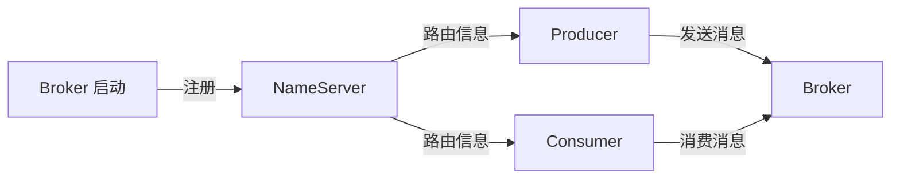
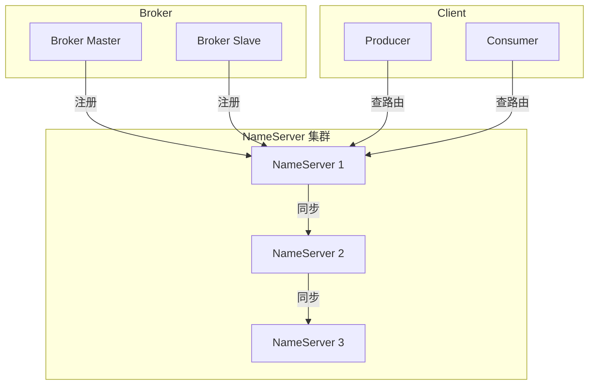

# NameServer 深度原理

## 本文核心

**一句话摘要**：NameServer 是 RocketMQ 的轻量注册中心，负责 Broker 注册/发现/路由信息管理，无状态设计支持水平扩展。

**核心机制链**：注册流程 → 路由管理 → 心跳检测 → 故障转移 → 生产实践





## 一、NameServer 架构

### 1.1 无状态设计

NameServer 无状态，不存储业务数据，只存储路由信息。支持多实例部署，客户端随机连接。

### 1.2 路由信息

NameServer 存储：
- Broker 地址（IP:Port）
- Topic 路由（Queue 列表）
- Broker 角色（Master/Slave）
- 集群信息

## 二、注册流程

### 2.1 Broker 注册

```
Broker 启动 → 向所有 NameServer 注册 → 定时心跳（30s 间隔）
```

### 2.2 心跳机制

- 心跳间隔：30s
- 超时时间：120s（4 次心跳未响应）
- 超时处理：移除 Broker 路由信息

### 2.3 路由更新

Broker 注册后，NameServer 更新路由表。Client 查询时获取最新路由。

## 三、路由管理

### 3.1 路由数据结构

```java
class TopicRouteData {
    String topic;
    List<QueueData> queueDatas;  // Queue 列表
    List<BrokerData> brokerDatas; // Broker 列表
}
```

### 3.2 路由查询

```java
// Producer 查询路由
TopicRouteData routeData = namesrvAddrList.get(0).getRouteInfo("Topic");

// Consumer 查询路由
TopicRouteData routeData = namesrvAddrList.get(0).getRouteInfo("Topic");
```

## 四、故障转移

### 4.1 NameServer 故障

NameServer 无状态，单台故障不影响整体。客户端自动重连其他 NameServer。

### 4.2 Broker 故障

Broker 故障时，NameServer 检测到心跳超时（120s），移除故障 Broker 路由。客户端自动切换到其他 Broker。

## 五、生产实践

### 5.1 部署建议

| 场景 | NameServer 数量 | 理由 |
|---|---|---|
| **小规模** | 1 台 | 够用 |
| **生产环境** | 3 台 | 高可用 |
| **大规模** | 5 台 | 负载均衡 |

### 5.2 客户端配置

```properties
# 客户端配置
namesrvAddr=192.168.1.1:9876;192.168.1.2:9876;192.168.1.3:9876
```

### 5.3 监控指标

| 指标 | 说明 | 健康阈值 |
|---|---|---|
| Broker 在线数 | 注册的 Broker 数量 | > 0 |
| Topic 路由数 | 路由的 Topic 数量 | > 0 |
| 心跳超时 | 超时 Broker 数 | 0 |

## 九、源码/关键路径

### 9.1 NameServer 注册关键路径

```
Broker 启动 → 向所有 NameServer 注册 → 定时心跳（30s 间隔）
  → NameServer 更新路由表 → Client 查询获取最新路由
```

### 9.2 路由查询关键路径

```
Client 查路由 → namesrvAddrList 随机选 NameServer
  → GetRouteInfoRequest → NameServer 返回 TopicRouteData
```

### 9.3 心跳检测关键路径

```
Broker 定时心跳（30s）→ NameServer 记录最后心跳时间
  → 超时 120s → 移除 Broker 路由 → 客户端自动重连
```

## 十、业内惯例/生产实践

### 10.1 业内惯例

- **NameServer 数量**：生产环境至少 3 台
- **客户端配置**：配置所有 NameServer 地址，客户端随机选择
- **心跳超时**：120s 超时意味着 Broker 故障后 2min 才被移除
- **路由缓存**：客户端缓存路由信息，定期刷新

### 10.2 生产实践

| 场景 | 实践 | 效果 |
|---|---|---|
| **NameServer 故障** | 客户端自动切换其他 NameServer | 服务不中断 |
| **Broker 故障** | 心跳超时后移除路由 + 客户端重连 | 自动故障转移 |
| **路由不一致** | 客户端定时刷新路由缓存 | 最终一致 |

## 十、核心带走
- **核心链条**：注册流程 → 路由管理 → 心跳检测 → 故障转移 → 生产实践
- **无状态设计**：支持水平扩展，单台故障不影响
- **心跳机制**：30s 间隔 / 120s 超时

## 💡 实战提示（Tips）

- **NameServer 数量**：生产环境至少 3 台
- **客户端配置**：配置所有 NameServer 地址，客户端随机选择
- **心跳超时**：120s 超时意味着 Broker 故障后 2min 才被移除
- **路由缓存**：客户端缓存路由信息，定期刷新

## ❓ 你们可能会问（QA）

**Q1：NameServer 为什么无状态？**
A：无状态设计简化架构，支持水平扩展。路由信息由 Broker 注册，NameServer 只负责存储和转发。

**Q2：NameServer 故障会影响吗？**
A：不会。客户端有 NameServer 列表，故障时自动切换。

**Q3：路由信息如何更新？**
A：Broker 注册时更新，客户端查询时获取最新路由。

## 🤔 思考（开放问题/反思）

- **NameServer 高可用**：3 台 NameServer 是否够？如何扩容？
- **路由信息一致性**：多台 NameServer 之间如何保证路由一致？——最终一致
- **客户端缓存**：缓存多久刷新一次？如何处理缓存不一致？

## ⚖️ Trade-off（代价与反方案）

| 方案 | 优势 | 代价 | 反方案 |
|---|---|---|---|
| **NameServer** | 轻量、无状态、易扩展 | 无持久化、路由信息易失 | ZooKeeper / Nacos |
| **ZooKeeper** | 强一致、持久化 | 复杂、运维成本高 | NameServer |
| **Nacos** | 配置管理 + 注册中心 | 依赖多 | NameServer |

## 📌 数据与事实声明

- 写于 2026-09-11，机制以 RocketMQ 4.x/5.x 为基准
- 量级红线为行业认知口径，决策需按实际业务压测校准
- 典型场景为公开技术社区高频案例的匿名化复述
- 工具口径以 RocketMQ 官方文档为准

## 📚 参考资料

- RocketMQ 官方文档：https://rocketmq.apache.org/docs/
- 《RocketMQ 技术内幕》耿雨春