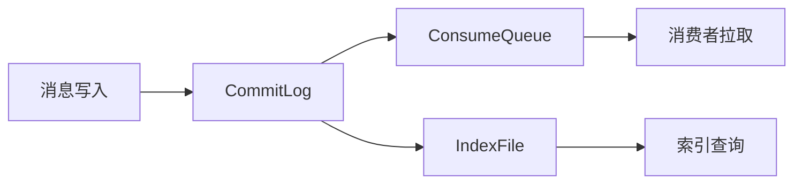
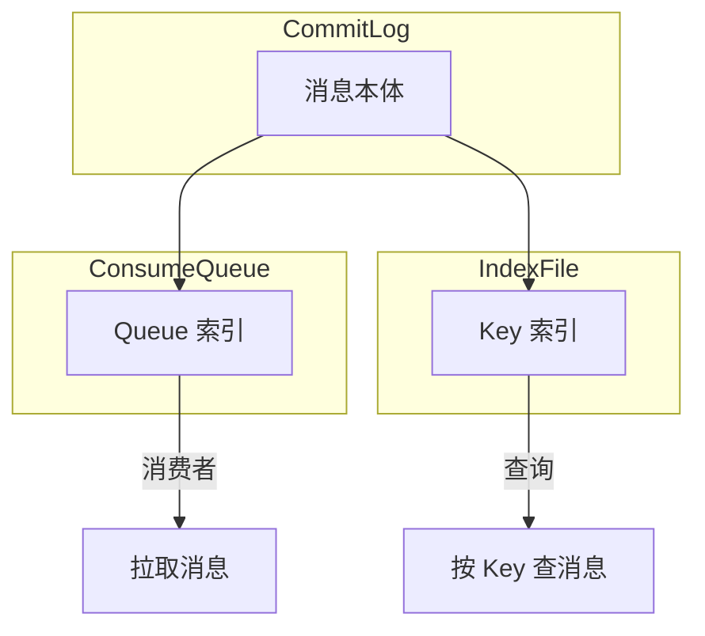

# Broker 存储引擎深度

## 本文核心

**一句话摘要**：RocketMQ Broker 存储引擎 = CommitLog + ConsumeQueue + IndexFile 三层结构，顺序写 + MMap 实现高吞吐。

**核心机制链**：写入流程 → 存储结构 → 消费流程 → 性能优化 → 生产实践





## 一、三层存储结构

### 1.1 CommitLog

- 所有消息写入同一个 CommitLog 文件
- 文件大小：1GB
- 命名规则：`${ PhysicOffset }.${ FileName }`
- 写入方式：顺序写 + MMap

### 1.2 ConsumeQueue

- 按 Topic/Queue 维护消费队列
- 文件大小：30W 条索引 / 文件
- 内容：CommitLog 偏移 + 消息长度 + Tag HashCode

### 1.3 IndexFile

- 按 Key 维护索引
- 文件大小：200M / 文件
- 内容：Key + CommitLog 偏移 + 时间戳

## 二、写入流程

### 2.1 生产者写入

```
Producer → namesrvAddr → RouteInfo → Master Broker
  → CommitLog 写入 → 返回 ACK
  → ConsumeQueue 写入 → 返回 ACK
```

### 2.2 写入性能

- 顺序写：600MB/s+
- MMap：内核页缓存，零拷贝
- 刷盘策略：异步刷盘（性能）/ 同步刷盘（可靠）

## 三、消费流程

### 3.1 消费者拉取

```
Consumer → namesrvAddr → RouteInfo → Master/Slave Broker
  → ConsumeQueue 查询 → CommitLog 读取 → 返回消息
```

### 3.2 拉取策略

| 策略 | 说明 | 适用场景 |
|---|---|---|
| **顺序拉取** | 按 Queue 顺序 | 顺序消息 |
| **负载均衡** | Round-Robin | 并发消费 |
| **广播模式** | 每个 Consumer 独立消费 | 广播场景 |

## 四、性能优化

### 4.1 刷盘策略

| 策略 | 同步/异步 | 可靠性 | 性能 |
|---|---|---|---|
| **同步刷盘** | 同步 | 高 | 低 |
| **异步刷盘** | 异步 | 中 | 高 |

### 4.2 消费快照

```java
// Consumer 设置消费起点
consumer.seek(topic, queueId, timestamp);
```

### 4.3 批量消费

```java
// Consumer 批量拉取
consumer.setConsumeBatchSize(64);
```

## 五、生产实践

### 5.1 部署建议

| 场景 | CommitLog 磁盘 | 刷盘策略 | 复制 |
|---|---|---|---|
| **金融** | SSD | 同步刷盘 | 主从同步 |
| **电商** | SSD/HDD | 异步刷盘 | 主从异步 |
| **日志** | HDD | 异步刷盘 | 主从异步 |

### 5.2 监控指标

| 指标 | 说明 | 健康阈值 |
|---|---|---|
| CommitLog 大小 | 单个文件大小 | < 1GB |
| ConsumeQueue 大小 | 索引文件大小 | < 30W 条 |
| 刷盘延迟 | 异步刷盘延迟 | < 5s |
| 消息堆积 | Consumer 消费延迟 | 0 |

## 八、源码/关键路径

### 8.1 CommitLog 写入关键路径

```
Producer → namesrvAddr → RouteInfo → Master Broker
  → CommitLog 写入（顺序写 + MMap）→ 返回 ACK
  → ConsumeQueue 写入 → 返回 ACK
```

### 8.2 ConsumeQueue 查询关键路径

```
Consumer 拉取 → ConsumeQueue 查询（Queue 索引）
  → CommitLog 读取 → 返回消息
```

### 8.3 刷盘关键路径

```
消息写入 → PageCache（内存）
  → 异步刷盘（5s 间隔）→ 磁盘
  → 同步刷盘（等待 ACK）→ 磁盘
```

## 九、业内惯例/生产实践

### 9.1 业内惯例

- **刷盘策略**：金融选同步，电商选异步
- **磁盘选型**：金融 SSD，电商 HDD/SSD
- **批量消费**：setConsumeBatchSize 提升吞吐
- **消费快照**：seek(timestamp) 跳转消费位点

### 9.2 生产实践

| 场景 | 实践 | 效果 |
|---|---|---|
| **金融核心** | 同步刷盘 + 主从同步 | 数据零丢失 |
| **电商大促** | 异步刷盘 + 主从异步 | 高吞吐 |
| **日志场景** | 异步刷盘 + HDD | 成本低 |

## 九、核心带走
- **核心链条**：写入流程 → 存储结构 → 消费流程 → 性能优化 → 生产实践
- **写入性能**：顺序写 + MMap = 600MB/s+
- **消费性能**：ConsumeQueue 索引 + CommitLog 读取

## 💡 实战提示（Tips）

- **刷盘策略**：金融选同步，电商选异步
- **磁盘选型**：金融 SSD，电商 HDD/SSD
- **批量消费**：setConsumeBatchSize 提升吞吐
- **消费快照**：seek(timestamp) 跳转消费位点

## ❓ 你们可能会问（QA）

**Q1：CommitLog 文件多大？**
A：1GB。达到上限后滚动新文件。

**Q2：ConsumeQueue 存什么？**
A：CommitLog 偏移 + 消息长度 + Tag HashCode。用于快速定位消息。

**Q3：IndexFile 的 Key 是什么？**
A：用户设置的 Key（Message Key）。用于按 Key 查询消息。

## 🤔 思考（开放问题/反思）

- **CommitLog 清理**：消息过期后如何清理？——TTL + 异步清理
- **ConsumeQueue 重建**：ConsumeQueue 损坏如何恢复？——从 CommitLog 重建
- **IndexFile 容量**：IndexFile 满后如何处理？——创建新文件

## ⚖️ Trade-off（代价与反方案）

| 方案 | 优势 | 代价 | 反方案 |
|---|---|---|---|
| **顺序写+MMap** | 性能极高 | 依赖文件系统 | 随机写 |
| **同步刷盘** | 可靠性高 | 性能低 | 异步刷盘 |
| **异步刷盘** | 性能高 | 可能丢消息 | 同步刷盘 |
| **主从同步** | 数据可靠 | 延迟高 | 主从异步 |

## 📌 数据与事实声明

- 写于 2026-09-11，机制以 RocketMQ 4.x/5.x 为基准
- 量级红线为行业认知口径，决策需按实际业务压测校准
- 典型场景为公开技术社区高频案例的匿名化复述
- 工具口径以 RocketMQ 官方文档为准

## 📚 参考资料

- RocketMQ 官方文档：https://rocketmq.apache.org/docs/
- 《RocketMQ 技术内幕》耿雨春