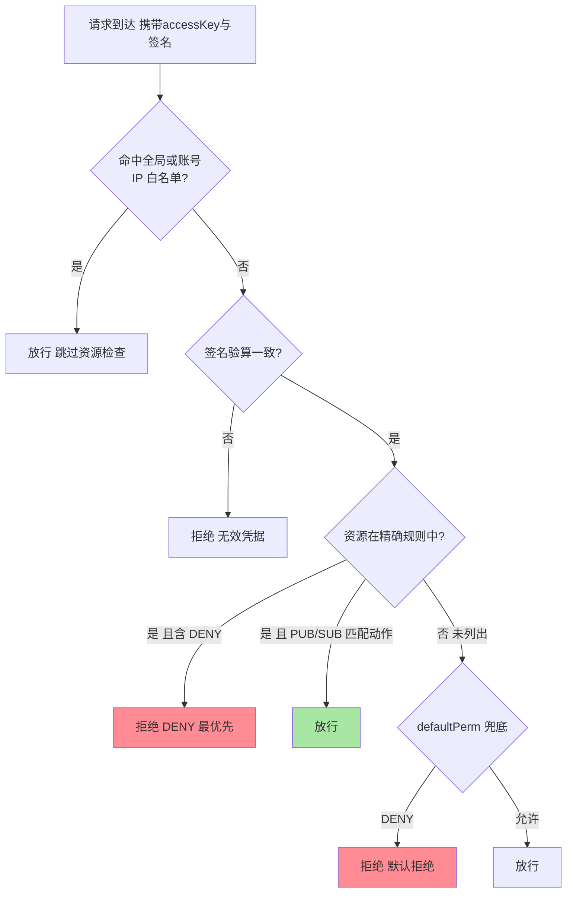
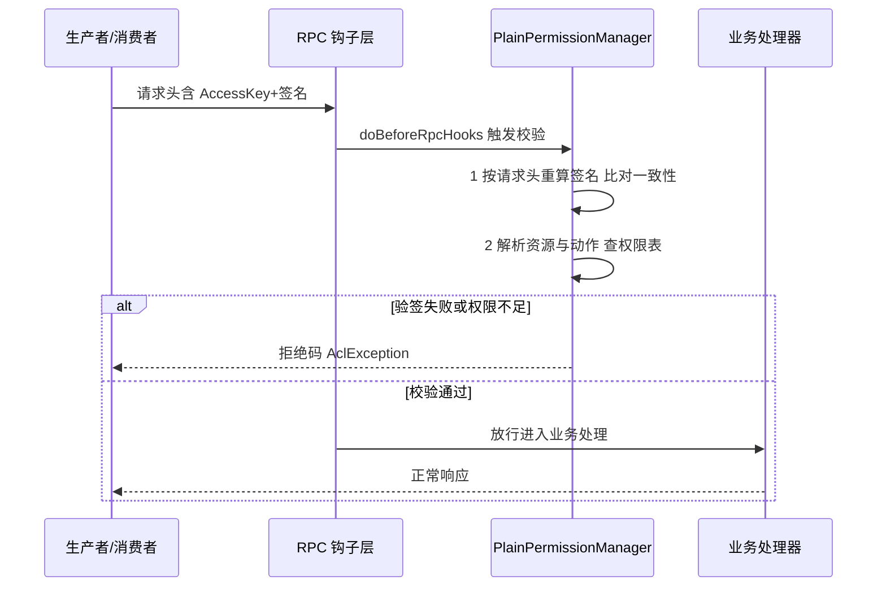
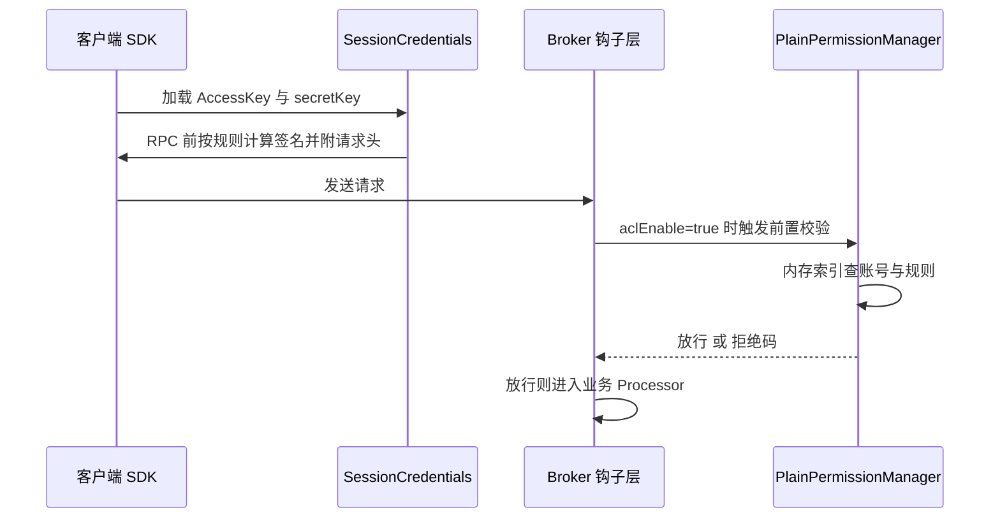

# ACL 权限体系与鉴权：从 plain_acl.yml 到 Broker 判定链

> 消息队列的安全问题往往在出事之后才被认真对待：某个陌生消费组悄悄把订单主题的数据拉走，或者测试环境的客户端误连生产集群写脏数据——裸奔的 Broker 对任何持有地址的人敞开。RocketMQ 的 ACL（访问控制列表）就是补这道门的：**谁能（Subject）对哪个主题（Resource）做什么（Permission）**。这篇讲清 ACL 的模型与配置结构、鉴权在 Broker 处理链路里的位置、与 TLS 的分工配合、以及从零到生产的安全开启路径。

## 一句话摘要

RocketMQ ACL 的核心是三层抽象：**Subject**（accessKey 标识的账号）、**Resource**（Topic/Group/Cluster 等被保护对象）、**Permission**（DENY/ANY/PUB/SUB，DENY 优先级最高）。账号与规则写在 `plain_acl.yml`（4.x 形态，5.x 演进出独立的认证与授权体系但 ACL 仍可用），Broker 开启 `aclEnable=true` 后，每个 RPC 请求在进入业务处理器**之前**先过「验签 + 鉴权」两道钩子：签名证明「你是你」，权限表裁决「你能不能」。TLS 与 ACL 是互补的两层——TLS 管信道的窃听与篡改，ACL 管访问的越权与误用，**只开一个都留有缺口**。

## 🎯 本文核心

**核心一句话：ACL 的设计哲学是「默认拒绝 + 白名单放行」——判定顺序是 DENY 最优先、精确规则次之、defaultPerm 兜底；鉴权钩子卡在 Broker 请求管线的业务入口之前，把越权请求挡在存储引擎与消费逻辑之外。**

机制链：三层抽象（Subject/Resource/Permission）→ 配置结构（plain_acl.yml 的账号与规则段）→ 鉴权位置（Remoting 层 RPC 钩子，先验签后裁权）→ 与 TLS 的分工（信道安全 vs 访问控制）→ 生产开启路径（灰度收紧五步）。全文一句话可重构：「**验签解决冒充，ACL 解决越权，TLS 解决窃听——三件事三个机制，缺一个就有一个口子**」。

## 前置阅读

- 入门层《[安全与 ACL](../../入门层/从零开始认识RocketMQ系列/安全与ACL-入门.md)》：概念层认知
- 本系列后续篇：敏感数据治理、审计与告警（规划中）

## 目标导向

本文是什么：RocketMQ ACL 模型、配置与鉴权链路的机制篇。功能是什么：让「为什么这条请求被拒绝了」「集群怎么从裸奔到受控」可推理、可落地。能得到什么：plain_acl.yml 的字段级理解、鉴权在 Broker 里的位置图、TLS+ACL 的配合口径、生产灰度开启的操作顺序。为什么用：集群安全加固、越权事件复盘、多团队共享集群的权限治理，必看。

## 一、边界：入门层讲过什么，本文讲什么

| 内容 | 入门层 | 本文 |
|---|---|---|
| ACL 是什么、为什么需要 | 提了一句 | 不重复 |
| Subject/Resource/Permission 三层模型 | 未讲 | **本文核心一** |
| plain_acl.yml 配置结构与判定优先级 | 未讲 | **本文核心二** |
| 鉴权钩子在 Broker 链路的位置 | 未讲 | **本文核心三** |
| 与 TLS 的分工及生产开启路径 | 未讲 | **本文核心四** |

## 二、三层模型：Subject、Resource、Permission

ACL 把「谁能对什么做什么」拆成三个正交概念：

- **Subject（主体）**：`accessKey` 是账号主键，`secretKey` 是验签凭据——前者公开可见（日志里能对账），后者只存配置与客户端侧，参与签名运算、永不上网传输
- **Resource（资源）**：被保护对象——Topic、Consumer Group、Cluster（4.x 口径以 Topic/Group 为主），规则写成 `资源=权限` 的条目
- **Permission（权限）**：`DENY`（显式拒绝）、`PUB`（生产）、`SUB`（消费）、`ANY`（全部），可组合为 `PUB|SUB`

三者解耦的收益是规则可枚举：安全审查时「列出某账号的全部权限」是一次查询而非考古；权限回收是删一行规则而非改代码。**把访问控制做成数据而不是逻辑**，是 ACL 与「在业务代码里写 if 校验」的本质差别。

### plain_acl.yml 的结构解剖

```yaml
globalWhiteRemoteAddresses:
  - 10.10.103.*
  - 192.168.0.1

accounts:
  - accessKey: RocketMQ
    secretKey: 12345678
    whiteRemoteAddress: 192.168.0.2
    admin: true

  - accessKey: user1
    secretKey: 23456789
    whiteRemoteAddress: 192.168.0.*
    admin: false
    defaultTopicPerm: DENY
    defaultGroupPerm: SUB
    topicPerms:
      - topicA=DENY
      - topicB=PUB|SUB
      - topicC=PUB
    groupPerms:
      - groupA=SUB
```

| 字段 | 语义 | 关键细节 |
|---|---|---|
| globalWhiteRemoteAddresses | 全局 IP 白名单 | 命中即跳过鉴权——只留给监控/运维组件，范围必须收窄 |
| admin | 管理员账号 | 绕过全部资源级检查——数量控制到个位数，泄漏即全线失守 |
| whiteRemoteAddress | 账号级 IP 白名单 | 账号 + 来源 IP 双因子：凭据泄漏后仍被 IP 挡住 |
| defaultTopicPerm / defaultGroupPerm | 未列资源的兜底权限 | 生产建议 DENY——「没写就是不允许」是默认拒绝原则 |
| topicPerms / groupPerms | 精确规则 | 一行一条，PUB 与 SUB 可组合授权 |

**配置即权限的全集**：账号能做什么完全由这份文件决定，没有隐藏的隐式授权。也正因为如此，这份文件本身成了最高价值资产——它的分发、备份与变更审计要按密钥等级管理。从 2019 年前后自建集群批量加固的演进看，多数团队的第一版 ACL 就是这份 YAML——它够用很久，直到账号与主题的对应关系复杂到「文件形态记不住」为止（见量级分档一节）。

### 判定优先级：DENY 为什么必须最优先



追问一层：为什么规则冲突时 DENY 必须赢？因为两条规则同时命中时，系统无法替管理员判断意图——而安全判定的错误方向是不对称的：**误放行的损失（数据泄漏、脏写）远大于误拒绝的损失（一次报错重试）**。DENY 优先本质是把「不确定时往安全侧倾斜」固化成机器行为。再深一层：这个不对称也解释了为什么生产建议 `defaultTopicPerm: DENY`——新增主题默认对既有账号关闭，权限按「显式申请才开通」流转，而不是「先全开、出事再收」。

## 三、鉴权在 Broker 侧的位置

开启 ACL 后，Broker 的请求处理链路在业务处理器之前多了一段安全管线：



位置选择的机制含义：其一，**钩子在业务处理器之前**——越权请求消耗的只是校验本身的开销，不会触碰存储引擎与消费进度，恶意流量的爆炸半径被压缩在入口；其二，**校验在 Remoting 层统一生效**——生产、消费、管理命令走同一套钩子，不存在「某个命令绕过检查」的旁路（4.x 实现口径：`PlainPermissionManager` 承载判定，注册为 Broker 的 RPC 前置钩子）；其三，**验签先于裁权**——先确认凭据真实，再查权限表，顺序反了会用未认证的输入查权限，制造投毒面。

### 源码关键路径

以 4.x 主线口径（org/apache/rocketmq/acl/）：

- 判定入口：`plain/PlainPermissionManager#validate`——验签、解析 Subject/Resource、按优先级裁决的全流程
- 配置加载：`plain/PlainPermissionManager` 构造时加载 YAML 并建内存索引；文件变更监听实现热更新（改配置不必重启 Broker）
- 钩子注册：Broker 启动时把 ACL 校验器挂到 RPC 前置钩子链（`aclEnable=true` 时生效），位置在业务 Processor 分发之前
- 客户端侧：`SessionCredentials` 承载 AccessKey/签名，客户端 RPC 前按规则计算签名并附到请求头

客户端、钩子层、权限管理器三方的协作时序——一次请求从发起到放行的完整安全管线：



阅读建议：拿「一条被拒绝的请求」当剧本倒着走——从拒绝码出发定位它在判定流程图里的哪个节点被拦，这条路径能把配置语义与代码行为对齐。

### 追问：为什么签名不能代替 ACL？

质疑者会问：既然验签能证明「你是你」，给每个合法用户发一把 key 不就够了吗？不够——**身份与权限是两个正交问题**。验签只回答「这个请求确实来自持有该 secretKey 的一方」，不回答「这一方是否有权动这个主题」。只有一把全局 key 的集群里，任何拿到 key 的业务都能读写全部主题——冒充问题解决了，越权问题原样保留。ACL 的价值正是在「已认证」之上做「最小授权」：认证收敛身份，授权收敛边界。

## 四、与 TLS 的配合：两层安全各管一段

ACL 与 TLS 常被混为一谈，其实是互补的两层：

| 维度 | TLS | ACL |
|---|---|---|
| 防什么 | 窃听、篡改、中间人 | 冒充（配合验签）、越权、误用 |
| 工作在 | 传输信道 | 请求语义层 |
| 失效场景 | 密钥泄漏、证书过期 | 凭据泄漏、规则配错 |
| 开启成本 | 证书管理与握手开销 | 配置文件与灰度流程 |

两者的配合关系：只开 TLS 不开 ACL——信道加密了，但任何能建立连接的客户端依然可为所欲为；只开 ACL 不开 TLS——签名能防篡改与冒充，但请求头在网络上裸奔，secretKey 参与的签名可被截获重放，且 Broker 地址与流量形态暴露。**生产口径是 TLS + ACL 同时开启**：TLS 把信道变成可信管道，ACL 在可信管道上做访问裁决——顺序不能颠倒，缺一都有明确的攻击面。把这套分工放进整体架构看：TLS 属于传输层上下游的公共能力，ACL 属于消息中间件自身的访问语义——两层横切在不同层次，代价各自独立，也各自可独立演进（证书轮换不影响权限表，权限收紧不需要动证书）。

## 典型场景

- **多团队共享集群**：每个业务独立 accessKey，只授予自有主题的 PUB|SUB——共享基础设施而互不越界，这是 ACL 最典型的价值场景
- **测试/生产环境隔离**：不同环境发不同凭据，测试客户端误配生产地址时在鉴权层被拒（而不是把测试消息写进生产主题）
- **三方系统对接**：给外部系统发只读凭据（仅 SUB、指定消费组、IP 白名单收紧），数据出口可控可审计

### 事故叙事：一个陌生消费组的数据外流

> 某团队的线上形态（同类事件在安全通报中反复出现）：数据巡检发现一个从未登记的消费组在某业务主题上持续拉取，堆积曲线平稳、消费正常——不是故障，是外流。排查三步：`consumerProgress` 确认陌生组与其订阅关系；核对 Broker 配置确认 `aclEnable` 从未开启（集群以「网络内网可达即安全」的假设裸奔）；回溯接入记录定位到一个已下线的对接方凭据仍在使用。修复动作按顺序：先关其消费权限（该集群随后整体开启 ACL）、再排查该时段的数据流向与影响面、最后把「集群开 ACL」写进上线检查单。复盘结论一句话：**内网不是信任边界——能连上不等于该读，访问控制必须在协议层，不能托付给网络拓扑**。

## 业内惯例

> 💡 **实战提示**
>
> 💡 开启顺序的纪律：先发凭据（客户端带上但不生效）→ Broker 开 `aclEnable` 观察拒绝码 → 按拒绝码补齐漏授权限 → 收紧 defaultPerm 到 DENY——一步到位式开启的最常见事故是把自己也挡在外面
> 💡 admin 账号数量控制在个位数且独立保管；日常运维用受限账号——admin 是绕过全部资源检查的后门，用它做日常等于没开 ACL
> 💡 IP 白名单只给无人值守组件（监控、巡检），人用的账号不配白名单——人的接入点（办公网/VPN）IP 段太宽，白名单会变成永久后门
> 💡 plain_acl.yml 的文件权限、备份与变更审计按密钥资产管理；热更新生效后核对拒绝码日志确认新规则已加载
> 💡 拒绝日志是权限治理的金矿：周期分析 AclException 的 Subject/资源分布——高频被拒的账号要么在越权尝试，要么是权限配置滞后于业务，两种都该进工单

业内两条现状（业内认知口径）：其一，托管消息服务普遍把 ACL/鉴权做成默认开启，「裸奔」形态主要集中在自建存量集群——安全加固项目里它常是第一项；其二，4.x 的 plain_acl.yml 形态在存量环境仍是主力，5.x 把认证与授权拆分为独立体系并支持更细的角色与资源模型——新建集群值得评估新体系，存量迁移按兼容口径灰度。

### 不同量级的思考：架构约束驱动解法

量级不是数字标签，是约束的边界——权限治理的每一档主要矛盾不同：

- **十万级（单集群、单团队或少数团队）**：约束来自「人少可当面沟通」；这一档的核心问题是「把门装上」，而不是「权限模型多精细」——一套 ACL 账号 + admin 收紧即可，引入权限平台属于提前消费。思考方式是「装门驱动」
- **百万级（多团队共享、主题数量上百）**：约束来自「账号-主题的对应关系开始记不住」；这一档的核心问题是「规则可审计」，而不是「再加几个白名单」——权限清单定期评审、拒绝日志月度分析成为固定动作。思考方式是「清单驱动」
- **千万级（平台化运营、接入方频繁进出）**：约束来自「权限生命周期需要自动化」；这一档的核心问题是「申请-审批-回收闭环」，而不是「管理员手动改 YAML」——凭据发放与回收接入工单/流程系统，plain_acl.yml 退化为机器生成的产物。思考方式是「流程驱动」
- **亿级（多集群多环境、外部生态对接）**：约束来自「跨集群权限一致性与密钥轮换」；这一档的核心问题是「中心化凭据与本地裁决的平衡」，而不是「某个集群怎么配」——凭据集中管理、权限在各集群本地生效、轮换与吊销全链路自动化。思考方式是「体系驱动」

思考方式总结：十万级靠「装门」，百万级靠「清单」，千万级靠「流程」，亿级靠「体系」——每一档的约束来源不同（团队规模/规则数量/接入频率/集群广度），思考方式跟着约束换挡。

**自下而上与触发升级**：先实测三件事再定档——当前 `aclEnable` 状态、admin 账号数量、拒绝日志的有无与分布；触发升级的信号：共享集群的团队数翻倍、出现第一次陌生主体访问、权限变更开始排队等人工——任一出现，治理方式必须随档升级，滞留在「口头约定 + 网络隔离」的每一天都在积累暴露面。

## 反方案：为什么不选「网络隔离就够了」？

「内网可达才安全」是最常见的反对理由，反方案分析：

- **边界在软化**：混合云、办公网直连、运维跳板、被入侵的一台内网机器——内网的「可信」假设在现代部署形态下处处有例外；边界防御的单点失守即全线失守
- **颗粒度对不上**：网络策略管到 IP 与端口，消息安全要管到「哪个账号对哪个主题做什么」——用网络层工具表达应用层语义，规则很快膨胀到不可维护
- **误操作防不住**：网络隔离防外不防内——测试客户端误配生产地址是同一条内网里的合法连接，只有 ACL 能按凭据区分

为什么不用「在业务代码里自行校验」替代 ACL？业务校验只覆盖「业务处理器内」的行为，消费组拉取、管理命令、心跳等框架层路径全部漏掉；且校验逻辑散落在各服务无法统一审计。框架层的横切关注点就该在框架层解决——**ACL 把校验做成 Broker 的统一管线，业务方零改造获得防护**，这正是横切逻辑下沉到基础设施的设计取舍。而「网络隔离」路线的诱惑在于零配置心智，代价是安全与拓扑耦合：拓扑一变（上云、多机房、办公网直连），整套边界假设作废重来——ACL 把边界从拓扑迁到凭据，一次配置长期有效，权衡的正是「边界随谁走」这个问题。

## 五、常见误区

- **「开了 TLS 就不用 ACL」**：TLS 管信道不管授权——加密管道里照样可以为所欲为，两层缺一不可
- **「配了白名单就是安全」**：白名单是「跳过检查」而不是「加强检查」——范围放宽一档，防护就弱一档，它是运维通道不是安全边界
- **「权限配一次就不用管」**：人员流动、系统下线、主题废弃都会留下孤儿权限——没有回收流程的权限表只增不减，最终没人说得清谁能动什么
- **「拒绝报错是故障」**：AclException 多数时候是防线在工作——把拒绝日志当告警噪音消音，等于拆掉越权行为的唯一观测点
- **不适用**：单机自用、完全可信封闭环境可以不开 ACL（配置与心智成本大于收益）；但任何「多主体共享」的集群，ACL 都不是可选项

## 六、与相邻机制的关系

- TLS 与证书体系：本文的信道层前提——TLS 关闭时 ACL 的签名防重放能力打折
- 5.x 认证授权体系：认证（Authentication）与授权（Authorization）的显式拆分——本文 ACL 是其前身与存量形态，概念可平移
- 消费组治理（本系列后续篇）：陌生消费组的发现与处置——ACL 挡住未授权访问，治理流程处理已授权但异常的使用

## 你们可能会问

**Q1：plain_acl.yml 改了之后要重启 Broker 吗？**
不需要——实现带文件监听的热更新（4.x 口径）。但热更新只保证「规则生效」，不保证「生效符合预期」：改完核对拒绝日志与关键账号的连通性验证是必备动作，别把「不用重启」当成「不用验证」。

**Q2：客户端密钥怎么轮换？**
双账号交接法：新发一把 key 并配好权限 → 客户端切换到新 key → 观察旧 key 流量归零 → 删除旧 key。直接改 secretKey 会让所有未升级的客户端同时断流——轮换的本质是流量迁移，不是配置修改。

**Q3：ACL 开启后性能影响多大？**
校验是内存索引查找 + 一次签名验算，单请求开销在微秒量级（业内认知口径），远小于一次磁盘 IO——性能从来不是不开 ACL 的理由，配置复杂度才是，而这正该由流程解决。

**Q4：4.x 的 ACL 和 5.x 的授权体系怎么选？**
存量 4.x 集群继续用 ACL（升级收益不抵迁移风险时）；新建 5.x 集群优先评估新的认证授权体系（角色、资源模型更细，gRPC 原生支持）；混合期两者可并存于不同集群——先统一「默认拒绝 + 最小权限」的原则，机制选型是次要问题。回望这条演进线：5.x 把认证授权拆成独立体系，2025 年存量迁移仍在进行——机制在演变，而「默认拒绝」的原则从未变过，原则先行、机制跟随，是安全体系演进中少有的稳定规律。

## 七、自测三问

1. Subject/Resource/Permission 三层各解决什么问题？为什么说 ACL 是数据而不是逻辑？
2. 判定优先级的顺序是什么？为什么 DENY 必须最优先、defaultPerm 建议配成 DENY？
3. 鉴权钩子在 Broker 链路的哪个位置？「验签先于裁权」的顺序为什么不能反？

## 开放问题

- 静态 YAML 规则与动态权限服务的拉锯（规则多了配置文件形态是否还够用）在社区长期讨论——文件形态的简单可审计与中心化服务的实时性各有拥趸。
- 消息场景的细粒度授权（按消息属性/内容过滤的权限语义）尚未有成熟共识——当前资源粒度到 Topic/Group，再细就走应用层了，这条边界怎么画值得跟踪。

## 🎯 核心带走

- **核心一句话**：RocketMQ ACL = 默认拒绝哲学 + 三层抽象（Subject/Resource/Permission）+ Broker 入口统一钩子——验签解决冒充、ACL 解决越权、TLS 解决窃听，三者各管一段缺一不可
- **机制链**：配置结构（plain_acl.yml）→ 判定优先级（DENY 最优先 → 精确规则 → defaultPerm 兜底）→ 链路位置（业务处理器之前的 RPC 前置钩子）→ 生产路径（凭据先行 → 开启观察 → 补权限 → 收紧默认值）
- **哪里会坏**：裸奔集群（网络即边界幻觉）、admin 滥用、白名单过宽、权限只加不收、把拒绝日志当噪音
- **边界**：本篇管访问控制；信道安全在 TLS 侧，5.x 认证授权新体系与消费组治理是本系列后续篇

## 📌 数据与事实声明

- 写于 2026-09-18，机制以 Apache RocketMQ 4.x 主线源码与官方文档口径为准（PlainPermissionManager、plain_acl.yml 字段）；5.x 认证授权体系为公开版本口径
- 签名算法、热更新行为等细节以官方文档为准；性能量级描述为业内认知，非精确实测
- 配置示例中的密钥均为演示占位，事故叙事为多案例合成的匿名化形态，不指向任何特定公司

## 📚 参考资料

| 类型 | 标题 | 来源 |
|---|---|---|
| 官方文档 | RocketMQ ACL（权限列表与部署） | rocketmq.apache.org/docs/clusterDeployment/acl |
| 官方源码 | apache/rocketmq（org.apache.rocketmq.acl） | github.com/apache/rocketmq |
| 官方文档 | TLS 与安全传输配置 | rocketmq.apache.org |
| 原理书 | 《RocketMQ 技术内幕》丁威（架构与插件机制章） | 公开出版 |
