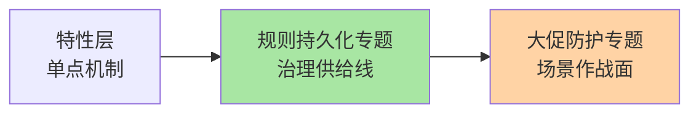
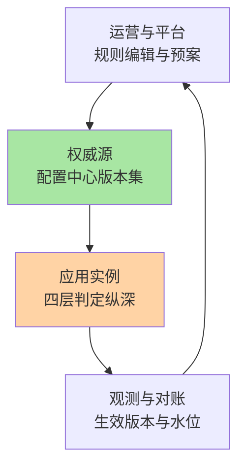
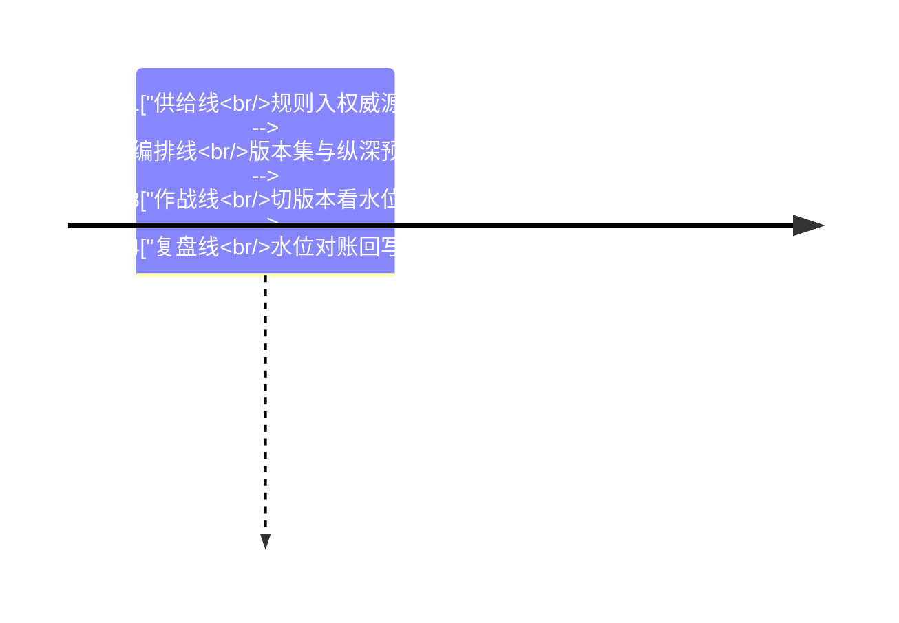
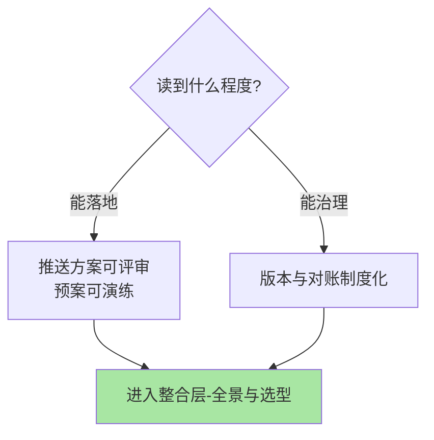

# Sentinel 专题层总览：治理与场景的两次收口

> **本文核心**：特性层拆的是单点机制，专题层回答**机制之间的组合与治理**——规则持久化专题收口「规则从哪来、怎么到实例、坏了怎么兜」的工程链路，大促防护专题收口「四层判定纵深怎么编排成可演练的预案」。两个专题各一篇深读，共同回答一个判断题：**防护体系的成熟度，一半在机制、一半在变更治理**。

## 一句话摘要

规则持久化专题讲权威源与投影（配置中心为源、客户端保旧热生效），大促防护专题讲纵深与预案（粒度对故障形态、战时只切版本）——前者是防护的供给线，后者是防护的作战面。

## 专题导航

| 专题 | 深挖点 | 篇目 |
|---|---|---|
| 规则持久化与动态推送深度 | 三模式链路 / 数据源机制 / 改造步骤 | 1_规则持久化与动态推送-深度 |
| 大促防护与热点治理深度 | 四层纵深 / 热点例外项 / 集群流控 | 1_大促防护与热点治理-深度 |

## 两个专题的架构位置图

## 与相邻层的关系

入门层篇 6 给推送模式概念、篇 4/5 给系统保护与热点概念；特性层给判定机制的实现（预热爬坡、状态机、责任链）；整合层收束单机到集群的演进与三框架选型。治理与场景的内容在本层完成组合，机制争议回到特性层找源头。

## 层内的取舍与演进

两个专题的机制内核长期稳定（推送链路的监听-校验-保旧语义、纵深判定的粒度分工），演进的是治理形态：规则即代码、演练常态化、对账自动化——**读专题的投入产出在「组织能力」而不只是技术能力**。取舍也如实说：专题层的结论带场景前提（规模、基建、组织），迁移到自己环境时要按前提重新对账。

## 📌 数据与事实声明

- 写于 2026-09-23，机制口径以 Sentinel 1.8.10 官方 wiki 与源码为基准（公开口径）
- 免责：以各篇参考资料与所用版本官方文档为准

## 📚 参考资料

| 类型 | 标题 | 来源 |
|---|---|---|
| 系列入口 | Sentinel 特性层系列 | 本仓库 middleware/sentinel/特性层 |
