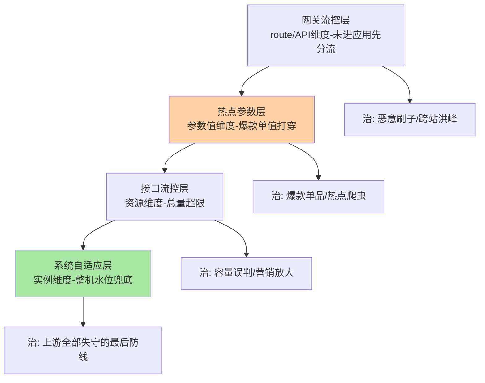
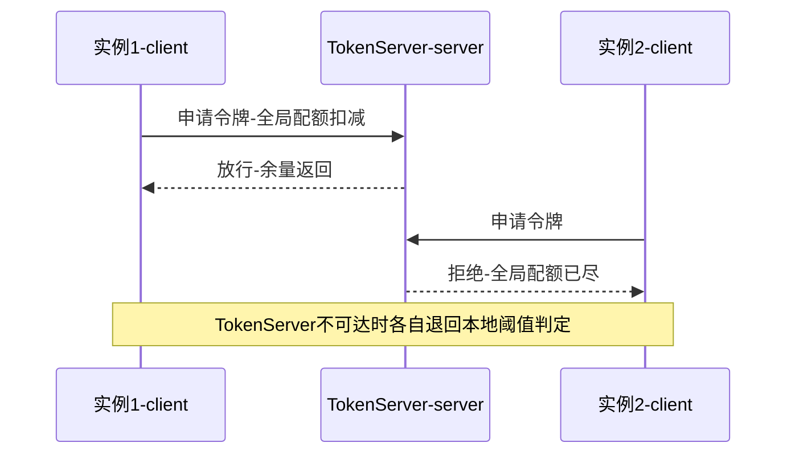
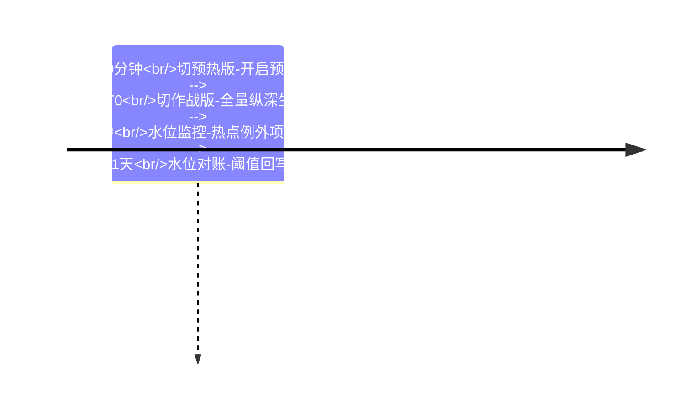
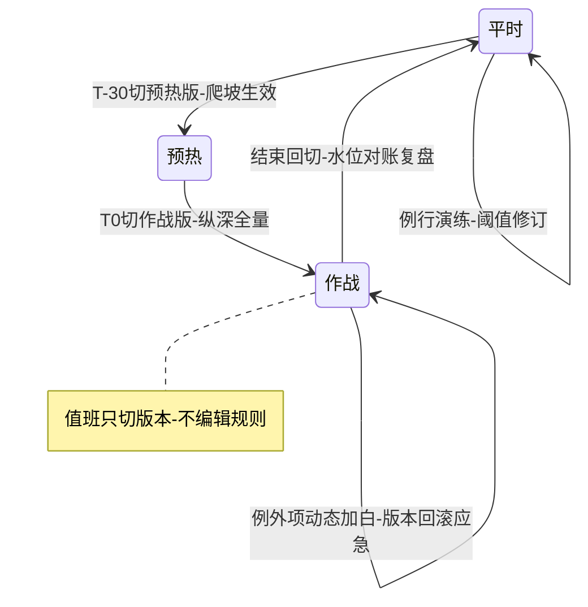

# 大促防护与热点治理深读：从热点参数到系统兜底的组合拳

> **本文核心**：大促防护不是「多加几条限流规则」，而是**把不同粒度的判定机制按失效顺序编排成纵深**：热点参数规则管「某个值突然爆了」（参数级）、QPS 流控管「这个接口总量超了」（资源级）、系统自适应规则管「整台机器快不行了」（实例级）、网关流控管「流量还没进应用就分流」（入口级）——四层粒度对应四种故障形态，**单独任何一层都防不住大促，组合编排才是本体的机制**。热点参数层是其中最有技术含量的一段：Sentinel 为参数值单独建统计结构（每个参数键独立的滑动窗口），支持「热门值专属阈值」的例外项——它把「限流的对象」从资源细化到参数值，治的正是大促最典型的病灶：总量看起来没事，某个爆款把系统打穿。**机制链**：容量盘点（压测推算分档阈值）→ 规则版本集（平时/预热/作战三套预编排）→ 战时切换（版本指针切换而非现场编辑）→ 四层判定纵深（网关→热点→流控→系统）→ 战后复盘（阈值与实际水位对账回写）。

## 一句话摘要

本篇把大促防护拆成「四层判定纵深 + 一套预案工程」：热点参数规则的实现原理（参数级统计与例外项）、集群流控的 Token Server 形态、系统自适应的兜底语义、网关层的预分流，最后用预案步骤把机制串成可演练的作战流程——**机制是子弹，预案是枪，两者合起来才打得准**。

## 前置阅读

- 入门层篇 4《熔断降级与系统自适应保护》与篇 5《热点参数与访问控制规则》
- 特性层流控系列篇 2（预热效果的实现，开门红爬坡的机制底座）
- 专题层规则持久化篇（规则版本集与切换，预案工程的地基）

## 目标导向

本文是什么：大促场景的 Sentinel 防护体系深度实战。功能：拆解四层判定的粒度分工与实现、热点参数统计与集群流控机制、预案制定的步骤骨架。收益：能独立设计大促防护方案、能判断热点治理的适用边界、能把机制编排成可演练可回滚的预案。必看场景：大促备战方案设计、热点突发治理、防护体系评审。

## 5W 速记卡

| 维度 | 一句话 |
|---|---|
| What | 网关/热点/流控/系统四层判定纵深与大促预案工程 |
| Why | 大促的故障形态是多粒度叠加，单层判定必漏 |
| When | 大促备战期编排预案、战时按水位切换、突发热点实时治理 |
| Where | 网关适配器、ParamFlowSlot、FlowSlot、SystemSlot 与集群 Token Server |
| How | 容量盘点 → 阈值分档 → 版本集编排 → 战时切换 → 水位对账复盘 |

## 一、四层判定纵深：粒度对故障形态



纵深的编排逻辑是**判定粒度与故障形态一一对应**：流量还没进应用就该被网关分流（便宜且离用户近）；进了应用后「单个参数值异常」由热点层拦（别让一个爆款拖累全接口）；「接口总量超限」由流控层拦（容量边界）；「以上全漏了」由系统层兜底（保机器不保请求）。层的顺序也是代价顺序：越靠前的层拦得越便宜（网关层拒绝一次的成本是应用层的十分之一量级，公开基准量级的行业认知），越靠后的层代价越高但越不可绕过。**预案评审的第一张表就是这张粒度对账表：每一层能不能说出它防的故障形态？答不出的层就是摆设，说得出但没配参数的层就是缺口**。

## 二、热点参数层：参数级统计与例外项的实现

热点规则的机制核心是**为参数值单独记账**：规则声明资源内第几个参数（parameterIndex）参与统计，ParamFlowSlot 为该资源的参数值维护独立的滑动窗口（每个参数键各自的计数结构，带缓存上限淘汰），判定时按「当前参数值的一秒请求数」对比阈值——普通流控问「这个接口过了多少」，热点规则问「这个接口里**这个值**被传了多少」。热门商品的秒杀、特定用户的爬虫、某个查询词的突刺，都是资源总量无害但单值爆表的形态。

```java
// 热点参数规则的骨架（简化示例，字段以所用版本为准）
ParamFlowRule rule = new ParamFlowRule("queryItem")   // 资源名
    .setParamIdx(0)                                    // 第 0 个参数参与统计
    .setCount(500)                                     // 该参数值默认单机阈值（QPS）
    .setDurationInSec(1);                              // 统计窗口默认 1 秒
// 例外项：爆款商品单独给阈值——普通值 500，爆款 item-9527 给 5000
ParamFlowRuleItem item = new ParamFlowRuleItem()
    .setObject("item-9527").setCount(5000).setClassType(String.class);
rule.setParamFlowItemList(Collections.singletonList(item));
```

**例外项是热点治理的灵魂**：热点规则的常见用法不是「把热门值限死」，而是「给热门值单独一个大阈值、给普通值一个防突刺的小阈值」——两档阈值分别对准两种故障形态（爆款被打穿 / 长尾值异常刷量）。行为细节有两处要盯：**参数必须可哈希且可比**（参数对象走字符串或基本类型最稳，自定义对象要重写 equals/hashCode，否则统计归并不了同类值）；**键空间有缓存上限**（参数值无限发散的场景，统计结构按容量淘汰，极端长尾下长尾值统计失真——所以热点规则适合「少数值贡献多数流量」的分布，全发散的长尾场景它既不适用也不必要）。与普通 QPS 流控的区别由此清晰：**普通流控的统计键是资源（有限个），热点规则的统计键是参数值（可能无限个）**——统计键从有限到无限的跨越，就是它需要缓存淘汰、例外项与适用性判断的全部原因。

## 三、集群流控与系统兜底：从单机到全局的最后两环

单机阈值叠多实例有一个经典缺口：**「每台 100」在 10 台实例上不是「全局 1000」**——流量不均时先倾斜的实例提前限流，流量均匀时全局又可能超预期。集群流控把判定上收：Token Server 统一持有全局配额，各实例（client 角色）请求时向其申请令牌；部署形态两种——**嵌入式**（Token Server 跑在某应用实例进程内，省部署但与应用争资源、应用挂它也挂）与**独立式**（单独部署，稳定但要回答 Token Server 自身的高可用）。失败语义有兜底参数：Token Server 不可达时实例**退回本地单机阈值判定**（fallbackToLocalWhenFail，默认 true 的公开默认值）——全局判定是增强，本地判定是保底，两者共存才敢上生产。



系统自适应层则是**不依赖任何规则的兜底**：它不看配置了什么阈值，而看机器自己的水位——负载、CPU 使用率、入口 QPS、平均 RT、并发线程数五类指标，任一越过阈值就按梯度收紧放行。它的语义是「保机器不保请求」：上游各层全部失守（比如规则没配、或流量绕过入口直连）时，系统规则是最后一道闸，宁可拒绝也要让机器活着。参数要显式下发（未配置的类型不生效），且**阈值要按机器规格分档**（同样的 load 阈值在高低配机器上含义完全不同）——这也是预案里系统规则必须模板化的原因。

## 四、预案工程：把机制串成可演练的作战流程

机制备齐了，大促真正的功夫在预案工程。步骤骨架六步（每步有完成标准与回退口）：

```text
第一步 容量盘点：核心链路压测推算容量（前置条件：压测环境与生产同构）
第二步 阈值分档：每层规则按压测数据定「十万/百万」分档阈值，标注数据来源
第三步 版本集编排：平时/预热/作战三套规则版本入权威源（互指规则持久化篇）
第四步 预演：预发或灰度环境演练版本切换-验证生效时延与回滚路径
第五步 战时：按时间轴切版本（T-30 预热版-T0 作战版），值班只切版本不编辑规则
第六步 复盘：实际水位与阈值对账-超预期触发记录回写-阈值修订进下一版预案
```



预案工程的设计思想值得点破：**把战时的「决策」压到最少**——所有阈值、例外项、版本编排都在备战期完成并演练过，战时的全部操作收敛为「切版本 + 看水位」，人为决策的每减少一步，失误概率就降一档（互指规则持久化篇「把变更操作降维成版本选择」）。业内成熟团队的大促值班手册几乎都是这个形态：机制提前装配、操作手册化、决策树前置。

## 五、与普通日常限流的区别：状态切换与水位对账

| 维度 | 日常限流 | 大促防护 |
|---|---|---|
| 规则形态 | 单套静态规则 | 多套版本集按时间轴切换 |
| 阈值来源 | 经验估+小修 | 压测推算+分档+复盘回写 |
| 操作模式 | 随时可编辑 | 战时只切版本不编辑 |
| 判定纵深 | 按需单层 | 四层粒度强制成体系 |

日常限流是「配置管理」，大促防护是「状态机工程」：系统在平时/预热/作战三个状态间切换，每个状态的规则集、阈值档位、监控重点都预先编排——两者的复杂度差一个数量级，**用日常限流的管理方式运营大促防护，是最常见的准备不足形态**。



## 六、不同量级的思考：防护纵深随规模的换挡

- **十万级（峰值 QPS 十万以内、促销以小时计）**：约束来源是人力与复杂度——这一档的核心问题是「纵深别配成摆设」，而不是「四层全开」。热点层加流控层两层起步（覆盖最典型病灶），系统规则用模板兜底，网关层按流量来源风险取舍，思考方式是风险驱动：每一层都要能说出防什么，说不出的先省掉。自下而上收尾：两层纵深在小规模足够；向上触发升级的条件是多活动并发与流量来源复杂化。
- **百万级（峰值百万 QPS、全站大促、多活动叠加）**：约束来源是全局配额与容量精度——这一档的核心问题是「单机阈值加总失真」，而不是「阈值高低」。集群流控上收核心接口判定（Token Server 独立部署加多套），四层纵深全开且网关层承担主要分流，思考方式是架构驱动：判定点的部署形态本身成为容量命题（Token Server 的容量与容灾要单独预案）。向上触发升级的条件是多地多活——全局配额的跨机房一致性问题浮现。
- **亿级（入口日请求亿级、峰值千万 QPS 量级）**：约束来源是「防护体系自身的可运营性」——这一档的核心问题是「万级规则的版本治理与演练常态化」，而不是「再加一层判定」。思考方式是治理驱动：规则即代码全流程（版本库-流水线-灰度-对账）、大促演练月度化（预案不演练等于没有）、水位对账自动化（阈值与实际水位的偏差即预警，互指规则持久化篇的口径对账）。自下而上收尾：判定机制四层到顶不再加层，复杂度全部沉到治理与演练体系——**机制的天花板很高，运营的天花板才是真的天花板**。

## 七、典型场景与误区

**典型场景**：秒杀商品链接被外链引爆（热点例外项给爆款大阈值，普通值小阈值防刷）；营销短链活动流量突刺（接口流控预热放坡，互指特性层流控篇 2）；爬虫与羊毛党（网关层按 IP/参数属性限流，未进应用先分流）；大促开门红（预热版规则提前爬坡，作战版 T0 切换）。

**常见误区**：① **热点规则配了「限制爆款」方向**——把爆款阈值限得比普通值还低，等于主动压制核心业务；例外项的默认方向是保护性放宽，方向配反是最贵的笔误；② **参数统计当精确计量用**——参数键缓存有上限、长尾淘汰失真，它是判定用的「足够准」，热点排查要看业务日志而不是防护统计；③ **系统规则阈值全机一刀切**——不同规格机器同一阈值，低配机器先死（它恰恰是容量最紧张的）；按规格分档是底线纪律；④ **Token Server 没有容灾预案**——嵌入式形态与应用共存亡、独立式形态自身会过载，fallback 本地阈值是兜底不是方案，Token Server 的容量与切换预案要单列；⑤ **预案只在纸上推演**——版本切换的生效时延、例外项的实时生效、回滚路径，不实演全是假设；预演的目的就是把这些假设变成实测数字。

## 八、事故与实践叙事

**事故一：例外项方向配反压垮爆款**。某团队给秒杀商品配热点例外项时把方向写反：普通值阈值 2000，爆款单值阈值 200——开抢瞬间爆款请求被精准限流，业务损失远超「不限流」。复盘三动作：例外项配置进变更评审清单（方向性配置双人核对）；预演增加「爆款单值压测用例」；控制台配置页加方向提示。**教训**：热点例外项是「保护爆款」还是「压制爆款」，一念之间、损失一个量级——方向性配置必须进双人核对。

**事故二：Token Server 嵌入式形态的连带倒塌**。某服务把 Token Server 嵌在其中一个应用实例里，该实例所在宿主机故障，Token Server 随之消失——其余实例 fallback 到本地阈值，本地阈值是按「全局配额除以实例数」折算的，实际流量本就倾斜，局部实例接连触发本地限流，可用性大幅下降。改造：核心接口 Token Server 独立部署双活，fallback 本地阈值按「单机实际可承受容量」标定（不是按全局折算）。**教训**：fallback 是逃生通道不是常态方案——逃生通道的参数要按「它成为常态时是否成立」来标定。

**事故三：系统规则阈值一刀切误杀低配实例**。某异构集群（新宿主机与旧宿主机规格差一倍）统一下发同一套系统规则，旧规格实例 CPU 提前触顶被系统规则收紧，新实例却还有大量余量——流量被负载均衡重新压向新实例，旧实例「越保越闲」。改造：系统规则按机器规格分档模板化，并接入规格标签自动匹配。**教训**：兜底层参数的「一刀切」在异构环境里就是定向误杀——兜底层也要有配置管理的常识。

**实践叙事：水位对账反哺阈值体系**。某平台把每次大促的「规则阈值-实际触发水位-实际拒绝量」三方对账做成战报例行：某核心接口连续三届大促实际水位只有阈值的六成（阈值从早期保守压测继承），按数据下调后释放了容量；另一接口例外项白名单膨胀到数百个（每届大促手动加），按数据收敛成「类目级例外」规则。**阈值体系是活的——战时数据是它唯一的营养**，不对账的阈值体系只会越来越保守或越来越失真。

## 九、设计思想：纵深与预案的同一性

四层纵深与预案工程表面是两个主题，深层是同一个设计思想的两面：**把不可预测的故障形态，翻译成可预编排的判定组合**。纵深回答「故障在哪个粒度出现就在哪个粒度拦」（机制维度的完备性），预案回答「什么时候用哪套判定参数」（时间维度的编排性）——完备性靠粒度分工，编排性靠状态切换，两者合起来才构成「可防御的体系」而非「一堆规则」。更深一层，这套思想反推出防护体系的成熟度判据：**成熟的标志不是规则多，而是战时操作少**——机制在备战期装配得越完整，战时的自由度就越小，自由度越小，体系就越可靠。

## 十、追问链

**质疑者第一层：热点参数统计为每个值建结构，键空间爆炸怎么办？为什么不干脆全量记账换取精确性？**——反方案算不过来：全量记账意味着键空间无界，内存与淘汰压力全部转嫁给判定进程；统计结构带缓存上限与淘汰（公开实现有容量约束）是刻意的取舍。这决定了它的适用分布：少数值贡献多数流量的「头部集中」场景效果最好，全发散的长尾场景统计失真且无治理价值。**先看流量分布再上热点规则**，适用性判断在配置之前。

**质疑者第二层：集群流控引入 Token Server 这个集中点，值得吗？**——算的是精度账：核心接口的全局精度（不因倾斜误杀）值不值一套 Token Server 的部署与容灾成本。非核心接口保持单机阈值加冗余实例即可；只有「全局配额精确性直接影响业务损失」的少数接口才值得上收——**集中判定是奢侈品，按业务价值分配**。

**质疑者第三层：系统自适应会不会把「本该限流的流量」也放过去？**——系统规则看的是机器水位不是业务容量，容量型超限它不感知（机器还扛得住就放）；它的定位就是「保命」而非「保容量」，容量防线由流控与热点层负责。**每一层只承诺自己粒度内的事**——指望兜底层干容量层的活，是层次语义最常见的误读。

## 十一、你们可能会问

**Q1：热点参数支持哪些参数类型？**
字符串与基本类型最稳（哈希与比较语义清晰），自定义对象必须重写 equals/hashCode；参数索引从 0 计、只对明确声明的索引生效。拿不准时先把参数规整成字符串再进资源方法。

**Q2：热点规则和网关参数限流是什么关系？**
网关流控可配参数属性（客户端 IP、Header、URL 参数），机制同源、落点在网关层（流量未进应用）；热点规则在应用内按方法参数判定。离用户越近代价越低，能在网关拦的不要放过应用层。

**Q3：集群流控下热点规则还能用吗？**
集群模式对参数流控的支持是逐步演进的（以所用版本官方说明为准），生产实践里更常见的组合是「集群流控管资源级 + 单机热点规则管参数级」——参数级全局精确性的收益通常撑不起集中判定的成本。

**Q4：大促之外，热点治理还有什么常态用法？**
日常反爬（特定参数值刷量）、热点查询降权（爆款内容单值限速保护存储）、灰度放量（按渠道参数值分档放行）——凡是「资源总量无害但单值异常」的形态都是它的主场。

## 💡 实战提示

- 💡 纵深评审第一问：每层能不能说出它防的故障形态——说不出的层是摆设，没配参数的层是缺口
- 💡 例外项方向性配置双人核对：保护性放宽是默认语义，方向配反损失一个量级
- 💡 决策口径：战时只切版本不编辑规则；阈值全部来自压测数据并标注来源；Token Server 只给全局精度值钱的接口
- 💡 选型推荐：热点规则先看流量分布（头部集中才适用）；fallback 本地阈值按「单机可承受容量」标定而非全局折算

## 十二、自测三问

1. 四层纵深各管什么粒度与故障形态？（答：网关=入口分流（刷子/洪峰）、热点=参数值（爆款打穿）、流控=资源总量（容量超限）、系统=机器水位（最后兜底）——粒度对形态）
2. 热点例外项的正确打开方式？（答：爆款单值保护性放宽大阈值、普通值小阈值防突刺——方向配反等于压制核心业务，双人核对）
3. 预案工程的战时操作收敛到什么？（答：只切版本看水位——阈值与例外项全部备战期编排演练，把变更操作降维成版本选择）

## 十三、开放问题

- 参数级判定的集群化语义（参数维度的全局配额）随版本演进，成本收益模型尚无行业共识。
- 水位对账的自动化闭环（实际水位实时反推阈值修订建议）需要容量模型沉淀，工程化程度早期。

## 📎 核心带走

- **核心一句话**：大促防护 = 四层判定纵深（网关/热点/流控/系统按粒度对故障形态）× 预案工程（版本集编排、战时只切版本）——把不可预测的故障翻译成可预编排的判定组合
- **机制链**：容量盘点压测定档 → 规则版本集入权威源 → 时间轴切版本 → 热点例外项动态加白 → 集群流控上收全局配额（fallback 本地兜底）→ 战后水位对账回写阈值
- **失效点/边界**：热点统计适合头部集中分布（全发散失真）；参数键缓存有上限（非精确计量）；Token Server 集中点要单列容灾预案；系统规则只保命不保容量、异构集群须分档

## 📌 数据与事实声明

- 写于 2026-09-23，机制以 Sentinel 1.8.10 官方 wiki 与源码（param 包 / system 包 / cluster 包）为基准（公开口径）；ParamFlowRule durationInSec 默认 1 秒、集群 fallbackToLocalWhenFail 默认 true 为公开默认值；性能与比例数字为公开基准量级或行业认知
- 免责：字段与行为以所用版本官方文档为准，以官方文档为准

## 📚 参考资料

| 类型 | 标题 | 来源 |
|---|---|---|
| 官方文档 | Sentinel Wiki：热点参数限流 / 系统自适应限流 / 集群流控 | github.com/alibaba/Sentinel/wiki |
| 官方源码 | param 包（ParamFlowSlot / ParamFlowChecker）、cluster 包 | github.com/alibaba/Sentinel |
| 关联文章 | 专题层规则持久化篇、特性层流控系列篇 2、入门层篇 5 | 本仓库 middleware/sentinel |
| 机制域 | 稳定性工程系列（大促防护机制定义） | 本仓库 architecture/system-design/stability |
