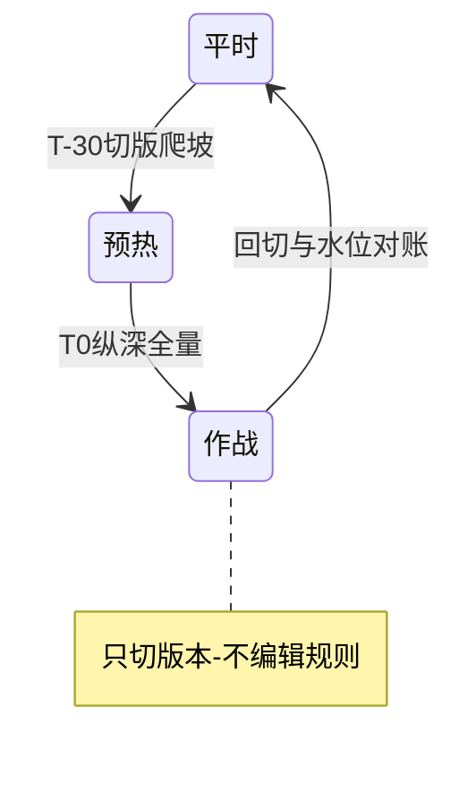
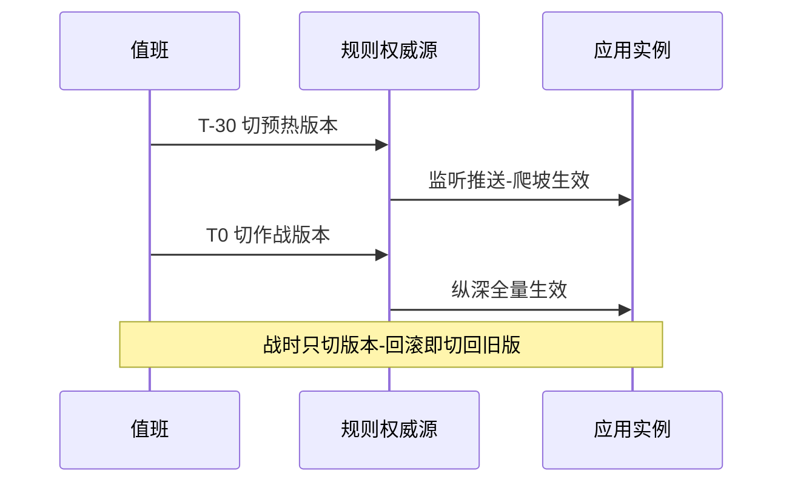
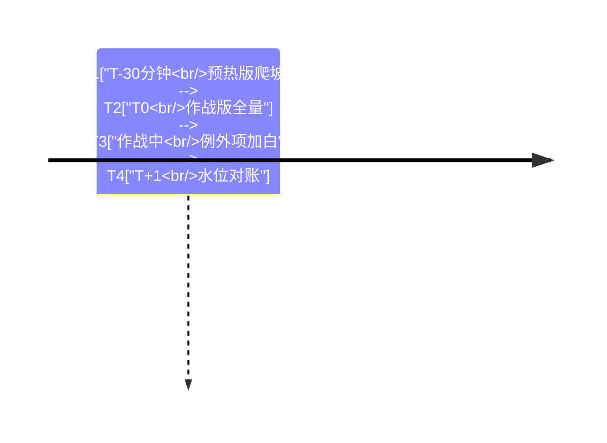

# 大促防护与热点治理专题总览

> **本文核心**：本专题回答场景组合题——**四层判定纵深（网关/热点/流控/系统）怎么编排成可演练的大促预案**。正文一篇：热点参数规则的参数级统计与例外项、集群流控 Token Server 的形态与兜底、系统自适应的保命语义，最后用版本集切换把机制串成作战流程。判断句：**机制是子弹，预案是枪；成熟的标志不是规则多，而是战时操作少**。

## 一句话摘要

粒度对故障形态：参数值爆了找热点层（例外项保护爆款）、总量超了找流控层、机器不行找系统层、流量没进应用找网关层——阈值来自压测分档，战时只切版本不编辑规则，战后水位对账回写。

## 篇目导航

| 篇目 | 深挖点 | 核心结论 |
|---|---|---|
| 1_大促防护与热点治理-深度 | 四层纵深 / 热点例外项 / 集群流控 | 每层要能说出防什么；战时操作收敛为切版本 |

## 防护体系状态速览

纵深编排的取舍速查：网关层拦得最便宜（取舍是维度粗）、热点层治单值爆点（取舍是键空间有界）、系统层兜底保命（取舍是不保容量）、集群流控换全局精度（取舍是集中点容灾）——每一层的代价都写在它的收益旁边，评审时逐层过一遍架构对账。防护体系的演进方向也一样：机制四层到顶，复杂度最终都沉到版本治理与演练体系里去。

## 与相邻域的关系

网关抽象机制归 governance/gateway 域（互指不重复），限流熔断的机制定义归稳定性工程系列；与特性层流控篇（预热爬坡）、专题层规则持久化篇（版本集地基）强关联。使用建议：备战期读正文的步骤骨架并照此编排预案，战前拉通评审用本页纵深图做粒度对账，战后复盘时按正文的对账方法把水位数据回写进阈值体系——三张图与一张表覆盖大促防护的完整生命周期。

## 📌 数据与事实声明

- 写于 2026-09-23，机制口径以 Sentinel 1.8.10 官方 wiki 与源码为基准（公开口径）
- 免责：以正文参考资料与所用版本官方文档为准

## 📚 参考资料

| 类型 | 标题 | 来源 |
|---|---|---|
| 系列入口 | Sentinel 入门层篇 4 与篇 5 | 本仓库 middleware/sentinel/入门层 |
