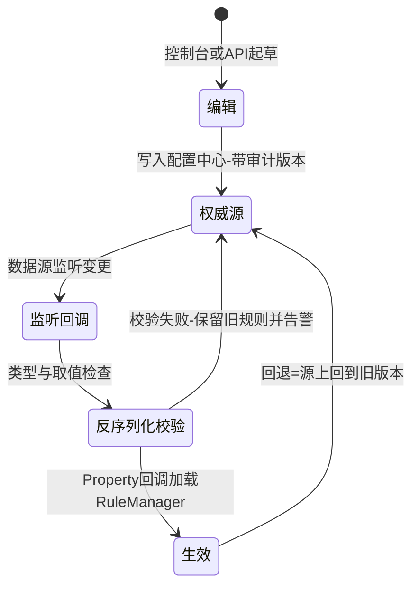
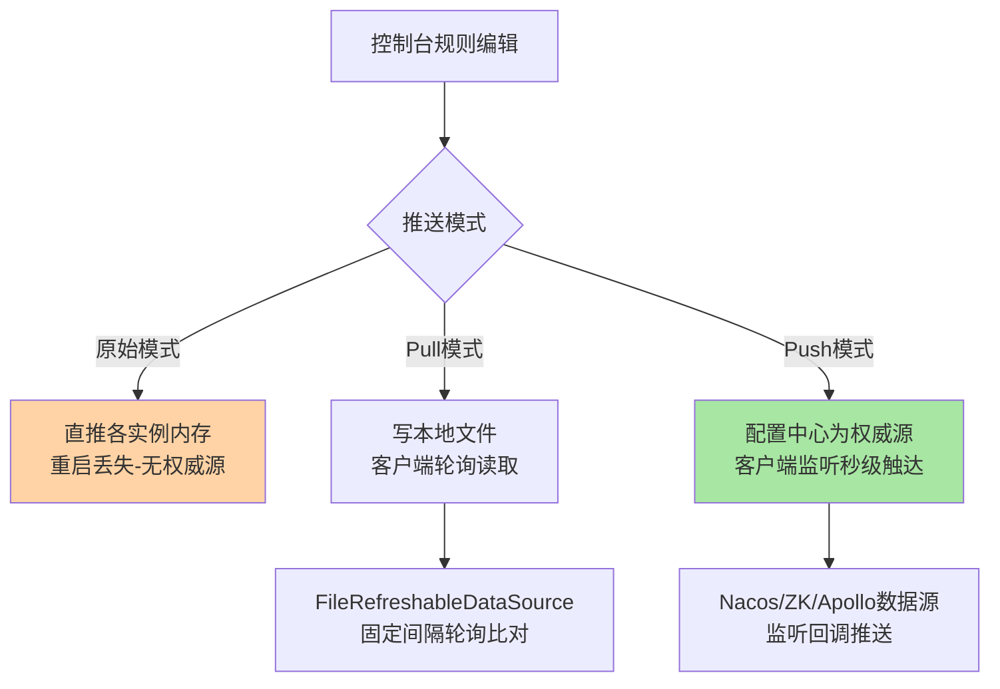
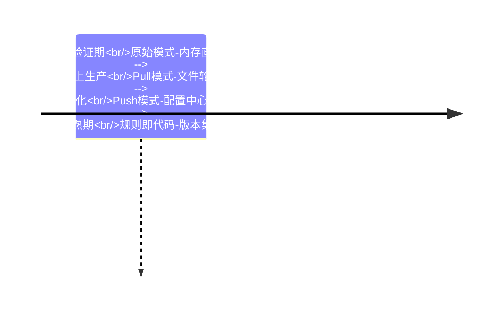
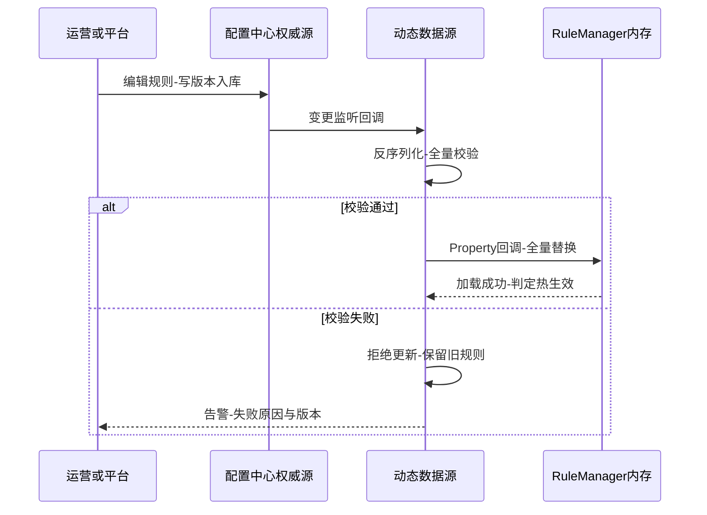

# 规则持久化与动态推送深读：从内存态到生产级推送链路

> **本文核心**：Sentinel 规则默认住在进程内存里——**「重启丢规则」不是缺陷，而是它把持久化与推送作为扩展面交给了使用方**。生产级方案的本质是给规则加一条「权威源 → 监听 → 加载 → 生效」的推送链路：把规则落到配置中心（Nacos/ZooKeeper/Apollo 等），客户端用动态数据源监听变更、反序列化后经 SentinelProperty 回调加载进规则管理器。三种模式（原始内存、Pull 轮询、Push 监听）的差异全在链路形状上：**原始模式规则跟着进程走（重启即失），Pull 靠轮询追（秒级延迟），Push 靠监听推（秒内触达）**——选型的判据不是「哪个高级」，而是规则变更频率、生效时延预算与配置中心基建三件事的权衡。**机制链**：规则编辑 → 权威源写入（配置中心）→ 数据源监听回调 → 反序列化校验 → SentinelProperty 通知 RuleManager 加载 → 判定热生效 → 失败保留旧规则兜底。

## 一句话摘要

本篇把规则推送从「配置项」讲到「链路」：三种模式的机制与代价、动态数据源的监听与回退语义、控制台改造为推送方的步骤、参数清单与事故推演——**规则推送方案的可靠性决定防护体系的可靠性**：规则都到不了位，再好的算法也只是在默认参数上空转。

## 前置阅读

- 入门层篇 6《接入实战与 Dashboard》（三种推送模式的概念）
- 特性层熔断系列篇 1（规则实例化与熔断器的关系）
- 本仓库配置中心域文章（Nacos 配置管理的机制细节）

## 目标导向

本文是什么：规则持久化与动态推送的生产级方案深读。功能：拆解三种模式链路、动态数据源工作机制、控制台推送改造步骤，给出参数清单与故障推演。收益：能按组织基建选推送模式、能把控制台改造成可生产的规则入口、能推演推送链路的每一种坏法。必看场景：防护体系平台化建设、大促规则下发方案评审、规则丢失事故复盘。

## 5W 速记卡

| 维度 | 一句话 |
|---|---|
| What | 规则的持久化载体与动态推送链路（原始/Pull/Push 三模式） |
| Why | 内存态规则撑不起生产：重启丢失、无审计、多实例不一致 |
| When | 从单机验证走向生产部署的必经一步，平台化建设的核心件 |
| Where | 动态数据源（配置中心）与 SentinelProperty 加载链路 |
| How | 编辑入权威源 → 监听回调 → 反序列化 → 加载生效 → 失败保旧 |

## 一、为什么内存态撑不起生产：三个缺口

原始模式下，控制台把规则直接推到客户端内存（调客户端接口改 RuleManager），这个设计的三个缺口在生产环境会被逐一放大。**缺口一：生命周期错位**——规则跟着应用进程走，发布重启、扩容新实例、实例崩溃重启，规则全部归零，防护退回默认状态；对大促防护这种「规则就是预案」的场景，等于预案写在沙子上。**缺口二：权威源缺失**——规则的真实版本散落在每个实例的内存里，控制台展示的是「最后一次推送」的记忆，实例实际生效的是什么要逐个查；审计、回滚、差异核对都没有抓手。**缺口三：多实例一致性**——推送失败单实例静默时，同一服务的不同实例防护水位不一致，流量倾斜时出事的恰是那个没收到规则的实例。三个缺口共同的根源：**内存是运行时状态，不是配置数据**——把运行时状态当配置用，配置管理的全部规律都会失效。



## 二、三种模式链路拆解：形状决定行为



**原始模式**是「控制台 → 各实例」的点对点直推：实现最省（零外部依赖），代价就是三个缺口本身。它的合理生存空间只有开发与测试环境——快速试规则、不谈持久化。**Pull 模式**把规则写到本地文件，客户端用 FileRefreshableDataSource 按固定间隔（默认 3000 毫秒，公开默认值）轮询比对文件修改时间再重读加载——变更生效延迟是「轮询间隔 + 读取加载」的量级，且控制台仍要先能把文件写到位（通常借客户端暴露的接口）。轮询模式的价值是**不依赖配置中心基建**，适合没有配置中心或规则变更极低频的团队；代价是生效延迟、文件系统的可靠性自担、多实例文件分发仍要解决。**Push 模式**让配置中心成为权威源：控制台改造成「写配置中心」，客户端数据源监听变更回调加载——生效秒级、有版本有审计、多实例天然一致。代价是要有配置中心基建，且控制台要改造（官方控制台默认不带推送实现，提供扩展点由使用方接入）。

三种模式的选型判据收敛成三个问题：**规则变更频率**（日频调参 Pull 可忍，分钟级运营操作必须 Push）；**生效时延预算**（防护规则改错要在秒级纠正，轮询的三秒就是三秒的风险敞口）；**基建存量**（已有 Nacos/Apollo 的团队 Push 边际成本最低，没有基建的团队 Pull 是务实起点）。业内惯例的演进路径也基本如此：验证期原始模式 → 上生产先 Pull → 平台化后 Push——**模式是台阶不是站队，按组织阶段爬**。



## 三、动态数据源关键路径：监听、反序列化与失败兜底

数据源侧的机制值得精读三段。**监听注册**：应用启动时数据源初始化，向配置中心订阅规则数据（Nacos 数据源以 groupId + dataId 定位），变更回调进入链路。**反序列化与转换**：回调拿到的是字符串/字节，经配置的 Converter 转成规则列表（JSON 反序列化居多），这里必须做**全量校验**——字段类型、阈值取值范围、规则间冲突；脏数据进 RuleManager 是推送链路最恶性的事故形态（一条坏规则可能让全部判定异常）。**Property 通知与加载**：校验通过后经 SentinelProperty 的回调通知 RuleManager，**整体替换**该类型规则列表——加载语义是「以源为准的全量覆盖」，这与「实例内存是运行时状态」的定位一致：源是唯一权威，内存只是投影。

失败兜底的语义要专门记：**数据源读取或反序列化失败时，客户端保留当前已加载的旧规则继续服务**，同时把失败暴露给日志与指标——「保旧」是推送链路的保守底线，宁可规则旧一版，不可防护裸奔。推论有二：其一，规则回调链路里的异常必须自己兜住（自定义 Converter 抛异常要转成「拒绝本次更新 + 告警」，不能向上炸）；其二，回退方案的实现因此极简——**把权威源上的配置回滚到旧版本即可**，客户端会自己追上来（Push 秒级、Pull 下个轮询周期），不需要动任何实例。



## 四、控制台改造与接入步骤：把 Push 链路补完

官方控制台的规则编辑默认走原始模式直推，Push 模式要把控制台改造成「写配置中心」——官方提供了扩展点（规则发布与查询接口），社区样例以 Nacos 为常见落点。步骤骨架如下（前置条件：已有可用的配置中心集群与命名空间规划）：

```text
第一步 客户端接入数据源：引入对应数据源依赖，配置连接与监听（见参数清单）
第二步 控制台改造：规则发布接口替换为「写配置中心」，查询改为「读配置中心」
第三步 命名约定：groupId/dataId 按应用与规则类型建立命名规范（防串写）
第四步 验证：控制台改一条流控规则-秒级在实例日志与行为上确认生效
第五步 回退演练：故意下发坏规则-确认保旧与告警-再验证源回滚后自动追平
第六步 审计接入：配置中心的变更历史与审批流对接-满足合规留痕
```

```yaml
# Spring Cloud Alibaba 环境的数据源配置示例（键值以所用版本官方文档为准）
spring:
  cloud:
    sentinel:
      transport:
        dashboard: dashboard.example.internal:8080   # 控制台地址
        port: 8719                                    # 本地通信端口默认值
      eager: true                                     # 启动即初始化-勿等首流量
      datasource:
        flow-rules:
          nacos:
            server-addr: nacos.internal:8848
            group-id: SENTINEL_GROUP                  # 命名规范防串写
            data-id: app-a-flow-rules                 # 一应用一类型一dataId
            rule-type: flow
```

**参数清单（名称/默认值/推荐值/为什么）**：

| 参数名 | 默认值 | 分档推荐 | 为什么 |
|---|---|---|---|
| transport.port（客户端通信口） | 8719 | 保持默认 | 控制台直连与原始模式依赖，冲突时自动顺延 |
| eager（启动即建连接） | false | 生产 true | 关闭时首个请求才初始化，冷启动判定有盲区 |
| datasource 轮询间隔（Pull） | 3000ms | 低频 3s-10s | 变更延迟下限=轮询间隔，按预算反选 |
| converter 校验 | 无强制 | 强制全量校验 | 脏规则入内存是最恶性事故，校验是闸门 |
| dataId 命名 | 无约束 | 应用+类型+环境 | 防多应用串写与误订阅 |

## 五、与配置中心通用配置推送的区别：语义同构但边界不同

| 维度 | Sentinel 规则推送 | 通用应用配置推送 |
|---|---|---|
| 加载语义 | 全量替换-以源为准-保旧兜底 | 按键合并-热刷新行为自定 |
| 失败影响 | 防护失效风险-保旧是底线 | 功能配置滞后-通常无害 |
| 校验强度 | 阈值范围与冲突全量校验 | 格式校验为主 |
| 消费方 | 判定热路径-每请求消费 | 业务逻辑按需读取 |

配置中心推送的一般语义（发布-监听-刷新）与规则推送同构，但规则推送的**失败代价与消费频率都高一档**：配置读错是「功能异常」，规则读错是「防护失效或误杀」；配置按需读，规则每个请求都在消费。所以规则推送链路要额外做三件事：全量校验（防脏规则）、保旧兜底（防裸奔）、生效验证（每条规则可观测「已加载版本」）。**理解这层边界，才能解释为什么规则推送不能「随手复用配置中心的最佳实践」而要按防护语义加固**。

## 六、不同量级的思考：推送链路随规模的换挡

- **十万级（数十应用以内、规则数百条）**：约束来源是基建成本——这一档的核心问题是「链路够用即可」，而不是「形态先进」。有配置中心直接 Push（边际成本最低），没有就 Pull 起步，思考方式是成本驱动：规则推送的复杂度必须与防护对象的价值匹配，单服务试水期原始模式加导出备份也能接受。自下而上收尾：这一档的关键纪律只有一条——权威源必须唯一；向上触发升级的条件是应用数量与规则模板化需求。
- **百万级（数百应用、规则数千条、平台化治理）**：约束来源是规则的生产质量与变更治理——这一档的核心问题是「规则变更的工程化」，而不是「推送速度」。思考方式是治理驱动：规则模板化（按应用等级套参数模板，互指特性层熔断篇的参数分层）、变更走审批流与灰度下发（先发金丝雀实例观察再全量）、生效版本可观测可对账。向上触发升级的条件是多环境多机房——环境间规则同步与差异核对成为常态工单。
- **亿级（全站防护平台、规则万条量级、大促变更多线程并发编辑）**：约束来源是变更风暴下的一致性与安全网——这一档的核心问题是「错误规则的爆炸半径控制」，而不是「推得快」。思考方式是安全驱动：分级发布管道（测试环境→预发→生产灰度→全量）、规则即代码（版本库托管加流水线下发）、推送链路全链路对账（源版本、已加载版本、实际行为三方核对，互指扩展机制篇的口径对账制度）。自下而上收尾：每一档的客户端机制（监听、校验、保旧）完全同一套——变的是变更治理的组织结构。

## 七、典型场景与误区

**典型场景**：大促预案下发（预案规则预先落权威源，战时一键切版本——本质是「规则版本切换」而不是现场编辑）；多环境规则同步（测试验证过的规则带版本晋升）；灰度验证（新规则先发单实例观察判定行为再全量）；应急回滚（推错规则时源上回滚版本，实例自动追平）。

**常见误区**：① **测试用原始模式、生产忘了升级**——原始模式顺手好用，上线清单里没有「推送模式检查项」是规则丢失事故的头号来源；② **把实例内存当第二权威源**——控制台从实例读回规则再编辑（原始模式行为），多实例不一致时读回哪份全凭运气，权威源必须唯一；③ **Converter 只做反序列化不做校验**——一条阈值写错单位的规则能让整类型规则加载异常，校验要在进 Property 之前拦住；④ **Pull 模式拿轮询间隔当生效 SLA**——轮询间隔只是下限，文件系统与加载耗时都在链路上，时延预算要按实测压测；⑤ **回退靠重新推一份旧规则**——人工重新编辑就是再引入一次出错机会，版本回滚是机制的、幂等的、可审计的。

## 八、事故与实践叙事

**事故一：发布日全站规则归零**。某团队在原始模式下运行半年，规则靠「记得住」维护；一次容器化迁移批量重建实例，所有应用规则清零，防护退回默认无规则状态——当天恰好一次下游抖动，无熔断无限流，故障持续到人工重推规则。复盘两动作：全部应用接入 Push 数据源，规则入配置中心；「实例重建后规则自动恢复」进上线验收清单。**教训**：内存态规则的存活时间等于进程存活时间——任何会重建实例的架构动作（迁移、伸缩、重启策略）都要先过「规则从哪恢复」这一问。

**事故二：一条坏规则拖垮整类型加载**。某运营在控制台把 QPS 阈值填成了「1,000」（带千分位逗号），Converter 反序列化直接抛错，该应用的流控规则整批更新失败。所幸保旧语义让旧规则继续生效，未造成裸奔；但告警晚到两小时（当时只看了控制台操作日志）。改造：Converter 层加字段级校验与明确报错回显，控制台在发布前做 dry-run 校验，失败告警接值班。**教训**：推送链路的错误处理决定它的生产成熟度——「拒绝坏版本 + 快速反馈」比「成功推送」更值得设计。

**事故三：多实例规则水位不一致的慢性故障**。某服务十几个实例，原始模式下控制台批量推送时有实例推送失败但无重试，两周里累积出三种规则版本并存；流量波动时错误集中在不一致实例上，排障两周才定位到「同服务不同实例防护水位不同」。复盘把「生效版本对账」做成例行巡检（各实例已加载版本与权威源版本比对），不一致即告警。**教训**：一致性不是推送成功就完事——「已生效」必须可观测、可对账，对不上就是故障前置信号。

**实践叙事：预案即版本切换的大促实践**。某平台把大促防护预案做成「规则版本集」：平时版本、预热版本、作战版本三套在权威源各占一个版本，战时按时间轴切换版本而非现场编辑规则——切换是幂等操作、可演练、可秒级回滚。大促期间规则类操作从「编辑」降级为「切版本」，人为失误面大幅收窄。**把变更操作降维成版本选择，是规则推送链路给稳定性最好的回报**。

## 九、设计思想：权威源与内存投影的分离

三种模式的演进背后是一条设计主线的浮现：**把「配置数据」从「运行时状态」中剥离，交给专门的存储与分发设施，进程内只保留投影**。这条线在配置管理领域反复被验证（声明式配置、GitOps、不可变基础设施），Sentinel 规则推送是它在防护领域的具体化：权威源提供持久化、版本、审计、一致性；客户端提供监听、校验、保旧与热生效。**投影语义（全量替换、保旧兜底）与权威语义（版本化、可回滚）分工明确**，链路上的每一段失败都有明确的归宿——这是规则推送方案能推演出完备故障语义的原因。做任何「配置类数据」的平台设计时，这套分离都是值得先画的图。

## 十、追问链

**质疑者第一层：Pull 模式轮询这么土，为什么官方还保留？**——因为它把外部依赖压到零（一个本地文件就能当权威源），对没有配置中心、规则变更以天计的团队是真实可用的台阶；轮询的代价（延迟、无推送风暴）在这类场景几乎不构成伤害。**机制没有高低，只有与场景的适配度**——官方保留它是保留了一条低成本路径。

**质疑者第二层：配置中心自身故障时，规则推送全断，防护不是更危险？**——这正是保旧语义的价值：配置中心不可达期间客户端按最后已知规则继续判定，防护水位冻结在故障前一刻；风险敞口是「故障期间无法调规则」，缓解手段是把应急规则下发做成多通道（如预留本地文件兜底通道）。**权威源故障要降级的是「变更能力」而不是「判定能力」**——两者分离了，故障影响面才能控住。

**质疑者第三层：为什么不把规则直接写进应用镜像（不可变基础设施思路）？**——镜像承载的是「版本化的基线规则」很合理（上线即带规则），但防护规则的高频调整（运营操作、应急响应）走镜像发布太重；两者是互补而非互斥：镜像带基线、配置中心管动态层。**不变性与动态性的分工要按变更频率切**，这又是一笔变更频率的权衡账。

## 十一、你们可能会问

**Q1：多套规则（平时/大促）怎么共存与切换？**
权威源上做「规则版本集」，切换即改指针或 dataId 映射；客户端无感，只认当前指向。切忌在客户端叠多层规则做状态切换——状态管理是权威源的职责。

**Q2：控制台多人同时编辑会互覆盖吗？**
原始模式会（last-writer-wins）；Push 模式下配置中心有版本与历史，配合审批流可到「乐观锁 + 变更单」级别。多人协作纪律属于变更治理，机制只提供抓手。

**Q3：规则量大了（数千条）加载性能有问题吗？**
全量替换的加载成本与规则数线性相关，数千条在毫秒到十毫秒量级（公开基准量级，以自测为准）；更大规模按应用与类型拆 dataId 分治，加载只碰变更的分片。

**Q4：怎么确认每个实例都生效了？**
平台化做法是版本对账：实例定期上报「已加载版本」与权威源比对（互指事故三）。小规模也可以抽查日志的加载记录——关键是「已生效」要有可查询的凭据，不靠推断。

## 💡 实战提示

- 💡 上线验收清单必含「推送模式检查项」：生产环境禁止原始模式，规则必须有权威源与恢复路径
- 💡 保旧兜底是底线语义：Converter 层强制全量校验，失败拒绝更新并告警，绝不让坏规则进内存
- 💡 决策口径：变更频率低且无基建选 Pull、有配置中心选 Push、战时操作一律降维成版本切换——按变更频率与时延预算选，不按技术偏好选
- 💡 选型推荐：控制台改造为「配置中心为权威源」的 Push 形态是平台化终局；改造期间用版本对账巡检兜住一致性

## 十二、自测三问

1. 三种模式的链路形状与生效延迟量级？（答：原始=直推内存（重启丢）；Pull=文件+轮询（间隔+加载，默认 3 秒起步）；Push=配置中心监听（秒级）——形状决定行为）
2. 推送链路的失败兜底语义是什么？（答：读取或校验失败保留旧规则继续服务并告警——宁旧勿裸，回退因此退化为「源上回滚版本」）
3. 规则推送与通用配置推送的边界差异？（答：失败代价高一档（防护失效）、消费频率高一档（每请求）——所以要全量校验、保旧兜底、生效对账三件加固）

## 十三、开放问题

- 规则即代码的完整流水线（版本库托管、评审、灰度下发、自动对账）还没有事实标准的开源实现，各平台自建形态不一。
- 多权威源场景（多活多配置中心）的规则仲裁语义（谁是谁非、冲突合并）缺乏成熟方案，社区仍在探索。

## 📎 核心带走

- **核心一句话**：规则推送方案 = 权威源（配置中心，版本化可回滚）+ 投影（客户端监听、校验、保旧、热生效）——把配置数据从运行时状态里剥离，进程内存只是投影
- **机制链**：编辑入权威源 → 数据源监听回调 → 反序列化全量校验 → Property 全量替换加载 → 判定热生效 → 失败保旧告警、回退走源版本回滚
- **失效点/边界**：原始模式重启丢规则；Pull 生效延迟下限是轮询间隔；坏规则可拖垮整类型加载（校验是闸门）；权威源故障降级的是变更能力而非判定能力（保旧冻结水位）

## 📌 数据与事实声明

- 写于 2026-09-23，机制以 Sentinel 1.8.10 官方 wiki「规则持久化与动态数据源」与 sentinel-datasource 系列源码为基准（公开口径）；FileRefreshableDataSource 默认轮询间隔 3000ms、transport 默认端口 8719 为公开默认值
- 免责：配置键名与行为以所用版本官方文档为准，以官方文档为准

## 📚 参考资料

| 类型 | 标题 | 来源 |
|---|---|---|
| 官方文档 | Sentinel Wiki：在生产环境中使用 Sentinel（推送模式） | github.com/alibaba/Sentinel/wiki |
| 官方文档 | Spring Cloud Alibaba Sentinel 数据源配置 | sca 官方文档 |
| 关联文章 | 入门层篇 6（接入与 Dashboard）、专题层大促防护篇 | 本仓库 middleware/sentinel |
| 机制域 | 本仓库配置中心域（Nacos 机制细节） | 本仓库 |
