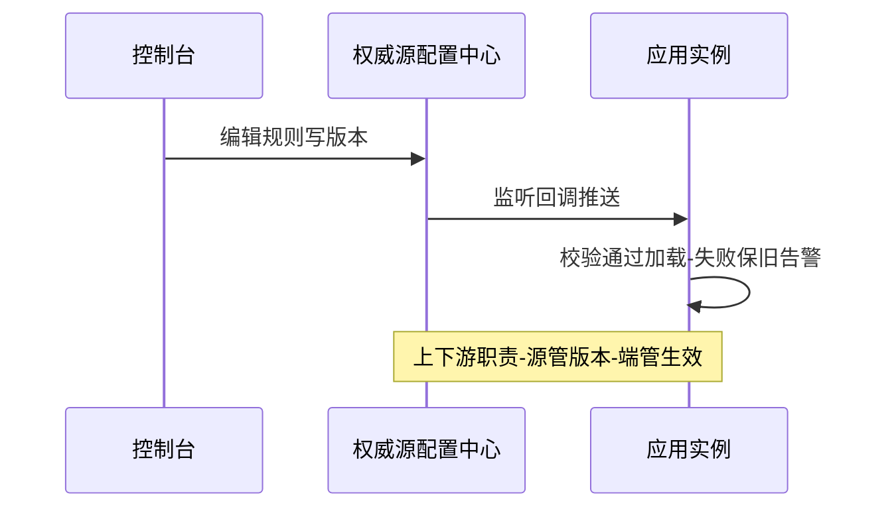
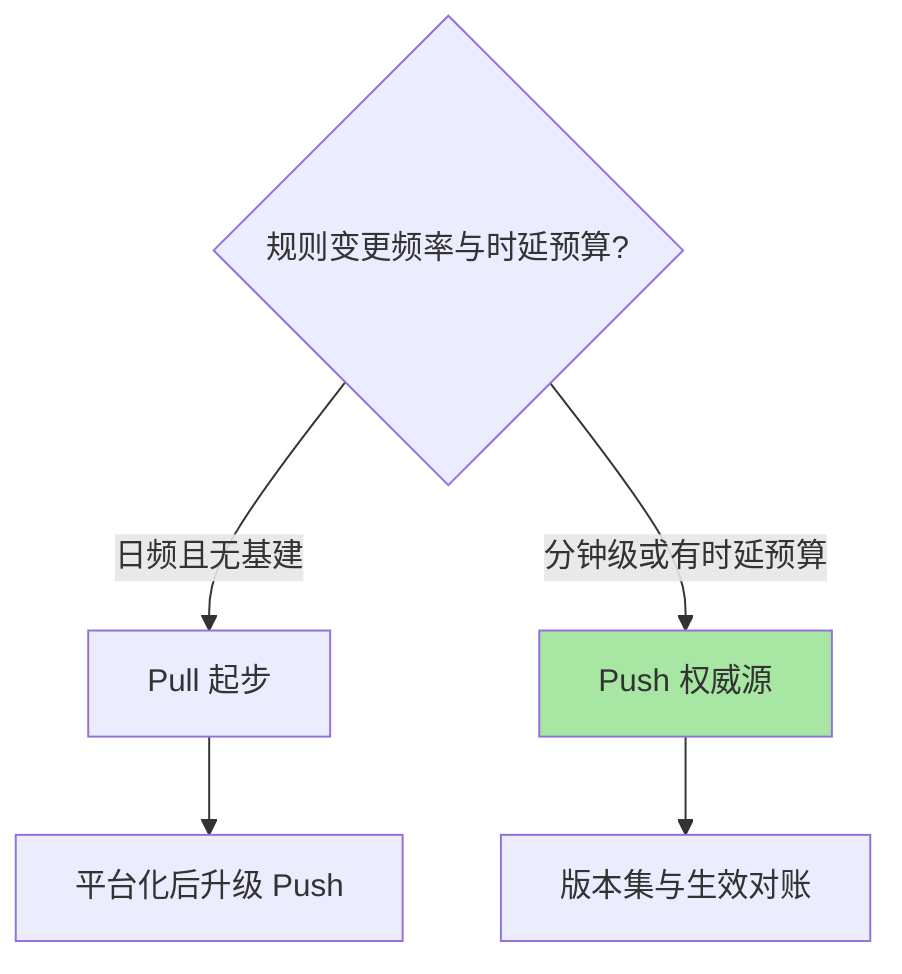
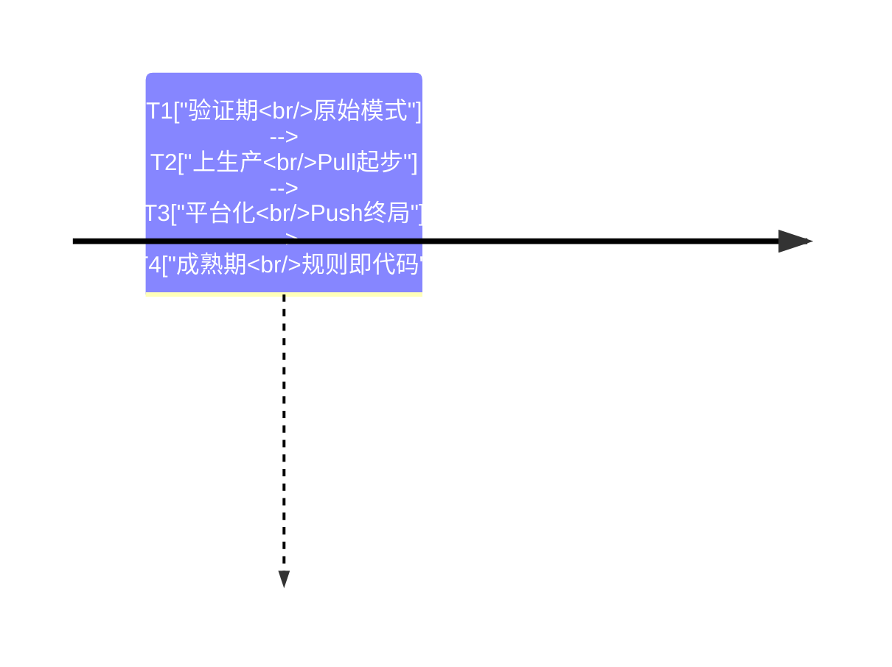

# 规则持久化与动态推送专题总览

> **本文核心**：本专题回答一个生产必答题——**规则住在哪、怎么到实例、坏了怎么兜**。正文一篇：从内存态的三个缺口讲到三种推送模式的链路形状，再到动态数据源的监听、校验、保旧与回退语义，最后给控制台改造步骤与参数清单。判断句：**规则推送方案的可靠性决定防护体系的可靠性**。

## 一句话摘要

原始模式规则跟进程走（重启丢），Pull 靠轮询追（秒级延迟），Push 让配置中心当权威源（秒级触达、版本可回滚）——按变更频率、时延预算与基建存量选模式，权威源唯一与保旧兜底是两条铁律。

## 篇目导航

| 篇目 | 深挖点 | 核心结论 |
|---|---|---|
| 1_规则持久化与动态推送-深度 | 三模式链路 / 数据源机制 / 改造步骤 | 生产禁原始模式；失败保旧是底线；回退=源版本回滚 |

## 推送链路架构速览

选模式的取舍速查：变更日频选 Pull 起步（取舍是延迟换零基建）、分钟级运营操作选 Push（架构上多一套配置中心依赖但秒级生效）、战时操作一律降维成版本切换——上下游各守边界，源管权威、端管投影。

## 与相邻域的关系

机制细节与入门层篇 6 互指（概念与实战）、与特性层熔断篇互指（规则实例化）；配置中心组件细节归本仓库配置中心域，本专题只讲 Sentinel 侧的消费与兜底。阅读顺序建议先正文后回看本页速览：正文里的参数清单、步骤骨架与事故推演是三张常查的表，本页的时间线图适合向他人讲解推送方案的演进逻辑时复用。

## 📌 数据与事实声明

- 写于 2026-09-23，机制口径以 Sentinel 1.8.10 官方 wiki 为基准（公开口径）
- 免责：以正文参考资料与所用版本官方文档为准

## 📚 参考资料

| 类型 | 标题 | 来源 |
|---|---|---|
| 系列入口 | Sentinel 入门层篇 6 | 本仓库 middleware/sentinel/入门层 |
