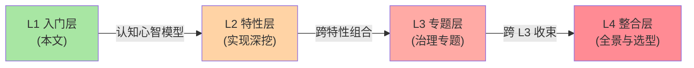

# Sentinel 系列导读：从规则到防护的 4 层学习路径

> 入门层 7 篇导读。讲清系列定位、4 层关系、阅读路径、与相邻系列的关系——**不重复入门层定义**。

## 一、这个系列讲什么

学流控防护最容易犯的错，是把「机制」和「组件」混在一起：

- 会配 QPS 流控规则，但说不清为什么用滑动窗口统计、预热模式的代价是什么
- 听过令牌桶、漏桶、熔断半开态，但不知道它们在 Sentinel 里怎么落地
- 组件上了生产，规则怎么推送没有方案，大促来临不知道防护怎么编排

所以本系列的分工先划清：**「为什么限流要用令牌桶」「熔断器状态机的通用理论」这类跨实现机制，归架构域的稳定性工程系列；本系列专注 Sentinel 这个组件本身**——规则体系、实现手法、生产落地。

按 4 层架构组织：先建认知心智模型，再深挖实现手法，最后用治理与选型收束。

## 二、4 层关系

```
L1 入门层（本文）      ← 概念入门：是什么 + 规则体系 + 接入
  ↓ 组件视角（机制概念 tips 链回稳定性系列）
L2 特性层           ← 实现深挖：流控算法 / 熔断器 / 扩展机制
  ↓ 跨特性组合
L3 专题层           ← 治理专题：规则推送 / 大促防护
  ↓ 跨 L3 收束
L4 整合层           ← 防护全景 + 选型决策树 + 接入实战
```

每层独立可读、并列不依赖——你可以在任何一层开始，按需深入。

## 三、子主题地图

入门层 7 篇分 4 组：

**第 1 组 · 认知（篇 1-2）**：Sentinel 是什么（与 Hystrix / Resilience4j 的定位直觉）+ 核心概念心智模型（资源 / 规则 / Slot 责任链）

**第 2 组 · 规则体系（篇 3-5）**：流控规则 → 熔断降级与系统自适应保护 → 热点参数与访问控制，三篇层层递进

**第 3 组 · 接入（篇 6）**：Spring Boot 接入 + Dashboard 控制台 + 规则推送三种模式

**第 4 组 · 生态（篇 7）**：版本演进、网关流控、云原生方向

## 四、阅读路径

| 读者类型 | 推荐路径 |
|---|---|
| **入门读者** | 篇 1 → 2 → 3 → 4 → 5 → 6 → 7 |
| **用过但想懂原理** | 篇 2 → 直接进 L2 特性层（从流控算法系列开始） |
| **生产运维视角** | 篇 6 → L3 专题层（规则推送 / 大促防护） |
| **框架选型视角** | 篇 1 → L4 整合层选型决策树 |

## 五、与相邻层的关系



- **L1 入门层**（本层）：概念入门，建立「防护体系」的心智模型
- **L2 特性层**（待铺）：实现深挖——先读 L1 再读 L2，理解成本最低
- **L3 专题层**（待铺）：跨 L2 特性的治理专题
- **L4 整合层**（待铺）：全景 + 选型 + 接入实战

## 六、与相邻系列的关系

- **architecture/service-governance/stability**：限流 / 熔断 / 降级的**机制**正式定义篇在那边——本系列机制概念级带过 + tips 互指，只讲 Sentinel 怎么实现
- **architecture/service-governance/gateway**：网关抽象机制在那边；Sentinel 网关流控作为组件能力在 L3 专题层讲
- **Hystrix / Resilience4j**：三框架完整对比（含状态机差异）只在 L4 整合层选型决策树讲一遍，篇 1 只做定位直觉

## 📌 数据与事实声明

- 写于 2026-09-08，对标 Sentinel 1.8.10（2026-05-21 发布，gh CLI 实测）
- 免责：Sentinel 版本迭代快，具体配置项与默认值以官方 Wiki 为准

## 📚 参考资料

| 类型 | 标题 | 来源 |
|---|---|---|
| 官方 Wiki | Sentinel Wiki | github.com/alibaba/Sentinel/wiki |
| 官方源码 | alibaba/Sentinel | github.com/alibaba/Sentinel |
| 仓库本系列 index | `docs/middleware/sentinel/index.md` | 本仓库 |
