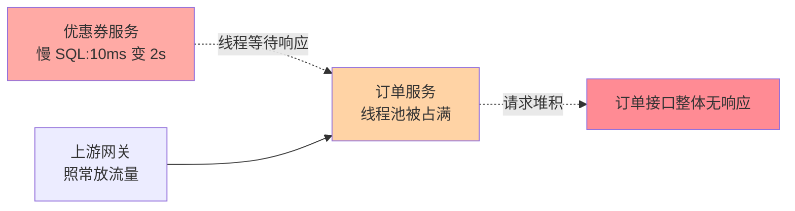
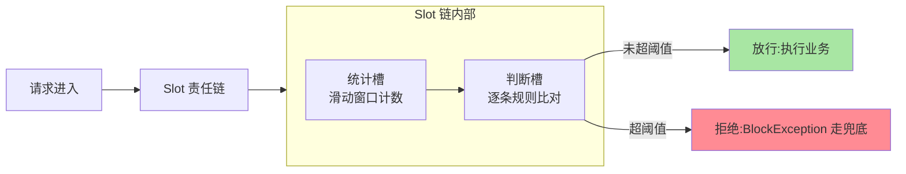

# Sentinel 是什么：流控防护组件的定位与全景

> 一句话：Sentinel 是面向微服务的流控防护组件——用「资源 + 规则」两个概念，把「流量大了怎么办、依赖慢了怎么办」从救火问题变成可配置的工程问题。

> **本文核心**：Sentinel 的本质是**在应用进程内做流量裁决**——以「资源」（被保护的代码块）为被检对象、以「规则」（QPS/并发/失败率等阈值）为裁决标准，请求进入时过一条 Slot 责任链（统计槽滑动窗口计数 → 判断槽逐条比对），超限即抛 `BlockException` 快速失败。**机制链**：请求 → 资源 Entry → Slot 链（统计+裁决）→ 放行业务 / 快速拒绝走兜底。四类规则各管一种不确定性：流量超载（流控）、依赖劣化（熔断）、参数热点（热点）、整机过载（系统自适应）。

## 一句话摘要

Sentinel 解决的是一个朴素的问题：**当流量超过系统承受能力时，让系统「有秩序地拒绝一部分请求」，而不是「无秩序地崩掉全部请求」**。它以 jar 包形式嵌在你的应用里，围绕「资源」（被保护的代码块）和「规则」（通过条件）工作，提供流控、熔断降级、热点参数、系统自适应保护四类手段。

## 一、为什么需要流控防护

先还原一段公开报道里反复出现的雪崩场景（细节匿名化，机理是通用的）：

某电商平台大促零点，流量冲到平日的几十倍。订单服务本身扛住了，但它依赖的优惠券服务因为一条慢 SQL 变慢——单次耗时从 10ms 掉到 2s。订单服务调优惠券的线程在等响应，线程池被逐渐占满，新请求开始排队；而上游网关不知道下游已经吃紧，还在照常放流量。几分钟后订单服务整体无响应——**优惠券只是「慢」，订单却是「死」，故障在上下游之间放大了**。



这个故事的教训是：**故障的传播不是线性的**。单个依赖变慢 → 调用方线程被占满 → 上游继续放流 → 整条链路雪崩。如果订单服务对「调优惠券」这个动作有防护——超过阈值快速失败、慢调用比例过高时暂时熔断——优惠券的慢就只影响优惠券相关功能，而不是拖死整条链路。

**量级演进视角**：千级 QPS 的单体应用——接入层 Nginx 限流基本够，应用内防护是锦上添花；万级 QPS 的微服务集群——依赖链变长，单个依赖劣化即可级联放大，应用内熔断/流控成为标配；十万级 QPS + 多机房 + 大促场景——防护从「规则配置」升级为「预案体系」（分级限流/热点隔离/整机兜底联动演练）——**防护体系的档位随流量与链路深度升级，从一条规则演进为一套组织流程**。

这就是流控防护组件的存在理由：流量和依赖的不确定性是常态，与其指望系统永远扛得住，不如提前设计好「扛不住的时候怎么办」。这层设计还有跨周期的价值：回顾这类组件十年的演进——从隔离优先到流控优先——大促年年有、预案年年演进，防护规则是少数能沉淀成组织资产的工程手段，今年调好的熔断策略，明年复盘只需要改阈值。

## 5W 速记卡

| 维度 | 一句话 |
|---|---|
| What | 面向微服务的流控防护组件（流量整形 + 熔断降级 + 系统保护） |
| Why | 流量超载、依赖变慢时，有秩序地拒绝，而不是无秩序地崩 |
| When | 接口要限流、依赖要熔断、热点要隔离、大促要有预案 |
| Where | 以 jar 包嵌在应用进程内（另有 Dashboard 做管理面） |
| How | 用「资源」包住业务代码，用「规则」定义通过条件，Slot 链逐关检查 |

## 二、核心概念：资源、规则与 Slot 链

Sentinel 只有三个必须先建立的概念。

**资源（Resource）**：被保护的东西——一个方法、一段代码块、一次远程调用都行。用一行代码圈出来：

```java
// 最小可运行示例：保护「创建订单」这个动作
FlowRule rule = new FlowRule();
rule.setResource("order:create");              // 资源名
rule.setGrade(RuleConstant.FLOW_GRADE_QPS);    // 按 QPS 维度限流
rule.setCount(100);                            // 每秒最多放行 100 个
FlowRuleManager.loadRules(List.of(rule));      // 加载规则

try (Entry entry = SphU.entry("order:create")) {
    return createOrder(req);                   // 受保护的业务逻辑
} catch (BlockException e) {
    return OrderResult.busy();                 // 被拒绝：快速失败，走兜底响应
}
```

**规则（Rule）**：资源的通过条件。上面例子的含义是——`order:create` 每秒最多进来 100 个，超出的直接抛 `BlockException` 进兜底分支。

**Slot 链（责任链）**：`SphU.entry()` 背后是一条由功能槽串起来的检查链：统计槽负责滑动窗口计数（按秒段分桶，累加每个资源的通过数、拒绝数、响应耗时），判断槽拿着规则跟统计值比对，决定放行还是拒绝。这个设计的妙处是功能可插拔——每类规则对应独立的 Slot，模块边界清晰，互不干扰。



一个值得知道的底层细节：统计是**异步聚合**的，业务线程只做一次原子计数就返回，所以防护机制自身的开销是微秒量级——「为了防护再拖垮系统」在绝大多数场景不成立，这也是它能在大规模生产铺开的前提。

## 三、四类规则一张表

| 规则类型 | 解决什么不确定性 | 一句话例子 |
|---|---|---|
| 流控规则 | 流量本身超载 | 这个接口每秒只放 100 个 |
| 熔断降级规则 | 依赖变慢或报错 | 优惠券慢调用比例超 50%，熔断 10 秒 |
| 热点参数规则 | 个别参数值打爆系统 | 爆款商品 ID 单独限流 |
| 系统自适应规则 | 整机负载过高的兜底 | load 超阈值，所有入口统一收敛 |

每类的具体参数和玩法是篇 3-5 的内容，这里只建立「四类规则各管一种不确定性」的直觉。

## 四、与同类组件的区别：Hystrix / Resilience4j

| 维度 | Sentinel | Hystrix | Resilience4j |
|---|---|---|---|
| 隔离模型 | 并发线程数限流（不占额外线程） | 线程池隔离（每个依赖一个池） | 信号量 + 装饰器组合 |
| 流控能力 | QPS/并发/关联/链路 + 三种流控效果 | 以隔离+熔断为主，基本无流控 | 限流器、熔断器模块化拼装 |
| 控制台 | 自带 Dashboard，可实时改规则 | 无官方控制台 | 无 |
| 维护状态 | 活跃维护（1.8.x） | 官方公告进入维护模式 | 活跃维护 |

定位直觉：**Hystrix 的时代命题是「隔离」——每个依赖一个线程池，坏了别连坐；Sentinel 的时代命题是「流控」——先把不该进来的流量挡在门外**。Hystrix 停更后，防护组件的演进把社区分流到两大去向：Sentinel 和 Resilience4j——前者适合需要控制台、规则中心化管理的微服务体系（Spring Cloud Alibaba 生态开箱即用），后者适合偏好函数式轻量组合的团队。这个分野是两代防护架构取舍的缩影。三框架的完整对比（含状态机差异与选型决策树）在整合层讲一遍，这里不展开。

顺带划一个边界：「为什么限流要用滑动窗口」「熔断器状态机的通用理论」这类**跨实现机制**，归架构域稳定性系列正式讲；本系列只讲 Sentinel 怎么实现它们。

## 五、典型使用场景

- **核心接口限流**：交易接口按 QPS 限流，超出快速失败，保护数据库连接池不被打爆
- **慢依赖熔断**：调第三方支付通道的出口配熔断，对方抖动时先止损，恢复后自动半开试探
- **热点商品隔离**：秒杀商品 ID 走热点参数规则单独限流，不让一个爆款拖累全品类
- **大促预案**：把流控/熔断规则做进预案，压测验证后随发布流程演练——这是防护规则从「技术配置」升级为「组织流程」的用法

## 六、误区与不适用

接入防护组件本身也有代价：规则要治理、告警要跟进、演练要排期，这笔长期账在接入前就该算清楚。在此基础上避开四个常见误区：

- **当削峰队列用**：Sentinel 的拒绝是「快速失败」，不是「排队稍后处理」。要把请求暂存起来慢慢消费（削峰填谷）该找消息队列。一句话边界：宁可降级丢弃的找 Sentinel，必须逐条处理的找 MQ
- **规则只存内存**：规则通过 API 推到应用后默认存内存，应用重启就丢——这是历史上最常见的踩坑点。生产的正确姿势是接 Nacos / Apollo 这类配置中心做持久化与推送，专题层会展开
- **全接口铺规则**：几百个接口都配规则，结果是隐性代价：阈值过期、告警失焦、规则无人维护。业内常见的取舍是只保护核心链路（交易/支付/登录），长尾接口靠系统自适应规则兜底
- **和 Nginx 限流混淆**：Nginx 在接入层按 IP/连接数挡流量，看不到业务语义；Sentinel 在应用层按业务资源做判断。两者是纵深分层，不是二选一

## 七、你们可能会问

**Q1：Nginx 都有限流了，应用内还需要吗？**
需要。接入层不知道「下单」和「查商品」哪个更值得保，资源级规则才能做到「宁保交易、舍弃导购」，两层是互补的纵深。

**Q2：统计是异步的，计数会不准吗？**
异步的是聚合，计数本身是原子的。滑动窗口按秒段分桶累加，允许的误差远小于业务流量自身的波动——防护判断要的是「趋势超阈」，不是精确会计。

**Q3：不接控制台，代码里写死规则能用吗？**
能用，适合起步和本地验证。但改阈值就要发版，违背「防护要随时调整」的初衷，跨周期看维护代价反而更高。

团队里还有一个常见分歧值得记录：业务视角倾向「少配规则别误伤」，稳定性视角倾向「核心链路都配上」。业内没有标准答案，常见的权衡是——规则数量宁少勿多，但每条规则必须挂着预案演练，演练过的规则才有资格留在配置里。

## 💡 实战提示

- 💡 规则默认存内存、重启即丢——生产必须接配置中心（Nacos/Apollo）做持久化与推送
- 💡 核心链路才配规则（交易/支付/登录），长尾接口用系统自适应规则兜底——规则宁少勿多，每条必挂演练
- 💡 决策口径：宁可降级丢弃的找 Sentinel、必须逐条处理的找 MQ；接入层挡 IP/连接、应用层挡业务资源——纵深分层

## 八、自测三问

1. 资源和规则分别是什么？`SphU.entry()` 抛出 `BlockException` 意味着什么？
2. 四类规则各管哪种不确定性？整机过载由谁兜底？
3. Sentinel 的快速失败和消息队列的削峰填谷，边界在哪？

下一篇讲「核心概念与心智模型」：把资源、规则、Slot 链展开成一张完整的心智模型，看清一次请求从进入到被拒绝的完整路径。

## 追问思考与开放问题

**质疑者视角**：防护组件的规则是「配置」——但配置错误的代价是真流量：阈值配小了误杀正常请求，配大了形同虚设。**防护规则必须像代码一样被评审与演练**——阈值来自压测而非拍脑袋，预案来自演练而非文档。另一个质疑：进程内防护的自我开销虽小（微秒级），但规则数量暴涨时 Slot 链变长、每次 entry 的检查成本线性上升——规则的「数量治理」也是性能治理。

**开放问题**：
- 防护规则与 Service Mesh 治理的边界——进程内裁决（Sentinel）与 sidecar 裁决（Envoy RateLimit）的分工，随 Mesh 普及持续演进。
- 多语言探针的规则语义统一——Java/Go/C++ 探针的统计口径与规则表达能否一致，决定跨语言团队的规则复用。

## 📎 核心带走

- **核心一句话**：Sentinel = 应用进程内的流量裁决器——资源圈保护对象、规则定通过条件、Slot 链执行裁决，超限快速失败走兜底
- **机制链**：请求 → 资源 Entry → Slot 责任链（统计槽计数 → 判断槽比对）→ 放行 / BlockException → 四类规则各管一种不确定性
- **失效点/边界**：拒绝≠排队（削峰找 MQ）；规则不持久化重启即丢；全接口铺规则=规则失焦

## 📌 数据与事实声明

- 写于 2026-09-08，对标 Sentinel 1.8.10（2026-05-21 发布，gh CLI 实测）
- Hystrix 进入维护模式为官方公告口径（公开报道）；三框架维护状态为 2026-09-08 检索确认
- 免责：具体配置项与默认值以官方 Wiki 为准

## 📚 参考资料

| 类型 | 标题 | 来源 |
|---|---|---|
| 官方 Wiki | Sentinel 介绍 | github.com/alibaba/Sentinel/wiki |
| 官方源码 | alibaba/Sentinel | github.com/alibaba/Sentinel |
| 官方文档 | Resilience4j | resilience4j.readme.io |
| 官方公告 | Hystrix 维护模式说明 | github.com/Netflix/Hystrix |
| 系列导航 | Sentinel 系列目录 | `docs/middleware/sentinel/index.md` |
