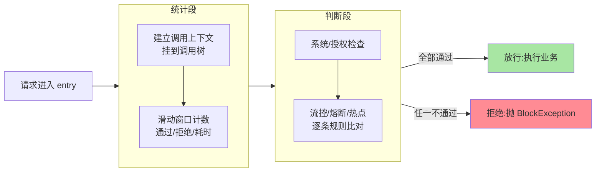
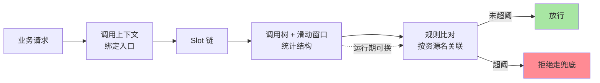

# Sentinel 核心概念与心智模型：一次请求的完整旅程

> 篇 1 建立了资源、规则、Slot 链三个概念。本篇把它们拼成一张完整的心智模型——主线只有一个问题：**一次请求从进入 Sentinel 到被放行或拒绝，中间到底发生了什么**。

## 一句话摘要

Sentinel 的内核是一套「**统计 + 判断**」的分工：Slot 链先为请求建立调用上下文并完成滑动窗口计数，判断类 Slot 再拿规则与统计值比对做出决策。理解了「统计从哪来、判断拿什么比」，四类规则、热点参数、系统自适应全都只是这条链上的不同判断槽。

## 一、为什么需要一张心智模型

只背「资源、规则、Slot」三个词，遇到真实问题还是懵：同一资源在十处被调用，统计算谁的？限流规则挂在哪个对象上？改了规则为什么没生效？

心智模型的作用是把概念变成一条**动态的旅程**。本篇的写法是：跟着一次请求走全程，路过每一站时讲清这一站在干嘛——走完一遍，后续所有篇目的内容都能挂到这条旅程的对应位置上。这也是一种权衡：入门层不追求把每个 Slot 的源码讲透（那是特性层的事），但求建立「坐标系」，让后面每篇深挖都有处安放。

## 5W 速记卡

| 维度 | 一句话 |
|---|---|
| What | 统计（调用树 + 滑动窗口）与判断（规则 Slot）分离的责任链内核 |
| Why | 统计与判断解耦，规则才能动态变、判断才能可插拔 |
| When | 建立整体认知时读一遍；后续每篇深挖都回这张图定位 |
| Where | 应用进程内，`SphU.entry()` / `@SentinelResource` 的执行路径上 |
| How | 请求带上下文进链 → 统计段计数 → 判断段比对 → 放行或抛 BlockException |

## 二、资源与调用树：统计从哪来

**资源名是统计的钥匙**。你在代码里写下 `SphU.entry("order:create")`，Sentinel 就以这个名字为维度建一套统计结构。同一进程内所有叫 `order:create` 的调用，不管出现在多少个类里，都汇入**同一个统计桶**——所以限流阈值的意义是全进程的，不是单处代码的。

统计不止一个视角，这背后是三个职责不同的统计节点（记住职责即可，类名不用背）：

- **入口节点**：一次外部请求进来的总入口（比如一个 HTTP 接口）对应一个节点，整条调用链的统计都挂在它下面
- **资源节点**：按调用路径逐层展开，形成一棵**调用树**——「订单接口 → 调优惠券 → 调缓存」每一步是树上的一个节点
- **全局节点**：按资源名跨调用路径聚合，回答「这个资源全进程总共过了多少流量」

调用树是 Sentinel 区别于简单计数器的关键**架构**设计：有了树，才知道「这个慢依赖是被哪个入口调用带起来的」，链路级限流、来源统计才有数据基础——排查这类跨上下游的问题，树是唯一的抓手，它也是 Sentinel 演进中被验证最有生命力的设计之一。这套树状统计的**原理**并不复杂——每个线程进入入口时绑定一个调用上下文，链上的节点按调用顺序逐层挂接——但正是它支撑起了后面所有的高级玩法。

## 三、Slot 链：一次请求的完整旅程

Slot 链按职责分两段：**统计段**先跑，**判断段**后跑。具体槽位顺序以官方 Wiki「Sentinel 工作主流程」为准，入门层只建立两段式直觉：

两个容易忽略的**底层**细节：

- **判断读的是统计**。流控槽判断「最近 1 秒通过数是否超阈值」，读的正是统计段刚维护的滑动窗口——统计和判断分离，规则才能在运行期随便换，因为换的只是「比对逻辑」，统计结构不动。
- **异常也是统计的一部分**。业务抛异常会被链路捕获记录，熔断规则的「异常比例」就是从这里来的。

顺带一提，这套「先统计、后判断」的结构自开源以来演进很小，十多年只在槽位增删上演变、结构从未重排——底层原理稳定，是它敢于在生产大规模铺开的底气之一。

## 四、规则与资源怎么关联

规则是**挂在资源名上**的：一条流控规则写着「对 `order:create`，QPS 阈值 100」，资源名就是关联键。规则加载进内存后即刻生效，也可以随时重新加载覆盖——这就是篇 1 说的「防护要随时调整」的机制基础。

**与 Web 过滤器链的区别**容易混，值得单独说：Servlet 过滤器链是**全局固定**的，每个请求按注册顺序过完所有过滤器，链是容器的、不区分业务；Sentinel 的 Slot 链是**按资源组织**的——每个资源有自己的检查配置，判断类 Slot 拿的是「这个资源的规则」，而且只在你显式 entry 的地方生效。一个在容器层挡请求，一个在业务层护动作，模块边界完全不同，两者分层共存。

## 五、心智模型总图

把前面几节收成一张图，后续所有内容都挂得上：

记住三个箭头的含义就抓住了本质：**上下文定位「谁在调」，调用树回答「过了多少」，规则决定「还让不让过」**。

## 六、典型使用场景

- **链路级限流**：同一个资源被多个入口调用，只对「从某个入口进来的调用」限流——靠的就是调用树的路径信息
- **来源授权**：统计节点记录调用来源（比如「黑盒服务调用我」单独标记），配合授权规则做黑白名单
- **动态调参**：规则挂资源名 + 支持运行期重载，大促时把阈值从 100 调到 300 只是换一条规则，不用动代码

## 七、误区与不适用

- **资源名绑死 URL**：把每个 REST 路径当成一个资源，几百个接口就是几百套统计结构，最后没人看得懂。取舍原则和篇 1 一致：资源是「业务动作」，不是「URL」，粒度对齐预案才有价值
- **Entry 不关闭**：`SphU.entry()` 返回的 Entry 用完必须 close（推荐 try-with-resources），否则统计错乱、调用树越挂越深——这是手工埋点最常见的坑
- **规则改了不生效**：八成是重新 loadRules 没执行，或压根没接配置中心做推送。规则在内存里，改配置文件不会热生效
- **背类名当懂原理**：把 Slot 类名背得滚瓜烂熟不等于理解机制。心智模型的价值在「旅程」，不在名字；类名到特性层源码走读时自然会记住

## 八、你们可能会问

**Q1：注解埋点和代码埋点选哪个？**
`@SentinelResource` 适合方法级保护，侵入小、和业务解耦；`SphU.entry()` 适合代码块级、需要自己控制范围的场景。同一个进程里混用没问题，资源名对齐即可。

**Q2：一个资源嵌套调用自己（或互相调用），统计怎么算？**
调用树按路径逐层挂接，嵌套调用在树上就是父子节点，各自统计互不污染——这也是为什么先讲树再讲规则。

**Q3：资源多了统计会不会内存爆炸？**
统计结构按资源数线性增长，每个是秒级滑动窗口的小数组，内存代价可控。真正该担心的是「资源粒度失控」带来的治理代价，不是统计本身。

## 九、自测三问

1. 同一资源在多处调用，限流阈值按什么维度生效？
2. Slot 链的统计段和判断段各干什么？为什么分离？
3. Slot 链和 Web 过滤器链的差异是什么？

下一篇讲「服务注册与发现」之前的重头——「流控规则」：QPS 与并发两种阈值、关联与链路两种模式、三种流控效果，逐一落到这张心智模型上。

## 📌 数据与事实声明

- 写于 2026-09-08，对标 Sentinel 1.8.10（gh CLI 实测）
- Slot 链槽位顺序以官方 Wiki「Sentinel 工作主流程」为准，本文只做两段式概念划分
- 免责：具体类名与配置项以官方文档为准

## 📚 参考资料

| 类型 | 标题 | 来源 |
|---|---|---|
| 官方 Wiki | Sentinel 工作主流程 | github.com/alibaba/Sentinel/wiki |
| 官方 Wiki | 滑动窗口统计说明 | github.com/alibaba/Sentinel/wiki |
| 系列导航 | Sentinel 系列目录 | `docs/middleware/sentinel/index.md` |
