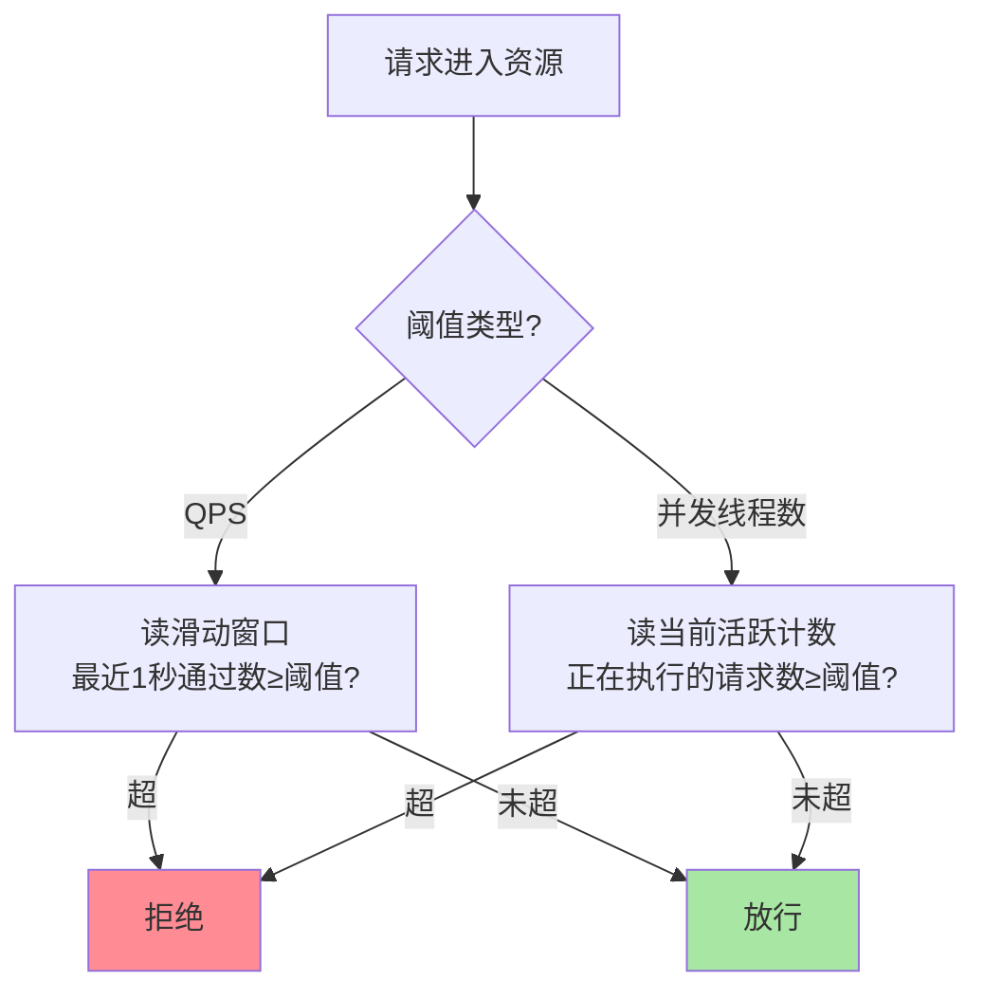
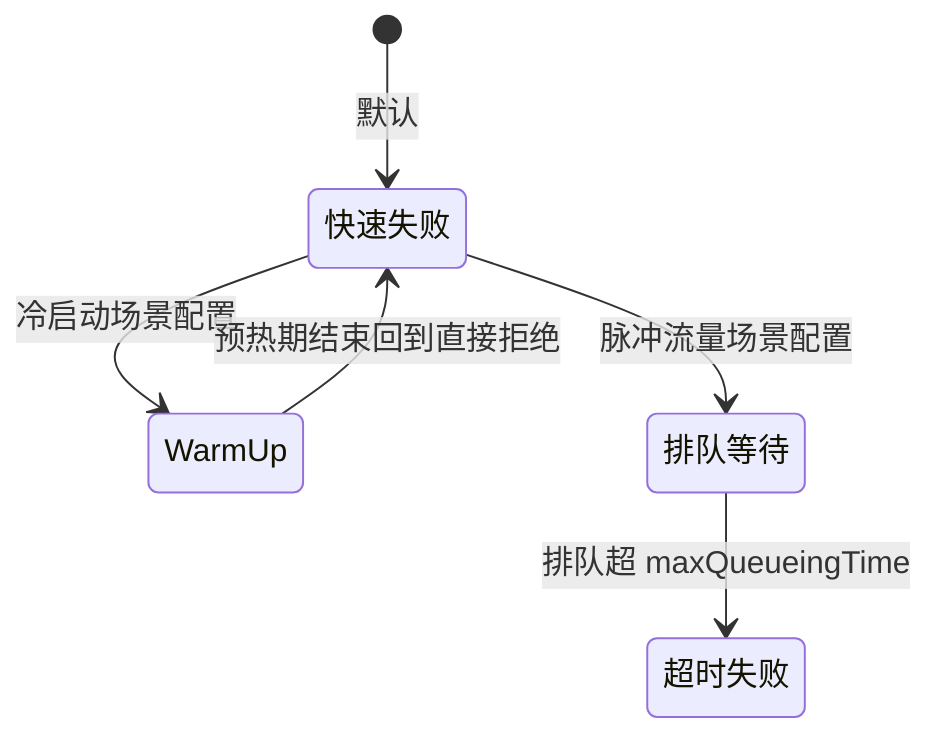

# Sentinel 流控规则：两种阈值、两种模式、三种效果

> **本文核心**：流控规则是 Sentinel 最常用的规则类型，参数体系可以收成「**2×2×3**」——**2 种阈值类型**（QPS：每秒请求数；并发线程数：同时在处理的请求数）、**2 种流控模式**（直接：资源自身超限就限；关联：另一个资源的流量超限时我让路）、**3 种流控效果**（快速失败：直接拒绝；Warm Up：冷启动预热爬坡；排队等待：匀速通过）。**机制链**：请求 → 按阈值类型取统计值（QPS 读滑动窗口 / 并发读活跃计数）→ 按模式选比对对象 → 按效果决定拒绝方式。三个维度正交组合，覆盖从「保护自己」到「保护下游」的流控语义。

## 一句话摘要

流控规则的参数没有想象中多——**阈值类型选「按什么限」（QPS 还是并发），流控模式选「比谁」（自己还是关联资源），流控效果选「怎么拒」（快速失败/预热/排队）**。QPS 限流防「流量洪峰打爆容量」，并发线程数限流防「慢调用占满线程」（不适合做线程池隔离却达到了隔离的效果——轻量版隔离）；Warm Up 解决「冷系统接不住突增」（缓存未热/连接池未建/ JIT 未优化），排队等待解决「削峰匀速化」（把突刺拉平成匀速流，脉冲式流量友好）。

## 5W 速记卡

| 维度 | 一句话 |
|---|---|
| What | 按阈值类型×流控模式×流控效果组合的流量控制规则 |
| Why | 流量洪峰与慢调用是服务过载的两大来源，需要不同维度的闸门 |
| When | 接口容量保护、秒杀洪峰、冷启动爬坡、脉冲流量整形 |
| Where | Sentinel 判断段的流控 Slot，规则挂资源名 |
| How | QPS/并发取统计值 → 直接/关联选比对对象 → 快速失败/预热/排队执行 |

## 二、两种阈值类型：QPS 与并发线程数

**QPS 限流**回答「每秒进来多少个」——防的是流量洪峰打爆容量，适合接口容量保护。**并发线程数限流**回答「此刻有多少个还没处理完」——防的是慢调用占满执行资源：接口平时 20ms、下游抖动变 2s 时，QPS 不变的流量会让并发数放大百倍，并发阈值此时才是准确的保护维度。**两者的分工不是二选一**：读接口（快、无状态）用 QPS，依赖下游的调用出口用并发数——后者不占额外线程却达到线程池隔离的效果，代价是「钝化」：所有慢调用共享一个并发阈值，无法按依赖分池。

**量级演进视角**：千级 QPS——一条 QPS 规则就够，阈值=压测容量的 80%；万级 QPS——阈值要按调用方来源拆分（核心调用方高配额、边缘调用方低配额，配合授权规则），并开始用并发阈值保护慢出口；十万级 QPS——流控规则与集群流控联动（单机阈值×实例数不等于集群容量的场景，见篇 7 生态），预热参数成为大促标配——**流控的复杂度不在规则参数，在阈值来源的治理**。

## 三、两种流控模式：直接与关联

**直接模式**是默认语义：资源自己超限就限自己。**关联模式**的语义是「**当关联资源超限时，限制我**」——典型场景：读写竞争。写接口和读接口争抢同一个数据库连接池，容量紧张时优先保写：给读接口配关联规则（关联资源=写接口），写接口流量超限时读接口自动让路——**「保写入弃读取」的优先级语义，用一条规则表达，不用写代码**。

链路模式（只对「从某个入口进来的调用」限流）依赖篇 2 的调用树：同一资源被多个入口调用时，只想限「来自秒杀入口的那部分流量」——链路模式按调用路径过滤统计。注意它的**适用边界**：需要埋点时显式声明入口（`ContextUtil.enter`），且高频调用下调用树维护有成本——链路规则数量要克制，治理成本随入口数增长。

## 四、三种流控效果：拒绝的艺术

**快速失败**：超限直接抛 `BlockException`，最简单也最常用——前提是调用方能接住拒绝（有兜底响应）。**Warm Up（预热）**：阈值不是瞬间生效，而是从 `阈值/冷加载因子` 在预热时长内爬坡到设定值——解决的真问题是「**冷系统接不住满血流量**」：服务刚启动缓存全空、数据库连接池未填满、JIT 未优化，直接放量反而雪崩；大促前扩容的新实例、发布后的预热期都靠它平滑过渡。**排队等待（匀速排队）**：请求按漏桶节奏匀速通过，超出的排队等待、等不了就超时失败——把「突刺流量」拉平成「匀速流」，适合消息处理、定时任务批处理这类**脉冲式**流量；注意它会让请求耗时变长（排队时间计入 RT），对延迟敏感的在线接口是反模式。

**Trade-off 视角**：三种效果的本质是「**拒绝的成本由谁承担**」的取舍——快速失败把成本给调用方（拿不到结果），排队把成本给等待时间（RT 变长但都处理），预热把成本给时间窗口（短期容量打折）——选哪个，取决于你的调用方能容忍哪种代价。

## 五、典型场景与误区

**典型场景**：交易接口 QPS 限流（压测容量的 80%，快速失败+兜底响应）；第三方调用出口并发限流（对方慢时不拖死自己线程）；读写竞争的关联限流（保写舍读）；大促新实例预热（Warm Up 10 分钟爬坡）；MQ 消费匀速化（排队等待，保护下游数据库写入速率）。

**常见误区**：① **阈值拍脑袋**——「1000 够了吧」没有压测依据；正确来源是压测 P99 达标时的最大吞吐 × 0.8 安全系数，并且随容量变更复审；② **慢接口用 QPS 限流**——单次 2 秒的接口限 100 QPS，并发照样到 200，线程池照样爆——慢接口该用并发线程数维度；③ **Warm Up 当日常限流用**——预热只解决冷启动，常态化「先拒绝一半再爬坡」没有意义；④ **排队等待配太长队列**——maxQueueingTime 给到几十秒，请求方早超时了服务端还在排队处理「无人认领」的请求——排队时长必须小于调用方超时；⑤ **关联模式滥用成万能开关**——关联语义是「让路」不是「联动」，跨服务的依赖关系用关联表达会让规则网络失控。

## 与 Nginx 限流的区别

| 维度 | Sentinel 流控（应用层） | Nginx 限流（接入层） |
|---|---|---|
| 判断依据 | 业务资源（接口/方法/参数） | IP/连接数/URI |
| 效果 | 预热/排队等丰富语义 | 基本为拒绝 |
| 生效位置 | 进程内，秒级动态改规则 | 接入层，reload 生效 |

两者是纵深分层：接入层挡洪水（粗粒度、无业务语义），应用层保资源（细粒度、有业务优先级）——不是二选一。

## 设计思想：为什么参数是三个正交维度

流控规则的参数设计是**正交分解**的范例：阈值类型（限什么）、流控模式（比什么）、流控效果（怎么拒）三者互相独立、自由组合——2×2×3=6 种组合语义清晰，没有「配置爆炸」。这背后是规则引擎设计的通用原则：**把「判断逻辑」拆成正交维度，每个维度独立演进，组合空间自然扩展**。对比「大而全」的规则设计（一个规则二十个参数），正交分解的学习成本与维护成本都低一个量级——这也是 Sentinel 规则体系能被 Dashboard 图形化的前提：每个维度都可视化为一次选择而非一个数值。

## 追问思考

**质疑者视角**：单机阈值的数学陷阱——集群 10 个实例各限 100 QPS，集群总限「理论上」1000，但负载均衡不均时（长连接粘滞/权重差异），单实例流量可以是均值的 2-3 倍：按总量算的容量规划配单机阈值，会出现「集群没满、单机先限」的误杀。**单机流控的正确定位是「每台机器的自我保护」，不是「集群配额的精确分摊」**——后者需要集群流控（Token Server 统一计数，篇 7 提及、专题层展开）。另一个质疑：并发线程数统计依赖请求结束才回落——调用方大批量超时重试时，旧请求未返回新请求又进来，并发计数虚高，保护触发得比真实负载更早——这其实是可接受的保守误差，但要知道它存在。

**事故视角**：某团队给订单查询接口配了 QPS 500 的流控（压测口径），一次大促预热把网关超时从 1 秒调到 10 秒——用户端重试增多，实际到达流量没超 500，但每次请求因下游缓存抖动变慢到 1.5 秒，并发数冲到 750，Tomcat 线程池（默认 200）先爆——流控规则毫发无损地「没触发」，服务却挂了。复盘：**QPS 规则保护的是「容量」，并发规则保护的是「执行资源」，这次故障缺的是后者**——修复即给查询出口补并发线程数规则。追问：为什么不把线程池调大？——线程数调大只是推迟爆点，慢调用根因（缓存抖动）未除前，更大的池子意味着更长的雪崩时间——**防护参数永远救不了根因，但能买定位根因的时间**。

**追问链**：为什么 Sentinel 用「并发线程数限流」替代 Hystrix 的「线程池隔离」？——Hystrix 为每个依赖建独立线程池：隔离彻底，但线程切换开销（上下文切换微秒级 × 高频调用）与线程数爆炸（几十个依赖 × 各自池）是真实代价；Sentinel 选择不建池、只用计数器卡并发——零线程切换开销，代价是「钝化隔离」（所有慢调用共享一个阈值）。**这是「隔离彻底性 vs 运行效率」的架构级取舍**，也是两代防护框架最深的分野（互指篇 1 对比表）。追问：滑动窗口的统计精度怎么量化？——秒级两桶意味着最坏情况下统计滞后半秒，十万 QPS 下半秒=5 万个请求的误差——这就是为什么核心接口的流控阈值要留 20% 余量：**阈值不是精确值，是带置信区间的容量声明**。

## 💡 实战提示

- 💡 阈值来源只有压测：容量 P99 达标最大吞吐 × 0.8，随容量变更复审——拍脑袋阈值等于没配
- 💡 读接口用 QPS 维度、依赖下游的出口用并发线程数维度——两种阈值是互补不是互斥
- 💡 排队等待的 maxQueueingTime 必须小于调用方超时——否则在处理「无人认领」的请求
- 💡 决策口径：常态保护快速失败、冷启动预热 Warm Up、脉冲整形排队等待——按调用方能容忍的代价选

## 你们可能会问

**Q1：QPS 阈值 100 是「精确每秒 100 个」吗？**
不是——滑动窗口秒级两桶的统计下，它是「最近 1 秒窗口内通过数不超过 100」的近似裁决，短窗口突刺可能瞬时超一点、也可能误拒一点。防护语义要的是趋势正确，不是会计精确；要求精确配额（计费）用集群流控或专用配额系统。

**Q2：并发线程数限流和信号量隔离是一回事吗？**
机制同源（都是计数器卡并发），语义有差：信号量隔离通常按依赖各配（Resilience4j 的 semaphore bulkhead），Sentinel 的并发阈值按资源配、全局共享一个——「钝化但轻量」。要按依赖精细分池，用多个资源名分别埋点即可达到等价效果。

**Q3：Warm Up 的冷加载因子 3 是什么意思？**
初始生效阈值 = 设定阈值 / 3（coldFactor 默认 3），在预热时长内线性爬回 100%——即冷系统先以 1/3 容量接客，10 分钟（可配）内爬到满配。参数按「实例冷启动到缓存热透」的真实时长设定，压测验证爬坡曲线。

**Q4：流控规则能按调用方区分配额吗？**
配合授权规则（调用方来源）+ 多资源埋点可以做到「核心调用方高配额、边缘低配额」；原生流控规则的粒度是资源级不是调用方级——调用方分级的语义由授权规则与来源统计（篇 2 调用树的 origin）组合实现。

## 八、自测三问

1. 两种阈值类型各防什么？（答：QPS 防流量洪峰打爆容量；并发线程数防慢调用占满执行资源——慢接口必须用后者）
2. 三种流控效果各把拒绝成本给了谁？（答：快速失败给调用方、排队给等待时间、预热给时间窗口）
3. 关联模式的语义与典型场景？（答：「关联资源超限时限制我」——读写竞争保写舍读，用规则表达优先级不写代码）

## 开放问题

- 单机流控与集群流控的统一语义——Token Server 模式的运维成本（单点/部署）与精确性的平衡，云原生形态（Operator 托管）在社区讨论中。
- 自适应流控与静态阈值的融合——按实时负载动态修正压测阈值（BBR 思路进 Sentinel 的 system 规则已有雏形），「零阈值配置」是长期方向。

## 📎 核心带走

- **核心一句话**：流控规则 = 2 阈值类型 × 2 流控模式 × 3 流控效果的正交组合——QPS 防洪峰、并发防慢调、快速失败/预热/排队按代价选
- **机制链**：请求 → 按阈值类型取统计值 → 按模式选比对对象 → 按效果执行（拒绝/爬坡/排队）→ 超限抛 BlockException
- **失效点/边界**：阈值必须来自压测；慢接口 QPS 限流无效；单机阈值≠集群配额；排队时长必须小于调用方超时

## 📌 数据与事实声明

- 写于 2026-09-15，对标 Sentinel 1.8.10；coldFactor/预热语义以官方 Wiki 为准（公开口径）
- 免责：具体参数名与默认值以官方文档为准，示例数字为方法论口径

## 📚 参考资料

| 类型 | 标题 | 来源 |
|---|---|---|
| 官方 Wiki | 流量控制 | github.com/alibaba/Sentinel/wiki/流量控制 |
| 官方 Wiki | Sentinel 工作主流程 | github.com/alibaba/Sentinel/wiki |
| 关联系列 | 本仓库 stability 系列（限流算法机制互指）、RPC 篇 10（三件套对照） | docs/architecture/ |
