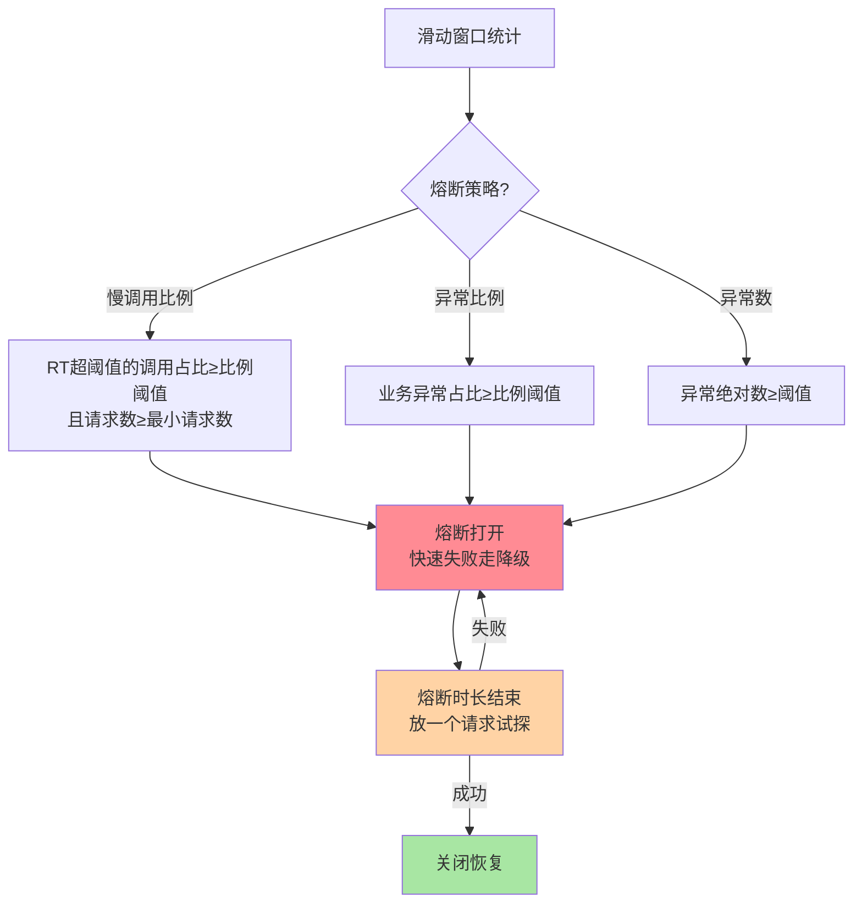
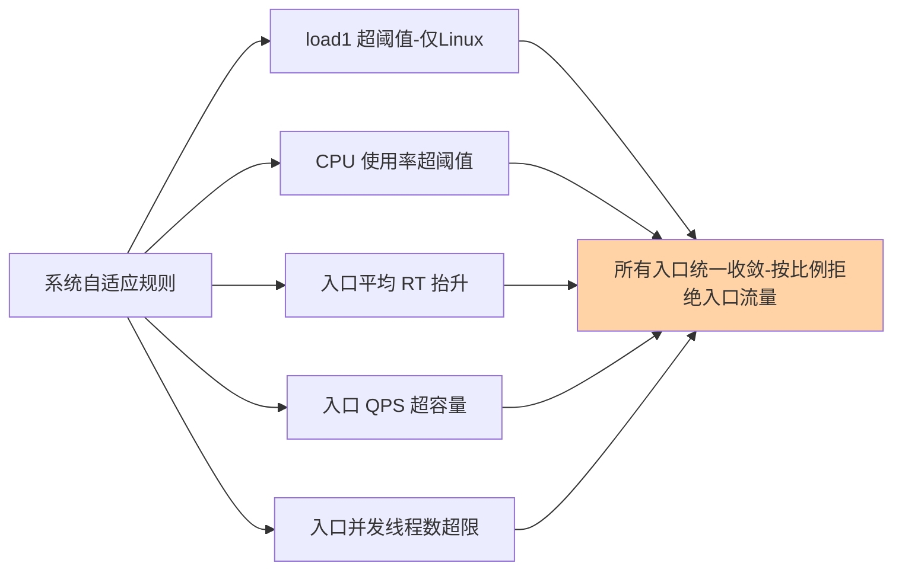

# Sentinel 熔断降级与系统自适应保护：劣化检测与最后防线

> **本文核心**：流控管「流量大」，本篇两套规则管「系统劣化」——**熔断降级规则**（consumer 视角，检测依赖的劣化：慢调用比例/异常比例/异常数三种策略，超阈值熔断跳过调用走降级，恢复窗口后试探关闭）与**系统自适应规则**（整机视角，load/CPU/RT/入口 QPS/线程数五类指标超限，对**所有入口**统一收敛流量，是全局兜底的最后防线）。**机制链**：请求 → 熔断器检查（资源是否处于熔断态）→ 正常则调用并统计（耗时/异常）→ 统计值超策略阈值 → 熔断打开（快速失败）→ 等恢复窗口 → 半开试探 → 成功关闭/失败续熔。

## 一句话摘要

**熔断降级**回答「下游坏了我怎么办」——三种触发策略对应三种劣化形态：**慢调用比例**（对方还活着但变慢，平均 RT 超阈值且比例超阈值才熔断）、**异常比例**（对方开始报错，异常数/总数超比例）、**异常数**（绝对量超限，适合异常基线极低的场景）——熔断后请求快速失败，**熔断时长**结束后进入试探恢复。**系统自适应保护**回答「整机快不行了我怎么办」——不区分资源，按整机指标（load1/CPU 使用率/平均 RT/入口 QPS/并发线程数）对全部入口流量统一收敛，是所有细粒度规则都失效时的兜底网。两者与流控规则构成完整防线：流量大找流控、依赖坏找熔断、整机过载找系统规则。

## 5W 速记卡

| 维度 | 一句话 |
|---|---|
| What | 依赖劣化检测（熔断三策略）+ 整机兜底（系统自适应五指标） |
| Why | 流控防不住「流量不大但依赖坏了/整机劣化」的故障形态 |
| When | 依赖抖动止损、第三方通道防护、大促整机兜底 |
| Where | 判断段的熔断 Slot / 系统 Slot |
| How | 劣化统计超阈值 → 熔断快速失败 → 恢复窗口后试探 → 整机指标兜底收敛 |

## 二、熔断三策略：检测三种劣化形态

**选策略就是选「劣化的检测器」**：慢调用比例适合「对方还活着但处理不动」（数据库慢查询、下游 GC 抖动）——注意 Sentinel 的慢调用判定是**响应时间**口径，统计上比「失败」更早发现劣化；异常比例适合「对方开始大面积报错」（发布事故、依赖服务异常）；异常数适合「异常基线极低的服务」——比如内部 API 正常运行不该有任何异常，1 分钟 10 个异常即异常状态，用比例反而钝化。三策略的共同前置是**最小请求数**：统计窗口内请求数不足时不触发（10 个请求错 5 个在低峰毫无意义）——这个参数是防误熔断的关键，别配太小。

**量级演进视角**：千级 QPS——熔断参数用默认值+按 P99 手调即可；万级 QPS——慢调用 RT 阈值要按依赖分级（核心依赖宽松防误熔断、边缘依赖灵敏快止损），最小请求数随流量上调；十万级 QPS——熔断与路由联动（熔断实例自动摘除流量，见 RPC 篇 10 的演进方向）、全链路熔断预案进大促体系——**熔断从「一条规则」演进为「依赖治理体系」**。

## 三、熔断的三个工程配套

**配套一：降级逻辑必须成对编写**。熔断只是「不调了」，降级才决定「给什么」——BlockException 捕获后返回缓存快照/默认值/简化结果。**熔断无降级 = 用户体验断崖**，两件事是一件事的两半。

**配套二：恢复试探要有节奏**。熔断时长（恢复窗口）决定「止损多久后开始试探」——太短则下游未恢复反复开断（熔断振荡），太长则白白损失可用容量。经验口径：按下游故障的典型恢复时间设定（GC 类抖动 10-30 秒、发布回滚类 5-10 分钟），配合监控的熔断状态告警人工兜底。

**配套三：熔断状态要可观测**。熔断打开/关闭事件、当前熔断中的资源清单必须进监控大盘——「用户反馈接口失败，排查发现是熔断打开、根因是下游慢 SQL」这样的定位链路，前提是熔断状态可见。

## 四、系统自适应保护：整机兜底网

系统规则与前三类规则的本质差异：**前三类按资源精确定点，系统规则对整机无差别收敛**——它回答的是「所有细粒度规则都没想到的过载形态」：比如某条未配规则的边缘接口突然被打爆拖垮整机、或混合部署下邻居进程吃光 CPU。**建议的定位是兜底网而不是常规手段**：正常流量下系统规则永远不该触发，它触发了就说明细粒度规则有缺口或容量规划失准——生产口径是「系统规则触发=告警+复盘」，而不是指望它天天工作。

**系统规则的语义细节**：入口 QPS/入口 RT/线程数三类指标基于**入口资源**（EntryType.IN）的统计——所以埋点时入口注解（`@SentinelResource` 的 entryType 或 Web 拦截器自动埋点）要规范，否则系统规则读不到数据；load 与 CPU 指标直接读操作系统——CPU 维度在容器环境下读的是 cgroup 口径还是宿主机口径，跨版本有差异，容器化部署要实测验证。

## 五、典型场景与误区

**典型场景**：第三方支付通道出口配熔断（对方抖动先止损，避免把己方线程拖死）；推荐类边缘依赖配灵敏熔断（坏了直接降级返回空推荐，主流程无感）；核心依赖配宽松熔断+重降级（熔断阈值高、降级用缓存快照，宁可多等也不轻易断）；大促整机兜底（CPU 80% + 入口 RT 抬升双指标，统一收敛保命）。

**常见误区**：① **核心依赖熔断阈值照抄边缘依赖**——核心依赖被熔断的代价远大于多等几秒，阈值必须更宽松、降级必须更重（缓存快照 vs 空列表）；② **熔断时长配 5 分钟**——下游 30 秒就恢复了，你白丢 4 分半容量；熔断时长与下游恢复特征不匹配是熔断规则最常见的设计缺陷；③ **异常比例策略用在「异常是正常业务分支」的接口**——查询接口把「未找到」抛成业务异常，正常流量下异常比例 30%，熔断规则天天误触发——先修异常语义再上熔断；④ **系统规则当流控用**——给系统规则配个低阈值「防患未然」，结果业务高峰天天触发全站收敛——它是保命网不是限流器；⑤ **只配熔断不监控熔断态**——熔断悄悄打开，恢复悄悄关闭，没人知道依赖曾经劣化——故障复盘时数据全缺失。

## 与 Hystrix 熔断的区别

| 维度 | Sentinel 熔断 | Hystrix 熔断 |
|---|---|---|
| 检测维度 | 慢调用/异常比例/异常数三策略 | 异常比例为主（熔断阈值按错误率） |
| 统计隔离 | 资源级滑动窗口，不建线程池 | 依赖级线程池内统计 |
| 恢复试探 | 熔断时长后单请求探测 | 半开态按比例放行 |

Hystrix 的熔断依附于线程池隔离（先隔离才能谈熔断），Sentinel 把两者解耦——熔断可以独立于隔离使用，配置面更轻。

## 设计思想：劣化检测为什么按「形态」拆策略

三种熔断策略的划分逻辑值得抽象一层：**故障不是一个标量，是有形态的**——「慢而不断」「快失败」「偶发异常」是三种不同的劣化形态，需要不同的检测器。这与可观测领域的 RED/USE 方法论同源：不同故障形态在不同的统计维度上先暴露。**把「检测什么形态」做成可选项，而不是把所有检测揉成一个综合分数**，是 Sentinel 熔断设计与 Resilience4j（基于异常率单维+慢调用扩展）的共同收敛方向——故障形态论是稳定性工程的底层认知。

系统自适应规则则是另一条设计哲学：**承认规则永远配不全**。几百个接口、无数依赖组合，细粒度规则必有遗漏；整机指标是「遗漏部分」的最后防线——它是「不信任配置完备性」的防御性设计，与「系统必须有全局兜底」的通用架构原则（互指 stability 系列的系统保护篇）一脉相承。

## 追问思考

**质疑者视角**：熔断是 consumer 侧的判断——它检测到的「下游劣化」也可能是**自己的问题**：调用方自身 GC 抖动会让所有下游的 RT 统计同时抬升，触发大面积误熔断（明明是自己在抖，却把下游全熔断了）。**单机视角的熔断无法区分「下游劣化」与「自身劣化」**——对策是熔断决策要对照整机指标（系统规则的自适应维度恰好提供了这个参照：入口 RT 普遍抬升+CPU 飙升=自身问题，先查自己）。另一个质疑：半开试探只放一个请求，对「按比例劣化」的下游（部分实例坏）探测效率低——这就是熔断要与服务发现摘除（ outlier 检测）联动的理由：实例级坏点靠摘除，服务级劣化靠熔断，两层语义不同。

**事故视角**：某服务给核心下游（库存服务）配了异常比例熔断 30%，一次库存服务发布引入 bug 但只影响「预售商品」分支（该分支占流量 5%）——异常比例长期在 5% 未达熔断线，而这 5% 的调用在调用方没有 try-catch 隔离，抛出的异常把上游主流程的批处理任务全部中断。复盘：**熔断保护的是「调用方不被拖垮」，但「5% 异常」在比例策略里是钝化的**——对可预期的分支性故障，正确手段是按资源拆分埋点（预售/现货分开埋点分别熔断）或调用方异常隔离，而不是调低全局熔断阈值（会误伤）。

**追问链**：为什么熔断统计在 consumer 而限流统计在 provider？——统计位置跟着「裁决权」走：限流的裁决权在容量拥有方（provider 知道自己扛多少），熔断的裁决权在风险承受方（consumer 知道自己等多久、坏了自己损失什么）——**「谁的代价谁裁决」是分布式防护机制的分工公理**。追问：熔断与超时的先后关系？——超时是「单次失败的止损」，熔断是「多次失败的止损」；超时抛出的异常进熔断统计（慢调用比例正是靠超时占比发现劣化）——两者是单次与统计的关系，配置时超时值决定「慢调用」的判定线，先定超时再定熔断阈值。

## 💡 实战提示

- 💡 熔断与降级是一件事的两半——配熔断必须同步写降级逻辑（缓存快照/默认值），并进故障演练激活
- 💡 熔断时长按下游恢复特征设定（GC 抖动 10-30s、发布回滚 5-10min），配熔断状态告警
- 💡 系统规则是兜底网不是限流器——它触发就该告警复盘，细粒度规则的缺口在哪儿
- 💡 决策口径：流量大找流控、依赖坏找熔断、整机过载找系统规则——先判断故障形态再选规则

## 你们可能会问

**Q1：慢调用比例和异常比例能同时配吗？**
能，同一资源可配多条熔断规则（Sentinel 1.8+ 支持多策略并存），任一触发即熔断。常见组合：慢调用比例（灵敏度主哨兵）+ 异常比例（报错型故障哨兵），各自设最小请求数防误触发。

**Q2：熔断打开期间请求都失败，调用方的重试会不会雪上加霜？**
会——所以熔断打开后必须停止重试（RPC 容错与熔断联动，互指 RPC 篇 9/10），调用方的 failover 逻辑要感知熔断态（BlockException 不重试直接走降级），否则重试流量在熔断期内全部变成降级流量，降级组件的容量要按「全量峰值」评估。

**Q3：系统规则的 load 指标在容器里准吗？**
不一定——load1 读的是宿主机（或共享内核）口径，容器共享宿主机内核时邻居负载会污染你的 load 统计；CPU 使用率在不同版本的 cgroup 感知实现也有差异。容器化部署建议以 CPU 使用率+入口 RT 为主要维度，load 仅作参考，上线前实测验证。

**Q4：熔断规则能自动生成吗？**
阈值可以半自动——按历史 P99/P95 统计推荐初始值（部分治理平台已做），但「哪些依赖该宽松、哪些该灵敏」的分级决策来自业务重要性，无法全自动。自动化生成阈值+人工定分级是当前务实形态。

## 八、自测三问

1. 三种熔断策略各检测什么劣化形态？（答：慢调用比例=活着但变慢；异常比例=大面积报错；异常数=低基线异常服务；先判形态再选策略）
2. 熔断打开后的完整恢复流程？（答：熔断时长内快速失败→窗口结束放试探请求→成功关闭/失败续熔；期间必须停止重试、走降级）
3. 系统自适应规则与流控规则的本质差异？（答：流控按资源定点、系统规则对整机入口无差别收敛——它是兜底网不是常规手段，触发即告警复盘）

## 开放问题

- 自身劣化与下游劣化的判别自动化——熔断决策引入「整机健康度参照」自动区分（我在抖 vs 对方坏了），社区已有讨论无标准实现。
- 熔断与实例摘除（outlier detection）的语义统一——服务级熔断与实例级摘除在 Mesh 时代的分层归一。

## 📎 核心带走

- **核心一句话**：熔断降级 = 按劣化形态（慢/错/异常量）检测依赖健康、超阈值快速失败走降级；系统自适应 = 整机指标超限对全部入口统一收敛的最后兜底
- **机制链**：滑动窗口统计（RT/异常）→ 策略阈值比对（含最小请求数）→ 熔断打开快速失败 → 恢复窗口 → 半开试探 → 关闭/续熔；整机 load/CPU/RT/QPS/线程数兜底收敛
- **失效点/边界**：熔断无降级=断崖；熔断时长与下游恢复不匹配=振荡或白丢容量；自身抖动会误熔断（对照整机指标判别）；异常分支语义要先修再配规则

## 📌 数据与事实声明

- 写于 2026-09-15，对标 Sentinel 1.8.10；三策略/五指标以官方 Wiki 为准（公开口径）
- 免责：具体参数名与默认值以官方文档为准，示例数字为方法论口径

## 📚 参考资料

| 类型 | 标题 | 来源 |
|---|---|---|
| 官方 Wiki | 熔断降级 / 系统自适应保护 | github.com/alibaba/Sentinel/wiki |
| 关联系列 | 本仓库 stability 系列（熔断器机制互指）、RPC 篇 9/10（容错与三件套联动） | docs/architecture/ |
