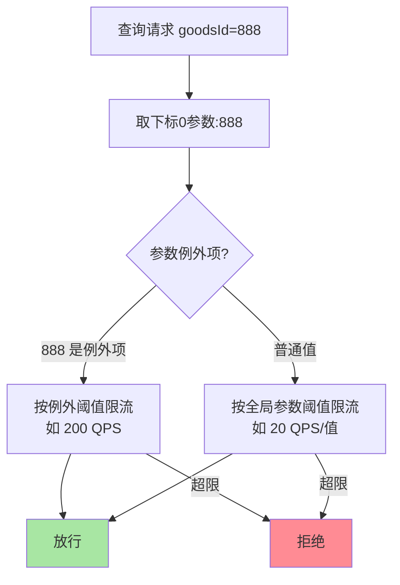
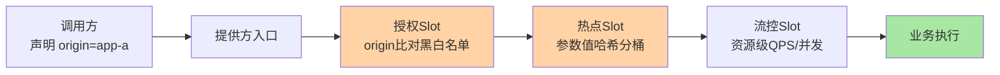

# Sentinel 热点参数与访问控制规则：参数级流控与来源授权

> **本文核心**：常规流控规则按「资源」整体计数，本篇两类规则把粒度再往下拆一层、往外扩一圈——**热点参数规则**按「参数值」分别计数限流：同一个查询资源，爆款商品 ID 单独限 100 QPS、普通商品共享大盘，解决「个别参数值打爆系统」的长尾热点问题；**授权规则（黑白名单）**按「调用来源」决定放行与拒绝，把「哪些调用方配得上我的容量」做成配置。**机制链**：请求 → 取指定下标的参数值 → 按参数值哈希定位计数桶（热点）/ 比对来源名单（授权）→ 超限或黑名单即拒绝。

## 一句话摘要

**热点参数限流** = 「资源内再按参数值分桶」——统计维度从「接口 QPS」细化到「每个参数值的 QPS」，秒杀爆款、热搜内容、恶意爬取的单个 ID 都能被定点掐住而不误伤同接口的普通流量；支持**参数例外项**（特定值单独配阈值）与**多参数组合**。**授权规则** = 「调用来源的准入名单」——白名单（只允许指定来源）、黑名单（拒绝指定来源）两种模式，配合来源统计（框架的 origin 埋点）实现「核心容量只给核心调用方」。两类规则共同把流控语义从「保护自己」推进到「精确分配」。

## 5W 速记卡

| 维度 | 一句话 |
|---|---|
| What | 按参数值分桶限流（热点）+ 按调用来源准入（授权）两类规则 |
| Why | 资源级流控挡不住「个别参数值的热点」与「不该来的调用方」 |
| When | 秒杀爆款、热搜内容、爬虫防护、核心容量分级 |
| Where | 判断段的热点 Slot / 授权 Slot |
| How | 参数值哈希定位计数桶 / 来源比对黑白名单 → 拒绝或放行 |

## 二、热点参数规则：把流控拆到参数值粒度

语义再拆细一层：**全局参数阈值**（每个参数值默认限多少）+ **参数例外项**（指定值单独配阈值）的组合，表达的是「普通值低配、爆款值高配（或反之）」的分级语义——比如商品查询：每个商品 ID 限 20 QPS 防爬虫，但大促主会场商品 ID 配例外 500 QPS 保爆款流量。**为什么必须按值分桶而不是按资源总限**：把整个查询接口限到「爆款不挤爆」的量，普通商品的正常流量也被误杀——热点规则的精确性正是「不误伤大盘」。

**量级演进视角**：千级 QPS——热点规则是保险丝，配了基本不触发；万级 QPS 的内容/电商业务——热搜与爆款成为常态，热点规则的例外项维护进运营流程（大促前批量更新例外项）；十万级 QPS——单机热点规则与集群热点联动（单个爆款 ID 的集群总流量超容量时，单机阈值再准也拦不住「所有实例都打到同一个值」的叠加效应）——**热点粒度越细，单机与集群的配额问题越突出**。

## 三、授权规则：调用来源的准入控制

授权规则的两个要素：**来源（origin）**与**名单模式**。来源由调用方埋点声明（RPC 场景传应用名、网关场景传渠道标识，进调用上下文），提供方在规则里声明白名单或黑名单。典型用法三则：**核心容量分级**（交易核心接口白名单只放订单/支付服务，边缘调用方一律拒绝）、**爬虫与渠道防护**（网关把渠道标识传进来，黑名单拒绝异常渠道）、**变更期隔离**（灰度发布时临时把旧版本调用方拉黑，强制走新链路验证）。

**来源的信任边界要想清楚**：origin 是调用方**自己声明**的——恶意调用方可以伪造来源绕过白名单。所以授权规则的定位是「**治理分级与误操作防护**」（防止边缘服务误配核心资源、方便容量分配），不是安全边界；真正的安全鉴权（身份认证+授权）要靠鉴权体系（互指治理域鉴权篇），两层语义不要混用。

## 四、与流控规则的区别：粒度与维度对照

| 维度 | 流控规则（篇 3） | 热点参数规则 | 授权规则 |
|---|---|---|---|
| 统计粒度 | 资源整体 | 资源内按参数值分桶 | 不统计，按来源比对 |
| 判断维度 | QPS/并发 | 参数值 QPS | 调用来源名单 |
| 典型问题 | 流量总量超载 | 个别值的流量热点 | 不该来的调用方 |
| 拒绝语义 | 超限拒绝 | 该值的桶超限拒绝 | 名单不匹配直接拒绝 |

三者的判断顺序在 Slot 链上有先后（授权先于热点先于流控的具体顺序以官方主流程图为准），语义上互不替代：**流控管总量、热点管长尾、授权管准入**——一个核心接口三类规则并存是生产常态。

### 两类规则在调用链上的位置

Slot 链上的这条检查路径就是三类规则的物理排布——来源在**调用方进程**声明、随协议头跨网络传输（架构上的上下游边界），裁决在**提供方进程**完成；理解「声明与裁决分离在两个进程」，就理解了为什么 origin 口径统一是全链路的纪律而不是单服务的事。

## 五、典型场景与误区

**典型场景**：秒杀商品 ID 热点限流（普通 ID 20 QPS/值、爆款例外 500）；内容热搜保护（热搜词条的查询值临时加例外项或压低全局阈值）；爬虫定向防护（异常参数值的访问模式被热点规则天然掐住）；核心接口调用方白名单（只放交易链路服务，新接入方误调用直接拒绝并告警）。

**常见误区**：① **把热点规则当常规限流用**——按值分桶的统计结构比资源级计数贵（哈希桶+LRU 淘汰），全部接口都上热点规则是浪费；只给「参数值分布长尾且偶发热点」的接口配；② **例外项维护失控**——例外项越加越多（几十个爆款 ID 硬编码在规则里），最后没人说得清哪个值对应哪次大促——例外项要有生命周期（活动结束即清理）与变更记录；③ **热点参数下标配错**——规则里配的是「第 0 个参数」，实际方法签名第一个参数是上下文对象，热点保护悄悄失效——上线前用真实签名自测；④ **拿授权规则做安全**——前述信任边界：伪造 origin 即绕过，安全防线要用真鉴权；⑤ **黑名单一刀切拒绝**——拒绝要有兜底响应与告警联动（大量黑名单命中说明正在被攻击或上游配置错误），静默拒绝会掩盖故障信号。

## 设计思想：统计维度决定治理粒度

热点参数规则的存在揭示了一条通用规律：**治理粒度跟着统计维度走**——资源级统计只能做资源级裁决，参数值分桶统计才可能做「精确到值」的裁决。这条规律往外推：网关按 IP/用户分桶、数据库按行锁分桶、成本系统按租户分桶——**「先决定按什么分桶统计，再谈能做什么治理」是所有精细化治理的起点**。而授权规则则是另一面：并非所有决策都需要统计——来源准入是**规则判定**（名单比对）而非**统计判定**（阈值比较），两类机制的分工对应「有历史规律可循的」与「纯策略性的」两类治理问题。

## 追问思考

**质疑者视角**：热点参数规则的哈希分桶天然要面对**热点键的分布漂移**——今天的爆款 ID 明天换一批，静态的例外项列表永远追不上热点的漂移速度；更尖锐地说，**真正的「未知热点」恰恰是规则里没配的那些**——已知爆款配例外只是止损已知，未知热点靠什么？靠热点自动识别（统计「参数值 QPS 分布的基尼系数」，突刺值自动进重点观察）+ 单机热点规则的全局阈值兜底——Sentinel 的参数级统计提供了识别的数据基础，自动识别与规则联动是演进方向。另一个质疑：按值分桶的内存是有界的（LRU 淘汰冷值），但攻击者可以用随机参数值撑爆桶空间——LRU 的淘汰节奏就是安全参数，随机值攻击场景要压测桶容量。

**事故视角**：某内容平台热榜功能上线后，第一条热搜爆了——热榜词条的查询流量把内容详情接口打高 40 倍，接口整体限流被触发，**全部内容的详情查询一起被拒**——热搜词条和普通词条一起死。复盘后接入热点参数规则：词条 ID 按值分桶，热搜值单独限流走降级（返回缓存快照），普通词条完全不受影响——**「一个值的热点、全体值的连坐」是长尾业务接口最典型的故障放大器**。追问：为什么不在网关层对热搜词限流？——网关看不到「词条 ID」的业务语义（它只是一个 path 参数），按值精准限流必须在理解业务语义的应用层做——**语义在哪一层，治理就在哪一层**。

**追问链**：参数值分桶为什么用 LRU 而不是全量 Map？——参数值的基数可能无穷（每个订单号都是新值），全量存储必然内存爆炸；LRU 以「最近热的最值得统计」的假设把内存压到有界——代价是统计的非稳态（冷值反复进出桶，统计不连续），对「趋势裁决」够用、对「精确配额」不够。追问：多参数组合限流（如 userId+goodsId）怎么实现？——把多个参数值拼接作为分桶键即可，但组合基数是两值基数的笛卡尔积，桶淘汰更快、统计更稀疏——**组合维度越高，统计越稀、结论越不稳**，能用单参数表达就不要上组合。

## 💡 实战提示

- 💡 热点规则只给「参数值分布长尾且偶发热点」的接口配——全接口上热点规则是统计资源浪费
- 💡 例外项要有生命周期管理（活动结束即清理）与变更记录——硬编码爆款 ID 列表会失控
- 💡 授权规则管治理分级不管安全——真鉴权靠身份体系，origin 可伪造
- 💡 决策口径：总量超载用流控、长尾热点用热点参数、准入分级用授权——三类规则语义正交

## 你们可能会问

**Q1：热点规则的参数类型有限制吗？**
基本类型与 String 均可（int/long/double/String 是常用形态），原理是值哈希后分桶；对象参数没有稳定哈希语义（默认 hashCode 可被重写），热点规则应打在基本类型参数上——参数选择本身也是接口设计的一部分。

**Q2：单个热点值的流量超出单机能扛的量怎么办？**
单机热点规则只能保证「这台机器不被单个值打爆」；集群级的单值容量需要集群流控（Token Server 统一计数）或前置层分片（按值哈希到固定实例，容量可算）——单机规则+集群方案配合，见篇 7 生态。

**Q3：授权规则的来源 origin 怎么埋？**
RPC 场景框架自动传应用名（Dubbo 的 attachment/SCA 透传），自研场景在调用上下文显式声明；关键纪律是**全链路声明口径统一**（同一调用方在所有服务里的 origin 一致），否则名单维护成灾难。

**Q4：热点规则和缓存能互相替代吗？**
不能，互补：热点值加缓存（降低回源）解决「读得快」，热点规则（限制回源上限）解决「万一全打过来别死」——大促场景两者同时上，缓存挡 99%，规则兜 1% 的穿透。

## 八、自测三问

1. 热点参数规则与资源级流控的粒度差异？（答：资源整体计数 vs 资源内按参数值哈希分桶——「一个值热点、不连坐大盘」）
2. 授权规则的定位与边界？（答：治理分级与误操作防护；origin 可伪造所以不是安全边界，真鉴权靠身份体系）
3. 参数例外项的治理纪律？（答：生命周期管理+变更记录——无清理的例外项列表是规则失控的起点）

## 开放问题

- 热点自动识别与规则联动——参数值分布突刺的在线检测自动生成/调整热点规则，减少人工例外项维护。
- 多级热点治理（单机值级 → 集群值级 → 前置分片）的统一配置面——值级容量管理跨层一致性是工程难点。

## 📎 核心带走

- **核心一句话**：热点参数 = 参数值分桶的定点流控（防长尾热点连坐）；授权规则 = 调用来源的准入名单（容量分级工具非安全边界）
- **机制链**：取参数下标的值 → 哈希定位计数桶（LRU 有界）→ 桶超限或例外项超限拒绝；来源声明 → 名单比对 → 放行/拒绝
- **失效点/边界**：组合参数统计稀疏；随机值攻击看 LRU 容量；例外项需生命周期管理；origin 可伪造

## 📌 数据与事实声明

- 写于 2026-09-15，对标 Sentinel 1.8.10；热点/授权规则语义以官方 Wiki 为准（公开口径）
- 免责：具体参数下标与配置项以官方文档为准

## 📚 参考资料

| 类型 | 标题 | 来源 |
|---|---|---|
| 官方 Wiki | 热点参数限流 / 授权规则 | github.com/alibaba/Sentinel/wiki |
| 关联系列 | 本仓库 stability 系列（热点治理互指）、治理域鉴权篇（安全边界互指） | docs/architecture/ |
