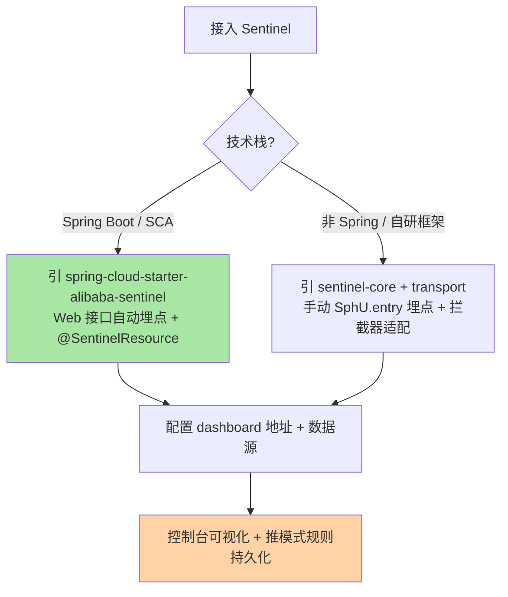
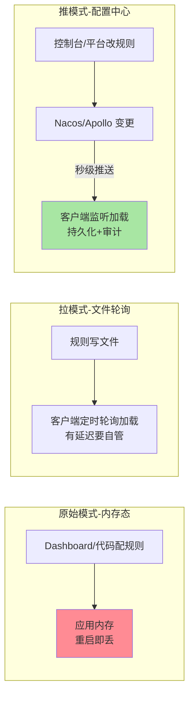

# Sentinel 对外暴露的最后一公里：接入方式、控制台与规则推送

> **本文核心**：前五篇讲的是 Sentinel 的「内功」，本篇讲「怎么用起来」——**两种接入方式**（原生 Spring Boot 依赖：手动埋点+配置拦截器；Spring Cloud Alibaba 整合：Web 请求自动埋点+注解驱动）、**Dashboard 控制台**（规则配置与监控可视化的管理面，本质是「带界面的规则推送器+指标收集器」）、**规则推送三种模式**（原始模式：内存态重启丢；拉模式：客户端轮询配置文件；推模式：配置中心变更即推送——生产必选推模式）。**机制链**：应用引入 transport 依赖 → 注册到 Dashboard → 控制台下发规则（推模式经 Nacos/Apollo）→ 客户端监听加载 → 指标周期上报 → 控制台可视化。

## 一句话摘要

接入 Sentinel 的完整链路是「**进程内引擎 + 进程外管理面**」的组合：引擎（核心依赖）在应用里做裁决，管理面（Dashboard）在进程外管规则看指标——两者通过 transport 通信（心跳注册+指标上报+规则下发）。**规则推送模式是接入方案的灵魂选择**：原始模式规则存内存、重启即丢（只配本地验证）；拉模式轮询有延迟且要自管文件；**推模式（Nacos/Apollo/ZK 数据源）变更秒级生效且持久化**——生产环境的及格线。Web 应用在 SCA 整合下免埋点（拦截器把每个 HTTP 接口自动注册为资源），业务方法用 `@SentinelResource` 注解埋点即可覆盖 90% 场景。

## 5W 速记卡

| 维度 | 一句话 |
|---|---|
| What | 引擎接入（两种方式）+ 管理面（Dashboard）+ 规则推送（三种模式） |
| Why | 防护规则要「随时可改、重启不丢、效果可视」才算工程可用 |
| When | 新服务接入 Sentinel、生产规则治理方案选型 |
| Where | 应用进程内引擎 + 进程外 Dashboard + 配置中心数据源 |
| How | 引依赖 → 埋点 → 接数据源（推模式）→ 上控制台 → 配规则看大盘 |

## 二、接入方式：原生与 SCA 整合

**SCA 整合是 Java 微服务的默认选择**：Web 拦截器自动把每个 URL 注册为资源（免埋点拿到全接口的流控/熔断能力）、`@SentinelResource` 注解覆盖方法级保护、block 处理器统一兜底响应——三件套齐活。**非 Spring 场景**（自研 RPC 框架、网关插件）用 sentinel-core 手动埋点，把 `SphU.entry()` 织进自己的拦截链——埋点的本质就是「在业务执行前后包一层统计与裁决」，框架适配只是把这层包装自动化。

**埋点纪律决定统计质量**：URL 资源自动埋点会把 REST 路径参数（`/order/{id}`）注册成不同资源，导致统计碎片化——统一配置 URL 清洗（收敛成资源名）或自定义资源名映射，是接入后第一件要治理的事（互指篇 2 的资源命名纪律）。

**量级演进视角**：试点期（个位数服务）——原生接入+拉模式即可快速验证价值；推广期（数十服务）——必须切推模式接配置中心，Dashboard 部署高可用，资源命名规范成文；平台期（数百服务）——接入 SDK 化（starter 封装默认配置与埋点规范）、规则治理平台化（批量导出/审计/回滚），Dashboard 从「配置工具」演进为「治理平台的前端」——**接入的形态随治理规模升级，第一步就按平台期规范做，返工成本最低**。

## 三、Dashboard：管理面的能力与边界

Dashboard 的四个核心功能：**实时监控**（资源的 QPS/RT/线程数的秒级曲线）、**规则管理**（流控/熔断/热点/系统规则的可视化配置与下发）、**机器列表**（接入应用的心跳与状态）、**簇点链路**（按调用树展示热点资源，是「该给谁配规则」的发现工具）。**理解 Dashboard 的本质定位**：它是一个「带界面的规则推送器+指标收集器」——进程外的管理面，与应用是松耦合（应用挂了 Dashboard 只丢监控，规则已在应用内存生效；Dashboard 挂了应用照常裁决）——**管理面故障不影响防护能力**，这是它敢在生产铺开的架构前提。

**Dashboard 的三个生产化改造点**：① **自身高可用**——单实例部署的 Dashboard 挂掉后看不到监控，多实例+无状态化（监控数据落时序库）；② **监控数据的留存**——Dashboard 默认内存聚合只留几分钟曲线，趋势分析要接 Prometheus/Grafana 体系（transport 的指标导出）；③ **权限与审计**——开源版无 RBAC，改一条核心规则不需要审批——接公司统一登录与变更流程，否则「规则误改」是新的故障源（互指篇 4 的规则变更安全网）。

## 四、规则推送三模式：生产方案的及格线

**三种模式的演进逻辑是「规则的持久化与触达方式」逐步工程化**：原始模式（规则在内存）只适合本地验证；拉模式（定时轮询文件）把规则落了盘但触达慢、文件管理靠自觉；**推模式把规则放进配置中心**——变更秒级推送、天然持久化、带审计与回滚，生产及格线就是它。实现上是 Sentinel 的「数据源」抽象：`nacos-datasource`/`apollo-datasource` 等适配器把配置中心的变更翻译成规则加载事件——**规则数据源的选型跟着公司配置中心走，不另行引入新组件**（互指治理域 config-center 系列的机制篇）。

**推模式仍有两道坎**：① **控制台改规则不自动写配置中心**——开源 Dashboard 的推模式改造是老坑（默认仍是原始模式写内存），要么用改造版/自研控制台、要么规则从配置中心侧管理（平台改配置中心，控制台只读）；② **规则版本与回滚**——配置中心的变更历史就是规则的变更审计，回滚按钮=配置回滚——治理流程要明确「规则的变更走配置中心流程」，绕过流程的改法（代码里硬编码 loadRules）在 code review 就该拦住。

## 五、典型场景与误区

**典型场景**：新 Spring Boot 服务接入（SCA starter + Nacos 数据源 + Dashboard 注册，半天搞定）；网关插件化接入（gateway 网关流控用 Sentinel 的 gateway adapter，接入层也统一防护体系）；老服务改造（手动埋点织进自研 RPC 拦截链，资源名对齐公司规范）；规则治理平台化（数百服务的规则导出/批量变更/审计接变更系统）。

**常见误区**：① **上生产用原始模式**——重启规则全丢，故障时临时加的限流规则随实例扩缩容蒸发，防护形同虚设；② **Dashboard 部署单点且无鉴权**——一个内网可达的 Dashboard 等于「任何人可改生产限流规则」，权限失控比没有防护更危险；③ **URL 资源不清洗**——`/order/123` `/order/456` 各成一个资源，统计碎片化+规则没法配，第一周就该治理掉；④ **把 Dashboard 当实时告警用**——它的监控是秒级曲线可视化，不是告警系统；告警要接监控体系（阈值告警/熔断状态告警进 IM），Dashboard 是人的眼睛不是值班机器人；⑤ **transport 端口暴露公网**——transport 端口承载规则下发，暴露即规则裸奔，网络边界（安全组/防火墙）要管住。

## 与 Hystrix 接入的区别、接入的量级账

| 维度 | Sentinel 接入 | Hystrix 接入 |
|---|---|---|
| 依赖形态 | 核心包+transport+数据源，组合灵活 | starter 一站式但已停更 |
| 规则管理 | 控制台/配置中心推拉模式可选 | 属性文件为主，动态性弱 |
| 监控 | Dashboard+可外接 Prometheus | hystrix.stream+Turbine 聚合，组件已老 |

接入的量级账也要算：千级 QPS 试点——单机原生接入即可验证；万级 QPS 数十服务——推模式+Dashboard 高可用是及格线；十万级 QPS 数百服务——SDK 化封装与治理平台化，接入成本随规模从「配置工作」变成「平台工程」——**接入方案的选择要看三年后的规模，不是今天的**。

## 设计思想：引擎与管理面分离的松耦合

Sentinel 把「裁决」放在进程内、「管理」放在进程外，两者靠 transport 松耦合——这个架构回答了一个核心矛盾：**防护判断要求微秒级响应（必须进程内），规则治理要求集中管控（必须进程外）**。松耦合的代价是最终一致（规则推送有秒级延迟、心跳有丢失窗口）与双组件运维，收益是故障隔离（管理面挂不影响防护）与演进自由（Dashboard 可替换为公司治理平台）。**「执行面在业务进程内保持薄、管理面在进程外做厚」**——这个拆分思路与 Service Mesh 的数据面/控制面分离同构（互指 servicemesh 系列），理解它就能看懂防护组件的下一代形态。

## 追问思考

**质疑者视角**：「规则推送秒级生效」听起来很美——但**秒级的规则变更速度同时也是事故的传播速度**：一次误操作的全量规则下发，10 秒内覆盖数百实例，回滚也要等一个推送周期。所以推模式的工程完整性必须包含三件套（互指 RPC 篇 8 的路由安全网）：**灰度推送**（规则先推金丝雀实例验证）、**变更审计**（谁在什么时候改了什么）、**一键回滚**（回到上一版本规则）——开源版三件套都不齐，生产化方案必须自己补齐，这也是「开源组件上生产」的典型改造清单。另一个质疑：Dashboard 的簇点链路依赖调用树统计上报，高流量下上报本身有开销与采样损失——簇点链路适合「发现与探索」，不适合当精确账本。

**事故视角**：某团队大促前临时给核心接口加限流规则，通过 Dashboard 直接下发（原始模式），当晚扩容 20 个新实例——新实例没接到这条「内存态」规则，限流只覆盖了老实例；流量高峰新实例被打爆，故障复盘发现「防护规则在扩缩容面前是筛子」。复盘：**所有规则改数必须走推模式（配置中心）**，扩缩容的实例启动即从数据源加载全量规则——这条纪律写进了发布检查单。追问：为什么不要求「扩容后手工同步规则」？——人工同步在慌乱的大促夜必然遗漏，**依赖人的纪律不如依赖机制的默认正确**（新实例自动加载），这是工程与管理的边界。

**追问链**：为什么 Sentinel 的监控上报用「周期拉取」而不是「指标推送」？——transport 的设计里 Dashboard 定期向应用拉取指标（应用侧无需主动外联，减少网络方向与端口暴露），代价是 Dashboard 轮询间隔决定监控粒度——**拉模式换网络简单性**的取舍在监控场景成立，但到平台化规模（数百应用）拉取压力集中到 Dashboard，就演进出「应用推指标到采集网关」的混合形态——没有永恒的拉或推，规模变了权衡就变。

## 💡 实战提示

- 💡 生产及格线：推模式数据源（Nacos/Apollo）+ Dashboard 高可用 + transport 端口网络管控——三缺一都是裸奔
- 💡 URL 资源清洗是接入后第一件治理事——路径参数资源碎片化让规则没法配
- 💡 规则变更走配置中心流程（审计+回滚），代码硬编码 loadRules 在 review 就拦
- 💡 决策口径：Java 微服务默认 SCA 整合、非 Spring 框架手动埋点织拦截链、规则管理一律推模式

## 你们可能会问

**Q1：不用 Dashboard，只用配置中心管规则行吗？**
行——规则数据源是独立抽象，配置中心（或自研平台）直接管理规则内容，应用照样加载生效；Dashboard 提供的是可视化配置与监控的便利。不少团队最终形态就是「自研治理平台管规则 + Prometheus 看指标」，Dashboard 只做补充。

**Q2：SCA 接入的 block 兜底响应怎么统一？**
Web 层实现 `BlockExceptionHandler` 全局兜底（统一返回限流/降级的标准错误码），注解方法用 `blockHandler` 指定兜底方法——两层的兜底都要写，「拒绝之后给什么」不因为接入方式而豁免（互指篇 4 熔断降级配套）。

**Q3：多实例的规则能不一样吗（灰度规则）？**
可以——推模式按实例分组下发不同数据（金丝雀实例订阅灰度配置组），或规则内容里带实例标签条件。灰度规则推送是规则安全网的组成部分，互指篇 8/4 的「规则灰度」。

**Q4：监控接 Prometheus 怎么做？**
两种路径：Dashboard 的指标接口被 Prometheus 抓取（简单但经 Dashboard 中转），或应用侧引 sentinel 的导出适配器直接暴露 `/metrics`（平台化形态）——按监控体系现状选，趋势分析与大促盯盘建议走 Prometheus/Grafana。

## 八、自测三问

1. 三种规则推送模式的差异与生产选择？（答：原始=内存重启丢、拉=轮询文件延迟大、推=配置中心秒级+持久化+审计——生产必选推模式）
2. Dashboard 与应用的耦合关系？（答：transport 松耦合——Dashboard 挂了监控丢失但应用防护照常，管理面故障不影响执行面）
3. Dashboard 生产化要补哪三件事？（答：高可用部署、监控数据外接时序体系、权限审计接变更流程）

## 开放问题

- 治理平台与 Dashboard 的关系演进——自研平台替代开源控制台后，「配置能力」与「监控能力」的平台化边界。
- 规则灰度推送的标准化——按实例分组/按标签订阅的规则下发协议尚无社区标准，各家平台自建。

## 📎 核心带走

- **核心一句话**：接入 = 进程内引擎（SCA 免埋点/手动埋点）+ 进程外管理面（Dashboard）+ 推模式规则数据源——管理面挂不影响防护，规则必须持久化
- **机制链**：引依赖 → 埋点（自动+注解）→ 注册 Dashboard → 数据源监听规则变更 → 秒级加载生效 → 指标上报可视化
- **失效点/边界**：原始模式重启丢规则；URL 资源要清洗；控制台默认不写配置中心（推模式要改造或平台侧管理）；transport 端口必须网络管控

## 📌 数据与事实声明

- 写于 2026-09-15，对标 Sentinel 1.8.10 与 Spring Cloud Alibaba 现行版；接入方式以官方 Wiki 与 SCA 文档为准
- 免责：starter 坐标与配置项以官方文档为准

## 📚 参考资料

| 类型 | 标题 | 来源 |
|---|---|---|
| 官方 Wiki | Sentinel 控制台 / 动态规则数据源 | github.com/alibaba/Sentinel/wiki |
| 官方文档 | Spring Cloud Alibaba Sentinel 模块 | sca.aliyun.com |
| 关联系列 | 本仓库 config-center 系列（推送机制互指）、servicemesh 系列（数据面/控制面同构） | docs/ |
