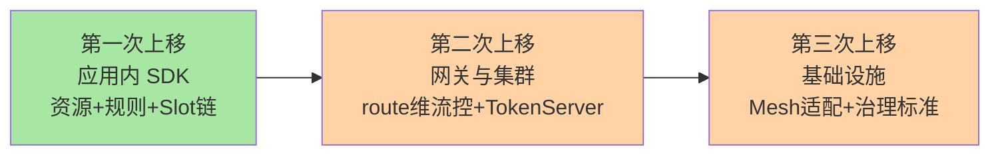
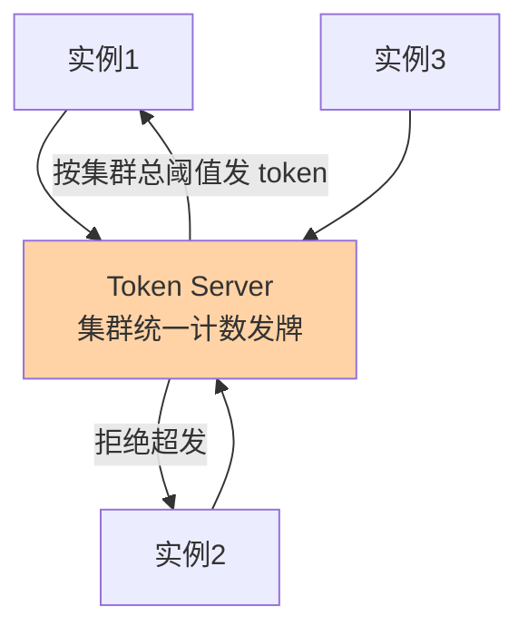

# Sentinel 版本演进与生态：从限流器到云原生防护

> **本文核心**：Sentinel 的演进主线是「**防护语义的抽象层逐级上移**」——1.x 时代把流控/熔断做成进程内的规则引擎（语言 SDK 形态），后续版本把能力延伸到三个方向：**网关流控**（gateway adapter 把防护推到接入层，按 route/自定义 API 维度限流）、**多语言探针**（Go/C++ 探针共用同一套核心语义，Java 不再是唯一一等公民）、**云原生方向**（Service Mesh 接入、OpenSergo 治理标准、K8s 环境适配）。**机制链**：单机规则引擎 → 网关适配 → 多语言探针 → 集群流控（Token Server）→ 治理标准与 Mesh 形态——每一步都是「同一套防护语义在新位置的再落地」。

## 一句话摘要

把 Sentinel 的版本与生态读成一条演进线：**1.8.x 稳定线**（流控/熔断/热点/系统四类规则成熟、集群流控、响应式适配）是今天的生产基座；**网关流控**把维度从「应用内资源」扩到「路由与 API 分组」；**多语言探针**（sentinel-go/sentinel-cpp）让异构技术栈共享防护语义；**云原生方向**（与 Envoy/Istio 的适配、OpenSergo 流量治理标准）试图把「限流规则的表达与下发」标准化成基础设施能力——**组件会老，但「资源+规则+统计裁决」的语义内核持续在新形态里复用**。

## 5W 速记卡

| 维度 | 一句话 |
|---|---|
| What | Sentinel 的版本演进线与生态版图（网关/多语言/云原生） |
| Why | 选型要看组件的生命力与演进方向，不看当前功能清单 |
| When | 技术选型评审、防护体系规划、Mesh 演进评估 |
| Where | 从应用 SDK 到网关、探针、治理标准的生态位 |
| How | 单机引擎为核，向网关/多语言/云原生三个方向延伸 |

## 二、演进主线：防护语义的三次上移

**第一次上移：从工具到引擎**——早期限流多是「一个计数器工具」，Sentinel 把它做成「资源+规则+责任链」的引擎形态，规则可动态下发、统计可成体系，防护第一次有了「治理」的形态。**第二次上移：从应用到集群与边界**——集群流控（Token Server 统一计数）解决单机阈值的配额分摊失真；网关流控把防护推到接入层，按 route/API 分组表达「入口语义」的规则。**第三次上移：从组件到基础设施**——Mesh 形态把裁决挪到 sidecar、OpenSergo 这类标准试图统一「流量治理的表达语言」——组件的能力在下沉，业务对防护语义的诉求始终不变。

**量级演进视角**：千级 QPS——1.8.x 单机规则引擎完全够用，集群流控与网关流控属于「用不上」；万级 QPS 多实例——集群流控开始有价值（配额精确分摊），网关流控统一入口防护；十万级 QPS 或异构多语言技术栈——多语言探针与 Mesh 形态进入评估视野，防护从「Java 组件决策」变成「架构级决策」——**演进方向的判断依据永远是你的量级与技术栈形态，不是组件的 feature 列表**。

## 三、网关流控：边界上的防护语义

网关流控（`sentinel-spring-cloud-gateway-adapter`）把 Sentinel 的规则语义适配到网关场景：按 **route 维度**（某条路由整体限流）与**自定义 API 分组**（把若干 path 打包成一个逻辑 API 限流）两个维度配规则，再叠加**参数限流**（按 header/URL 参数分桶——热点规则在网关的复用）。它与篇 3-5 的应用内规则的关系是**同一套语义在接入层的再表达**：阈值类型/流控效果的语义一致，统计对象从「业务资源」换成「路由与分组」。

**分层的治理语义**值得想清楚：网关层的防护语义是「渠道/租户/路由级」的粗粒度配额（它看不到业务方法），应用层的防护是「资源/参数级」的精细保护——**接入层管总量配额、应用层管资源保护**，两层规则叠加是纵深而不是重复。常见的反例是「网关和应用各配一套互不知情的阈值」——两层阈值没有联动设计（网关总量与后端容量不匹配），防护互相打架。

## 四、集群流控：单机阈值的配额难题

单机流控的数学缺陷在篇 3 已埋下伏笔：负载不均时「单机阈值×实例数≠集群容量」。集群流控的解法是**把计数从实例收拢到 Token Server**——每个实例放行前先向 Server 要 token，集群总阈值全局精确。代价同样明确：Token Server 是新的部署组件（要高可用、要选主、要防自身过载），请求路径多了一跳 RPC（内网毫秒内，但对极致延迟场景是真实成本）。**生产口径**：只对「需要集群精确配额」的少数核心资源开集群流控，其余资源继续单机规则——它是精确配额的专用工具，不是全量标配。

## 五、与同类框架的生态位区别

三框架的当前生态位（互指篇 1 的对比表，此处看生态演进视角）：**Hystrix** 停止演进后成为「历史坐标」——它的线程池隔离思想仍影响后续设计；**Resilience4j** 走「轻量函数式模块」路线——熔断器/限流器/重试是独立模块自由拼装，无中心控制台，适合单体或小规模服务、偏好代码即配置的团队；**Sentinel** 走「组件+控制台+生态」路线——规则中心化、Dashboard、网关适配、多语言探针，适合微服务体系与需要统一治理的组织。**生态位差异的本质**：防护能力是「库」还是「体系」——前者把治理留给业务方，后者把治理做成组织能力。选型即站队：小团队轻依赖选 Resilience4j，平台化组织统一防护选 Sentinel（整合层的选型决策树会展开决策表）。

## 六、典型场景与误区

**典型场景**：微服务体系防护标准化（Java 主力+Sentinel 统一治理，Go 边缘服务用 sentinel-go 对齐语义）；网关入口统一限流（按渠道/租户 route 维度配额，应用层做资源保护）；大促容量体系（集群流控保护核心资源+网关层渠道配额+应用层热点参数，三层联动）；Mesh 演进评估（Java 应用逐步 Mesh 化时，防护从 SDK 向 sidecar 迁移的路径规划）。

**常见误区**：① **追新上非稳定特性**——把 Mesh 适配/最新探针直接上核心链路，稳定线（1.8.x）验证过的能力才是生产基座，新特性进试点；② **全量上集群流控**——Token Server 的部署与运维成本被低估，它解决的是「精确配额」这一特定问题，不是性能升级包；③ **多语言探针当「能力完全对等」看**——Go/C++ 探针的规则语义与 Java 核心对齐，但生态深度（适配器/扩展面）有差距，异构团队的防护能力规划要按探针实际能力分级；④ **Mesh 化=立即卸载 SDK**——SDK 裁决与 sidecar 裁决会长期共存（进程内统计的应用语义 Mesh 覆盖不了），迁移是渐进叠加不是一刀切。

## 设计思想：语义内核与形态外壳的分离

Sentinel 演进线展示了一条值得抽象的规律：**「资源+规则+统计裁决」的语义内核不变，「它跑在哪」的外壳持续更换**——SDK、网关插件、多语言探针、sidecar、治理标准，都是同一语义在不同基础设施位置的再落地。这条规律对选型的启示：**评估防护方案时，先看语义内核的完备性（规则类型/统计精度/裁决性能），再看形态与自己的技术栈匹配度**——形态会随基础设施演进持续变化，语义内核的成熟度才是长期价值。这也是「学机制不学工具」在防护领域的具体化：本系列前五篇讲的规则语义，在 Sentinel 换任何形态后依然成立。

## 追问思考

**质疑者视角**：「多语言探针共享防护语义」是个美好的目标，但**统计口径的跨语言一致性是硬问题**——不同语言的运行时（线程模型/GC/协程）让「并发线程数」「慢调用」这些指标的定义天然有歧义：Go 的 goroutine 并发与 Java 的线程并发在数值上不可直接比较。跨语言团队的集群流控若把不同语言实例混在同一配额池，阈值语义必须重新校准——「语义统一」的工程含义是「每个语言探针独立校准到等价语义」，而不是「同一个数字到处用」。另一个质疑：治理标准（OpenSergo 类）的落地速度取决于生态多方的投入，标准先行而实现滞后时，团队可能陷入「按标准设计的规则没有可用实现」的空转——跟进标准但用稳定实现做生产基座。

**事故视角**：某平台团队引入集群流控保护秒杀资源，Token Server 与秒杀应用部署在同一批节点——大促开始，Token Server 被同机的业务流量挤占 CPU，响应变慢，各实例要 token 的等待时间计入请求路径，全链路 RT 上涨 30ms，秒杀接口 P99 飙升。复盘：Token Server 必须独立部署+自身过载保护（它拒绝发牌比它变慢好——变慢把延迟传染给所有实例）。追问：为什么不在设计时想到？——「防护组件自身也需要容量规划」在直觉上被跳过了：防护组件平时零负载、大促才满载，恰恰在业务最需要它的时刻它自己也到了瓶颈——**防护组件的容量评估要按「最需要它的时刻」做**。

**追问链**：为什么 Mesh 时代的进程内防护没有消失？——Sidecar 能接管网络层的流控/熔断，但**进程内的语义它够不着**：业务方法级的资源埋点、参数级热点、基于业务语义的降级逻辑，都需要在业务进程内知道「这段代码是什么业务」——sidecar 只见流量不见语义。所以 Mesh 形态下防护是两层：基础设施层管网络语义（连接/路由/粗粒度限流），应用层管业务语义（资源/参数/降级）——**「语义边界决定组件边界」在本系列反复出现，这是最后一次**。

## 💡 实战提示

- 💡 生产基座选稳定线（1.8.x）验证过的能力，新特性（Mesh 适配/新探针）进试点不进核心链路
- 💡 集群流控只给需要集群精确配额的核心资源开——Token Server 独立部署+自身过载保护，大促前专项压测
- 💡 网关层配渠道/租户配额、应用层配资源保护——两层阈值要有联动设计，不要各配各的
- 💡 决策口径：小团队轻依赖选 Resilience4j、平台化统一治理选 Sentinel、异构技术栈按探针能力分级规划

## 你们可能会问

**Q1：Sentinel 1.8.x 还在活跃维护吗？后续大版本怎么看？**
1.8.x 是长期维护的稳定线（补丁与安全修复持续）；方向性演进（Mesh/OpenSergo/新探针）在社区分支与配套项目推进——生产按「稳定线上跑、演进线跟进」双轨制，重大升级前看社区 release notes 与兼容性公告（以官方仓库为准）。

**Q2：Go 团队想对齐 Java 的防护体系，怎么起步？**
sentinel-go 提供与 Java 对齐的核心语义（流控/熔断/热点/自适应），起步路径：先对齐「资源命名与规则模型」（治理口径统一），再接同一套配置中心数据源，最后监控并入统一大盘——语义对齐优先于工具对齐。

**Q3：公司要上 Istio，Sentinel 还要留着吗？**
短中期留着——Mesh 接管网络语义的粗粒度防护，进程内的资源/参数/降级语义 Sidecar 覆盖不了；长期看两层会重新划界，但「业务语义的防护在应用内」这个判断短期内不会反转。迁移路径做渐进叠加：Mesh 上粗粒度，应用内保留细粒度。

**Q4：评估「要不要跟 OpenSergo 这类治理标准」？**
跟标准的价值是「规则表达的可移植性」（换组件不重写规则），成本是标准实现成熟度的风险。务实姿势：规则管理平台把「标准格式」作为导出能力之一，生产执行仍用当前稳定组件——可移植性做成能力，不做赌注。

## 八、自测三问

1. Sentinel 演进的三次上移是什么？（答：应用内 SDK 引擎 → 网关与集群流控 → 基础设施化（Mesh/标准）——语义内核不变、位置上移）
2. 集群流控解决什么、代价是什么？（答：解决单机阈值×实例数≠集群容量的配额失真；代价是 Token Server 部署+一跳 RPC——只给核心资源开）
3. 为什么 Mesh 时代进程内防护不会消失？（答：Sidecar 只见流量不见业务语义——资源级/参数级/降级语义必须留在进程内）

## 开放问题

- 跨语言统计口径的等价性标准——不同运行时的并发/延迟指标如何定义「等价语义」，社区尚无权威规范。
- 治理标准与组件实现的落地时差——标准先行期的务实路线（标准作为导出格式而非执行依赖）能否沉淀为行业共识。

## 📎 核心带走

- **核心一句话**：Sentinel 的演进 = 「资源+规则+统计裁决」语义内核在 SDK/网关/集群/多语言/Mesh 各形态的再落地——选型看内核成熟度与形态匹配度
- **机制链**：单机规则引擎 → 网关流控（route/API 分组）→ 集群流控（Token Server 精确配额）→ 多语言探针 → Mesh 与治理标准
- **失效点/边界**：稳定线才是生产基座；集群流控是精确配额专用工具非标配；多语言探针语义需独立校准；Mesh 化不卸载进程内防护

## 📌 数据与事实声明

- 写于 2026-09-15，对标 Sentinel 1.8.10（2026-05-21 release，gh CLI 实测口径）；生态演进描述以官方仓库与社区公开信息为准
- 免责：版本路线与生态项目状态以官方文档为准，本文不预测未发布特性

## 📚 参考资料

| 类型 | 标题 | 来源 |
|---|---|---|
| 官方仓库 | alibaba/Sentinel Releases | github.com/alibaba/Sentinel/releases |
| 生态项目 | Sentinel Go / Sentinel C++ / 网关适配器 | github.com/alibaba 各子仓库 |
| 关联系列 | 本仓库 servicemesh 系列（Mesh 形态互指）、stability 系列（机制域互指） | docs/ |
