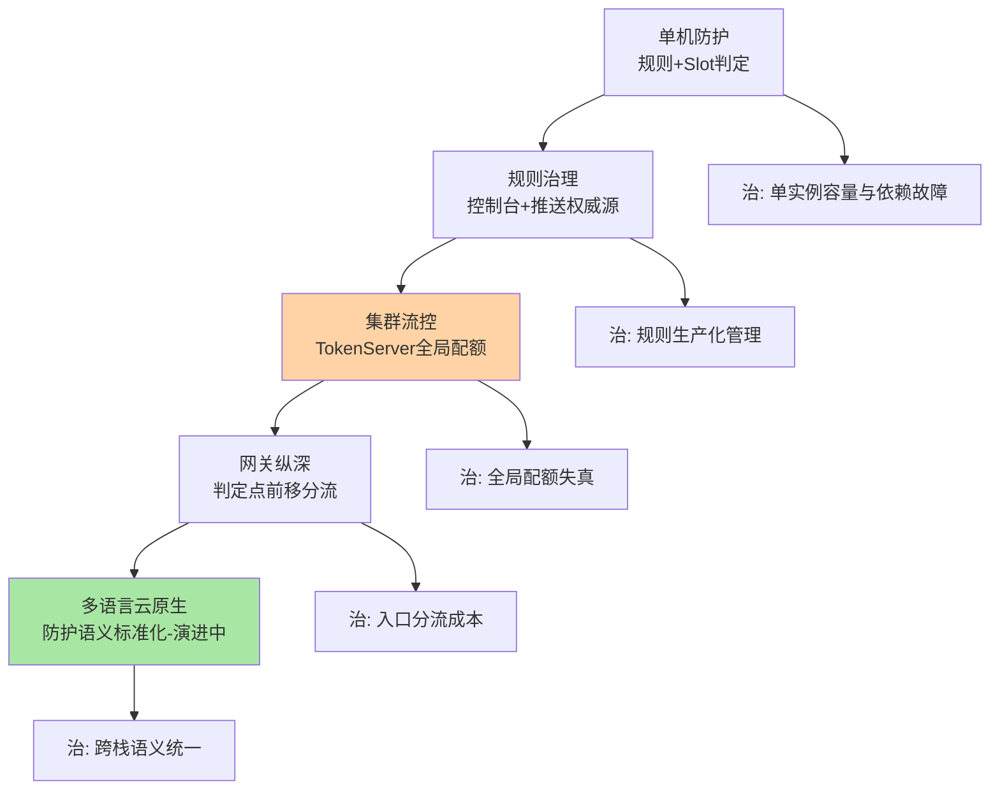
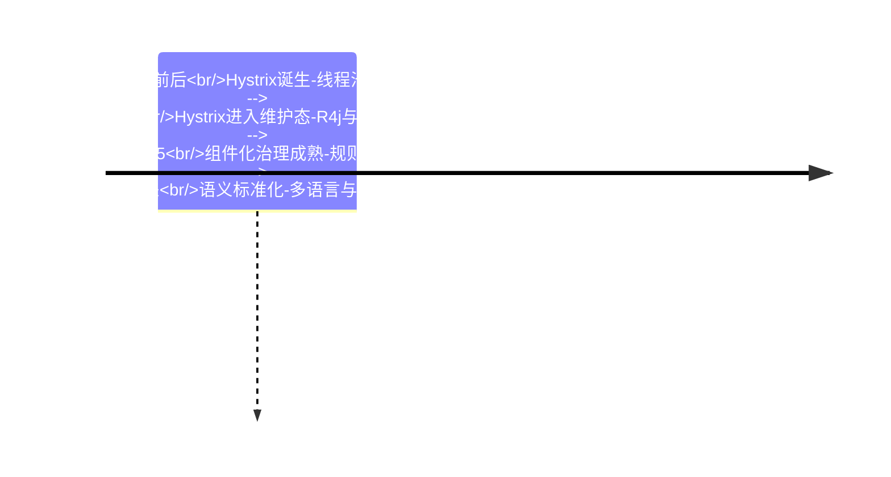
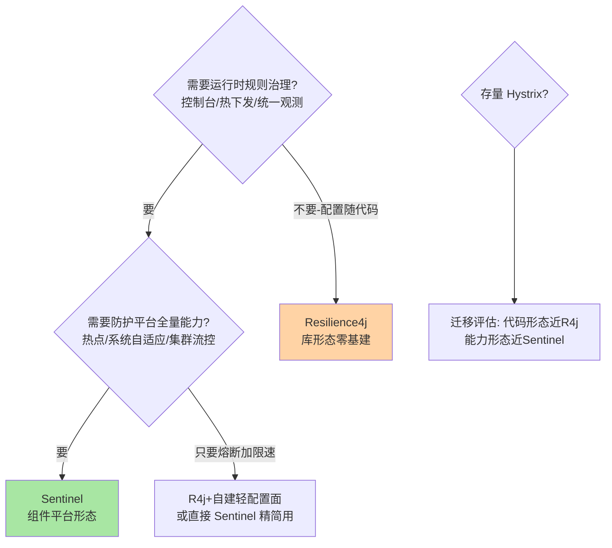
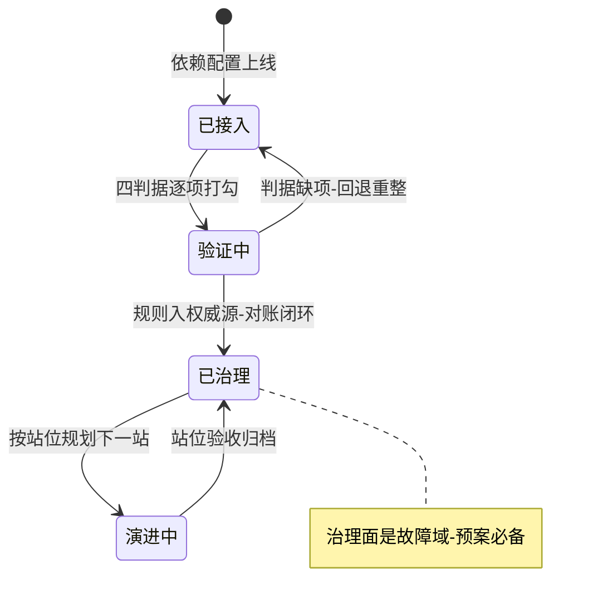
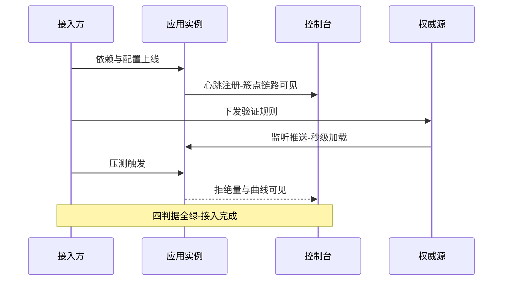

# 高可用防护全景深读：单机到集群的演进与三框架选型决策树

> **本文核心**：把 Sentinel 的全部能力放回一条演进主线上看，每个能力都有明确的「出现时机」与「解决的问题形态」：**单机防护**（规则加 Slot 判定，解决单实例的容量与依赖故障）→ **规则治理**（控制台与推送链路，解决规则的生产化管理）→ **集群流控**（Token Server 上收全局配额，解决多实例加总失真）→ **网关纵深**（判定点前移，解决入口分流）→ **多语言与云原生**（标准化防护语义，解决技术栈统一）。这条主线同时是选型的坐标系：**Hystrix（维护态的上一代）、Resilience4j（代码库形态）、Sentinel（组件平台形态）**三框架的差异不在算法清单，而在「防护能力长在代码里还是长在平台上」——选型先答「治理面要不要建」，再答「用谁的算法」。**机制链**：需求判定（治理面/能力清单/技术栈）→ 决策树三分叉 → 形态匹配（平台态 vs 库态）→ 参数级接入 → 验证与回退路径 → 跨周期演进预案。

## 一句话摘要

本篇做两件事：一是把前四层的机制收束成「单机到集群」的演进全景（每个能力解决什么形态的问题、代价是什么），二是给三框架选型一棵可执行的决策树加一份参数级接入清单——**读完应当能独立完成一次防护体系的技术选型评审，并把结论落成可验证的接入方案**。

## 前置阅读

- 特性层三系列（统计结构 / 熔断状态机 / 责任链扩展面——本文结论的机制底座）
- 专题层两专题（规则推送与大促预案——本文治理面的工程细节）
- 入门层篇 1（三框架的定位直觉——本文是其展开版）
- 本仓库 RPC 域限流熔断篇与稳定性工程系列（机制定义正源）

## 目标导向

本文是什么：Sentinel 高可用防护全景与三框架选型的整合层收束。功能：演进主线叙事、选型决策树、参数级接入清单、验证与回退路径、跨周期演进判断。收益：选型评审的完整判断力、接入方案的可执行性、技术栈演进的前瞻视野。必看场景：新服务防护选型、Hystrix 遗留迁移、防护体系平台化立项。

## 5W 速记卡

| 维度 | 一句话 |
|---|---|
| What | 防护能力演进全景 + 三框架选型决策树 + 接入清单 |
| Why | 单点机制学完后，需要「组合成体系、按形态选型」的收束 |
| When | 技术选型评审、平台化立项、遗留框架迁移 |
| Where | 单机判定到集群治理的完整栈 |
| How | 演进定位 → 决策树分叉 → 参数接入 → 验证回退 → 跨周期预案 |

## 一、演进全景：每个能力都是对一种故障形态的回应

防护能力的演进不是功能堆叠，而是**问题形态倒逼的能力出现**。第一站是单机防护：给资源配流控熔断规则，进程内 Slot 链判定（机制见特性层三系列）——它解决「这个实例打不住」的问题，但规则活在内存里。第二站是规则治理：控制台加推送链路让规则有权威源、可回滚、可审计（机制见专题层规则持久化篇）——它解决「防护体系能进生产」的问题，但判定仍是各实例为政。第三站是集群流控：Token Server 上收全局配额、本地判定兜底——它解决「多实例加总失真与流量倾斜误杀」。第四站是网关纵深：判定点前移到流量入口，按路由与参数属性分流——它解决「便宜地拦住不该进来的流量」。第五站正在演进中：多语言探针与防护语义标准化（社区沿 OpenSergo 等方向探索，概念级）——它试图解决「跨技术栈的防护语义统一」。



读这张图的方法是**对着自己的体系问「每站解决了吗」**：还在第一站的团队，重点是规则推送落地（不解决，防护进不了生产）；卡在第二站的团队，重点是核心接口的集群流控与预案工程（不解决，大促容量对不齐账）。**演进站位的诊断，比「我们用了 Sentinel 没有」深刻一个量级**。

## 二、三框架横向对比：形态差异先于算法差异

| 维度 | Sentinel | Resilience4j | Hystrix（维护态） |
|---|---|---|---|
| 形态 | 组件平台（库+控制台+规则体系） | 代码库（装饰器+函数式） | 代码库（命令模式，已停止演进） |
| 隔离模型 | 并发线程数流控（信号量式，弱隔离） | Bulkhead（信号量/线程池可选） | 线程池隔离为主（强隔离） |
| 流控丰富度 | QPS/并发/热点/关联/链路+三种整形 | RateLimiter 基础限速 | 无独立限流 |
| 熔断 | 三态机+三种策略+规则热下发 | 三态机+次数窗口+装饰器 | 三态机+健康统计 |
| 系统与集群 | 系统自适应+集群流控 Token Server | 无内建 | 无内建 |
| 治理面 | 控制台+动态规则推送+观测 | 无（需自建配置面） | Dashboard 已停演进 |

对比表的正确读法是**先看形态行再看能力行**：形态决定了「能力的运营方式」——Sentinel 的每一项能力都自带治理面（规则热下发、控制台观测、集群协同），Resilience4j 的每一项能力都长在代码里（配置随版本发布、观测靠自建）。**Hystrix 的线程池强隔离是它至今被怀念的原因**（依赖故障被物理隔离在线程池里），它的落幕原因是维护态下的生态冻结（2018 年官方宣布进入维护模式，公开事实），不是设计错误——理解这一点，迁移时才知道该保留什么心态。

### 与 Hystrix 的区别：隔离哲学与治理哲学的两代答案

| 维度 | Hystrix | Sentinel |
|---|---|---|
| 隔离代价 | 线程池切换开销换强隔离 | 轻量计数换弱隔离（靠熔断限流补） |
| 规则运营 | 配置随代码-静态为主 | 控制台热下发-运行时治理 |
| 能力扩展 | 命令对象封装 | Slot 链 SPI 插拔 |
| 生态现状 | 维护态 | 活跃迭代（1.8.10） |

两代的深层差异是**隔离哲学**：Hystrix 相信「故障要用资源边界物理隔开」（线程池切换的成本买故障的爆炸半径收敛），Sentinel 相信「故障要用判定体系逻辑隔开」（轻量统计加熔断限流规则，代价是依赖故障的隔离粒度更细但非物理）。工程上的推论：用 Sentinel 替代 Hystrix 时，**并发线程数流控不等于线程池隔离**——原 Hystrix 隔离点上要不要补线程池或舱壁，要按依赖的故障形态单独评估，这是迁移方案里最容易漏的一项。三框架在时间轴上的位置，把「为什么会有三种形态」讲得更清楚：



## 三、选型决策树：三分叉与两个反模式



决策树的三个反模式同样重要。**反模式一：用框架名气选型**——「大厂都在用」不是论据，治理面要不要建是成本决策不是声誉决策；十万级 QPS 以内的小团队上全套平台，运维账大概率是负的。**反模式二：混合栈强行统一实现**——两条链路两套熔断裁判会互锁（互指特性层熔断篇 2 的混用误区），统一观测口径比统一实现更务实。**反模式三：把选型当成一次性决策**——框架选型有半衰期，接入方案要预留退出路径（抽象层隔离直接依赖），跨周期视角（5 年）看，防护语义的标准化是确定性方向，实现会换，语义投资（规则评审制度、水位对账纪律）不会白费。

## 四、参数级接入清单与步骤（照做能跑）

以 Spring Boot / Spring Cloud Alibaba 环境接入 Sentinel 为例，参数清单如下（名称/默认值/推荐值/为什么）：

| 参数名 | 默认值 | 分档推荐 | 为什么 |
|---|---|---|---|
| spring.cloud.sentinel.transport.dashboard | 无 | 必填控制台地址 | 无控制台则治理面缺失，规则只能代码写死 |
| transport.port（客户端通信口） | 8719 | 保持默认 | 控制台与客户端通信口，冲突自动顺延要知晓 |
| spring.cloud.sentinel.eager | false | 生产 true | 默认懒初始化：首个请求才建立链路，冷启动判定有盲区 |
| spring.cloud.sentinel.filter.enabled | true | Web 应用保持 true | Web 入口自动建资源；纯内部服务按需关闭减链路 |
| 数据源配置（datasource.*） | 无 | 生产必配 | 规则权威源（互指专题层规则持久化篇的参数清单） |
| coldFactor（预热冷因子） | 3 | 默认或按爬坡需求 | 冷态阈值约稳态三分之一，互指特性层流控篇 2 |

接入步骤六步（前置条件：JDK 版本满足依赖要求、控制台已部署且网络可达）：

```text
第一步 引依赖：SCA 环境引 spring-cloud-starter-alibaba-sentinel；纯 Boot 引 sentinel-core 与适配器
第二步 配置：写 transport 地址与 eager=true，生产环境配数据源指向权威源
第三步 验证连通：启动应用-控制台「簇点链路」应出现资源（预期输出：资源名与 QPS 曲线）
第四步 配规则：控制台或权威源下发一条流控规则（QPS 阈值设低便于验证）
第五步 验证判定：压测到阈值（预期输出：超限请求返回限流响应/抛 BlockException，曲线出现拒绝）
第六步 回退路径：规则回滚走权威源版本回退；组件级回退是关 filter/移除依赖（前置条件：无业务依赖自定义 Slot）
```

**报错与踩坑速查**：控制台看不到应用（transport 地址不通或端口被防火墙拦，看客户端启动日志的心跳报错）；8719 被占用（自动顺延端口，但控制台可能连旧口——固定端口更稳）；首个请求超时（eager=false 的懒初始化代价，生产务必 true）；Web 接口返回「Blocked by Sentinel」（这是限流判定已生效的默认响应，按需自定义返回体）；自定义 Slot 静默缺席（SPI 服务文件没打进包，互指特性层扩展机制篇的事故二）。

接入项目自身的推进也是一个状态机——每个状态有明确的进入条件与退出判据，卡在哪个状态一眼可辨：



## 五、验证闭环：接入完成的判据

接入不是「能启动」，验证闭环有四个判据：**资源可见**（簇点链路出现预期资源）、**判定生效**（规则触发后拒绝可观测）、**规则可控**（权威源变更秒级生效、回滚可用）、**观测成环**（曲线、日志、告警三方能对上同一份数据）。四个判据写成验收清单逐项打勾，缺一项都算接入未完成——**接入方案的可验证性本身就是设计质量的一部分**。



## 六、不同量级的思考：全景随规模的换挡

- **十万级（峰值 QPS 十万以内、服务数十）**：约束来源是运维人手与基建预算——这一档的核心问题是「防护别比业务还重」，而不是「能力全开」。库形态（Resilience4j）或 Sentinel 精简用（本地规则+基础流控熔断）起步，控制台可以后置，思考方式是成本驱动：防护体系的每一分复杂度都要有对应的故障损失预期托底。自下而上收尾：这一档的默认答案是「轻」；向上触发升级的条件是服务数与规则量——手工维护规则的成本曲线先爆炸。
- **百万级（峰值百万 QPS、服务数百、多团队共用）**：约束来源是规则治理的规模化——这一档的核心问题是「治理面建设」，而不是「选哪个算法」。Sentinel 平台形态的收益兑现期：控制台+权威源推送+集群流控+预案工程整套落地（互指专题层两专题），思考方式是架构驱动：防护从「每个服务的依赖项」升级为「组织的公共基础设施」，需要专职治理与 SLA。向上触发升级的条件是多机房多活与跨技术栈——语义统一成为新命题。
- **亿级（入口日请求亿级、峰值千万 QPS 量级）**：约束来源是防护基础设施自身的可生存与可演进——这一档的核心问题是「防护体系与架构共生演进」，而不是「堆更多能力」。思考方式是标准驱动：防护语义下沉网关与 Mesh 层探针、跨语言规则契约标准化（社区方向，概念级）、防护数据进入组织级稳定性度量（未来 5 年的确定性投入方向）。自下而上收尾：每一档的判定内核（滑动窗口加状态机）从未改变——**演进的是防护的位置与治理，不是防护的数学**。

## 七、典型场景与误区

**典型场景**：新微服务从零接入（决策树三分叉，十万级从轻起步）；遗留 Hystrix 迁移（按调用链分批：先行为对齐压测、后治理面切换，互指本篇第四节的隔离语义评估）；混合技术栈治理（主形态统一、观测口径统一、局部保留）；平台化立项（演进站位诊断——确定当前卡在哪一站、投资下一站）。

**常见误区**：① **「上了组件就等于有了防护」**——没有权威源规则与验收闭环的接入是装饰品，四判据不全不算完成；② **迁移时把线程数流控当线程池隔离**——隔离语义退化为逻辑限制，重依赖的故障爆炸半径反而扩大，原隔离点要单独补强；③ **选型论证只比功能清单**——形态与治理面的成本差异远大于功能差异，功能清单是必要条件不是充分条件；④ **预留退出路径被省略**——直接依赖框架类型散落业务代码，五年后想换实现时就是一次全量重构；语义投资（规则制度、对账纪律）与实现绑定要松。

## 八、事故与实践叙事

**事故一：迁移后的「假隔离」放大故障**。某团队从 Hystrix 迁到 Sentinel，把每个原线程池隔离点简单映射成并发线程数流控规则。一次下游存储故障，原来会被线程池排队缓冲住的慢依赖，现在直接占满业务线程——故障表现从「单依赖超时」恶化为「全接口挂起」，比迁移前更严重。复盘重建迁移方法论：每个原隔离点按依赖故障形态分类（慢依赖补线程池或舱壁、错误型依赖直接映射流控熔断），分类结论进迁移评审。**教训**：隔离是语义不是配置项——映射式迁移漏掉的正是语义本身。

**事故二：控制台单点引发的规则迷航**。某平台控制台单实例部署且未接权威源（原始模式尾巴），一次控制台故障期间多个应用重启，规则全丢且无处查看——值班只能凭记忆重配，恢复花了数小时。改造：权威源化（控制台故障不影响实例已有规则）、控制台多实例、规则变更全部走权威源（互指专题层规则持久化篇）。**教训**：治理面自身也是故障域——「控制台挂了会怎样」是接入方案必答题，答不出就是设计缺口。

**事故三：退出路径缺失的五年之痒**。某系统五年前深度绑定某框架的注解与类型，业务代码散布框架专用注解；框架进入维护态后想换实现，评估变成一次横跨全部服务的改造工程，最终不了了之。对照组：同团队另一条产品线在接入层做了薄抽象（防护语义接口隔离实现），两年内完成实现替换。**教训**：框架半衰期真实存在——语义抽象层的成本要在接入期就付，跨周期视角不是远虑是近忧。

**实践叙事：演进站位诊断驱动平台立项**。某组织用本篇第一节的五站图给自己做了诊断：绝大多数服务停在第二站（有推送无集群判定），少数核心链路有临时性的全局配额脚本。平台立项因此不写「引入新框架」，而写「把核心链路推到第三站、把网关纵深试点到第四站」——立项范围、验收标准、预算全部按站位差推导，评审一次通过。**演进图最大的价值是把「要做什么」变成「从哪到哪」**。

## 九、设计思想：防护能力的「位置」哲学

回看全景，Sentinel 体系的演进方向呈现一条清晰的设计哲学：**防护能力的价值取决于它站在流量的哪个位置**——进程内判定（单机）→ 进程外治理（权威源）→ 跨进程协同（Token Server）→ 入口前移（网关）→ 语义下沉（标准化）。位置越靠前，拦截面越广、单次成本越低、语义越粗；位置越靠内，语义越细、成本越高、越精确。**体系设计的功夫在于按故障形态分配位置，而不是把所有能力堆在一处**。这条哲学与「纵深防御」的军事同源思想一致，也解释了为什么防护体系永远做不完——位置谱系的尽头是架构本身，防护做的最好的样子，是业务架构里根本不需要「防护」这个独立词汇。

## 十、追问链

**质疑者第一层：为什么不把三框架做成一个统一抽象（像 JDBC 之于数据库）？**——有人在做（Spring Cloud CircuitBreaker 等抽象层），但抽象层只能统一「熔断」这类语义交集，统一不了治理面与生态差异：Sentinel 的价值一半在控制台与规则体系，这部分抽象无解。**抽象层的正确定位是「退出路径的保险」而不是「统一的能力面」**——用它隔离核心语义，别指望它抹平形态。

**质疑者第二层：演进主线会不会有终点（标准化的防护语义内建于基础设施）？**——Mesh 与 Serverless 方向确实在把部分防护能力下沉为基础设施（概念级趋势），但「业务语义的防护」（热点商品、租户配额、大促预案）永远需要应用层表达——基础设施能带走通用防护，带不走业务防护。**判断哪些能力会被下沉，就是判断哪些投资有跨周期价值**。

**质疑者第三层：小团队按「轻起步」走，会不会在规模上来时被锁死在轻方案里？**——会的风险真实存在，对冲手段是接入期的两件事：核心链路做语义抽象（退出保险）、规则制度按平台形态预演（制度先于工具）。规模拐点到来时补工具容易，补制度难——**轻的是工具，别轻的是纪律**。

## 十一、你们可能会问

**Q1：已有 Hystrix，迁移的优先级排序怎么定？**
按「框架风险 x 迁移收益」排：核心链路优先（维护态框架的故障排查成本在核心链路上最高）、行为对齐压测前置、隔离语义单独评估（本篇事故一）。整体节奏按调用链分批，不做大爆炸切换。

**Q2：Sentinel 与网关层限流（如网关自带能力）怎么分工？**
网关层管「该不该进来」（粗粒度、入口策略），Sentinel 管「进来后怎么保护」（细粒度、业务语义）；两边都用时注意阈值对账，避免网关放行量大于应用防护量的错配。

**Q3：多语言服务怎么纳入统一防护？**
Sentinel 有多语言探针生态（Go/C++ 等社区版本，能力子集以各官方仓库为准）；统一路径是规则契约与观测口径统一，实现允许异构——与混合栈治理同一纪律。

**Q4：接入后第一步应该建什么能力？**
按演进站位答：第一站的建推送链路（权威源），第二站的建集群判定与预案，永远不要跳过验证闭环直接堆能力——四判据是每个能力复用的验收模板。

## 💡 实战提示

- 💡 选型先答治理面（要不要控制台与规则体系），再比功能清单——形态差异比算法差异大一档
- 💡 迁移 Hystrix：并发线程数流控不等于线程池隔离，原隔离点按依赖故障形态分类补强
- 💡 决策口径：十万级轻起步（库形态或精简用）、百万级建治理面（平台形态）、亿级投语义标准化——按规模与组织形态选，预留退出路径
- 💡 选型推荐：接入方案必须含四判据验收（资源可见/判定生效/规则可控/观测成环）与回退路径，缺一项不算完成

## 十二、自测三问

1. 演进五站各解决什么问题形态？（答：单机判定→实例防护；规则治理→生产化管理；集群流控→全局配额失真；网关纵深→入口分流成本；语义标准化→跨栈统一——站位诊断驱动投资）
2. 三框架选型的第一分叉问什么？（答：需要运行时规则治理吗——要则平台形态（Sentinel），不要则库形态（Resilience4j），Hystrix 走迁移评估）
3. 接入完成的四判据是什么？（答：资源可见、判定生效、规则可控、观测成环——验收清单逐项打勾，缺一不算完成）

## 十三、开放问题

- 防护语义的跨语言标准化（规则契约、判定语义、观测口径）处于社区探索期，标准落点未定。
- 防护能力向 Mesh/Serverless 基础设施下沉的边界（哪些能力会被带走、哪些永留应用层）随架构形态演进，判断需要每两年重估。

## 📎 核心带走

- **核心一句话**：防护体系 = 按演进站位投资（单机→治理→集群→网关→标准化）+ 按形态选型（平台态 Sentinel / 库态 Resilience4j / 迁移态 Hystrix）——机制是数学，位置与治理才是架构
- **机制链**：演进站位诊断 → 决策树三分叉 → 隔离语义评估（迁移）→ 参数级接入与四判据验收 → 回退路径预留 → 跨周期语义投资
- **失效点/边界**：逻辑限流不是物理隔离（迁移第一大坑）；治理面自身是故障域（控制台挂了要能答）；框架有半衰期（抽象层保险要接入期买）；基础设施下沉只能带走通用防护、带不走业务防护

## 📌 数据与事实声明

- 写于 2026-09-23，机制以 Sentinel 1.8.10 官方源码与 wiki 为基准，Hystrix 维护态与 Resilience4j 能力清单以其官方公告与文档为基准（均公开口径）；性能与规模数字为公开基准量级或行业认知
- 免责：版本能力差异以各自官方文档为准，以官方文档为准

## 📚 参考资料

| 类型 | 标题 | 来源 |
|---|---|---|
| 官方文档 | Sentinel Wiki / Spring Cloud Alibaba Sentinel 接入 | github.com/alibaba/Sentinel |
| 官方公告 | Hystrix 维护模式公告 / Resilience4j 官方文档 | 各官方仓库与站点 |
| 关联文章 | 特性层三系列、专题层两专题、入门层篇 1 与篇 7 | 本仓库 middleware/sentinel |
| 机制域 | 稳定性工程系列、RPC 域限流熔断篇 | 本仓库 |
