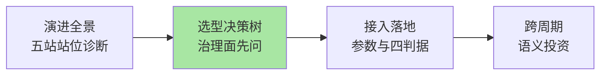
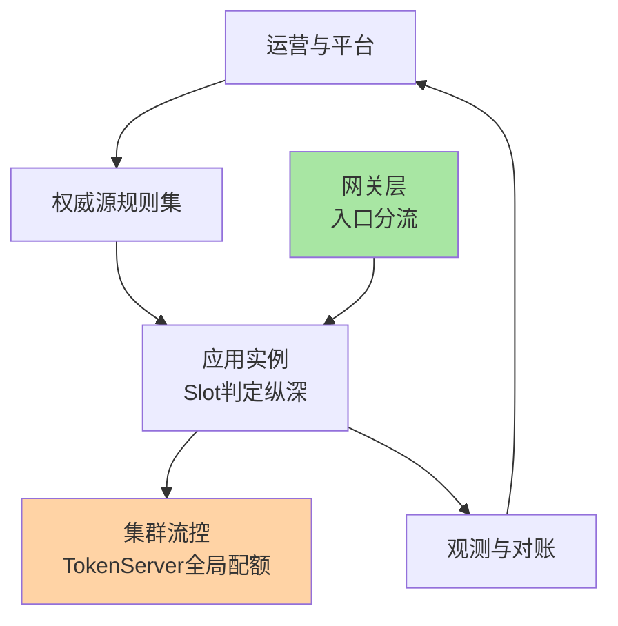
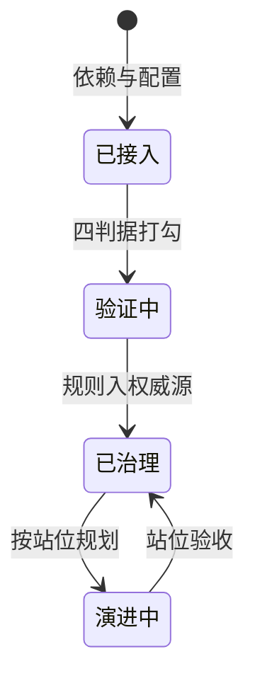
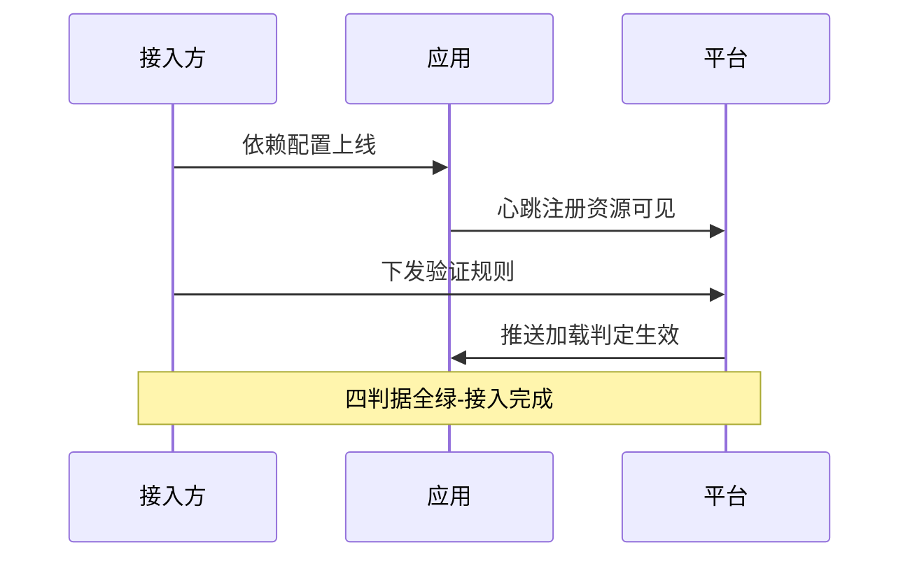
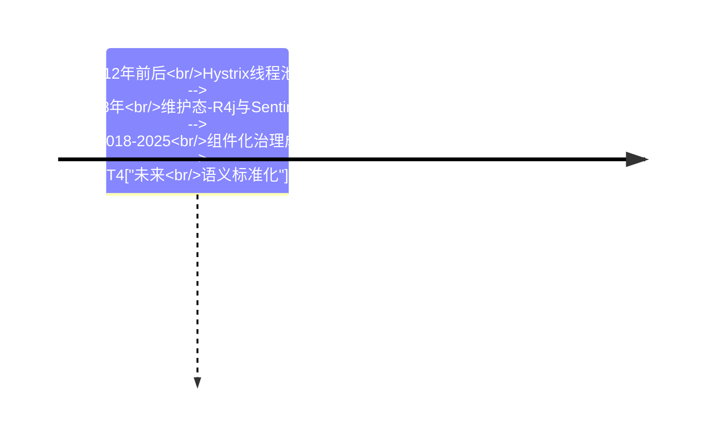

# Sentinel 整合层总览：全景收束与选型落地

> **本文核心**：整合层把前四层的机制收束成两个「可执行交付」——**演进全景**（单机防护到集群治理的五站主线，用于诊断自己体系的站位）与**选型决策树**（Sentinel/Resilience4j/Hystrix 三框架按形态分叉，附参数级接入清单与四判据验收）。判断句：**机制是数学，位置与治理才是架构**。

## 一句话摘要

一篇全景深读完成三件事：给演进主线（每站解决一种故障形态）、给选型决策树（治理面优先于功能清单）、给接入方案（参数清单+步骤+验证闭环+回退路径）——读完能独立完成防护体系选型评审并落地验收。

## 篇目导航

| 篇目 | 深挖点 | 核心结论 |
|---|---|---|
| 1_单机到集群防护演进与三框架选型-深度 | 五站主线 / 三框架对比 / 接入清单 | 逻辑限流不是物理隔离；治理面自身是故障域 |

## 全景架构位置图

## 接入的推进状态图

## 验证闭环时序

## 三框架演进时间线

## 与相邻层的关系

入门层给定位直觉（篇 1），特性层给机制底座，专题层给治理与场景；Hystrix/Resilience4j 的横向对比只在本层展开（三讲一遍原则），迁移与平台化立项以本层结论为起点。选型的取舍集中在两处：形态之争（平台态的成本是治理面运维、库态的代价是无治理面）与跨期投资之争（工具会换、语义制度不换）——本层深读里的对比表与决策树是这两笔取舍的展开。

## 📌 数据与事实声明

- 写于 2026-09-23，机制口径以 Sentinel 1.8.10 与各框架官方文档为基准（公开口径）
- 免责：以各篇参考资料与所用版本官方文档为准

## 📚 参考资料

| 类型 | 标题 | 来源 |
|---|---|---|
| 系列入口 | Sentinel 专题层系列 | 本仓库 middleware/sentinel/专题层 |
