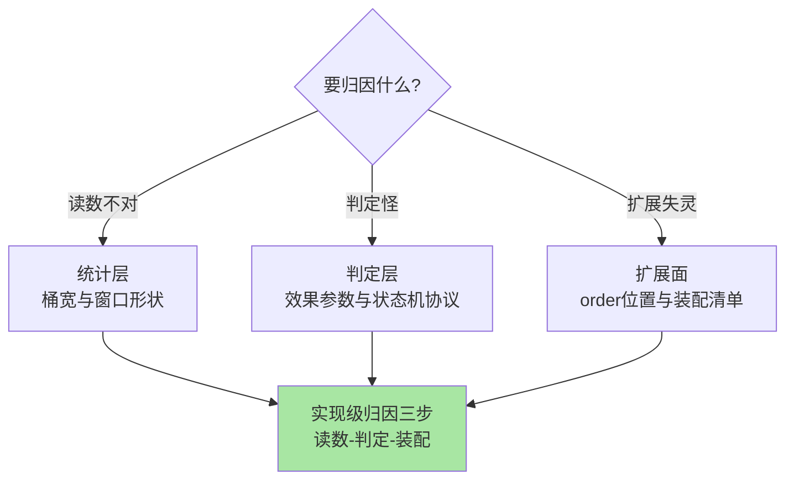
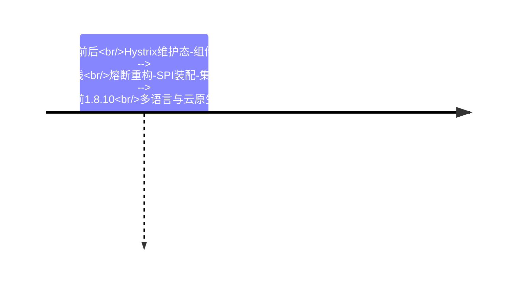

# Sentinel 特性层总览：三系列实现深读

> **本文核心**：特性层沿 Sentinel 的三层骨架展开——**统计结构**（LeapArray 滑动窗口怎么把读数做到又准又便宜）、**判定与整形**（流控效果、熔断状态机的实现账本）、**扩展面**（Slot 责任链的编排与自定义落地）。三个系列六篇 deep-dive，机制为主线、事故为钉子，全部对标 1.8.10 源码。合起来回答一个判断题：**Sentinel 的全部行为，都是统计成本、判定语义与扩展秩序三组工程决策的结果**。

## 一句话摘要

统计层定地基（读数多准多便宜），流控与熔断系列定判定语义（阈值曲线与状态机协议），扩展机制系列定秩序边界（编排顺序与扩展件负债）——读完能对任何规则行为做实现级归因。

## 系列导航

| 系列 | 深挖点 | 篇目 |
|---|---|---|
| 深入理解流控算法系列 | 统计结构与流量整形 | 1_滑动窗口 LeapArray 2_WarmUp 与匀速排队 |
| 深入理解熔断器实现系列 | 状态机与探测协议 | 1_三态机与半开探测 2_异常统计与 Resilience4j 对比 |
| 深入理解扩展机制系列 | 编排与扩展落地 | 1_Slot 责任链与 SPI 2_自定义 Slot 与指标统计 |

## 三层骨架的取舍图

## 与相邻层的关系

入门层给规则与概念语义，本层给实现与事故；规则治理专题收口在专题层，单机到集群的演进与三框架选型收束在整合层。机制定义的正源（限流熔断的跨实现理论）在稳定性工程系列（architecture/system-design/stability），两边互指不重复。

## 📌 数据与事实声明

- 写于 2026-09-23，机制口径以 Sentinel 1.8.10 官方源码与官方 wiki 为基准（公开口径）
- 免责：以各篇参考资料与所用版本源码为准

## 📚 参考资料

| 类型 | 标题 | 来源 |
|---|---|---|
| 系列入口 | Sentinel 入门层系列 | 本仓库 middleware/sentinel/入门层 |
