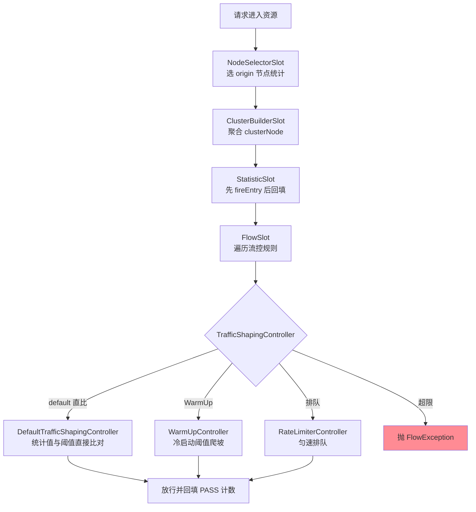
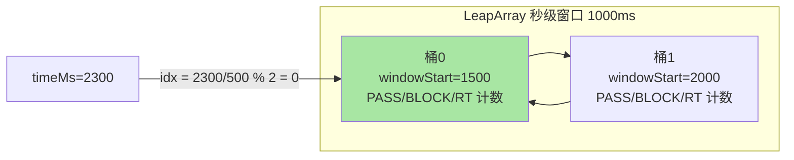
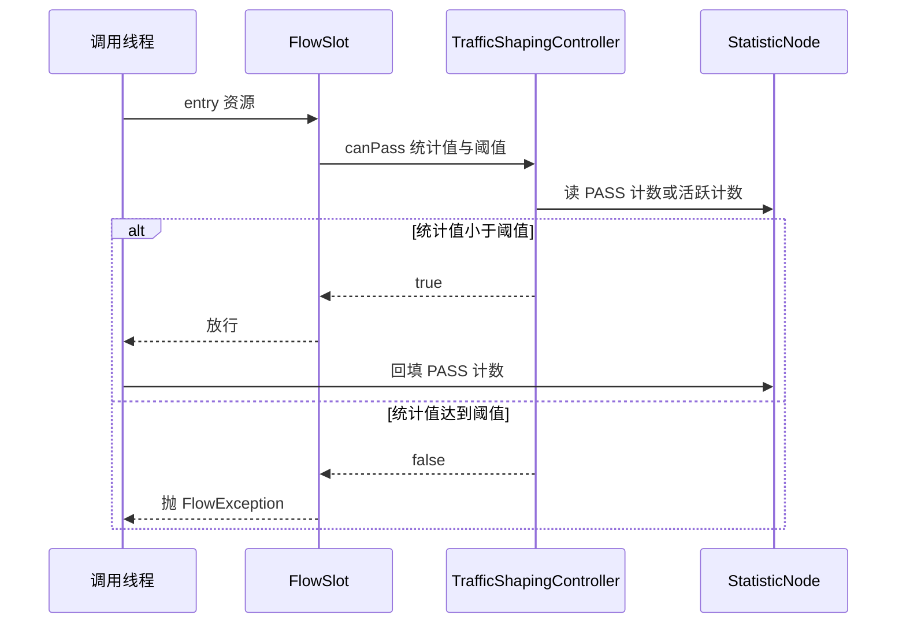
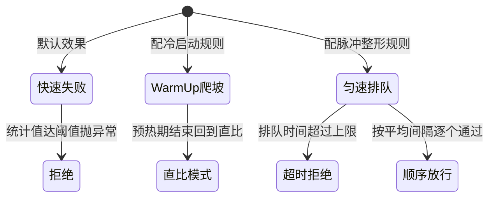

# Sentinel 限流机制与滑动窗口：LeapArray 统计结构与三种流控效果的实现

## 🎯 本文核心

> **一句话核心**：Sentinel 的限流是「统计与裁决分离」的两段式流水线——**LeapArray 滑动窗口**负责统计（通过/拒绝/异常/RT/并发计数），**流控规则**负责裁决（QPS 与线程数两种阈值 × 快速失败/Warm Up/匀速排队三种效果），两者靠 Slot 链生产的节点数据连接。
>
> **机制链**：请求 → NodeSelectorSlot（origin 节点）→ ClusterBuilderSlot（聚合 clusterNode）→ StatisticSlot（先放行下游检查、通过后回填计数）→ FlowSlot（遍历规则选控制器）→ Default / WarmUp / RateLimiter 三种 TrafficShapingController 裁决 → 超限抛 FlowException。
>
> **边界声明**：入门层篇 2/3 讲过 Slot 链心智模型、两种阈值类型与三种流控效果的**语义与选型**（什么时候配哪种），本篇下探到**实现层**——LeapArray 的桶结构与 CAS 复位竞态、线程数阈值的统计来源、Warm Up 背后的令牌数学、匀速排队的虚拟队列，以及与令牌桶的机制对比。入门层回答「怎么配」，本篇回答「为什么这样设计、边界在哪、失效形态是什么」。

## 一句话摘要

滑动窗口的真相是「**一个环形数组的定点撞桶**」：默认秒级窗口拆成 2 个 500ms 的桶（业内认知，官方默认口径），请求按时间戳算出桶下标直接累加计数，旧桶惰性过期、跨桶时 CAS 复位——**没有全局锁、没有重排序，单请求统计成本是常数级**。QPS 阈值读「最近 1 秒通过数」，线程数阈值读「当前活跃计数」，前者是**速率量**后者是**存量量**，统计来源完全不同。三种流控效果各有独立的实现路径：快速失败是「统计值与阈值直比」；Warm Up 把「冷启动」建模成令牌桶里冷令牌的释放（与 Guava RateLimiter 的预热数学同源）；匀速排队用「上次放行时间戳」构造虚拟漏桶，把突刺拉平成匀速流。**Sentinel 没有把令牌桶做成唯一算法，而是做成「效果组合器」——这是它与经典限流器在演进路上最深的设计分野**。

## 一、统计与裁决分离：限流的底层分工



流控的底层是**分工明确的两个角色**：统计层只回答「发生了什么」（多少通过、多少拒绝、耗时多少、此刻多少在处理），裁决层只回答「这个请求放不放」。分工的收益是**复用与正交**——同一个 clusterNode 的统计数据同时服务流控、熔断、热点、系统四类规则；同一条流控规则换一个控制器就换一种效果。**设计思想**：把「观测」与「决策」拆开，是控制论里「测量回路」在工程上的投影——测量回路保持廉价且恒定，决策回路按策略替换，系统的演进就只发生在策略层。

一个容易误解的细节：StatisticSlot 在链路中的位置排在 FlowSlot 之前，但它**先调用 fireEntry 让下游检查（含限流裁决）通过，返回后才回填 PASS 计数与 RT**——统计记录的是「既成事实」，而不是「检查前的假设」。这保证了「被拒绝的流量计进 BLOCK 桶，不污染 PASS 统计」，也让「通过数」天然扣除了被自己规则拦掉的部分。

## 二、LeapArray：滑动窗口的桶结构



LeapArray 的结构三件套：**WindowWrap**（一个桶的时间包装：窗口起始时间 + 窗口长度 + 数据体）、**MetricBucket**（数据体：一组 LongAdder 计数器，按 PASS/BLOCK/EXCEPTION/SUCCESS/RT 等类型分列）、**AtomicReferenceArray**（环形数组，长度等于采样桶数）。每次统计三步走：**算下标**（时间戳除以窗口长度对数组大小取模）→ **取桶**（下标处为空则 CAS 塞入新桶；桶的 windowStart 落后于当前窗口则 CAS 复位）→ **累加**（对计数器做 LongAdder 累加）。读侧聚合时把「当前桶 + 未过期的历史桶」求和，就是滑动窗口值。

```java
// LeapArray 核心逻辑（简化示意，非源码全量）
public WindowWrap<MetricBucket> currentWindow(long timeMillis) {
    long idx = calculateTimeIdx(timeMillis);        // time / windowLength % arraySize
    long start = calculateWindowStart(timeMillis);  // time - time % windowLength
    while (true) {
        WindowWrap<MetricBucket> old = array.get(idx);
        if (old == null) {                          // 空槽：CAS 塞入新桶
            array.compareAndSet(idx, null, new WindowWrap<>(length, start, new MetricBucket()));
            return array.get(idx);
        } else if (old.windowStart() == start) {    // 撞中当前桶
            return old;
        } else if (start > old.windowStart()) {     // 旧桶过期：CAS 复位
            if (array.compareAndSet(idx, old, resetTo(old, start))) return array.get(idx);
        } else {                                    // 时钟回拨等异常形态：退化为返回旧桶
            return old;
        }
    }
}
```

**追问**：为什么不选「一把锁保护检查与复位」、而是 CAS 复位？——反方案分析：如果用同一把锁保护「检查 + 复位」，高并发下所有写统计的线程会挤在锁上，统计成本从常数级退化为争抢级；CAS 只在「跨桶复位」这个罕见时刻才可能冲突，冲突方重试一次即可，绝大多数请求走的是无锁快路径。**再追问**：CAS 自旋失败会不会活锁？——复位是一次性的（旧桶换新桶），竞争窗口极窄，失败方下一轮循环拿到已复位的桶直接返回，自旋深度天然有界。**追问**：为什么默认秒级只拆 2 个桶？——这是「统计精度 vs 内存与 CPU 成本」的设计取舍：桶越多统计越平滑，但每个资源都要常驻这么多桶（每秒、每分钟两套窗口，资源数 × 桶数 × 计数器数，纯内存开销）；2 桶意味着最坏情况下统计滞后半个窗口（500ms），对防护语义够用。**追问**：时钟回拨会怎样？——代码里对「start < 旧桶 windowStart」的分支选择了保守返回旧桶，宁可统计暂时失真也不 reset——时钟异常时的语义是「降级而非雪崩」，这是防御性设计的典型样本。**打破砂锅问到底**：复位策略、桶数、回拨处理这三层追下来，答案收敛到同一句话——统计底座的每个自由度都要用「失效方向保守」来定价，宁可精度打折，不让底座制造新的故障面。

## 三、QPS 与线程数：两种阈值的统计来源

两种阈值类型的底层差异比入门层讲的「一个防突发、一个防慢调用」更根本——**它们的统计载体就不同**：

| 维度 | QPS 阈值 | 线程数阈值 |
|---|---|---|
| 统计载体 | 滑动窗口 PASS 计数（速率量） | 活跃计数器 curThreadNum（存量量） |
| 更新时机 | 请求通过时累加，按时间窗过期 | 进入资源 +1，退出资源 -1 |
| 时间依赖 | 强（窗口滚动） | 无（进入/退出成对） |
| 慢调用下的行为 | 单请求数一次就消失，感知钝 | 请求数不退出就累积，感知灵敏 |

线程数阈值**不依赖时间窗口**：StatistaticSlot 在进入资源时对并发计数 +1、退出时 -1，裁决时只看「此刻有多少个还没走」。这就是并发阈值对慢调用灵敏的机制根源——接口 RT 从 20ms 恶化到 2s，QPS 统计没变化，但活跃存量会直接放大百倍撞破阈值。**追问**：并发计数会不会漏减（线程异常退出没走到 exit）？——Sentinel 的埋点约定是 entry/exit 成对出现（try-finally 包裹），注解与框架适配层已兜底；漏减的后果是计数虚高、保护提前触发，属于「保守方向」的失效——防护系统宁可误拒不可漏放，这个方向性选择值得记下来。

## 四、三种流控效果的实现路径



**快速失败（Default）**：统计值与阈值直接比对，超限抛 FlowException——实现最薄，全路径无等待，是绝大多数场景的正确默认。**Warm Up**：阈值不是瞬间生效，而是从「设定值 / coldFactor」（coldFactor 默认 3，官方口径）在预热时长内爬坡到设定值。实现上它内部维护了两套令牌（普通容量令牌 + 预警令牌），数学与 Guava RateLimiter 的 SmoothRateLimiter 同源：把「系统冷」建模成「桶里囤着一堆冷令牌」，预热过程就是按速率释放冷令牌、阈值随释放量线性爬升——**用令牌桶的机制实现了「容量爬坡」的语义**。**匀速排队（RateLimiterController）**：按「阈值 = 每秒放行数」算出平均间隔 meanInterval，维护一个「上次放行时间戳」的原子变量；新请求到达时若间隔未到，就计算出需要等待的时长——等待不超过 maxQueueingTimeMs 就 sleep 排队，超过则拒绝。它等价于一个**用单个时间戳构造的虚拟漏桶**：没有真实队列，队列的形态只是「时间戳的推算」。



**追问**：匀速排队的 sleep 发生在谁的线程上？——**调用线程自己**。虚拟漏桶不搬运请求，只是让调用线程睡到自己的「放行时刻」——这意味着排队会占用上游线程资源，在线程池紧的场景（如 Tomcat 工作线程本就吃紧）排队等待反而加速线程耗尽。这是它与「接入层真正的请求队列」（如 Nginx 的缓冲队列）的机制级差异：**进程内限流的排队是「线程的时间」，接入层的排队是「连接的空间」**。**追问**：为什么不选排队等待当默认效果、把所有突刺都磨平？——排队把「拒绝的代价」换成了「线程的时间」：默认快速失败给出的是瞬间的拒绝信号，让上游立刻感知容量边界；排队则在 RT 上隐形加价、还持续占用线程，把整形当默认等于让全部接口默认缴纳延迟税与线程税——效果单选的语义就是逼你按流量形态显式表态，而不是默认替你选。

## 五、与令牌桶的对比：为什么 Sentinel 不是单一算法

| 维度 | 令牌桶（Guava RateLimiter 为代表） | Sentinel 滑动窗口 + 效果组合 |
|---|---|---|
| 统计模型 | 速率模型：按速率发令牌，余量即桶存量 | 计数模型：事件计数按窗口聚合 |
| 突发语义 | 允许一次性消费桶内余量（有界突发） | 按「最近 N 秒通过数」裁决，突发受窗口约束 |
| 信息维度 | 只关心「还能放几个」 | PASS/BLOCK/RT/并发全维计数，供多类规则共享 |
| 预热能力 | SmoothRateLimiter 内建预热变体 | WarmUp 借用同一套令牌数学 |
| 平滑能力 | 需换 acquire 阻塞用法 | 匀速排队控制器原生支持 |

**为什么不选令牌桶做唯一内核？**反方案分析：如果内核换成令牌桶，三个代价难以接受——其一，熔断、热点、系统规则都需要「异常数、慢调用比例、入口并发」这些**事件统计量**，令牌桶的速率模型表达不了；其二，令牌桶的「桶存量突发」语义对防护场景是危险的（桶容量 1000 意味着瞬时放行 1000 个，可能正好是压垮依赖的那根稻草）；其三，集群流控、按来源统计等演进方向都长在「多维度计数」上，速率模型扩展不动。另一种做法也有——纯漏桶（如接入层限速的常见实现）——但漏桶把所有流量强行拉平，丢掉了「快速失败的果断」与「预热的弹性」，对在线服务的语义太钝。**Sentinel 的选择是：滑动窗口做统计底座（承载全维事件计数），把令牌桶与漏桶的精华降格为两种「效果控制器」**——这是「底座统一、策略开放」的设计哲学，与数据库里「存储引擎统一、索引策略可选」是同一种架构直觉。

## 源码关键路径：Slot 链上的统计与裁决

- **DefaultSlotChainBuilder**：Slot 链的组装点（SPI 可替换，编排框架按注解顺序微调）——链的顺序就是职责分层：先选节点、再聚合、再统计、最后裁决。
- **NodeSelectorSlot → ClusterBuilderSlot**：前者按调用来源（origin）挂统计节点，后者把各 origin 聚合成 clusterNode——「按调用方限流」读 origin 节点视角，全局裁决读 clusterNode 视角，同一请求两条统计线。
- **StatisticSlot**：先 fireEntry 让下游检查（含 FlowSlot / DegradeSlot）裁决，通过后才回填 PASS/SUCCESS/RT 与并发计数——「统计事后回填」这个位置安排，就是「拒绝不污染通过数」的实现。
- **FlowSlot / FlowRuleChecker**：按资源取规则集，依 grade（QPS/线程）与 controlBehavior 选出 TrafficShapingController（Default/WarmUp/RateLimiter 三实现），canPass 不通过即抛 FlowException。
- **LeapArray 家族**：秒级（默认 2 桶）与分钟级（60 桶）两套窗口挂在 StatisticNode 上——热路径读秒级保证裁决灵敏，监控与大盘读分钟级看趋势，读写各取所需（类位置见文末速查表，与篇 2 的 UnaryLeapArray 变体对照阅读）。

## 不同量级的思考：架构约束驱动解法

- **十万级（约束来源：单机 CPU 与内存的统计成本上限）**：这一档的核心问题是统计本身不能成为负载，而不是阈值调多准。10w QPS 下每次请求的统计操作必须停留在「常数次 CAS 与 LongAdder 累加」，任何锁、任何 O(n) 扫描都会把统计层变成热点——这是 LeapArray 选择环形数组 + 定点撞桶的物理理由。思考方式是**成本驱动**：先算统计路径的指令账，再谈策略调优。这一档单机滑动窗口仍然够用，警惕的是「每资源两套窗口 × 大量资源」的内存账。
- **百万级（约束来源：单机阈值不等于集群配额，负载不均放大误差）**：这一档的核心问题是配额怎么分摊，而不是单机统计多平滑。集群百万 QPS 摊到几十上百实例，负载均衡的粘滞与波动会让单实例流量偏离均值数倍——单机阈值按「总量/实例数」配，必然出现「集群没满、单机先限」。思考方式是**分摊驱动**：阈值从「容量声明」变成「配额协议」，需要集群流控（Token Server 统一计数）或按调用方来源拆分配额来补齐语义。触发升级的信号是：误杀率随实例数上升。
- **亿级（约束来源：跨集群的治理面与规则规模效应）**：这一档的核心问题是规则本身的治理成本，而不是任何单个规则的算法精度。数万条规则、数百服务、多机房部署时，规则的正确性从「算法问题」变成「工程治理问题」——版本、灰度、审计、回滚的缺失会让「一次误推送」放大成全局故障。思考方式是**治理驱动**：统计与算法在前面冲锋，规则治理面在后面兜底。自下而上回顾：桶结构的常数成本 → 集群配额协议 → 规则治理面，每一档的瓶颈都从「单请求」上移到「集群」再到「组织」；触发升级的时机永远是「上一档的解法开始制造新的误差来源」，而不是流量数字本身。

## 业内惯例与生产实践

**业内惯例**：秒级窗口默认 2 桶、coldFactor 默认 3、预热默认 10 秒——这三个默认值是生产中的事实起点（公开口径），惯例是**不改默认值、用效果组合表达差异**；阈值一律来自压测（P99 达标最大吞吐 × 0.8），并在容量变更后复审；读接口配 QPS、慢出口配并发，是流控规则分配的经典分工。部分团队在网关层叠加接入层限流与进程内 Sentinel，形成「接入层挡洪水、进程内保资源」的双层惯例。

**事故叙事一（线上排查）**：某团队给营销页接口配了排队等待，maxQueueingTimeMs 配到 30 秒「追求不让请求失败」。一次流量高峰，前端超时 3 秒，用户端重试大量涌入；服务端还在为「已超时」的请求排队放行，Tomcat 工作线程被 sleep 占满，连带其他接口一起不可用。复盘结论：排队的时长上限必须小于调用方超时（还要扣除网络往返），否则服务端在处理「无人认领」的请求——**限流效果与调用方超时的协议错配，是排队等待最典型的翻车形态**。

**事故叙事二（当时复盘）**：某服务大促前扩容，新实例配了 Warm Up 10 分钟，团队以为万事大吉。放量后新实例仍然雪崩——排查发现根因不在 JVM 与 JIT，而在**本地缓存未热**：冷实例每笔请求都穿透到数据库，阈值爬坡只爬了「自己的接客能力」，没爬「依赖的承受能力」。复盘结论：Warm Up 预热的是「资源就绪度」，它管不了「依赖链路的就绪度」——冷启动方案必须配套缓存预热（启动时主动回源）与连接池预建，预热时长按「最慢就绪项」设定，而不是拍一个 10 分钟。

## 什么时候用 / 什么时候不用

- **明确推荐**：常态容量保护用快速失败 + 压测阈值（首选，90% 的场景）；发布后与大促扩容的新实例用 Warm Up；消息消费、定时批处理等脉冲流量且下游写入敏感时用匀速排队；慢接口/下游依赖出口补并发线程数阈值与 QPS 并用。
- **不用/慎用**：延迟敏感的在线接口不用匀速排队（排队时间计入 RT，是延迟反模式）；常态化限流不用 Warm Up（预热只在冷启动期有语义）；精确配额（计费、份额）不用单机滑动窗口（用集群流控或专用配额系统）；调用方超时小于排队上限时不排队（先修超时协议再谈整形）。

## Trade-off：三种取舍贯穿始终

统计层的取舍：**桶多精度高但内存与聚合成本高**——2 桶是「够用 + 廉价」的折中，对统计敏感的监控另建分钟级窗口补齐。裁决层的取舍：**拒绝的果断 vs 通过的平滑**——快速失败把代价瞬间甩给调用方，排队把代价摊到时间上但占用线程，预热把代价摊到「短期容量打折」上；没有全赢的效果，只有与调用方能容忍的代价相匹配的选择。架构层的取舍：**单机的准确 vs 集群的正确**——单机滑动窗口零网络成本但配额语义在集群下失真，集群流控语义精确但要维护 Token Server 的部署与单点问题——防线设计永远是在这两端之间选位置，而不是发明一种两端全占的算法。

## 💡 实战提示

- 💡 统计口径要记牢：QPS 阈值是「最近 1 秒」的近似裁决，秒级 2 桶下最坏滞后 500ms——阈值按趋势语义用，不当会计精确值
- 💡 慢接口必须用并发线程数阈值——QPS 统计对「变慢」天然钝感，并发存量才是灵敏维度
- 💡 排队等待的 maxQueueingTimeMs 严格小于调用方超时，并确认上游线程池有排队余量——否则排队变成线程耗尽放大器
- 💡 Warm Up 预热的是「自己」，依赖就绪要另配缓存预热与连接池预建——预热时长按最慢就绪项定
- 💡 阈值唯一合法来源是压测，P99 达标最大吞吐 × 0.8，容量变更后复审——拍脑袋阈值等于裸奔

## 你们可能会问

**Q1：滑动窗口统计会不会在高并发下成为瓶颈？**
写路径是「取模定位 + 一次 LongAdder 累加」，LongAdder 的分段设计把热点拆到 cell，读路径（每次裁决聚合两个桶）也是常数成本。真正要警惕的是海量资源（数万个资源名）各自常驻窗口的内存账——按规范收敛资源名粒度比担心单次累加更有效。

**Q2：为什么读统计时偶尔会出现「当前桶还没满、历史桶已过期」的锯齿波动？**
秒级窗口只有 2 个桶，读值 = 当前桶 + 历史桶的滚动组合，跨桶瞬间读值会跳变——这是分桶统计的固有粒度噪声。防护裁决关心的是趋势，锯齿不影响语义；要平滑曲线做展示，另读分钟级窗口。

**Q3：Warm Up 和排队等待能叠加吗？**
同一规则的流控效果是单选——效果维度互相独立但不能同时表达。确有「既要冷启动爬坡又要匀速通过」的复合需求，正确做法是拆两层：入口资源配 Warm Up，内部消费资源配匀速排队，靠资源链路天然叠加。

**Q4：被拒绝的请求会影响统计吗？**
会，且各归各的桶——拒绝计进 BLOCK 计数不进 PASS，这是「通过数」不被自我拦截污染的关键。BLOCK 计数本身就是重要的运维信号：BLOCK 长期为零说明规则形同虚设，突然上涨说明流量形态或容量出了变化。

**Q5：occupy（借用未来桶）是什么？**
秒级窗口有个变体允许「预支下一窗口的配额」来平滑临界突刺（官方源码与 Wiki 有说明，默认对外语义仍以阈值为准）。它解决的是「临界秒把流量挤成两半」的边界噪声，属于内部优化项——生产上把它当透明机制即可，不需要配置。

## 开放问题

- 统计窗口的动态化——按流量形态自动调整采样桶数（突发多则加桶、平稳则减桶）在社区有讨论，尚无标准实现；自适应统计与自适应阈值的边界仍值得讨论。
- 单机效果与集群配额的统一语义——排队/预热效果在集群流控（Token Server）下的等价表达，是流控语义收敛的长期方向。

## 🎯 核心带走

- **核心一句话**：限流 = LeapArray 统计（环形桶 + CAS 复位 + LongAdder，常数成本）+ 裁决（QPS 读速率量 / 线程数读存量量）+ 三种效果（直比 / 令牌数学预热 / 时间戳虚拟漏桶）
- **机制链**：NodeSelector → ClusterBuilder 聚合 → StatisticSlot 事后回填 → FlowSlot 选控制器 → 超限抛 FlowException；统计与裁决分离，一套统计服务四类规则
- **失效点/边界**：秒级 2 桶统计滞后 500ms；排队上限超调用方超时 = 线程耗尽放大器；Warm Up 管不了依赖就绪；单机阈值在集群下失真，配额语义需集群流控补齐

## 附录：关键类速查表

| 类 | 位置（包级） | 职责 |
|---|---|---|
| LeapArray / WindowWrap | slots.statistic.base | 环形窗口数组与桶的时间包装、CAS 复位 |
| MetricBucket / LongAdder | slots.statistic.base | 桶数据体：PASS/BLOCK/RT 等分段计数 |
| StatisticNode | slots.statistic | 秒级/分钟级两套窗口 + 活跃线程计数 |
| NodeSelectorSlot / ClusterBuilderSlot | slots | origin 节点与 clusterNode 的构建 |
| StatisticSlot | slots | 检查通过后回填 PASS/RT/并发计数 |
| FlowSlot / FlowRuleChecker | slots.block.flow | 遍历规则、按模式选统计节点 |
| Default/WarmUp/RateLimiter Controller | slots.block.flow | 三种流控效果的裁决实现 |

## 📌 数据与事实声明

- 写于 2026-09-18，对标 Sentinel 1.8.x；默认参数（秒级 2 桶、coldFactor=3、预热 10s 等）为官方文档与源码公开口径，具体数值以所引版本源码为准
- 数字口径：容量/事故类数字均为方法论口径或匿名化公开认知，不指向任何特定公司；机制描述以官方 Wiki 与开源源码为源，简化示意代码以注释标明非源码全量

## 📚 参考资料

| 类型 | 标题 | 来源 |
|---|---|---|
| 官方 Wiki | Sentinel 流量控制 / 滑动窗口实现 | github.com/alibaba/Sentinel/wiki |
| 官方源码 | LeapArray / WarmUpController / RateLimiterController | github.com/alibaba/Sentinel（1.8.x master） |
| 生态对照 | Guava RateLimiter 预热数学（SmoothRateLimiter） | Guava 官方 Javadoc |
| 关联文章 | 入门层篇 3（流控规则语义选型）、本系列篇 2/3 | 本仓库 docs/middleware/sentinel/ |
