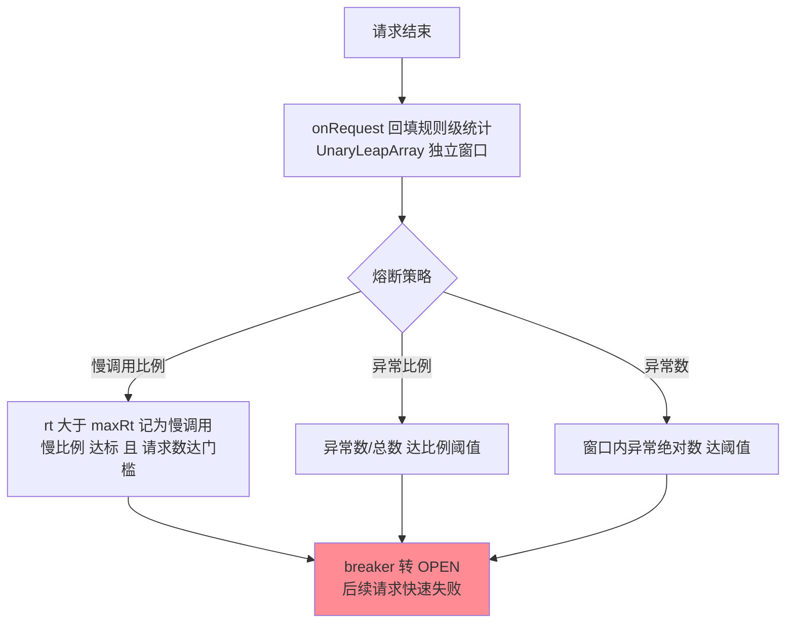
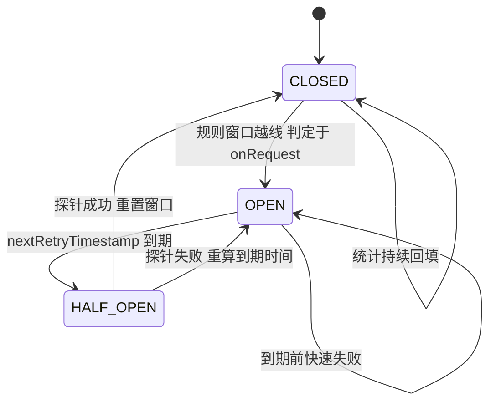
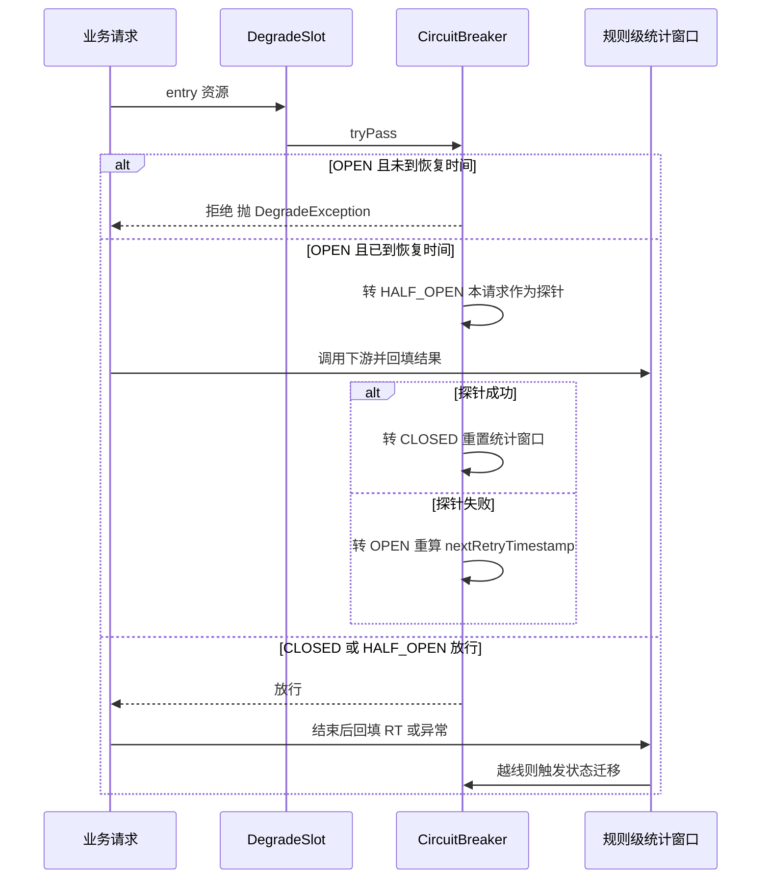
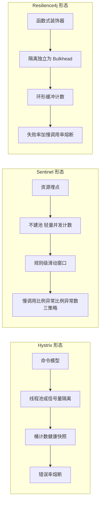

# Sentinel 熔断降级与状态机：三种策略、恢复探测与两代断路器的机制差异

## 🎯 本文核心

> **一句话核心**：熔断降级是挂在资源上的**逐请求状态机**——每条 DegradeRule 对应一个 CircuitBreaker 实例，三种策略（慢调用比例/异常比例/异常数）是三种「劣化检测器」，超阈值把状态从 CLOSED 推到 OPEN 快速失败，熔断时长结束后进 HALF_OPEN 放**单探针**请求，成败决定关闭或重开。
>
> **机制链**：请求 → DegradeSlot → 遍历该资源的熔断规则 → breaker.tryPass 判状态 → 统计回填（onRequest 记录 RT/异常）→ 比例越线 → CLOSED 转 OPEN → nextRetryTimestamp 到期 → HALF_OPEN → 探针成功关闭 / 失败重开。
>
> **边界声明**：入门层篇 4 讲过三种熔断策略的**语义与选型**、降级逻辑的配套与系统自适应保护，本篇下探**实现层**——规则到断路器实例的映射、状态迁移的判定时机、半开单探针的设计依据，以及与 Hystrix/Resilience4j 两代断路器的机制级对比。入门层回答「怎么配、配多少」，本篇回答「状态怎么转、为什么这么设计、换一代框架差异在哪」。

## 一句话摘要

三种策略的分工是**三种劣化形态的检测器**：慢调用比例抓「活着但变慢」（RT 超 maxRt 的占比 × 最小请求数门槛）、异常比例抓「大面积报错」、异常数抓「低基线异常服务」。状态机三个状态、两条边：**CLOSED→OPEN** 由「独立于资源的规则级统计窗口」判定（1.8 起每条规则自带一个 CircuitBreaker 与专属滑动窗口，多条规则并存互不污染）；**OPEN→HALF_OPEN→CLOSED/OPEN** 由「nextRetryTimestamp + 单探针」驱动。与 Hystrix 的分野在**熔断与隔离解耦**（不建线程池也能熔断）；与 Resilience4j 的分野在**半开并发度与统计载体**（单探针 vs 可配批量探测，请求驱动回填 vs 环形缓冲直读）。熔断的工程难点从来不是「打开」，而是**恢复探测的节奏**——振荡与白丢容量都在这一段发生。

## 一、三种策略：规则级统计与检测器

机制层的第一个关键点：**熔断统计与限流统计是两套账**。限流读的是资源级 clusterNode；熔断统计在 1.8 重构后挂在**规则自带的滑动窗口**上（每条 DegradeRule 一个 CircuitBreaker，规则更新时实例重建）——同一资源配慢调用与异常两条规则，各自窗口独立累计，互不污染，也避免了旧版「多条规则挤一个统计」的钝化。第二个关键点：**判定发生在统计回填时**（onRequest），而不是定时扫描——每笔请求结束的瞬间，它的 RT 与异常就推进了规则窗口的聚合值，越线即刻翻状态，没有定时任务的延迟窗口。第三：最小请求数门槛（minRequestAmount，官方默认口径为 5）是防误熔断的保险丝——低峰期 3 个请求错 1 个就把比例推到 33%，没有门槛的熔断器在深夜全是误报。

**追问**：慢调用比例的「慢」线为什么不选「框架自动按 P99 划线」、而必须用户显式配（maxRt）？——反方案分析：框架若内置「P99 自动慢线」，P99 会随熔断打开而变化（熔断快速失败拉低整体 RT，慢线跟着下移），检测器与被检测对象形成反馈回路——**测不准也稳不住**。慢线必须是业务承诺值（SLA 口径），静止、外生、可审计，这是「检测器不可污染」的设计原则。

## 二、熔断状态机：三条状态、两条迁移边

状态机有两个容易误读的细节。**其一，OPEN 不是计时器自动翻转**——「熔断时长结束」只是让 tryPass 里 nextRetryTimestamp 到期，下一个到达的请求被选中为探针、状态才真正切到 HALF_OPEN；熔断期内无流量，状态就停在 OPEN（状态翻转是请求驱动的）。**其二，半开是单探针语义**：进入 HALF_OPEN 后，后续请求一律拒绝，直到当前探针返回并做出「关闭/重开」的裁决——**半开期同时只有一个在途请求**。这保证了「恢复探测的最小试探量」：下游刚恢复、能力未满血时，最多只多打一个请求；探针失败即重开，绝不放量。回看断路器十年间的形态演变，半开并发度一路从「按比例放行」收敛到「最小试探」，方向始终是「试探量随爆炸半径走」。

**追问**：为什么不选「后台定时扫描、批量翻状态」的集中式实现，而把判定挂在每笔请求的回填上？——定时扫描给每次状态迁移引入一个周期级的滞后窗口（洪峰打来时熔断器还在等下一次 tick），且「判定与统计分离」还要额外处理并发翻转的竞态；挂在 onRequest 上的即时判定让检测粒度与请求节奏天然对齐，代价只是把回填路径压到常数成本——这笔账篇 1 的滑动窗口已经付过。

**追问**：为什么探针失败要「重算到期时间」而不是立刻再试？——熔断时长按下游故障的典型恢复时间设定，探针失败说明恢复时间判断早了，重开时应给下游再留一个完整窗口。**再追问**：为什么不选「探针失败立刻换一个请求再试」、偏要等满一个窗口？——立即重试等于把恢复探测变成高频轮询，试探量随失败次数累加，刚病的下游会被探针本身拖住——恢复探测的节奏必须绑定「下游恢复的时间尺度」，而不是「调用方着急的程度」。**打破砂锅**：慢线、到期、探针口径三层追问到底，答案是同一条原则——检测器的每个参数都必须外生、静止、可审计，绝不让被测对象参与定义测量自己的标准。**追问**：探针请求的「成败」怎么定义？——与所在策略同口径：慢调用策略下探针 RT 超 maxRt 即算失败（哪怕没抛异常），异常策略下抛异常即失败——**探针的判定标准与熔断的判定标准是同一条线**，否则会出现「熔断线说它病了、探针线说它好了」的自相矛盾。

## 三、恢复探测的工程节奏：振荡与白丢容量

恢复探测的两类失效形态，对应两个参数的错配。**熔断振荡**：timeWindow（熔断时长，秒）配得比下游真实恢复时间短——打开、试探、失败、再打开循环往复，每次振荡都有探针流量打进一个还没恢复的下游，等于用探针持续骚扰病号；下游本就脆，探针的并发还可能成为压垮它的最后一根稻草。**白丢容量**：timeWindow 配得比恢复时间长——下游 30 秒恢复，你熔断 5 分钟，4 分半的可用容量白白空转，而调用方还以为必须靠降级硬扛。**设计思想**：熔断时长的本质是「对下游故障恢复时间的预测」，预测值只能来自对下游的运维认知（GC 类抖动、发布回滚、容量不足各有典型量级），它是运维协议的一部分，不是拍一个「5 分钟保险」。

第三类失效更隐蔽：**状态不可观测**。熔断悄悄打开、悄悄关闭，故障期间没人知道发生过熔断，复盘时统计链路缺失。机制上 CircuitBreaker 支持状态迁移事件监听（StateChangeObserver 形态，官方源码口径），业内惯例是把「熔断打开/半开/恢复」事件接入告警与大盘——**熔断状态是可用性事件，不是内部实现细节**。

## 四、与 Hystrix / Resilience4j 的机制差异

| 维度 | Sentinel | Hystrix | Resilience4j |
|---|---|---|---|
| 熔断与隔离的关系 | 解耦：不建池、并发计数即用 | 强耦合：熔断依附线程池/信号量隔离 | 解耦：隔离独立为 Bulkhead 模块 |
| 统计载体 | 规则级 LeapArray 滑动窗口 | 固定桶数组滚动快照（10 桶 × 1s，公开口径） | 环形缓冲（按次数或按时间） |
| 判定时机 | 请求回填即刻判定 | 定时汇总健康快照 | 读取缓冲即时计算 |
| 触发策略 | 慢调用比例/异常比例/异常数 | 错误率为主 | 失败率 + 慢调用率（后加） |
| 半开并发 | 单探针（1 个在途） | 单试探请求 | 可配批量探测（默认口径 10） |
| 生命周期 | 主线演进 | 进入维护态（公开口径，不再新增功能） | 主线演进 |

把三代组件放进同一张架构图后，机制差异里最值得穿透的是两点。**其一，熔断与隔离的耦合度**：Hystrix 的熔断建立在「每个依赖独立线程池」之上——隔离彻底但代价是线程切换与池数爆炸（入门层篇 3 已对比过）；Sentinel 与 R4j 都走向解耦，熔断退化成一个纯统计状态机，谁都可以独立使用。隔离与熔断从紧耦合走向解耦，是两代断路器演进的主线；解耦的代价是「钝化隔离」（所有慢调用共享并发阈值），收益是零线程开销与配置面轻量——两代框架的取舍方向完全一致，只是 Hystrix 先付了隔离的学费。**其二，判定时机**：Hystrix 靠定时任务把桶聚合成健康快照，熔断判定天然滞后于请求；Sentinel 在请求回填瞬间判定，感知最快，代价是回填路径必须极廉价（这正是篇 1 滑动窗口常数成本的意义）；R4j 的环形缓冲介于两者之间。**追问**：为什么 R4j 敢把半开批量探测（默认口径 10 个）而 Sentinel 收敛到 1 个？——R4j 的使用形态多为进程内库函数调用，探针量小且可控；面向服务间调用的防护更保守——**试探量与调用形态的爆炸半径成正比**，没有谁对谁错，只有爆炸半径的假设不同。

## 源码关键路径：从规则到状态迁移

- **DegradeSlot**（Slot 链中排在 FlowSlot 之后，顺序即职责边界的架构表达）：入口统一走 DegradeRuleManager.checkCircuitBreaker，按资源取出熔断规则集逐条 tryPass。
- **DegradeRule → CircuitBreaker**：1.8 起规则持有一个 breaker 实例（属性监听器在规则更新时重建），grade 决定实现类——**ResponseTimeCircuitBreaker**（慢调用：内部 UnaryLeapArray 记录 RT，maxRt 与 slowRatioThreshold 双参数）与 **ExceptionCircuitBreaker**（异常比例/绝对数）。
- **UnaryLeapArray**：与限流的 MetricBucket 不同，熔断窗口每个桶只装「单值计数」（慢调用数/总数、异常数/总数），按规则自己的 statIntervalMs 划窗——这就是「规则级统计」的物理载体（官方源码口径）。
- **状态迁移判定**：tryPass 处理 OPEN→HALF_OPEN 的放行决策；onRequest 在请求结束时回填统计并对 HALF_OPEN 探针做出关闭/重开裁决——**状态机的两次翻转各有一个明确的触发函数**，不靠后台线程。
- 附录速查表见文末，配合本系列篇 1 的 Slot 链路径对照阅读。

## 不同量级的思考：架构约束驱动解法

- **十万级（约束来源：单请求判定路径的常数成本）**：这一档的核心问题是熔断检查不能拖慢正常请求，而不是阈值调多灵敏。每笔请求多一次状态判断与计数累加，10w QPS 下就是常数成本 × 十万的乘法——所以状态机设计成「请求驱动 + 原子状态」而非后台扫描。思考方式是**成本驱动**：先把判定压到 O(1)，再谈策略丰富度。这一档单机熔断完全够用。
- **百万级（约束来源：探针流量的集群叠加效应）**：这一档的核心问题是每个实例的探针会叠加成集群探针风暴，而不是单实例的探针量。百实例同时半开，单探针语义下集群也在同时打 100 个探针——刚恢复的下游可能被集群探针二次打挂。思考方式是**叠加驱动**：半开并发要在集群视角重新核算，配合实例间错峰（熔断时长带随机抖动）或由服务发现摘除承接实例级坏点。触发升级的信号是：恢复探测阶段的流量曲线出现第二座尖峰。
- **亿级（约束来源：熔断状态的跨实例一致性与治理面）**：这一档的核心问题是熔断决策的可见性与统一编排，而不是任何一个状态机的实现精度。数千实例各自为政的熔断状态，让「依赖整体处于熔断」这类全局事实无人知道——需要把状态事件汇聚成全局视图，并与路由摘除、预案系统联动。思考方式是**治理驱动**：状态机是单车智能，治理面是调度中枢。自下而上回顾：常数判定 → 探针叠加 → 状态汇聚，瓶颈从「单请求」上移到「集群行为」再到「全局可观测」；触发升级的时机永远是「上一档的解法开始制造新的信息缺口」。

## 业内惯例与生产实践

**业内惯例**：生产环境惯例是「慢调用比例为主哨兵 + 异常比例为副哨兵」双规则并存（各自配最小请求数防误触发）；熔断时长按下游恢复特征分档（GC 类抖动分钟内、发布类回滚十分钟级，公开口径）；熔断状态事件必接告警；熔断规则随依赖分级管理（核心依赖宽松、边缘依赖灵敏）而不是一套参数全网铺。

**事故叙事一（线上排查）**：某核心链路的下游做缓存重启，实例逐台恢复；调用方的熔断时长配了 2 秒——每 2 秒就有探针打进「刚拉起、缓存还是冷的」实例，探针全部慢调用失败，熔断反复重开；等下游真正热透，调用方的熔断状态机已经振荡了上百轮，探针流量本身又拖慢了下游预热。复盘结论：熔断时长必须长于下游「恢复 + 预热」的完整周期，并对集群探针叠加有预估——**振荡不是状态机坏了，是恢复时间预测错了**。

**事故叙事二（当时复盘）**：一个查询接口把「数据不存在」抛成业务异常，日常异常比例约 2%。某次上游营销活动带来大量无效查询，异常比例冲到 8%，触发了本想防「下游故障」的异常比例熔断——下游完全健康，熔断的却是自己的正常业务分支，降级返回空结果造成用户投诉。排查还原后复盘：异常策略检测的是「异常」，它不区分「谁的错」——**业务分支异常必须先改成非异常语义（返回空对象/状态码）再上熔断规则**，否则熔断器会成为业务波动的放大器。

## 什么时候用 / 什么时候不用

- **明确推荐**：所有跨进程依赖出口（RPC/HTTP/缓存代理）至少配一条熔断规则——慢调用比例打底；第三方通道、边缘依赖配灵敏熔断 + 轻降级；核心依赖配宽松熔断 + 重降级（缓存快照）；熔断状态事件必接监控告警。
- **不用/慎用**：进程内函数调用不配服务级熔断（本地异常直接捕获更直接）；「异常是正常分支」的接口先修语义再配异常策略；下游恢复特征未知时不拍熔断时长（先演练压测拿到恢复曲线）；熔断不能替代容量规划——它买的是止损时间，不是无限容量。

## Trade-off：保护强度与试探成本的永恒拉锯

**灵敏度与误杀**的取舍：阈值越灵止损越快，误熔断的正常流量损失也越大——最小请求数与双哨兵分工是工程上的平衡点。**单探针与恢复速度**的取舍：单探针试探量最小但恢复确认慢（一个一个试），批量探测恢复确认快但爆炸半径大——试探量应该跟调用形态的破坏力走。**解耦与隔离彻底性**的取舍：不建线程池换来零开销与轻配置，代价是慢调用共享并发阈值的钝化——这个代价由篇 1 的并发阈值与资源拆分埋点部分偿还。**状态机与治理**的取舍：请求驱动的状态机实现最省，但「无流量就停在 OPEN」的语义要求监控必须补上状态可见性——机制的简洁不能靠运维的盲区来付账。

## 💡 实战提示

- 💡 慢调用线（maxRt）必须是业务 SLA 承诺值——自动跟随统计的检测线会被熔断自身污染，测不准也稳不住
- 💡 熔断时长按「下游恢复 + 预热」完整周期设定，并给集群探针叠加留余量——振荡的根因是恢复时间预测错
- 💡 熔断状态事件必接告警与大盘——「发生过熔断」是可用性事件，不是实现细节
- 💡 熔断与降级是一件事的两半：BlockException 的降级逻辑、降级路径的容量评估（全量峰值口径）要在演练中验证
- 💡 同一资源可多条熔断规则并存（慢调用 + 异常比例双哨兵），各自最小请求数防误触发——这是 1.8 后规则级统计带来的能力

## 你们可能会问

**Q1：熔断期内完全没有流量，恢复探测会一直不来吗？**
会——状态翻转是请求驱动的，OPEN 停在那里直到下一个请求到达。这不是缺陷而是语义：没有流量就没有恢复的必要证据；但监控上要注意「OPEN 停留时长」指标，避免「熔断了、流量退了、没人再回来探」的暗失效。

**Q2：探针请求的耗时会不会拖累正常请求？**
探针本身就是一个正常调用，只是多承担了「裁决恢复」的角色；它的失败会重开熔断，成功即关闭。要控制的是探针的超时与并发（超时按下游 SLA 设），不要给探针特殊化重试——探针失败重试等于人为放大试探量。

**Q3：半开单探针会不会让恢复确认很慢？**
单探针只确认「能过一次」，关闭后统计窗口立即重新累计，若有残余劣化会很快再次熔断——恢复确认靠「关闭后的统计」，不靠探针数量。这与 R4j 批量探测是两条路线：Sentinel 选择「快开 + 快关 + 再熔断成本低」，适合故障反复抖动的形态。

**Q4：熔断统计窗口（statIntervalMs）配多大合适？**
官方默认口径 1000ms 起步。窗口越小感知越快但噪声越大（配合最小请求数扛噪声），越大越平滑但滞后——惯例是默认窗口 + 调最小请求数，不要两头都激进。

**Q5：熔断和限流都在 Slot 链里，顺序重要吗？**
重要——流控在前、熔断在后：先把明显的超额流量挡掉，熔断统计面对的是「合法容量内的流量」，劣化判定不被洪峰噪声污染。两条规则体系共享统计底座但裁决独立，顺序即职责边界。

## 开放问题

- 熔断状态与实例摘除（outlier detection）的统一语义——服务级熔断与实例级摘除在 Mesh 化部署下的分层归一，社区尚无标准。
- 集群探针的协调机制——半开期的跨实例错峰或探针配额仲裁，目前依赖「时长抖动」这类朴素手段，值得讨论的自动化方案还未定论。

## 🎯 核心带走

- **核心一句话**：熔断 = 规则级滑动窗口（三种劣化检测器）+ 请求驱动的三态状态机（CLOSED→OPEN→HALF_OPEN→CLOSED/OPEN），半开单探针是试探量的最小化承诺
- **机制链**：DegradeSlot → breaker.tryPass 判状态 → onRequest 回填规则窗口 → 越线翻 OPEN → nextRetryTimestamp 到期选探针 → 成败裁决关闭或重开
- **失效点/边界**：熔断时长错配 = 振荡或白丢容量；异常策略不区分「谁的错」；无流量时停在 OPEN 的暗失效；熔断买止损时间不替代容量规划

## 附录：关键类速查表

| 类 | 位置（包级） | 职责 |
|---|---|---|
| DegradeSlot / DegradeRuleManager | slots.block.degrade | 入口检查与规则-断路器映射管理 |
| DegradeRule | slots.block.degrade | 策略/阈值/熔断时长等参数载体 |
| CircuitBreaker（接口） | slots.block.degrade.circuitbreaker | 三态状态机与 tryPass/onRequest 契约 |
| ResponseTimeCircuitBreaker | 同上 | 慢调用比例策略实现（UnaryLeapArray 记 RT） |
| ExceptionCircuitBreaker | 同上 | 异常比例/异常数策略实现 |
| UnaryLeapArray | slots.statistic.base | 规则级单值滑动窗口（熔断专属统计） |

## 📌 数据与事实声明

- 写于 2026-09-18，对标 Sentinel 1.8.x；默认参数（最小请求数、统计窗口等）为官方文档与源码公开口径，具体数值以所引版本源码为准
- Hystrix 维护态、默认桶参数、Resilience4j 半开默认探测数等均为公开报道/公开文档口径，不指向任何特定公司；事故叙事已匿名化，数字为方法论口径

## 📚 参考资料

| 类型 | 标题 | 来源 |
|---|---|---|
| 官方 Wiki | 熔断降级（1.8 重构说明：规则级 CircuitBreaker） | github.com/alibaba/Sentinel/wiki |
| 官方源码 | circuitbreaker 包（ResponseTime/Exception 实现） | github.com/alibaba/Sentinel（1.8.x master） |
| 生态对照 | Hystrix / Resilience4j 官方文档（公开口径） | 各项目官方文档站 |
| 关联文章 | 入门层篇 4（策略语义与降级配套）、本系列篇 1（滑动窗口） | 本仓库 docs/middleware/sentinel/ |
