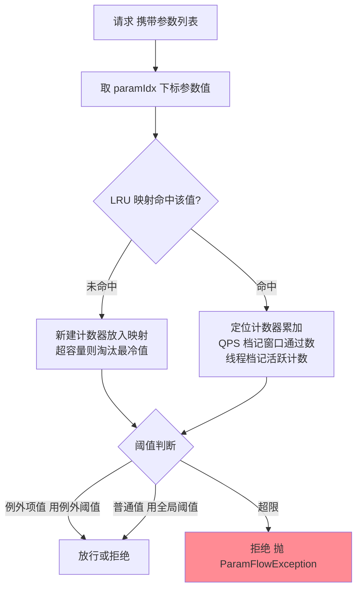
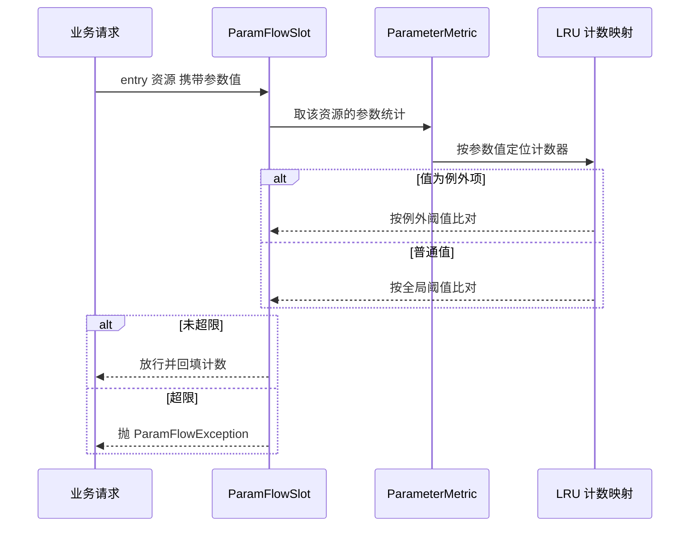
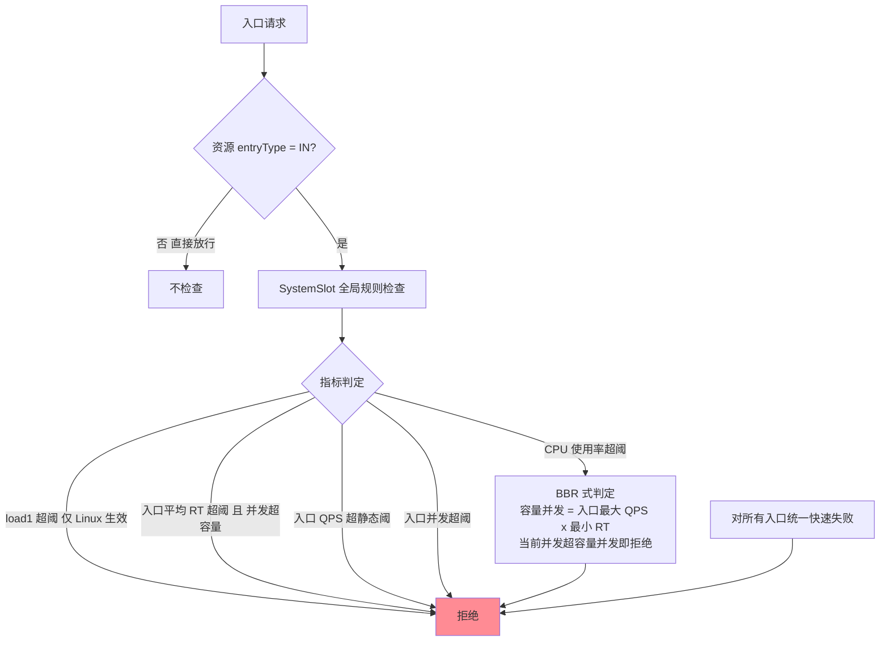

# Sentinel 热点参数限流与系统自适应：参数维度统计与整机兜底的实现

## 🎯 本文核心

> **一句话核心**：这两套机制是 Sentinel 防线里「粒度最细」与「粒度最粗」的两端——**热点参数限流**把统计从资源级拆到「参数值级」（LRU 计数映射按值分桶，例外项对特定值单独定阈值）；**系统自适应保护**把裁决放大到「整机级」（load/CPU/RT/入口 QPS/并发五类指标，对所有入口统一收敛）。一头管「个别值打爆系统」，一头管「所有细粒度规则都没想到的过载」。
>
> **机制链**：热点——请求带参数 → 取指定下标参数值 → 按值在 LRU 映射中定位计数器 → 例外项优先匹配、普通值走全局阈值 → 超限拒绝；系统——入口请求 → SystemSlot 只查 entryType=IN → 系统指标（load/CPU 采集 + 入口统计聚合）越线 → 对所有入口快速失败（CPU 超限走 BBR 式判定）。
>
> **边界声明**：入门层篇 5 讲过热点参数与授权规则的**语义与例外项用法**，入门层篇 4 讲过系统自适应**五类指标的定位与兜底口径**；本篇下探实现层——参数值分桶的 LRU 结构与容量上限、例外项的匹配语义、系统规则的入口统计聚合与 BBR 判定公式，以及两套机制的量级边界。入门层回答「配什么」，本篇回答「结构怎么撑住语义、什么规模下会失效」。

## 一句话摘要

热点参数限流的统计结构是「**资源 → 参数值 → 计数器」的两级映射**：ParameterMetric 按资源维护「值到计数器」的 LRU 缓存（QPS 档记窗口通过数、线程档记活跃计数），LRU 容量上限是它在大值域下的护身符——淘汰最冷的值、把内存账封顶，代价是热值被挤出后统计「失忆」。例外项是值级配置的精确打击：普通值低阈值、爆款值高阈值（或反之），匹配发生在分桶计数之前。系统自适应保护则是「**承认规则永远配不全**」的最后防线：五类指标里 load/CPU 读操作系统、入口 QPS/RT/线程数聚合自入口统计，CPU 超限后按 BBR 思想用「容量并发 = 吞吐 × 最小 RT」判定退避——**两套机制的公共哲学是：粒度越极端的地方，越要靠结构上限而不是参数精度来保命**。

## 一、参数维度统计：资源内再分桶的结构

结构上最重要的组件是那个 **LRU 计数映射**：每个值一个计数器，缓存有容量上限（源码常量口径默认 4000，业内认知），满了就淘汰最久未访问的值。这个上限是结构级的设计取舍——参数值域理论上是无限的（每个商品 ID、每个用户号都是一个值），不做上限，攻击者构造海量随机值就能把统计内存打爆；有了上限，最坏内存账被封顶。**追问**：LRU 淘汰会不会误伤真热点？——先回答它背后的反问：**为什么不选「不设上限的全量计数」**？——反方案分析：参数值域理论无限（每个商品 ID、每个用户号都是一个值），无上限结构在恶意构造值面前内存必被打爆，容量上限是反方案分析后的必然选择，不是偷懒。上限的代价则是它的结构性边界：当「流动值域规模 × 访问局部性」跨过容量上限，冷热值开始互相挤占，热值的计数窗口被淘汰后清零重建，限流出现「失忆式漏判」。所以热点规则的适用前提是**值域可控**：爆款数量有限（值域收敛、访问局部性强）是最佳场景；值域发散的场景（扫描型流量）热点规则只能兜住局部，主防线要交给接入层与行为分析。

**追问**：为什么线程档（THREAD）不依赖时间窗口而 QPS 档要窗口计数？——与篇 1 的 QPS/线程数同构：线程档是存量量（进入 +1/退出 -1），天然精确；QPS 档是速率量，必须靠 durationInSec 窗口聚合（规则可配，默认 1 秒，官方口径）——窗口内通过数与「阈值 × 窗口时长」比对，配合令牌余量约束突发（实现细节以源码为准）。

## 二、例外项：值级配置的匹配语义

例外项（paramFlowItemList）把「指定参数值 → 指定阈值」做成规则的局部覆盖：匹配发生在分桶计数判断之前，值命中例外项就用例外阈值，否则用全局阈值。它表达的是**值的分级**而非规则的叠加——大促主会场商品高配额、普通值低配额防爬取，一条规则承载两级语义。工程上有三个易错点：**其一，参数值类型**——机制上按值的等值语义匹配与分桶，整型/字符串等基础类型最可靠，复杂对象落到对象等值判定，语义脆弱；埋点时传基础类型是铁律。**其二，规则按参数下标生效**——一条规则只盯一个下标（paramIdx），需要同时约束多个维度时用多条规则分别对准不同下标，语义是并列裁决而不是组合约束。**其三，例外项是配置不是代码**——爆款清单随运营节奏变化，例外项的批量更新要走规则推送通道（本系列篇 4 的动态数据源），把「运营动作」翻译成「配置变更」而不是发版。

**设计思想**：例外项本质是**在统计结构里开一个「命名桶」**——全局阈值是统计的默认项，例外项是统计的特例项，两者的裁决路径在同一次检查里汇合。这种「默认 + 特例」的双层配置模型，与路由表（默认路由 + 精确路由）、防火墙规则同构：精确规则优先、默认规则兜底，学习成本与表达能力同时最优。

## 三、系统自适应保护：整机兜底的判定结构

系统规则的机制结构有两个独特点。**其一，规则是全局一份**——不像流控/熔断按资源配，系统规则挂在进程级（SystemRuleManager 持有全局规则），裁决只问「是不是入口流量」（entryType=IN），命中即对所有入口统一快速失败。**其二，指标来源分两类**——load1 与 CPU 使用率由系统指标采集（毫秒级到秒级周期，官方口径），入口 QPS/平均 RT/并发线程数聚合自入口统计（这依赖埋点规范：Web 拦截器或入口注解必须把资源标成 IN，否则系统规则读不到口径）。CPU 超限后的 BBR 式判定值得单独说：**容量并发 = 入口最大 QPS × 最小 RT / 1000**——这是 Little 定律的直接应用（并发 = 吞吐 × 时延），当前并发超过这个容量估计，说明系统已进入「时延抬升、并发堆积」的拥塞态，按 BBR 思想退避拒绝，而不是继续接客把雪崩变本加厉。

**追问**：为什么 load/CPU 类指标要「读操作系统」而不是用应用侧统计？——应用统计（RT/QPS）是「业务负载」口径，load/CPU 是「资源消耗」口径；两者会背离（慢依赖导致的线程堆积业务侧看不出 CPU 异常，邻居进程抢资源 CPU 侧先报警）。兜底网必须用**独立于业务的第二信源**，否则「规则没配到的地方」与「指标测不到的地方」会同时失守。**再追问**：为什么不选「统一用应用侧统计、省掉一套信源」？——省掉信源就是省掉兜底网的独立性：第二信源的全部价值恰在「业务侧全绿、它先红」的背离时刻，合并信源等于让兜底网共享业务统计的盲区。**打破砂锅**：信源、口径、动作连问三层，答案同构——兜底网的每个属性都要「独立、简单、不可欺骗」，任何引入业务判断的设计都在稀释它的兜底资格。

**追问**：为什么不选「按入口比例平滑收敛」、而把命中动作做成「全局快速失败」？——比例收敛（另一种做法）听起来更优雅，但比例收敛的前提是「每个入口的优先级已知」——这正是细粒度规则的职责；系统规则的定位是兜底网，语义故意保持简单：它的使命是把系统从拥塞态里最快捞出来，精细分级留给上层规则完成。把兜底语义做复杂，等于让最后一道防线也背上「判断错误」的可能——防线越靠后，越要简单可靠。这也解释了它的演进方向：部署形态稳定后，部分团队把系统规则的外围语义（告警、预案联动）上移到治理平台，进程内只保留 CPU 与 RT 这两个最不可欺骗的指标。

## 源码关键路径：从请求参数到系统指标

- **热点链路**：ParamFlowSlot（Slot 链中位于流控/熔断检查段）→ ParamFlowChecker（按 grade 分 QPS/THREAD 两路，例外项优先匹配）→ ParameterMetric（按资源聚合的参数统计容器，持 LRU 计数映射两套：QPS 计数与线程计数）→ 命中即抛 ParamFlowException。参数值通过埋点 API 携带（`entryWithArgs` 形态，注解适配层自动透传方法实参）。
- **系统链路**：SystemSlot → SystemRuleManager.checkSystem（全局规则 + entryType=IN 判定）→ 系统指标采集（load1/CPU 周期采样，OperatingSystemMXBean 口径）+ 入口统计聚合（入口 QPS/RT/线程数）→ 五类指标任一命中即拒绝；CPU 维度进入 BBR 式容量判定。
- **对照记忆**：热点是「把篇 1 的滑动窗口按参数值再乘一层」，系统规则是「把篇 1 的统计按入口维度聚合成一份整机账」——三套机制共用统计底座，只是分桶维度不同（资源 / 参数值 / 入口全集），这正是 Slot 链统计复用的架构红利。

## 不同量级的思考：架构约束驱动解法

- **十万级（约束来源：参数值域规模与统计内存的乘积）**：这一档的核心问题是统计结构要封顶，而不是阈值要多准。热点值域上万流动时，LRU 上限就是内存护城河——结构上限先于参数精度起作用。思考方式是**结构驱动**：先确认值域规模与访问局部性，再决定热点规则是否成立。这一档单机热点 + 默认系统规则阈值基本够用。
- **百万级（约束来源：单机热点统计无法表达集群叠加）**：这一档的核心问题是热值的集群总流量超出任何单机阈值的意义，而不是单机桶数不够。爆款值同时打向所有实例，每台都「没超阈值」，集群早已超容——单机热点在集群热点面前结构性失明。思考方式是**叠加驱动**：上集群热点流控（Token Server 按值统一计数）或用缓存/异步化把热点「消化」掉，限流只做最后闸门。触发升级的信号是：单机热点从未触发但爆款接口照样雪崩。
- **亿级（约束来源：热点治理成为跨系统协作问题）**：这一档的核心问题是热点清单的生产与时效，而不是任何机制参数。亿级流量下热点由运营/推荐/搜索多源头动态产生，例外项的维护节奏必须与业务节奏同步（分钟级），人工维护不可行——需要热点探测（实时统计Top 值）自动回填例外项的治理链路。思考方式是**治理驱动**：机制沉淀为底座，热点治理上升为一条业务流程。自下而上回顾：结构封顶 → 集群叠加 → 治理时效，瓶颈从「统计内存」上移到「集群语义」再到「组织协作」；触发升级的时机永远是「上一档的解法开始需要新的信息源」。

## 业内惯例与生产实践

**业内惯例**：热点规则配在「值域可控」的读接口上（商品/内容/门店维度），例外项与运营大促清单联动；系统规则的业内惯例是「CPU + 入口 RT」双指标为主，且指标口径随部署形态演进（物理机时代 load1 为主、容器时代 CPU 与 RT 为主，load1 在容器环境被普遍降权为参考值），阈值按整机压测水位标定，触发即告警复盘——生产中系统规则常年不触发才是健康态（公开口径的通行认知）。

**事故叙事一（线上排查）**：某平台的秒杀预检接口用「门店号」做热点参数，平时活跃门店数百个、局部性极强，规则运转良好。一次全渠道活动把活跃门店推到数万个，超过 LRU 容量上限——冷热值互相挤占，部分真热门店的计数被淘汰后「失忆」，限流反复漏判，热点保护形同虚设。排查还原后复盘：**热点规则的结构前提是访问局部性**——值域规模逼近统计容量时应收敛维度（按品类/渠道归一化参数）或把主防线移到接入层，而不是调大阈值硬撑。

**事故叙事二（当时复盘）**：混合部署的机器上，邻居进程半夜跑批把整机 CPU 打高，服务自身流量平稳，但系统规则的 CPU 维度命中，全站入口被统一拒绝近一小时——监控里「自己的 QPS 平稳、CPU 飙升、入口被拒」三线同现。复盘结论：CPU 是整机口径不是进程口径，混合部署下它测的是「机房的那台机器」而不是「你的服务」——**系统规则的指标必须与部署形态匹配**：独占部署可用 CPU 维度，混部环境以入口 RT 为主、CPU 需结合容器配额口径实测后再启用。排查此类问题先厘清上下游边界：流量平稳而资源指标异动，先怀疑部署形态与邻居，再怀疑自身容量——防线架构与部署形态对齐，是兜底网生效的前提。

## 什么时候用 / 什么时候不用

- **明确推荐**：值域可控、存在明显爆款值的读接口配热点规则（商品/内容 ID 维度，普通值低阈值 + 爆款例外项高阈值）；每个服务都配系统自适应兜底（CPU + 入口 RT 为主，阈值来自整机压测水位）；热点例外项更新接入规则推送通道随运营节奏动态生效。
- **不用/慎用**：值域发散的扫描型流量不靠热点规则主防（接行为分析与接入层）；混部环境慎用 load/CPU 维度（口径先实测）；系统规则不当作常态限流器（触发即说明细粒度规则有缺口）；复杂对象参数不做热点分桶（等值语义不可靠）。

## Trade-off：粒度两端的代价账

**热点端**的取舍：统计越细（按值分桶），表达力越强，但值域发散时 LRU 淘汰引入「失忆漏判」——结构上限换内存安全，牺牲的是极端值域下的统计完备性。例外项的取舍：值级配置精准但维护成本随清单规模线性涨，例外项治理本身就是一个小型配置管理系统。**系统端**的取舍：整机兜底最稳但最钝——统一拒绝没有资源优先级，「误伤面」覆盖所有入口；指标信源独立（操作系统口径）才能测到业务统计的盲区，但跨部署形态（容器/混部）的口径差异又让信源本身需要实测校准。**两端合看**：粒度越极端，参数精度的价值越低、结构设计与口径管理的价值越高——这是防线设计里「精细与兜底」的对称代价。

## 💡 实战提示

- 💡 热点参数传基础类型（整型/字符串）——复杂对象的等值语义会让分桶与例外项双双不可靠
- 💡 上热点规则前先估值域规模与访问局部性——LRU 容量上限是结构红线，值域逼近上限时先收敛维度再谈调参
- 💡 系统规则阈值来自整机压测水位，且与部署形态匹配——混部环境 load/CPU 口径先实测再启用
- 💡 系统规则触发 = 告警 + 复盘的信号，不是常态工作状态——它常年静默才是健康态
- 💡 热点例外项走规则推送通道动态更新——把运营节奏翻译成配置变更，不发版

## 你们可能会问

**Q1：热点规则和资源级流控规则会冲突吗？**
不冲突，Slot 链上各自独立裁决、顺序执行：资源级流控先挡总量，热点再按值精确约束——两层叠加是推荐形态（总量防线 + 热点防线）。拒绝异常类型不同（FlowException / ParamFlowException），降级逻辑可分别定制。

**Q2：例外项太多会不会拖垮检查性能？**
例外项是规则的局部列表，检查按值匹配，代价与例外项数量线性相关。惯例是例外项控制在个位数量级（真爆款才有资格进例外项），清单化的批量值应该用值域归一化（维度收敛）解决，而不是无限堆例外项。

**Q3：BBR 判定里的「最小 RT」从哪来？**
来自入口统计的历史窗口（系统运行期的观测值，官方源码口径），本质是用「无拥塞时的时延」作为容量估计的基准——所以服务刚启动、统计未热时 BBR 判定的置信度低，这一段靠其他指标与监控人查补位。

**Q4：入口埋点不规范，系统规则会静默失效吗？**
会——入口 QPS/RT/并发三类指标聚合自 entryType=IN 的统计，Web 场景拦截器自动埋点通常没问题，自研 RPC 入口要显式声明入口类型；load/CPU 两类不受影响（读操作系统）。系统规则上线后做一次「人为压测验证触发」，是防止静默失效的业内通行做法。

**Q5：集群热点流控是什么形态？**
与集群流控同构：各实例把「值」的计数请求交给 Token Server 统一裁决，集群维度对爆款值控总量。它解决单机热点「结构性失明」的问题，代价是 Token Server 的部署与可用性治理——只在确有集群级热点（爆款全站并发）时启用。

## 开放问题

- 热点探测与例外项的自动闭环——实时 Top 值统计自动回填例外项（带灰度与回滚），社区有实践无标准；自动化的边界（哪些值允许机器定阈值）值得讨论。
- 系统指标的容器口径统一——cgroup 感知在跨版本/跨运行时的差异，仍是「部署前必须实测」的坑，标准化的指标口径仍在演进中尚未收敛。

## 🎯 核心带走

- **核心一句话**：热点 = 「资源 → 参数值 → LRU 计数器」两级映射 + 例外项值级覆盖；系统自适应 = 进程级全局规则 + 双信源指标（操作系统口径 + 入口聚合）+ BBR 式容量判定，对所有入口统一收敛
- **机制链**：热点——取下标值 → LRU 定位计数 → 例外项优先、全局阈值兜底 → 超限拒；系统——IN 入口判定 → 五类指标判定（CPU 走容量并发公式）→ 命中即全站快速失败
- **失效点/边界**：值域发散击穿 LRU 局部性 = 失忆漏判；集群热点单机失明；混部下 load/CPU 口径失真；入口埋点不规范 = 系统规则静默失效

## 附录：关键类速查表

| 类 | 位置（包级） | 职责 |
|---|---|---|
| ParamFlowSlot / ParamFlowChecker | slots.block.flow.param | 热点检查入口与 QPS/线程两路裁决 |
| ParamFlowRule / ParamFlowRuleItem | slots.block.flow.param | 规则参数与例外项（值级阈值）载体 |
| ParameterMetric | slots.block.flow.param | 按资源的参数统计容器（LRU 计数映射） |
| SystemSlot / SystemRuleManager | slots.system | 全局规则持有与入口统一裁决 |
| SystemRule | slots.system | 五类指标阈值载体（load/CPU/RT/QPS/线程） |
| 系统指标采集 | core（系统指标模块） | load1/CPU 周期采样（OperatingSystemMXBean 口径） |

## 📌 数据与事实声明

- 写于 2026-09-18，对标 Sentinel 1.8.x；LRU 容量上限、durationInSec 默认值、BBR 判定公式等为官方源码与 Wiki 公开口径，具体数值以所引版本源码为准
- 事故叙事已匿名化，数字为方法论口径；容器 CPU 口径差异为业内公开认知，不指向任何特定公司

## 📚 参考资料

| 类型 | 标题 | 来源 |
|---|---|---|
| 官方 Wiki | 热点参数限流 / 系统自适应保护 | github.com/alibaba/Sentinel/wiki |
| 官方源码 | param / system 包（ParameterMetric、SystemRuleManager） | github.com/alibaba/Sentinel（1.8.x master） |
| 原理参照 | Little 定律与 BBR 拥塞控制思想 | 公开学术与工程文献 |
| 关联文章 | 入门层篇 5（热点与授权语义）、本系列篇 1（滑动窗口）、篇 4（规则推送） | 本仓库 docs/middleware/sentinel/ |
