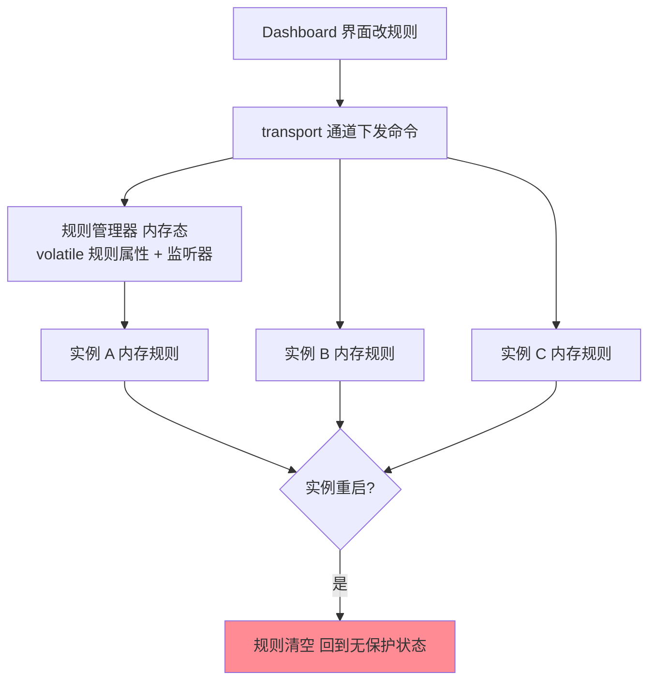
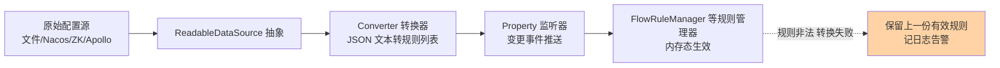
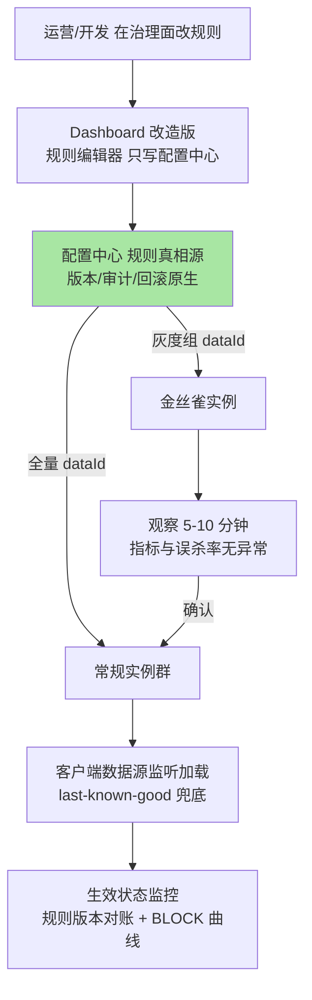

# Sentinel 规则持久化与动态数据源：从内存态到配置中心的生产架构

## 🎯 本文核心

> **一句话核心**：Sentinel 的规则默认活在**进程内存**里——这是「轻量与解耦」的设计选择，也埋下三个工程问题：重启即丢、多实例不同步、无审计无回滚。解法是把「规则从哪来」抽象成**数据源扩展点**：ReadableDataSource 统一「读取 + 转换 + 监听」三件事，pull 模式（轮询文件）与 push 模式（Nacos/ZooKeeper 等配置中心监听）是同一个抽象的两种实现，生产推荐架构 = **配置中心为规则真相源 + Dashboard 改造为规则编辑器 + 灰度/审计/回滚安全网**。
>
> **机制链**：规则管理器（内存态 volatile 属性 + 监听器）← 数据源加载/变更事件 ← 数据源实现（文件轮询 pull / 配置中心监听 push）← 配置中心 ← 管理面（Dashboard 改造或治理平台）。
>
> **边界声明**：入门层篇 6 讲过接入方式、Dashboard 定位与三种推送模式的**选型结论**（生产必选推模式）；本篇下探实现层——内存态丢失问题的机制根因、数据源抽象的接口契约、Nacos/ZooKeeper 适配的实现要点、以及生产推荐架构里「谁写、谁存、谁听、谁兜底」的完整闭环。入门层回答「选哪种」，本篇回答「怎么搭、怎么防失效」。

## 一句话摘要

内存态规则的丢失不是 Bug 而是架构选择：规则管理器用「volatile 属性 + 监听器」承载规则，transport 通道把 Dashboard 的修改直接写进内存——**进程内零存储依赖换来管理面与执行面的完全解耦**，代价是把持久化责任整体外移给集成方。数据源抽象正是这条外移路径的官方答案：一个接口管三件事（读原始配置、类型转换成规则列表、注册变更监听），pull 实现靠定时轮询（延迟分钟级、实现零依赖），push 实现靠配置中心长连接监听（秒级触达、天然持久化与审计）。生产架构的核心动作是**反转写入方向**：原生 Dashboard 只会写客户端内存，生产上必须改造它写配置中心——让配置中心成为唯一真相源，客户端只听不写；再补上灰度推送、变更审计、一键回滚三件套，规则变更才从「裸奔」变成「工程」。

## 一、内存态：规则的默认宿主与丢失根因

机制根因要拆到三层。**第一层是存储**：各类规则管理器（FlowRuleManager 等）在进程内以「资源名 → 规则列表」的内存结构持有规则，更新走属性写入 + 通知监听器——进程就是这个结构的全部生命周期，重启自然是白纸。**第二层是同步**：每条规则只写进了「收到命令的那批实例」的内存，实例之间没有对账机制——扩容新实例、替换实例都不继承规则，运行一段时间后「各实例规则集漂移」是常态。**第三层是治理**：内存态没有版本、没有修改记录、没有回滚锚点，误操作无法追溯。三层问题的公共根源是：**Sentinel 把自己定位为「裁决引擎」而不是「规则系统」**——进程内保持薄、可替换存储，这个边界本身是对的，错误的是拿原始模式直接上生产。

**追问**：为什么不选「引擎内嵌本地文件持久化兜底」？——反方案分析：如果引擎自动把内存规则落盘、重启自动恢复，会制造「规则已持久化」的错觉：落盘的是「某一台实例在某时刻的规则集」，多实例漂移的规则被某台的重启结果「定格」，反而把漂移固化为冲突——**半吊子持久化比不持久化更危险**。**再追问**：那 pull 模式的文件轮询算不算「本地持久化」？——不算：文件在 pull 模式里是「配置的载体」而非「引擎的记忆」，真相源仍约定在文件上游（人工或平台维护），引擎只读不写——边界没有破。引擎层保持无存储，把持久化的语义完整地交给配置中心（有版本、有对账、有审计），是边界干净的做法。

## 二、数据源抽象：把「规则从哪来」做成扩展点

数据源抽象的接口契约只有三件事：**读**（从源拿原始配置）、**转**（字符串按规则类型反序列化成规则列表）、**听**（注册变更回调，源变了推给规则管理器）。这个抽象的价值在「听」——规则管理器只暴露属性监听器，数据源是唯一的写入方，引擎内不再有第二条改规则的路径，规则生效的时序就变得可推理。实现侧再配一层启动装配：数据源实例按初始化扩展点自动注册（SPI 机制，Spring Cloud Alibaba 整合下由自动装配类按配置批量创建，官方文档口径），应用启动即完成「连源、拉全量、挂监听」三步。

转换失败的兜底是这套抽象的隐形契约：配置内容非法（JSON 坏、字段缺失、阈值越界）时转换器抛错，规则管理器**保留上一份有效规则**而不是清空——「last-known-good」语义。**追问**：为什么不选「空规则 + 告警」的语义？——防护系统的失效方向必须是保守的：坏规则顶多是旧规则继续生效（失效模式=不更新），清空规则的失效模式是「全站裸奔」（失效模式=失去保护）——两者在故障时的差距是雪崩与平稳的区别。

## 三、pull 与 push：两种实现的要点与差异

| 维度 | pull 模式（轮询） | push 模式（配置中心监听） |
|---|---|---|
| 触达机制 | 客户端定时轮询文件/存储 | 服务端变更推送（长连接监听） |
| 时效 | 轮询间隔级（分钟级常见） | 秒级 |
| 持久化 | 靠文件/存储自管 | 配置中心原生持久化 + 版本 |
| 依赖 | 无新组件（可用本地文件） | 引入配置中心（多数生产环境已有） |
| 审计回滚 | 自己造 | 配置中心原生能力 |
| 典型实现 | FileRefreshableDataSource（内容指纹比对轮询） | NacosDataSource / ZookeeperDataSource / ApolloDataSource |

**Nacos 适配的实现要点**：数据源初始化时按 group + dataId 建立配置监听，收到变更回调后走「转换器 → 更新规则属性」两步；要点有三——**命名约定先行**（惯例是一个应用一种规则类型一个 dataId，如应用名-流控规则，group 承载环境隔离），**全量覆盖语义**（每次推送都是该类型规则的完整列表，客户端不做增量合并——增量语义交给人脑和平台，机器只认全量，简单且可对账），**连接断开的行为**（监听断连后客户端持 last-known-good 规则继续工作，重连后自动对齐——执行面不因管理面抖动而裸奔）。**ZooKeeper 适配的实现要点**：用节点数据承载规则 JSON、节点监听（缓存监听形态）感知变更，要点在于会话过期与节点重建——ZK 会话过期时监听器需要重建，实现里必须处理「临时节点丢失/重连风暴」的窗口，业内常见坑是只注册一次监听、断连后永久失聪。

**追问**：为什么 push 模式「秒级触达」反而要配灰度推送？——触达速度与爆炸半径成正比：一次误改的全量规则，秒级覆盖数百实例，回滚也要等一个推送周期；全量快推没有给「发现问题」留时间窗。所以生产的推送通道必须自带节奏控制：先推金丝雀实例观察、再全量铺开——**推送速度是引擎给的，推送节奏是治理面自己造的**。**打破砂锅**：从「要不要内嵌落盘」、到「坏配置保旧还是清空」、再到「快通道配不配灰度」，三个追问的答案在一条线上——凡是「变更」都要给错误留退路：真相源有版本可回滚、坏配置有 last-known-good 保底、快通道有灰度窗口刹车。

## 四、生产推荐架构：谁写、谁存、谁听、谁兜底

生产架构的四个角色分工：**写**——改造 Dashboard（或自建治理平台）把规则写入配置中心而不是直推内存，写入即有版本；**存**——配置中心是唯一真相源，group 隔离环境（测试/预发/生产各一个 group），dataId 承载「应用 × 规则类型」；**听**——客户端只挂数据源监听，绝不做「写」的动作（客户端写内存 = 重新制造漂移）；**兜底**——三层：转换失败保 last-known-good、配置中心不可用时客户端按最后规则继续工作、平台层保留「最近有效版本」支持一键回滚。再叠加三件套：**灰度推送**（金丝雀实例先吃规则）、**变更审计**（谁、何时、改了什么、为什么）、**一键回滚**（版本快照切换），这条链路上的每一环都有明确的责任人。

**设计思想**：这套架构的本质是给「规则」补齐了它作为**生产资产**的全部属性——版本、环境、审批、回滚、对账。Sentinel 引擎只认「属性变更事件」，资产属性全部外置到配置中心与治理面——「引擎无状态、资产有治理」，与「代码在 Git、进程只编译执行」是同一个架构直觉。检查自己环境是否健康的试金石只有一条：**随便杀掉任何一个组件（Dashboard/配置中心/任意实例），规则的生效状态是否仍然可预期**。

## 源码关键路径：从接口到两个适配器

- **规则管理器**（FlowRuleManager 形态）：静态持有「资源名 → 规则列表」的内存属性，对外暴露「注册监听器 + 更新属性」两个原语——这是所有数据源写入的终点，也是内存态的物理边界。
- **ReadableDataSource 接口**：读、转、听三件事的契约；AutoRefreshDataSource 基类为 pull 型实现提供轮询骨架（内容指纹无变化则跳过转换，避免空转重载）。
- **NacosDataSource**：构造时建配置服务与监听，回调里「取最新配置 → 转换 → 更新属性」；转换失败走异常路径保住旧规则（对应第二节的 last-known-good 语义）。
- **ZookeeperDataSource**：基于客户端的节点缓存监听，节点数据变更触发同样的「转换 + 更新」；实现里对监听的重建（会话过期场景）做了补偿——选型 ZK 时要确认所用版本的这一行为。
- **启动装配**：初始化扩展点（SPI）在首次规则访问前装配数据源；Spring Cloud Alibaba 整合下由自动装配按 `spring.cloud.sentinel.datasource` 配置批量创建——两种方式殊途同归，选其一，避免双注册互相覆盖。

## 不同量级的思考：架构约束驱动解法

- **十万级（约束来源：规则规模小、团队注意力有限）**：这一档的核心问题是「别忘配」，而不是治理体系多完善。推模式数据源 + 少量规则 + Dashboard 改造一步到位即可，三件套可以用配置中心原生能力凑齐（版本即回滚、操作日志即审计）。思考方式是**成本驱动**：用现成组件的原生能力拼出 80 分治理，不自建平台。这一档最大的风险仍是「忘了改造 Dashboard、原始模式上生产」。
- **百万级（约束来源：规则条数与服务数同时起量，人工维护失守）**：这一档的核心问题是规则的生产率与正确率，而不是单条推送的速度。数百服务 × 每服务数十条规则，手工编辑不可持续——需要规则模板（按服务分级套参数模板）、批量变更、生效状态对账。思考方式是**平台驱动**：治理面从「Dashboard 二开」升级为「规则治理平台」，配置中心降级为存储组件。触发升级的信号是：规则误配次数随服务数线性上涨。
- **亿级（约束来源：多组织多环境多集群的规则自治需求）**：这一档的核心问题是规则的归属权与隔离域，而不是平台的吞吐。多业务线共用一套防护设施时，规则的编辑权、审批流、配额都要按组织切分——治理平台演进出多租户形态，配置中心按集群分片。思考方式是**组织驱动**：技术架构跟着组织边界走，规则治理面最终长成「防护领域的配置管理中间件」。自下而上回顾：别忘配 → 别配错 → 别越权，瓶颈从「注意力」上移到「生产率」再到「组织边界」；触发升级的时机永远是「上一档的工具开始被滥用出事故」。

## 业内惯例与生产实践

**业内惯例**：数据源选型跟着公司既有配置中心走（不为此引入新组件是铁律，公开口径的通行认知）；命名约定「应用名-规则类型」级 dataId + 环境 group；规则变更走与代码发布同级的变更流程（审批 + 窗口 + 观察）；大促前做「规则快照冻结」——冻结期禁改规则，变更走紧急通道加审批。

**事故叙事一（线上排查）**：某团队早期用原始模式在生产跑了一个季度，规则全靠 Dashboard 现配。一次例行扩容，新实例挂上来没有任何规则（内存态不同步），当晚流量高峰全部打到新实例——无流控无熔断，下游缓存被打穿，故障持续到人工发现并补配规则。复盘把「规则不随实例走」列为一级风险，全员迁移推模式数据源；**教训的机制层结论是：规则的生效单元是进程，实例生命周期与规则生命周期必须解耦——解耦的唯一途径是进程外的真相源**。

**事故叙事二（当时复盘）**：一次紧急限流，值班同学在治理面把某接口阈值从 2000 改成 200（本想改另一个测试项），全量推送秒级生效，正常业务流量被大面积拒绝约 12 分钟。复盘暴露三个缺口：无灰度（没有金丝雀观察窗口）、无审计（当时的规则版本找不回）、无回滚（只能手改回来）。修复即落地三件套：灰度组 dataId + 变更必填备注 + 版本一键回滚；并把「阈值类变更必须先推金丝雀 5 分钟」写进值班手册。**机制层结论：推送速度是引擎给的，推送节奏必须是治理造的——没有节奏控制的推送通道，速度越快事故越大**。

## 什么时候用 / 什么时候不用

- **明确推荐**：生产环境一律推模式数据源 + 配置中心真相源 + Dashboard/平台写配置中心的改造；测试与本地开发可用 pull 模式或原始模式（就地验证语义）；规则变更必走灰度 + 审计 + 回滚三件套；大促期规则快照冻结。
- **不用/慎用**：不拿原始模式上生产（重启即丢 + 漂移，两条都是定时炸弹）；不在客户端代码里手工维护规则（绕开数据源 = 绕开真相源，漂移复发）；不用 pull 模式承载紧急止血类规则（分钟级时效撑不住止损窗口）；不为 Sentinel 单独引入一套新配置中心（复用公司既有设施）。

## Trade-off：解耦的代价与治理的补位

**引擎无存储**的取舍：进程内裁决引擎保持薄、零存储依赖，换来的解耦与可替换性，代价是持久化责任外移——集成方必须补上配置中心与治理面，这是「轻量内核」的账单，逃避账单就是原始模式裸奔。**全量推送**的取舍：全量语义简单可对账，代价是大规则集的推送成本与变更粒度粗糙——到专题层规模需要平台层的 diff 计算来补表达力。**秒级触达**的取舍：时效换来爆炸半径，必须用灰度节奏对冲——推送通道的速度与治理流程的节拍是互补设计而非二选一。**统一真相源**的取舍：配置中心单一真相源消灭了漂移，代价是它自己成为关键依赖——所以客户端的 last-known-good 与平台的版本快照是对「真相源自身故障」的双保险。每一项取舍都在回答同一个问题：**简单性与工程完备性的边界放在哪一层**。

## 💡 实战提示

- 💡 生产及格线三件套一次配齐：推模式数据源 + Dashboard 写配置中心的改造 + 生效状态监控——缺任何一件都是变相裸奔
- 💡 客户端只听不写：任何「代码里手工改规则」的捷径都会让多实例规则漂移复发
- 💡 转换失败保 last-known-good 是兜底语义——配置内容合法性（JSON 校验 + 阈值边界）要在治理面写入时就拦，不要等客户端转换报错
- 💡 数据源命名约定先行：一个应用一种规则类型一个 dataId，group 隔离环境——命名乱了的代价在排障时加倍偿还
- 💡 规则变更与代码发布同级治理：灰度推送 + 变更审计 + 一键回滚，阈值类变更先金丝雀观察 5 分钟

## 你们可能会问

**Q1：配置中心挂了，限流熔断还能工作吗？**
能——客户端持有 last-known-good 规则继续裁决，配置中心故障只影响「改规则」，不影响「已生效规则」。这正是执行面与管理面解耦的价值；但要监控数据源的连接状态，长时间断连意味着规则冻结在某个时点，应触发告警。

**Q2：为什么不选「Dashboard 直接绑定配置中心」，而要做成改造点？**
Dashboard 定位是轻量演示与管理组件，绑定具体配置中心实现会抬高上手门槛、锁死生态选择；推模式的官方姿势就是「改造 Dashboard 的规则发布接口指向配置中心」（官方 Wiki 给出了改造指引口径）——把「编辑器」与「真相源」分离，是刻意留下的集成点而不是缺陷。

**Q3：多种规则类型怎么组织数据源？**
每种规则类型一个数据源实例、一个 dataId（流控/熔断/热点/系统各一份），转换器各配各的。不要把所有规则塞进一个 JSON 大对象——全量覆盖语义下，混一个大文件意味着改一条限流也要重推全部规则类型，风险面无谓放大。

**Q4：灰度推送怎么做？实例是怎么「分组」的？**
两种惯用路数：其一，按 dataId 分组（金丝雀实例订阅灰度 dataId，验证后把变更同步到全量 dataId）；其二，配置内容带实例标签条件，客户端按自身标签决定是否采用（需要平台与客户端约定协议）。开源版不内置，三件套通常在治理平台层自建——这正是「开源组件上生产」的典型改造清单条目。

**Q5：规则生效的延迟链路有多长？**
治理面写配置中心（秒内）→ 配置中心推客户端（秒级）→ 客户端转换与属性更新（毫秒级）——端到端常规秒级到 10 秒级（公开口径认知）。止血类操作要按这个延迟预估「生效前还会漏过多少流量」，必要时叠加接入层限流先行。

## 开放问题

- 规则灰度协议的标准化——金丝雀分组、标签条件的下发协议尚无社区标准，各家平台自建，跨团队迁移成本高，值得讨论统一形态。
- 规则即代码（Rule as Code）的实践边界——规则进 Git 走代码评审、由流水线推送配置中心的形态在部分团队实践，与「治理面直接编辑」的效率权衡尚未定论。

## 🎯 核心带走

- **核心一句话**：规则默认内存态（轻量内核，持久化责任外移）→ 数据源抽象统一「读、转、听」→ push 模式（配置中心监听）为生产形态 → 生产架构 = 配置中心真相源 + 治理面只写配置中心 + last-known-good 与三件套兜底
- **机制链**：治理面编辑 → 配置中心（版本/审计/回滚）→ 灰度 dataId 分发 → 客户端数据源监听 → 转换器 → 规则属性更新 → 内存生效；转换失败保旧规则，断连持最后规则
- **失效点/边界**：原始模式重启即丢 + 实例漂移；客户端手写规则破坏真相源；秒级推送无灰度 = 秒级事故放大；pull 模式分钟级时效撑不住止血窗口

## 附录：关键类速查表

| 类 | 位置（包级） | 职责 |
|---|---|---|
| FlowRuleManager 等规则管理器 | slots.block.flow 等 | 内存态规则属性 + 监听器（写入终点） |
| ReadableDataSource（接口） | datasource | 读、转、听三件事的扩展点契约 |
| AutoRefreshDataSource | datasource | pull 型实现的轮询骨架（内容指纹比对） |
| FileRefreshableDataSource | datasource | 文件轮询实现（pull 模式代表） |
| NacosDataSource / ZookeeperDataSource | datasource（扩展适配器） | 配置中心监听实现（push 模式代表） |
| InitExecutor / 初始化扩展点 | init | SPI 装配数据源（启动时连源、拉全量、挂监听） |

## 📌 数据与事实声明

- 写于 2026-09-18，对标 Sentinel 1.8.x；数据源接口、初始化机制、Dashboard 改造指引为官方文档与源码公开口径，具体类名与行为以所引版本源码为准
- 时效数字（秒级/分钟级）为业内公开口径的方法论描述；事故叙事已匿名化，不指向任何特定公司

## 📚 参考资料

| 类型 | 标题 | 来源 |
|---|---|---|
| 官方 Wiki | 在生产环境中使用 Sentinel（规则推送模式改造指引） | github.com/alibaba/Sentinel/wiki |
| 官方源码 | datasource 包与各数据源适配器 | github.com/alibaba/Sentinel（1.8.x master） |
| 生态文档 | Nacos / ZooKeeper 配置监听机制文档 | 各项目官方文档站 |
| 关联文章 | 入门层篇 6（接入与推送选型）、本系列篇 3（例外项动态更新） | 本仓库 docs/middleware/sentinel/ |
