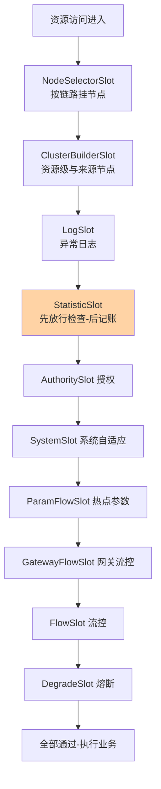
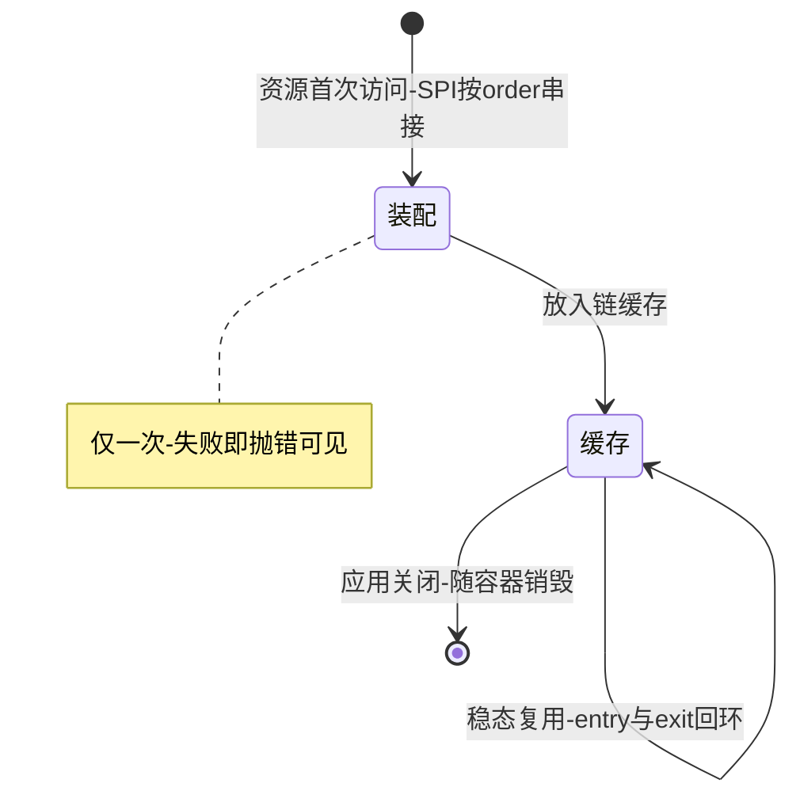
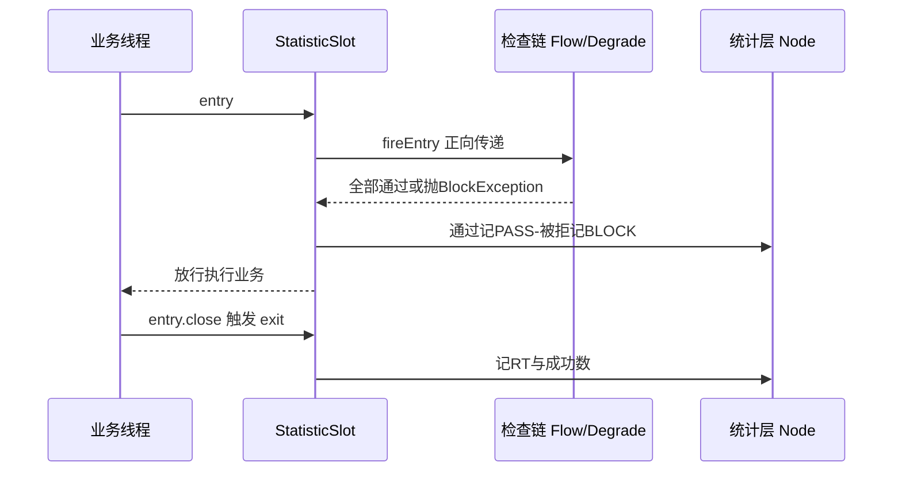

# Slot 责任链深读：编排顺序与 SPI 扩展机制

> **本文核心**：Sentinel 的全部功能都发生在一条 Slot 责任链上——节点选择、统计构建、检查判定、记账回写各由一个 Slot 承担，链的形状决定组件的行为边界。编排有三条铁律：**Slot 单例共享、链按资源构建**（同一个 Slot 实例被所有资源的链复用，靠 context 参数区分数据归属）；**entry 正向传递、exit 反向回环**（判定在去程、记账在回程，StatisticSlot 恰好卡在两程的交汇点上）；**链成员由 SPI 按序装配**（1.8 起每个 Slot 用 order 注解声明位置，第三方 Slot 与原生 Slot 同场排序）——三条铁律合起来，把「一个检查框架」变成「一台可改装的判定机器」。**机制链**：资源首次被访问 → 查缓存无链 → SPI 加载全部 ProcessorSlot 按 order 排序 → 拼成该资源的链并缓存 → entry 正向过检查链 → 全部放行则执行业务 → exit 反向回环记账。

## 一句话摘要

读懂责任链就是读懂 Sentinel 的骨架：九个默认 Slot 按固定序编排（先建节点再统计、先记账位再检查、最后流控熔断），SPI 机制让这个序列可插拔——**编排顺序不是实现细节，而是语义本身**：任何 Slot 挪一个位置，读到的是不同的统计、挡住的是不同的流量。

## 前置阅读

- 入门层篇 2《核心概念与心智模型》（资源 / context / Slot 的主语关系）
- 本系列流控算法篇 1《滑动窗口 LeapArray 与统计结构》（统计层如何被喂饱）
- Sentinel 官方 wiki「自定义 Slot」章节（公开口径）

## 目标导向

本文是什么：Slot 责任链的编排机制与 SPI 扩展面深读。功能：拆解默认链的九个位置及其语义、entry/exit 双向传递、SPI 装配与 order 排序的源码关键路径。收益：能安全地插入自定义 Slot（不踩顺序坑）、能读懂官方 Slot 的分工逻辑、能设计链路级的扩展点位。必看场景：自定义扩展开发、Slot 顺序排障、框架层改造评审。

## 5W 速记卡

| 维度 | 一句话 |
|---|---|
| What | 按资源构建、按 order 排序的 Slot 责任链与 SPI 装配机制 |
| Why | 检查与记账的编排顺序决定判定语义与数据正确性 |
| When | 自定义 Slot 开发、链路行为排障、扩展点设计 |
| Where | CtSph 链缓存与 DefaultSlotChainBuilder |
| How | SPI 加载 → order 排序 → 按资源拼链缓存 → entry 正向 / exit 反向 |

## 一、默认链的九个位置：先建结构、再记账位、后做检查

1.8 默认链按 order 从小到大依次是：NodeSelectorSlot、ClusterBuilderSlot、LogSlot、StatisticSlot、AuthoritySlot、SystemSlot、ParamFlowSlot、GatewayFlowSlot（网关场景）、FlowSlot、DegradeSlot。这个顺序是三段式的：**前三个 Slot 建结构**（NodeSelector 按调用链路挂 DefaultNode、ClusterBuilder 挂资源级 ClusterNode 与来源 OriginNode、Log 落异常日志）；**StatisticSlot 建记账位**（order 排在检查类之前，但它的记账动作发生在检查之后——先 fire 让后面的检查链跑完，再按结果记 pass 或 block）；**后五个 Slot 做检查**（授权、系统自适应、热点参数、网关流控、普通流控、熔断，强度从「旁路校验」递进到「熔断兜底」）。



顺序里最有味道的是 StatisticSlot 的「位前记后」。它排在检查类之前（所以它能包住整个检查过程），但 entry 方法体是「先 fireEntry 把请求往检查链送，等检查链全部通过才记通过数；任何一个检查抛 BlockException 就记拒绝数」——**记账位在前、记账动作在后**，这保证了统计只记「判定结果」而不记「判定过程」，篇 1 统计层里「完成量」口径（熔断分母不含被限流请求）就是这句话的物理结果。

把九个位置当角色表读会更牢：前三个 Slot 是「建设者」，负责把这次访问登记进节点体系（链路节点、资源节点、来源节点），它们失败等于地基没打；StatisticSlot 是「记录员」，只忠实记录检查链的裁决；后五个是「裁判」，从旁路校验（授权、系统水位）到主判定（热点、网关、流控、熔断）强度递增，任何一个裁判举手，请求就走拒绝路径、由记录员记下原因。**角色分工与位置的对应关系，是理解一切链行为的第一性框架**——排障时先问「哪个角色出了问题」，再定位到具体 Slot，比按代码文件盲找快得多。

## 二、关键路径：链的缓存与双向传递

链的构建与查找在 CtSph（Sentinel 的入口协调者）里，关键路径两段：

```java
// 1. 查链缓存：同一资源只建一次链（简化注释版）
ProcessorSlot<Object> lookProcessChain(ResourceWrapper resource) {
    ProcessorSlotChain chain = chainMap.get(resource);
    if (chain == null) {
        synchronized (this) {                  // 双重检查锁
            chain = chainMap.get(resource);
            if (chain == null) {
                chain = slotChainBuilder.build();   // SPI 装配一条新链
                chainMap.put(resource, chain);
            }
        }
    }
    return chain;
}
// 2. SPI 装配：加载全部 ProcessorSlot 实现按 order 升序串接
// DefaultSlotChainBuilder: SpiLoader.of(ProcessorSlot.class).loadInstanceListSorted()
//                          逐个 addLast 拼成链
```

两个设计决策值得精读。**决策一：链按资源缓存、Slot 全局单例**——每个资源一条链，但链上的 Slot 对象是共享实例（SPI 默认单例加载）；Slot 内部不持有请求态数据，一切按 context 与 resource 参数在调用间区分。这把链的内存成本锁死在「每资源一条链的节点对象」量级，Slot 本身零复制。**决策二：entry 与 exit 双向回环**——业务执行结束（或异常）时 Entry.close 触发 exit，沿链反向回环，StatisticSlot 在回程里记 RT 与成功数；**去程判定、回程记账**的两段式让「业务耗时」天然被包在链的进出之间，不需要额外计时埋点。一条链的一生也就三态：资源首次访问时装配、进入缓存稳态复用、应用关闭随容器销毁——绝大多数链一旦建好便终身服役，装配成本被请求量摊薄到接近零。





## 三、SPI 机制：order 排序与第三方同场装配

1.8 把链装配从硬编码数组改成 SPI：每个 ProcessorSlot 实现用注解声明 order 值，SPI 加载器从 classpath 的服务声明文件里读出全部实现、实例化、按 order 升序串接。**这个改动把扩展面从「改源码」降为「加 jar 包」**：第三方实现自己的 Slot、声明一个 order、注册服务文件，就能插进所有资源的链——业内惯例里，监控埋点、业务自定义熔断、多租户计量等能力都是这样挂进去的。排位置的口诀是「**想读统计就在 StatisticSlot 之后，想做检查就在对应检查之前，想包住全程就在最前**」——order 是语义声明，不是随意数字。

| 位置区间 | 该区间能拿到什么 | 典型扩展 |
|---|---|---|
| StatisticSlot 之前 | 判定前的原始 context | 请求打标、环境探测 |
| StatisticSlot 之后至检查链中 | 已建好的节点与统计读数 | 自定义检查规则 |
| 检查链之后 | 各检查的最终裁决 | 二次兜底、审计记录 |

号段纪律是把 order 用成治理工具的具体做法：平台把号段划给原生 Slot（最大负值区）、平台扩展件（中间区）、业务扩展件（贴近检查链区），三方各占各的段、评审只看跨界申请。生产实践中，号段表随平台规范发布、变更走评审——**数值本身没有魔法，可审计的归属才是价值**。

## 四、与经典责任链模式的区别：全链执行与双向回环

| 维度 | GoF 责任链模式 | Sentinel Slot 链 |
|---|---|---|
| 传递语义 | 处理者决定是否继续传递 | 固定编排-默认全链执行 |
| 方向 | 单向 | entry 正向 + exit 反向回环 |
| 成员状态 | 通常每请求新建处理者 | Slot 单例-按 context 区分 |
| 装配方式 | 客户端组装 | SPI 按 order 全局装配 |

Sentinel 的链借了责任链的形，改掉了它的三个习性：不允许中途「截流不传递」（检查类 Slot 抛异常即中断，放行则必然走完全链）、增加了反向回程（记账语义）、成员单例化（性能语义）。**框架里的模式从来不是教科书模式——读源码前先把教科书的假设清空**，否则会带着「处理者可以不传递」的预期读出错误的并发结论。

## 五、不同量级的思考：扩展面随规模的换挡

- **十万级（单应用扩展）**：约束来源是改动风险——这一档的核心问题是「别把链改坏」，而不是「扩展点多不多」。自定义 Slot 控制在一到两个、order 贴着语义区间取值、必须跑压测对账统计口径（自定义 Slot 在 StatisticSlot 之前读统计会读到半成品），思考方式是风险驱动：链是全局共用的判定主干，任何插入都是全量流量的行为变更。自下而上收尾：单应用内验证通过；向上触发升级的条件是多应用复用——jar 包的分发与版本治理成为新命题。
- **百万级（平台化扩展）**：约束来源是扩展件的多团队共享——这一档的核心问题是「扩展件的治理」，而不是「能不能插」。思考方式是治理驱动：扩展 Slot 收敛为平台提供的能力件（统一埋点、统一租户计量），业务团队不再各自插链；SPI 服务文件的打包纪律进 CI（shade 打包必须合并 services 文件，见事故叙事二）。向上触发升级的条件是跨语言——Java 链的扩展语义要翻译到多语言探针。
- **亿级（多语言与云原生）**：约束来源是链语义的跨语言一致性——这一档的核心问题是「扩展语义的标准化」，而不是「Java 链的性能」。思考方式是标准驱动：把 Slot 的抽象提炼为跨语言的拦截器契约（社区正沿 OpenSergo 等方向探索标准化，概念级），各语言实现各自的链但共享规则与观测语义。自下而上收尾：无论哪一档，链的编排铁律（单例、双向、SPI 排序）都没变过——变的是扩展件的所有权与治理结构。

## 六、典型场景与误区

**典型场景**：业务维度熔断（自定义 Slot 读业务指标做判定，挂在检查链中段）；统一调用标签（最前端 Slot 给 context 打租户/机房标，供后续检查与统计使用）；审计与回放（检查链末端记录每条规则的裁决结果）；多活路由联动（读系统规则的同时输出路由建议）。选点时按「能力归属」倒推：属于判定语义的进检查区间、属于观测语义的进末端、属于环境语义的进最前端——选点错了能力就会寄生在错误的位置，后续治理成本翻倍。

**常见误区**：① **自定义 Slot 插在 StatisticSlot 之前读统计**——读到的节点统计是半成品甚至为空，判定永远不触发；想读统计必须排在它之后；② **Slot 里存请求态成员变量**——Slot 是全局单例，成员变量会被并发请求互相覆盖，数据必须挂 context 或局部传递，这是自定义 Slot 最高频的正确性事故；③ **exit 里忘记或重复释放资源**——Entry 未关闭会导致 RT 与成功数统计泄漏（永远等不到回程记账），线程内嵌套调用时要保证 entry 与 close 配对；④ **服务声明文件在打包时丢失**——SPI 靠 classpath 的服务文件发现实现，shade/assembly 打包不合并服务文件时 Slot 静默缺席、链行为回到默认且无报错。

## 七、事故与实践叙事

**事故一：order 手滑导致统计口径漂移**。某团队的自定义限流 Slot 想读「最近一秒通过量」，order 配到了 StatisticSlot 之前——测试环境单接口压测「一切正常」（节点恰好为空、走了兜底分支），上线后规则判定数据始终比监控曲线低一截，限流形同虚设。排查用了一周：先怀疑统计层，最后发现是 Slot 位置。复盘把「自定义 Slot 必须声明与 StatisticSlot 的相对位置及理由」写进评审清单。**教训**：order 是语义声明——链上没有「随意」的位置，每个 order 值都该能回答「为什么在这个 Slot 前面」。

**事故二：shade 打包吞掉 SPI 文件**。某应用用 shade 插件打 fat jar，第三方扩展 jar 的服务声明文件与主应用的同名文件合并失败，扩展 Slot 在生产链里静默缺席——业务自定义的灰度判定没生效，全量流量直接打到新版本，触发一晚上的隐性故障。修复是在打包配置里显式合并服务描述文件，并在启动日志里打印「链上 Slot 清单」做自检。**教训**：SPI 的失败模式是静默缺席而不是报错——**装配结果必须可观测**，启动时打印链清单是成本最低的自检。

**实践叙事：用链清单做升级对照**。某平台团队把「启动期打印 Slot 链顺序清单」做成标准能力，每次升级 Sentinel 版本或扩展 jar，自动对照新旧链清单差异。1.8 升级时正是这份清单暴露了网关 Slot 位置变化带来的顺序调整需求，提前修掉了两处 order 假设。**把装配结果当数据看，是治理可插拔架构的通用手法**。

## 八、设计思想：编排即语义的扩展面

Slot 链的设计哲学可以压缩成一句话：**把「功能」拆成「位置」**——限流不是一段代码，是链上的一个位置；统计不是一模块，是去程与回程的交汇点。位置化的收益是扩展的原子性（插拔一个位置不惊动其他位置）与语义的可推理（每个位置的输入输出由编排决定），代价是顺序纪律必须被严格守护（位置错了语义就错）。SPI 按 order 装配是这套哲学的工程闭环：**用声明式的排序替代命令式的拼装，让「谁在哪」成为可审计的元数据**而不是散落在构建代码里的隐式知识。这套思路在一切管线型架构（编译器 pass、Servlet Filter、CI 流水线）里反复出现，Slot 链是其中纪律最严的实现之一。

## 九、追问链

**质疑者第一层：为什么链按资源建、Slot 却全局单例——不嫌绕吗？**——因为「链的形状」是资源无关的（所有资源的判定流程相同），「链的归属」是资源相关的（每个资源的链上有自己的节点指针）；单例 Slot 加资源级链，等于把「不变的流程」与「可变的数据」分开存储——内存按资源线性增长，Slot 零复制，这是内存账上的最优解。

**质疑者第二层：为什么用 SPI 而不是配置文件或注解扫描？**——SPI 是 JVM 标准的实现发现机制：零依赖、加载时机确定（首次构建链时）、与服务加载器生态兼容；注解扫描需要类路径扫描器、配置文件需要解析与分发设施。链装配发生在流量路径的冷启动一次，最便宜的机制就是对的机制——**扩展机制自身的成本也要进热路径的预算**。

**质疑者第三层：两个第三方 Slot 的 order 冲突了怎么办？**——同序时按加载顺序稳定排序，语义上等于「未定义行为」：平台治理的正确应对是约定 order 分段（平台件与业务件各占号段），并靠启动期的链清单暴露冲突。**排序冲突没有自动解，只有可观测性兜底**——这与分布式系统里「冲突不可避免、检测必须存在」是同一纪律。

## 十、你们可能会问

**Q1：怎么确认我的自定义 Slot 生效了？**
三个信号：启动日志的链清单里出现你的 Slot；压测时它的判定路径命中日志可见；统计口径与既有关键指标对得上。三者缺一都要怀疑装配失败。

**Q2：自定义 Slot 能不能抛异常阻断业务？**
可以但要区分语义：抛 BlockException 走限流拒绝路径（会被 StatisticSlot 记为 block），抛其他异常会打断链并影响业务——扩展件的异常语义必须与框架契约对齐，测试要覆盖两条路径。

**Q3：Slot 里能做异步或重逻辑吗？**
链在请求线程上同步执行，Slot 内的每毫秒都加到调用方 RT 上——重逻辑（远程调用、复杂计算）禁止进链，先记数据后异步处理是标准做法。

**Q4：网关场景的链有什么不同？**
网关适配器会引入网关流控 Slot 并按路由/API 维度建资源，链形状更长但编排铁律不变；顺序与语义仍按本篇口诀推理。

**Q5：升级 Sentinel 版本时链会怎么变？**
原生 Slot 的 order 与成员可能调整——升级前跑链清单对照（见实践叙事），重点核对自定义 Slot 与新原生的相对位置是否仍满足语义区间；升级后用关键规则的压测用例回归判定行为，链结构变了但判定口径不该变。

## 💡 实战提示

- 💡 order 口诀：想读统计排在 StatisticSlot 之后、想做检查排在对应检查之前、想包全程排在最前——每个 order 都要能回答「为什么在这」
- 💡 Slot 单例无状态：数据挂 context 或局部变量，成员变量就是并发 bug
- 💡 决策口径：扩展能力优先平台件化（平台插链、业务用规则），业务团队直插链要过评审——链是全量流量的主干，不是插件的游乐场
- 💡 选型推荐：启动期打印链清单作为标配自检，SPI 打包合并服务文件进 CI 检查——装配可观测是插拔架构的底线设施

## 十一、自测三问

1. 为什么 StatisticSlot 位置在前、记账在后？（答：位置在前才能包住整个检查过程，动作在后才能按判定结果记 pass 或 block——「完成量」不含被拒请求的口径由此而来）
2. 链与 Slot 的生命周期各是什么？（答：链按资源构建并缓存（每资源一条），Slot 由 SPI 单例加载全局共享——流程不变量与数据可变量的分离存储）
3. SPI 装配的失败模式是什么、怎么兜底？（答：服务声明文件缺失或合并失败时静默缺席、无报错——启动期打印链清单自检，打包合并服务文件进 CI）

## 十二、开放问题

- 链的按资源差异化编排（不同资源挂不同 Slot 子集）能省链长，但编排规则的声明与冲突检测尚无内建方案。
- 跨语言链语义契约的标准化（多语言探针共享规则与观测语义）仍在社区探索期，概念级跟踪。

## 📎 核心带走

- **核心一句话**：Slot 链 = 按资源构建的链 × 全局单例的 Slot × SPI 按 order 装配——功能被拆成位置，编排顺序就是语义本身
- **机制链**：SPI 加载实现 → order 升序串接 → 按资源拼链缓存 → entry 正向过检查链 → exit 反向回环记账（StatisticSlot 位前记后）
- **失效点/边界**：order 配错=判定读半成品数据；Slot 持有请求态=并发覆盖；Entry 未关闭=统计泄漏；SPI 文件丢失=静默缺席——四类事故全部靠「装配与位置可观测」兜底

## 📌 数据与事实声明

- 写于 2026-09-23，机制以 Sentinel 1.8.10 官方源码（slot 包 / CtSph / SpiLoader）与官方 wiki 为基准（公开口径）
- 免责：order 具体数值与行为以所用版本源码为准，以官方文档为准

## 📚 参考资料

| 类型 | 标题 | 来源 |
|---|---|---|
| 官方源码 | slot 包（ProcessorSlotChain / DefaultSlotChainBuilder）与 CtSph | github.com/alibaba/Sentinel |
| 官方文档 | Sentinel Wiki：自定义 Slot 与扩展机制 | github.com/alibaba/Sentinel/wiki |
| 关联文章 | 本系列篇 2（自定义 Slot 与指标统计）、流控系列篇 1（统计结构） | 本仓库 middleware/sentinel |
