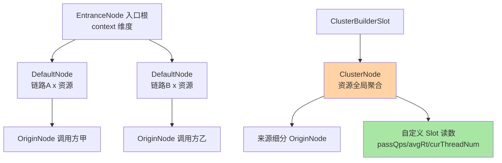
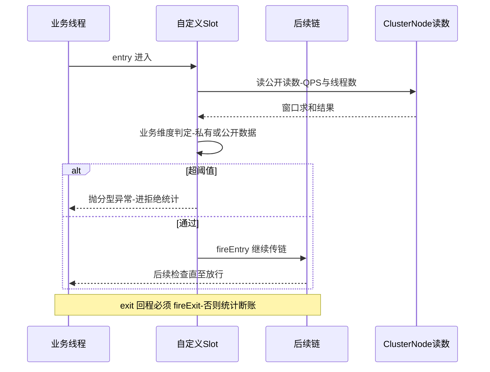
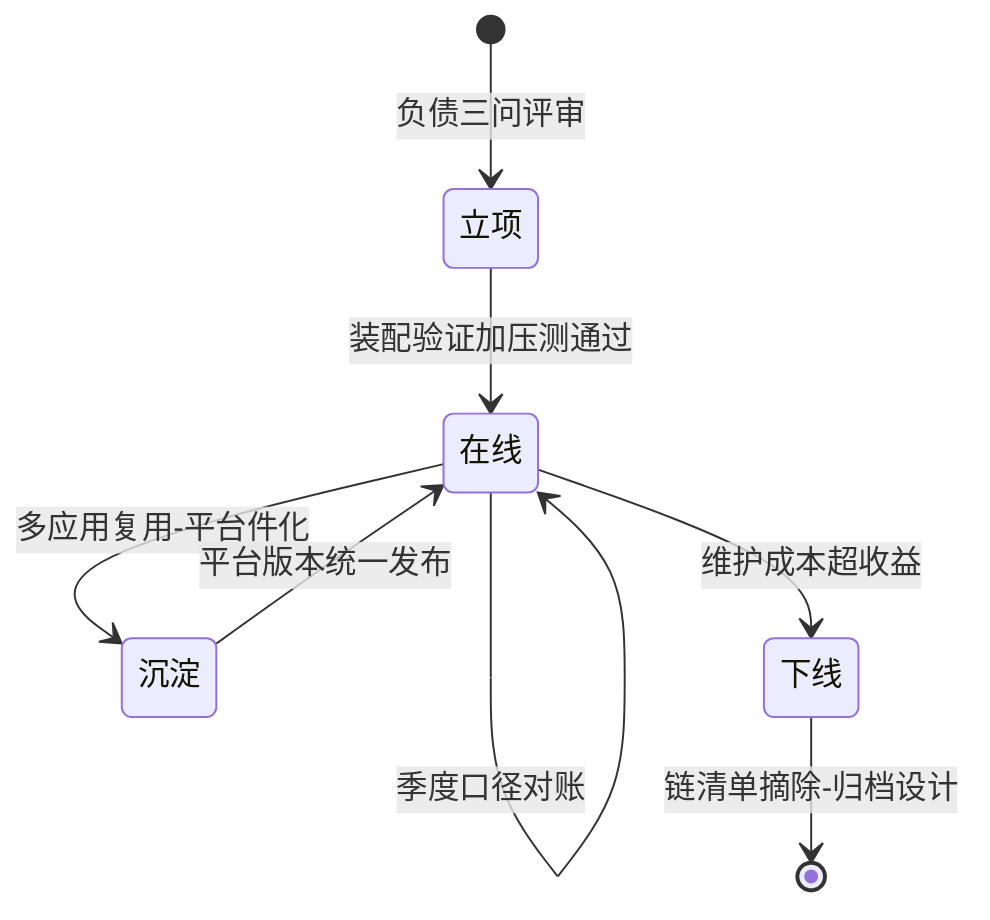

# 自定义 Slot 与指标统计结构深读：从节点树到私有记账

> **本文核心**：自定义 Slot 的本质不是「写一个插件」，而是「把自己的判定塞进既定的记账秩序」——官方 Slot 的判定全部消费 Node 指标体系（DefaultNode 管链路维度、ClusterNode 管资源全局维度、OriginNode 管调用方维度），自定义 Slot 要么读这套公开读数（与流控熔断同源同准），要么自建私有记账结构（自己承担内存与正确性责任）。**选哪条路是自定义 Slot 的第一个决策：能读公开读数就别自建结构**——自建结构的每一个 Map、每一个计数器，都是一份要自己负责生命周期与并发安全的负债。**机制链**：定位扩展语义（判定/观测/打标）→ 选位置（order，互指本系列篇 1）→ 选数据源（Node 公开读数 or 私有结构）→ 实现判定与记账 → 注册与装配验证 → 统计口径对账。

## 一句话摘要

本篇把自定义 Slot 的完整链路走一遍：步骤骨架（实现、注解、注册、验证）、数据源决策（Node 树的三类公开读数 vs 私有记账的负债清单）、口径对账方法（判定行为与监控曲线必须同一份读数）——**写自定义 Slot 的功力不在代码量，而在对统计秩序的尊重程度**。

## 前置阅读

- 本系列篇 1《Slot 责任链编排与 SPI 机制》（order 语义与装配链路）
- 本系列流控算法篇 1《滑动窗口 LeapArray 与统计结构》（读数的底层来源）
- 入门层篇 5《热点参数与访问控制规则》（按维度判定的原生样例）

## 目标导向

本文是什么：自定义 Slot 的落地路径与指标统计结构深读。功能：给出从零到生产的步骤骨架、讲清 Node 树三类节点的分工与读数口径、列出私有记账结构的负债清单。收益：能写出与原生规则同可靠性的自定义判定，能避免私有统计的内存与并发事故，能把扩展件接进统一观测。必看场景：业务维度流控开发、多租户计量、自定义大盘建设。

## 5W 速记卡

| 维度 | 一句话 |
|---|---|
| What | 自定义 Slot 的步骤骨架 + Node 指标体系与私有记账的决策框架 |
| Why | 扩展件的可靠性取决于它与统计秩序的贴合程度 |
| When | 原生四类规则覆盖不了的业务判定需求时 |
| Where | 自研 jar 包插入 Slot 链，读数来自 Node 树或自建结构 |
| How | 定位语义 → 选位置 → 选数据源 → 实现 → 装配验证 → 口径对账 |

## 一、Node 指标体系：自定义 Slot 的公共数据源

判定要读数，读数先看树。Sentinel 为每个资源维护一组节点，树形分工是三类：**DefaultNode 按「调用链路 × 资源」建**（同一个资源在入口 A 与入口 B 的链路里各有节点，链路维度容量评估用它）；**ClusterNode 按资源全局聚合**（不分链路不分来源，流控熔断判定的默认读数源，origin 维度也在这里细分出 OriginNode）；**EntranceNode 管入口**（context 的根，系统自适应规则读入口 QPS）。StatisticNode 作为基类提供统一的读数面：通过量、拒绝量、异常量、成功量、RT 均值、当前线程数，秒级与分钟级各一组滑动窗口（结构即本系列篇 1 拆的 LeapArray）。



**读数选型的口诀：判资源行为读 ClusterNode，判链路行为读 DefaultNode，判调用方行为读 OriginNode**。选错节点是自定义 Slot 最隐蔽的正确性错误：在 DefaultNode 上做「资源全局」判定，多入口资源的读数各是一部分，阈值形同虚设；在 ClusterNode 上做「链路隔离」判定，各链路互相污染。官方检查类 Slot 的读数选择可以直接抄：FlowSlot 读资源维度节点、系统规则读入口节点、授权规则读来源维度——**每类语义配一类节点，原生代码就是标准答案**。

## 二、步骤骨架：从零到生产的六步

生产实践里一个自定义 Slot 从想法到稳定运行，步骤骨架是六步（每步都有可验证的完成标准）：

```text
步骤一 定位语义：判定型/观测型/打标型——写进设计说明一句话
步骤二 选 order：按篇 1 口诀定位置，写明「为什么在这个 Slot 前/后」
步骤三 实现：继承 AbstractLinkedProcessorSlot，entry 写判定、无状态、异常分型
步骤四 注册：@Spi 声明 order + 服务描述文件进 META-INF/services
步骤五 装配验证：启动日志链清单确认在位 + 压测触发判定路径
步骤六 口径对账：自定义判定的拒绝量与全局 block 量、业务曲线三方核对
```

```java
// 判定型自定义 Slot 骨架（简化示例）
@Spi(order = -2500)   // 示意值：落在热点之后、流控之前，理由写入设计说明
public class BizDimensionSlot extends AbstractLinkedProcessorSlot<DefaultNode> {
    @Override
    public void entry(Context context, ResourceWrapper resource, DefaultNode node,
                      int count, boolean prioritized, Object... args) throws Throwable {
        // 读公开读数做判定：资源全局视角用 ClusterNode
        double pass = node.getClusterNode() != null ? node.getClusterNode().passQps() : 0;
        if (exceedBizThreshold(resource, pass)) {
            throw new BizBlockException(resource.getClass().getName()); // 分型异常
        }
        fireEntry(context, resource, node, count, prioritized, args);   // 判定通过继续传链
    }
    @Override
    public void exit(Context context, ResourceWrapper resource, int count, Object... args) {
        fireExit(context, resource, count, args);   // 回程必须继续传递
    }
}
// 注册：resources/META-INF/services/com.alibaba.csp.sentinel.slotchain.ProcessorSlot
// 文件内容一行：完整类名
```



骨架里三处是新手坟场：**fireEntry 必须在判定通过后调用**（忘调 = 链断、后续 Slot 全部失效）；**exit 必须 fireExit**（忘调 = 回程断、StatisticSlot 记不上成功与 RT）；**异常要分型**（BlockException 系走拒绝统计，其他异常直接炸链伤业务，互指本系列篇 1 的异常语义问答）。这六步的取舍也很清楚：步骤一到三换来的严谨是「机制与阈值分离、判定与统计同源」，省掉任何一步都在生产期加倍偿还——业内惯例里扩展件返工的头号原因就是当初跳过了位置论证或口径对账。

## 三、私有记账结构：什么时候建、负债是什么

公开读数覆盖不了的维度（租户、商品类目、业务身份），需要在 Slot 里自建记账。**建私有结构前先过负债清单**：键空间有没有界（按业务 key 计数而没有淘汰策略，键空间随流量无限膨胀，一周后就是一次内存事故）；并发写入用什么结构（ConcurrentHashMap 分段已是底线，热点 key 还要 LongAdder 化，互指流控篇 1 的计数器选型）；数据要不要与窗口对齐（私有计数是「自启动以来累计」还是「最近一秒」，语义要写死，否则判定与预期漂移）。**业内惯例是三问全过才允许建结构，任何一问答不上来就退回「读公开读数 + 降维判定」**。私有与公开之间的权衡并不难判：公开读数的优势是零维护成本加口径天然统一，私有结构的优势是维度自由——代价是把生命周期、并发正确性、口径一致性三份责任全部揽到自己头上；权衡的胜负手在「维度是否真的不可降维」，多数看似需要私有维度的需求，降维到资源或调用方维度后都能接受。

私有结构与公开读数的对账也必须建立：定期抽样把私有计数与 Node 读数、业务真实量三方核对（口径对账），漂移超阈值告警。某团队的多租户计量 Slot 上线两个月后私有计数与账单系统差了 3%（公开口径的行业认知量级），排查是重启丢数——私有结构没有持久化语义，它只为判定服务，绝不能当计量账本（决策口径：计费级准确走消息与账单系统，进程内结构只做「足够准」的判定依据）。

## 四、与 AOP 切面的区别：判定与观测的分野

| 维度 | 自定义 Slot | AOP 切面拦截 |
|---|---|---|
| 数据源 | Node 公开读数/链内位置语义 | 自行埋点采集 |
| 执行时机 | 与原生检查同序编排-可中断链 | 方法边界-与检查链时序脱钩 |
| 拒绝语义 | BlockException 走统一拒绝统计 | 自定义异常-统计层不可见 |
| 治理归属 | 链清单可审计-规则平台可管 | 散落各应用-治理靠自觉 |

用 AOP 也能做限流熔断式的拦截，为什么要在链里做？差别在**与统计秩序的贴合度**：链内 Slot 的拒绝自动进 block 统计、自动被 Dashboard 观测、自动与规则体系同源；AOP 拦截自成一体，判定数据与保护数据两套体系，监控对不上、告警分不清。**选 AOP 的唯一正当理由是「不改依赖」——能进链就别绕在链外**，这是扩展件治理成本的分水岭。

## 五、不同量级的思考：扩展件的规模换挡

扩展件自身也有生命周期：立项按负债评估、上线靠对账守护、成熟后或沉淀为平台件或安静下线——把生命周期画出来，规模换挡的位置感就清楚了。



- **十万级（单应用一两个自定义 Slot）**：约束来源是维护人手——这一档的核心问题是「扩展件别比业务还难养」，而不是「功能做满」。只做判定型、只读公开读数、私有结构能不建就不建，思考方式是负债驱动：每个自定义 Slot 都是长期负债（版本升级要跟、口径要对账、故障要复盘），负债要在立项时就算清楚。自下而上收尾：轻量扩展单应用可养；向上触发升级的条件是多应用复制——同一 Slot 被第二个应用需要时，治理问题开始出现。
- **百万级（平台扩展件、应用数十）**：约束来源是版本与口径的一致性——这一档的核心问题是「扩展件的版本治理」，而不是「单个 Slot 的功能」。平台统一收编：扩展件版本由平台发、口径对账自动化、链清单差异进升级流水线，思考方式是治理驱动（互指本系列篇 1 的平台件化决策）。向上触发升级的条件是口径分歧——各应用私改 Slot 导致同名判定行为不一致。
- **亿级（全站扩展件体系）**：约束来源是扩展件与原生件的边界清晰度——这一档的核心问题是「哪些能力该反哺进开源或平台核心」，而不是「扩展件够不够多」。思考方式是标准驱动：高频复用的扩展件沉淀为平台核心能力或推动社区化，私有的逐渐下线——扩展体系也是生命体，代谢比堆积重要。自下而上收尾：无论哪档，判定读数优先取自 Node 体系的纪律从未改变。

## 六、典型场景与误区

**典型场景**：业务维度流控（按商品类目/租户维度限流，私有结构带 LRU 淘汰）；多活打标（最前端 Slot 写路由标，供统计与网关联动）；业务熔断（按业务错误码聚合判定，读公开异常计数加分型）；联合观测（末端 Slot 把裁决结果异步吐进数据管道）。

**常见误区**：① **私有 Map 不设淘汰**——按 key 计数无界增长是自定义 Slot 第一大内存事故源，LRU 或定时清算是底线配置；② **在 entry 里做远程调用**——链在业务线程同步执行，一次远程往返就是全员 RT 加一个 RTT，重逻辑异步化是铁律；③ **把私有计数当账本**——进程内结构重启即清零、无事务语义，计费审计类需求必须外置；④ **判定读数与监控读数不同源**——自己另采一套数据做判定，监控看着没超、判定说超了，口径分裂的排障成本极高（互指流控篇 1 的同一份读数原则）。

## 七、事故与实践叙事

**事故一：租户计数 Map 的慢性内存泄漏**。某多租户平台在自定义 Slot 里按租户 ID 记 QPS，上线平稳，两周后实例内存爬到临界、Full GC 频繁。排查发现边缘租户的长尾 ID 让 Map 键空间持续增长——每个 ID 只占一点，架不住只进不出。修复上 LRU 淘汰加过期扫描，并把「键空间上限」做成启动参数带告警。**教训**：私有结构的生命周期管理不是可选优化，是上线前置条件——键空间的增长曲线要在压测里就看得到。

**事故二：Slot 内鉴权远程调用拖垮全站 RT**。某团队把租户鉴权（远程调权限服务）塞进链中段 Slot，灰度期全站 P99 上涨一个量级。链是同步的、Slot 在业务线程上——权限服务的每次抖动都直接放大到所有接口。改造：鉴权结果本地缓存加异步刷新，Slot 里只读缓存。**教训**：Slot 的 RT 预算按「微秒到毫秒」记账，任何网络往返都是越权行为。

**实践叙事：口径对账制度化的收益**。某平台给所有扩展件立了「三方对账」规矩（扩展件判定量、全局 block 统计、业务真实量），每季度跑一次自动核对。一次核对揪出一个自定义熔断 Slot 的分型错误：业务异常被误计进熔断统计，比例虚高、熔断提前触发——业务方看到的是「熔断太灵敏」，对账看到的是「口径漂移」。**口径对账是扩展件体系的体检制度，病在早期都是数字对不上**。

## 八、设计思想：扩展件是「秩序的客人」

原生规则体系是一套自洽的秩序（读数有源、判定有位、拒绝有账、行为可观测），自定义 Slot 的设计思想可以概括为**做秩序的客人而不是钉子户**：进链（接受编排纪律）、读公开读数（接受统计秩序）、抛分型异常（接受拒绝秩序）、进链清单（接受治理秩序）。每一次「绕开秩序更方便」的诱惑（自采数据、自定异常、绕过链清单）都是未来事故的预约单。这套思想不只在 Sentinel——**任何插件式架构里，插件的可靠性上限都取决于它与宿主秩序的贴合度**，评估插件框架时先看它把秩序表达得多清楚（Sentinel 用 order、异常分型、链清单三件套表达），再看它允许什么。

## 九、追问链

**质疑者第一层：Node 树为什么拆成三类节点，一个全局节点加标签过滤不行吗？**——标签过滤意味着每次判定都要在全量数据上做筛选，判定路径的开销随维度组合爆炸；预拆节点把「维度选择」提前到访问时的节点定位（O(1) 查表），判定只读目标节点的窗口求和。**空间换时间拆到维度粒度**，是高频判定路径的标准手法。

**质疑者第二层：私有结构为什么不能用 Node 的 LeapArray 直接实例化一套？**——可以，而且这正是进阶做法：LeapArray 是通用结构，自建「按业务 key 的 LeapArray 组」能继承过期复用与窗口语义。但负债清单仍然全适用（键空间管理、并发安全、口径对账）——**借结构不等于借秩序，秩序那部分责任永远是自己的**。

**质疑者第三层：为什么不推动所有自定义需求都走开源社区，长成原生规则？**——社区化有它的门槛（通用性论证、兼容性包袱、维护承诺），业务维度的判定天然长尾且耦合业务语义，硬进原生反而污染核心。健康路径是分层：通用机制进社区、行业共性进平台、业务私有留扩展件——**扩展面的存在正是为了给核心挡住长尾需求**。

## 十、你们可能会问

**Q1：怎么给自定义判定配「规则」——硬编码还是走规则中心？**
判定参数走规则中心（对接 Sentinel 动态数据源或自有配置面），Slot 只消费参数——把「机制」与「阈值」分离，是扩展件可治理的前提（互指专题层规则持久化篇）。

**Q2：自定义 Slot 的监控指标怎么进大盘？**
拒绝量天然进全局 block 统计（抛 BlockException 的红利）；私有结构指标走 Metrics 输出（异步导出），与 Node 读数并列展示、标注口径来源——大盘上「谁产的数」必须可追溯。

**Q3：一个资源上能同时挂几个自定义 Slot？**
链不限制数量，但每加一个都是全量流量的行为变更与 RT 负担——单应用建议收敛在一到两个，更多需求优先合并进既有 Slot 或平台件化。

**Q4：怎么验证自定义 Slot 的并发正确性？**
压测断言三件套：判定阈值边界（刚好触发/刚好不触发）、统计口径对账（判定量等于 block 量加放行量）、内存曲线（键空间有界平稳）。并发 bug 在低负载测试里几乎必然漏检。

## 💡 实战提示

- 💡 数据源口诀：判资源读 ClusterNode、判链路读 DefaultNode、判调用方读 OriginNode——原生代码是标准答案，抄就对了
- 💡 私有结构负债三问（键有界？并发安全？口径对账？）答不上就退回公开读数
- 💡 决策口径：进程内结构只做「足够准」的判定依据，计费级准确外置；能进链就别用链外 AOP 绕行
- 💡 选型推荐：自定义 Slot 立项按负债评估——每个扩展件都是长期负债，能进平台就不散装自养

## 十一、自测三问

1. Node 树三类节点各管什么维度？（答：EntranceNode 管入口 context、DefaultNode 管链路×资源、ClusterNode 管资源全局（含 OriginNode 来源细分）——每类判定语义配一类节点）
2. 自定义 Slot 的三处新手坟场？（答：判定通过后忘 fireEntry（断链）、exit 忘 fireExit（统计断账）、异常不分型（炸链或统计污染））
3. 私有记账结构的负债清单三问？（答：键空间有界吗、并发写入结构选对了吗、口径与公开读数定期对账吗——任一答不上退回公开读数）

## 十二、开放问题

- 业务维度的规则语义标准化（租户/类目等常见维度的声明式规则）在社区仍是空白，现由各平台扩展件各自表达。
- 私有结构与 Node 体系的统一观测协议（跨扩展件的口径元数据标准）没有内建方案，靠平台自律。

## 📎 核心带走

- **核心一句话**：自定义 Slot = 在既定记账秩序里插入判定——数据源优先 Node 公开读数（资源/链路/调用方三类语义配三类节点），私有结构是负债不是资产
- **机制链**：定位语义 → 选 order 位置 → 选数据源 → 无状态实现与分型异常 → SPI 注册装配验证 → 三方口径对账
- **失效点/边界**：选错节点=判定失真；私有 Map 无界=慢性泄漏；entry 远程调用=RT 越权；私有计数当账本=重启丢数——全部靠「尊重统计秩序」预防

## 📌 数据与事实声明

- 写于 2026-09-23，机制以 Sentinel 1.8.10 官方源码（slot 包 / node 包）与官方 wiki 为基准（公开口径）；事故数字为行业认知量级
- 免责：API 与注解形态以所用版本源码为准，以官方文档为准

## 📚 参考资料

| 类型 | 标题 | 来源 |
|---|---|---|
| 官方源码 | node 包（DefaultNode / ClusterNode / StatisticNode） | github.com/alibaba/Sentinel |
| 官方文档 | Sentinel Wiki：自定义 Slot 指南 | github.com/alibaba/Sentinel/wiki |
| 关联文章 | 本系列篇 1（责任链编排）、流控系列篇 1（统计结构） | 本仓库 middleware/sentinel |
| 机制域 | 稳定性工程系列（扩展与治理机制） | 本仓库 architecture/system-design/stability |
