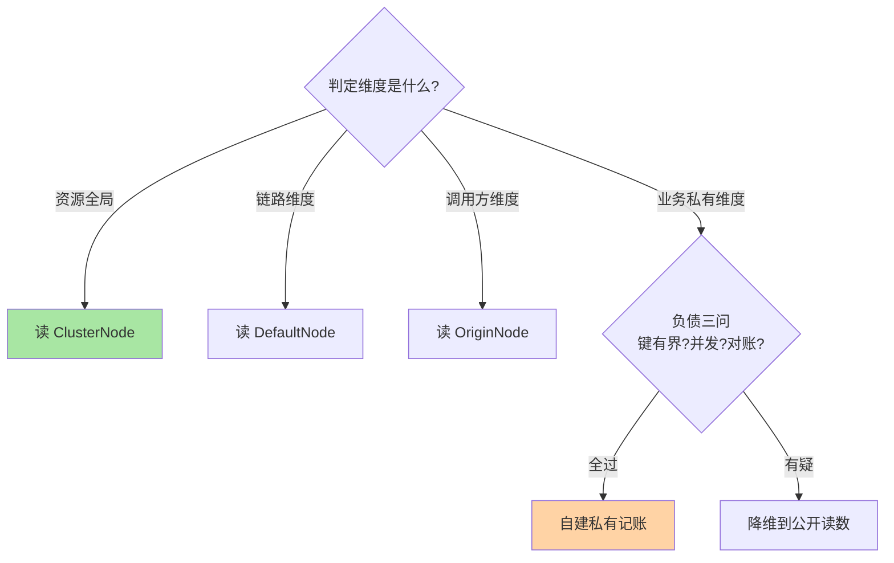
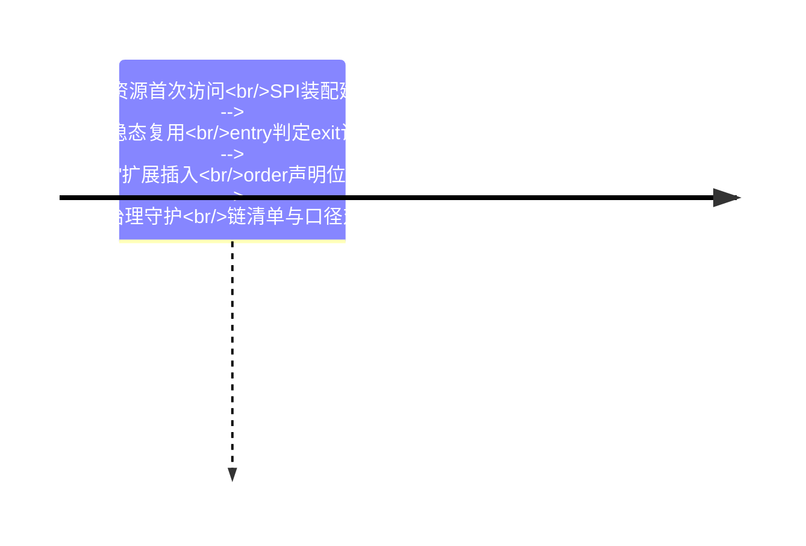

# 深入理解扩展机制系列总览：责任链、SPI 与自定义落地

> **本文核心**：扩展机制系列沿「编排 → 落地」两篇展开——篇 1 拆 Slot 责任链的编排铁律（Slot 单例、链按资源、SPI 按 order 装配、entry 正向 exit 反向），篇 2 拆自定义 Slot 的落地路径与数据源决策（Node 三类节点的公开读数优先，私有记账是负债）。两篇合起来回答一个判断题：**扩展件的可靠性上限，取决于它与宿主统计秩序的贴合程度**。

## 一句话摘要

篇 1 讲链怎么编排（九个默认位置的三段式分工与 SPI 装配），篇 2 讲件怎么长出来（六步骨架、数据源三问、口径对账制度）——编排即语义，落地即负债管理，这两句话撑起整个扩展体系。

## 系列导航

| 篇目 | 深挖点 | 核心结论 |
|---|---|---|
| 1_Slot责任链编排与SPI机制-深度 | 默认链九位置 / 双向传递 / SPI 装配 | order 是语义声明，每个值都要能回答「为什么在这」 |
| 2_自定义Slot与指标统计结构-深度 | Node 树三类节点 / 私有结构负债清单 | 能读公开读数就别自建结构，负债要立项时算清 |

## 扩展件的数据源决策图

## 与相邻层的关系

入门层篇 2 给资源与 Slot 的概念心智模型，本系列给编排实现与扩展落地；扩展件的规则消费与动态下发在专题层规则持久化篇收口，链上各检查类 Slot 的机制细节归流控与熔断两个系列。

## 📌 数据与事实声明

- 写于 2026-09-23，机制口径以 Sentinel 1.8.10 官方源码与官方 wiki 为基准（公开口径）
- 免责：以各篇参考资料与所用版本源码为准

## 📚 参考资料

| 类型 | 标题 | 来源 |
|---|---|---|
| 系列入口 | Sentinel 入门层系列（篇 2 心智模型） | 本仓库 middleware/sentinel/入门层 |
