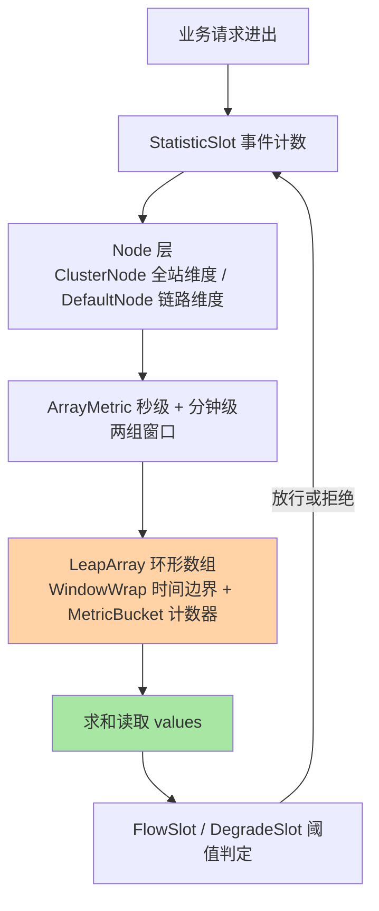
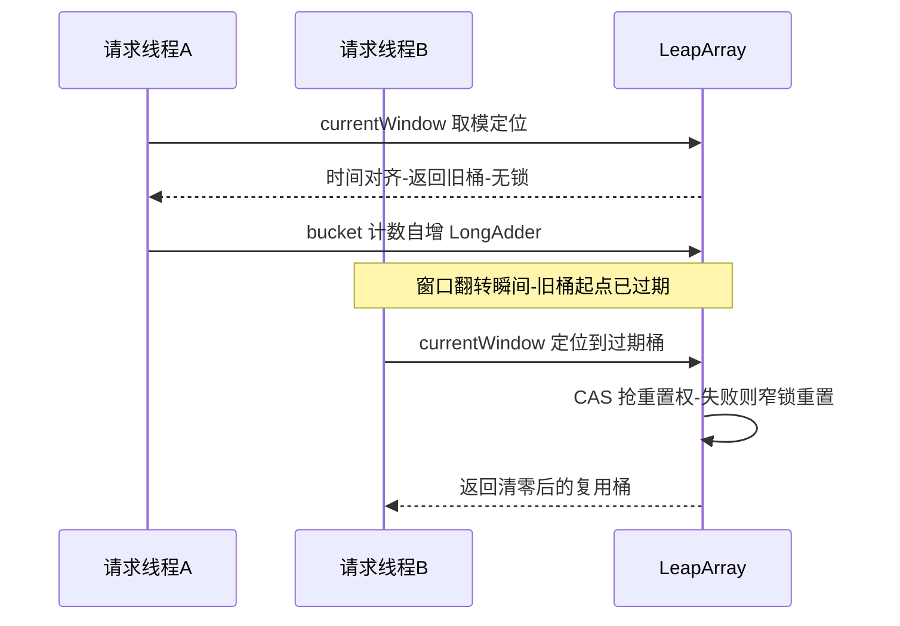
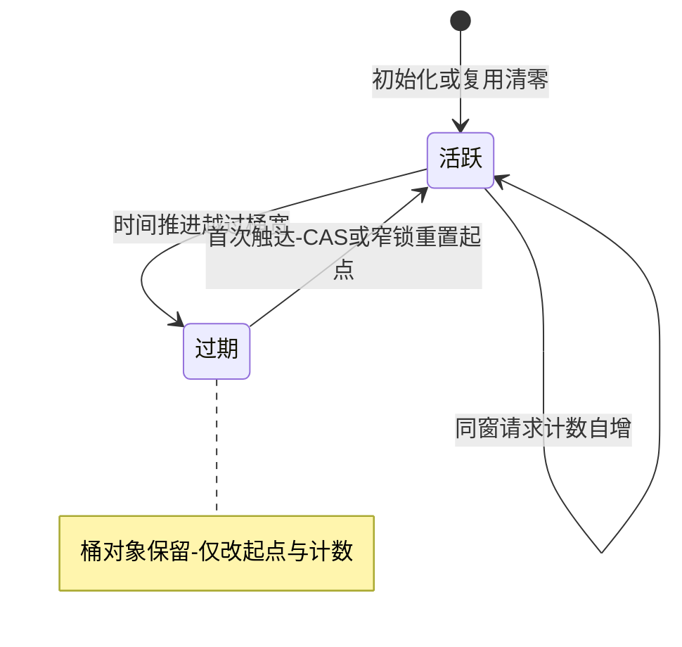

# 滑动窗口深读：LeapArray 与 Sentinel 的统计结构

> **本文核心**：Sentinel 一切流控与熔断判定的地基不是规则，而是统计——**先有准确又便宜的「过去一秒发生了什么」的读数，才有阈值判定可言**。Sentinel 的答案是三层结构：`WindowWrap`（带时间边界的桶）包住 `MetricBucket`（六类事件计数器），`LeapArray`（环形数组）管理这组桶随时间的滚动复用。写入路径只做一次数组下标取模加计数自增，读取路径收集未过期桶求和，全程无全局锁、不分配新对象——**统计开销被压到与业务请求同数量级**，这是单机十万级 QPS 下还能实时判定的底层前提。**机制链**：请求事件（通过/拒绝/异常/成功/RT）→ 定位时间桶（下标取模 + 窗口起点取整）→ 过期判断与窗口复用（CAS + 锁降级）→ 求和读取（values 过滤过期桶）→ 上层判定（FlowSlot / DegradeSlot 拿 QPS 读数做阈值比较）。

## 一句话摘要

「为什么用滑动窗口而不是直接计数」的真答案是**精度与成本的定价**：全局 AtomicLong 计数器最便宜但窗口边界粗糙（上一秒的洪峰会污染这一秒的判定），逐毫秒桶最精确但内存与读取成本不可接受；Sentinel 用「少量时间桶（默认 1 秒切 2 桶、分钟级 60 桶）+ 过期复用不新建」把精度和成本锁在一个工程甜点上——**读懂 LeapArray 的桶定位与复用逻辑，就读懂了 Sentinel 所有规则的读数来源**。

## 前置阅读

- 入门层篇 2《核心概念与心智模型》（资源 / 节点 / Slot 的主语关系）
- 入门层篇 3《流控规则》（阈值判定在什么场景消费统计读数）
- 本仓库稳定性工程系列（docs/architecture/system-design/stability/，限流熔断的跨实现机制定义）

## 目标导向

本文是什么：Sentinel 统计层的数据结构与关键路径深读。功能：讲清 WindowWrap / MetricBucket / LeapArray 三层如何咬合、过期窗口怎么复用、读写各花多少钱。收益：能对统计精度做参数级推导（sampleCount 怎么选）、能解释「限流为何偶尔放过超标请求」这类现象、能看懂源码里 metric 包的扩展点。必看场景：统计精度调优、限流毛刺归因、自定义统计维度开发。

## 5W 速记卡

| 维度 | 一句话 |
|---|---|
| What | WindowWrap + MetricBucket + LeapArray 组成的时间轮式滑动窗口统计 |
| Why | 流控熔断判定依赖低开销、高精度的实时 QPS 读数 |
| When | 统计精度调优、限流边界现象归因、扩展统计维度时 |
| Where | sentinel-core 的 metric 包，被 StatisticSlot 与各 Node 消费 |
| How | 事件计数 → 桶定位取模 → 过期复用 → 求和读取 → 阈值判定 |

## 一、统计层在 Sentinel 架构里的位置

Sentinel 处理一次请求，Slot 责任链先跑检查类 Slot（流控、熔断、热点），它们判定的依据全部来自 Node 上的统计数据；判定结束，StatisticSlot 再把本次事件（通过、拒绝、异常、成功、RT）写回 Node。**写与读是同一套结构：Node 内部持有的就是 ArrayMetric，而 ArrayMetric 是 LeapArray 的标准封装**。所以「Sentinel 怎么统计」不是一个附属问题——它是所有规则语义的物理承载，规则的「统计时长」「最小请求数」这些参数，本质都是在描述底层 LeapArray 的形状。

分层看统计结构：最上层是 Node 树（ClusterNode 汇聚全站维度、DefaultNode 承接调用链路维度、OriginNode 区分来源），中间是 StatisticNode 提供的两组滑动窗口（秒级与分钟级），底层才是本文的主角 LeapArray。**上游问「刚才一秒过了多少」，LeapArray 给数；下游问「这一分钟趋势如何」，还是 LeapArray 给数**——一个结构喂两类读者，这是它必须同时优化写入与读取的原因。



## 二、三层结构拆解：WindowWrap、MetricBucket、LeapArray

**MetricBucket 是纯计数器**：一组 `LongAdder` 按事件类型（PASS 通过、BLOCK 拒绝、EXCEPTION 异常、SUCCESS 成功、RT 耗时、OCCUPIED 优先级占用）各自累加——六个计数器放在同一个桶里，保证「同一时间片的各类事件天然对齐」，异常比例、慢调用比例这类「比率型规则」才能用一次读取算出分子分母。**为什么用 LongAdder 而不是 AtomicLong**：高并发写同一计数器时 LongAdder 把热点拆到分段 cell 上、读时再汇总，写入吞吐高一档——这是「写多读少」场景的教科书选型，统计层恰好就是写多读少（每个请求都写，判定按需读）。

**WindowWrap 给桶加时间边界**：三个字段——窗口长度 windowLength、窗口起点 windowStart、实际数据 value。它解决的问题很具体：**光有「第 N 号桶」不够，还要知道这个桶代表哪段时间**，否则数组复用后旧读数会被误当成新读数。窗口起点用 `time - time % windowLength` 对齐到整段边界，这个「向下取整」让所有并发线程在同一瞬间算出同一个 windowStart，是后面无锁协商的基础。

**LeapArray 是环形数组管理器**：构造时定死两个参数——桶数 sampleCount 与总时长 intervalInMs，窗口长度 = 总时长 / 桶数。默认配置下秒级统计是 1 秒切 2 桶（每桶 500 毫秒），分钟级是 60 秒切 60 桶（每桶 1 秒）。注意精度分工：**秒级窗口供实时判定（桶少、求和快），分钟级窗口供趋势观测与展示（桶多、曲线细）**——同一个结构、两种配置，服务两类读者。

## 三、关键路径：写入怎么做到无锁且零分配

写入路径（`currentWindow`）是整个统计层最值得精读的一段，四个动作按序展开：

```java
// LeapArray.currentWindow 关键路径（简化注释版）
public WindowWrap<T> currentWindow(long timeMillis) {
    int idx = (int) (timeMillis / windowLengthInMs % array.length()); // 1. 下标取模
    long windowStart = timeMillis - timeMillis % windowLengthInMs;    // 2. 起点取整
    while (true) {
        WindowWrap<T> old = array.getReference(idx);
        if (old == null) {                       // 3. 空位：CAS 放入新桶
            if (array.compareAndSet(idx, null, newWindow(windowStart))) return array.getReference(idx);
        } else if (windowStart == old.windowStart()) {
            return old;                          // 4a. 时间对齐：直接复用当前桶
        } else if (windowStart > old.windowStart()) {
            lock.lock();                         // 4b. 过期桶：持锁重置复用
            try {
                if (windowStart > old.windowStart()) array.reset(idx, newWindow(windowStart));
            } finally { lock.unlock(); }
            return array.getReference(idx);
        }
        // windowStart < old.windowStart()：时钟回拨，循环重试
    }
}
```

三个设计决策值得逐个说透。**决策一：取模定位 + 边界取整**让桶定位是纯算术运算，没有哈希、没有查找；同一时间窗内所有线程必然收敛到同一桶，竞争面收敛到一个 `LongAdder` 的分段自增。**决策二：过期复用而不是新建**——环形数组在初始化时一次性分配好全部桶，窗口过期后把旧桶计数清零、时间戳改写，继续服务下一个时间片；运行期稳态零对象分配，GC 压力与请求量解耦，这是它能在十万级 QPS 下保持低开销的底层原理之一。**决策三：快路径无锁、慢路径窄锁**——「时间对齐直接复用」这一分支占绝大多数请求，只读引用比较；只有窗口翻转瞬间（每 500 毫秒一次）有少量线程进入重置分支，且用「先 CAS 抢、抢不到持锁重试」把锁的覆盖面压到单个桶的翻转动作上。**读线程与写线程互不阻塞**：`values` 读取只是遍历数组、跳过「起点已过期」的桶、对余下桶求和，全程不拿锁。



## 四、与固定窗口计数器的区别：边界毛刺从哪来

单个桶的一生是一条极简状态线：初始化分配后进入活跃态，时间推进越过自身窗口长度即过期，被新时间片首次触达时清零复用——**「过期」不是销毁而是待复用**，这正是零分配稳态的来源。



业内惯例里，「滑动窗口 vs 固定窗口」几乎是每个限流组件都要回答的第一题，两边差异落在边界行为上：

| 维度 | 固定窗口计数器 | Sentinel 滑动窗口（LeapArray） |
|---|---|---|
| 窗口推进 | 每秒整点清零 | 桶逐段过期，读数随时间平滑滑动 |
| 边界毛刺 | 两窗口交界处可能放过约 2 倍阈值 | 毛刺上限收敛到桶宽（默认 500 毫秒） |
| 实现成本 | 一个计数器 | 少量桶 + 起点比对 |
| 精度档位 | 秒 | 桶宽可调（500 毫秒量级起步） |

固定窗口的经典缺陷是**交界双倍**：前一窗口尾部的洪峰与后一窗口头部的洪峰各自不超标，但任意一秒切片看都超了。滑动窗口把读数定义为「最近 N 毫秒的滚动和」，交界毛刺被压到桶宽这一档。**追问一层：为什么不把桶切得更细（比如 100 桶每秒）把毛刺压得更低？**——因为读取成本随桶数线性上涨：每次判定都要遍历求和，桶数翻倍、读开销翻倍，而秒级判定的业务价值在 500 毫秒精度后边际收益极低。**桶数是精度与读取成本之间的权衡旋钮**，默认 2 桶是「够用且最便宜」的工程答案，不是精度最优解。

## 五、不同量级的思考：统计结构随规模的换挡

统计结构是这套体系里跨量级最稳定的部分——三层结构本身不变，变的是「判定依据从哪来」。逐档看：每一档的核心问题是「读数够不够判定用」，而不是「结构够不够先进」。

- **十万级（单机 QPS 10 万以内）**：约束来源是单机 CPU 与 GC——这一档的核心问题是统计开销不挤占业务线程，而不是统计精度无限细化。默认 2 桶秒级窗口完全够用，思考方式是成本驱动：先用最便宜的结构守住开销底线，靠 LongAdder 分段与零分配稳态把统计成本压到请求处理成本的零头。自下而上看，桶定位与计数自增都是几条 CPU 指令的事；向上触发升级的条件是集群化——单机统计看不见全局。
- **百万级（集群聚合后 QPS 百万）**：约束来源是「单机视角看不到全局洪峰」——这一档的核心问题是判定依据的全局正确性，而不是单机读数精度。单机各自为政会让总量超标 N 台机器的 N 倍，思考方式是架构驱动：把统计与判定上收到集群流控 Token Server（互指本系列集群篇与整合层全景篇），本地统计退化为兜底。向上触发升级的条件是多地域——跨机房 RT 让集中式 Token Server 也捉襟见肘。
- **亿级（入口日请求亿级、峰值千万 QPS 量级）**：约束来源是集中式判定点的带宽与容灾——这一档的核心问题是判定基础设施自身的可生存性，而不是算法精度。思考方式是治理驱动：分区多套 Token Server、网关层预分流、系统自适应规则兜底（互指专题层大促防护篇），把「一处判定」拆成「分层判定」。自下而上看，每一层判定消费的依然是同一套滑动窗口读数——底层结构的稳定让上层换挡不用换地基。

## 六、典型场景与误区

**典型场景**：接口 QPS 流控的实时读数（秒级窗口）；Dashboard 的分钟级趋势曲线（60 桶窗口）；慢调用熔断的 RT 均值统计（同一结构读 RT 计数）；自定义 Slot 里取「最近一秒异常数」做业务化熔断（读 MetricBucket 对应计数器）。

**常见误区**：① **把限流毛刺归罪于「限流不准」**——桶宽精度决定了毛刺下限，500 毫秒桶宽下交界处放过超标请求是机制内行为，不是 bug；要更紧就把桶数调细，但要付读取成本。② **在压测前临时把桶数调到极大**——读取遍历变长，高 QPS 下判定开销反噬吞吐；调精度要连读数频率一起对账。③ **以为统计数据是强一致的**——窗口翻转瞬间不同线程可能读写新旧两桶，读数是「工程精确」而非「线性一致」；限流判定不需要线性一致，需要的是开销可控的足够准。④ **绕过 Node 直接自己计数再喂给规则**——脱离 LeapArray 的自造统计通常漏掉时钟回拨与并发复用的处理，时钟回拨分支（windowStart 落后于旧桶）在自造轮子里几乎必踩。

## 七、事故与实践叙事

**事故一：全站限流在发布瞬间集体放宽**。某团队接入 Sentinel 后某次大促前的全链路压测中发现，应用滚动发布重启的瞬间，相邻机器的流量读数出现短暂「空洞」，流控判定随之放过了明显超阈值的洪峰。排查结论：新进程统计窗口从零起步，冷启动期读数远低于真实流量，而规则判定只信读数。复盘改造：发布流程前置「预热流量爬坡」，并给入口流控叠加系统自适应规则做第二道兜底（互指专题层大促防护篇）。**教训**：统计结构的「冷启动零点」是判定体系的固有盲区，预案要为读数不可信的窗口期准备兜底，而不是假装读数永远可信。

**事故二：时钟回拨引发的读数重复**。某机房 NTP 校时导致宿主机时钟小幅回拨，Sentinel 统计的窗口起点瞬间「大于」请求时间，LeapArray 落入循环重试分支，个别线程出现短暂 CPU 尖刺；所幸重试收敛快、未造成判定错误，但监控的线程数曲线出现锯齿。复盘把「时间源稳定性」纳入中间件宿主机基线检查。**教训**：时间驱动的统计结构，其健壮性边界里必须包含时钟异常——LeapArray 用循环重试兜底了正确性，但性能代价要由基础设施纪律来避免。

**实践叙事：把统计层读数接进自定义大盘**。某团队做容量治理时，没有自造计数器，而是直接从 ClusterNode 的分钟级窗口读「每秒成功量与 RT 均值」，每秒聚合一次喂给容量模型。因为读的就是判定用的同一份结构，大盘曲线与限流行为完全自洽——压测时「限流何时触发」与「曲线何时拐头」逐帧对得上。**用同一份读数喂观测与判定，是消除「监控说没超、限流说超了」这类扯皮的根治手段**。

## 八、设计思想：把「准」和「省」拆成两个可独立定价的维度

LeapArray 的设计哲学在于**拒绝在「精确」与「便宜」之间做整体取舍，而是把两者拆开分别定价**：精度由桶宽决定（可配置、按场景换挡）、成本由桶数与复用策略决定（固定数组、零分配、无锁快路径）。更底层的思想是**用时间换空间的环形复用**——空间上限在构造时锁死，任意流量下内存不涨，这让容量规划从「按峰值流量算」变成「按结构算」，统计层的成本变成常量。这套思想在存储领域反复出现（RRD 环形趋势库、监控时序的预聚合桶），Sentinel 把它用在了最热的写入路径上——**在最贵的路径上用最便宜的结构，是性能工程的第一原则**。

## 九、追问链

**质疑者第一层：为什么桶里存的是事件计数而不是直接存 QPS？**——因为 QPS 是读数不是事实：同一份原始计数可以按任意窗口求和出秒级、分钟级读数，还能算比率（异常比、慢调用比）；如果桶里存的是算好的 QPS，换一个时间窗就得重算。**存事件、算指标**，是统计层的单一事实源原则。

**质疑者第二层：窗口翻转用锁，高并发下会不会把锁打成热点？**——锁只保护「单个过期桶的重置」，且翻转频率 = 1/桶宽（默认每 500 毫秒一次），竞争窗口极窄；翻转之外的路径全是无锁 CAS 与 LongAdder。真正的热点是同一桶内计数器写竞争，已由 LongAdder 分段消化——**锁要放在低频路径上，高频路径用原子操作**，这是并发结构设计的通用配方。

**质疑者第三层：为什么分钟级窗口不做成 120 桶让曲线更细？**——Dashboard 的曲线粒度受前端渲染与采集周期约束，1 秒桶已超过展示分辨率；桶数翻倍的读取成本却是实打实的。观测精度够用即止，把预算留给判定侧——**观测与判定共享结构时，参数要按判定的需求定，观测迁就判定**。

## 十、你们可能会问

**Q1：sampleCount 和 intervalInMs 能不能改？**
秒级判定窗口的形状由统计节点构造决定，改动属于深度定制（重建 Node 的统计结构），常规调优不建议动；热点参数统计等独立模块有自己的窗口配置（以所用版本官方 wiki 为准）。改统计形状前先算读取成本，再压测验证。

**Q2：限流判定读的是哪个窗口？**
FlowSlot 默认消费秒级读数（最近 1 秒通过量与线程数），熔断规则可指定统计时长（默认 1000 毫秒、最小请求数门槛，见熔断系列篇）。区分「判定窗口」与「展示窗口」是排障基本功。

**Q3：OCCUPIED 这个事件类型是干嘛的？**
匀速排队效果下，优先级请求会「占用未来时间片的配额」提前放行，这部分记账就是 OCCUPIED 计数——它让「借了未来的额度」在统计上可见，避免优先级请求把后续普通请求挤到判不出真实水位（详见本系列篇 2）。

**Q4：统计会丢事件吗？**
进程内结构没有持久化，重启即清零；单桶内计数由 LongAdder 保证不丢不重。要可靠计量（计费级）不能用这套结构，它是为判定服务的「足够准」，不是审计级的「绝对准」。

## 💡 实战提示

- 💡 限流毛刺归因先看桶宽：桶宽 500 毫秒量级下交界放过是机制行为，调精度先算读取成本再动手
- 💡 观测与判定用同一份 Node 读数，曲线与限流行为才对得上——别在旁边自造一套计数器
- 💡 决策口径：判定精度要求高（计费边界类）另选方案；Sentinel 统计层的定位是「开销可控的足够准」，审计级准确不在此结构的能力边界内
- 💡 选型推荐：自定义统计维度优先扩展 Slot 读 MetricBucket，而不是绕开 Node 自建——保住与规则判定同一事实源

## 十一、自测三问

1. LeapArray 定位一个时间桶做哪两步算术？（答：下标 = 时间 / 桶宽对桶数取模；起点 = 时间对桶宽向下取整——取整保证同窗线程收敛到同一桶）
2. 过期桶为什么不新建而要复用？（答：稳态零分配、内存上限构造期锁死——GC 与流量解耦，是高 QPS 低开销的底层前提；翻转用 CAS 抢权加窄锁保护单桶重置）
3. 固定窗口的交界双倍毛刺，滑动窗口压到什么程度、还剩多少？（答：压到桶宽量级——默认 500 毫秒；桶数是精度与读取成本的权衡旋钮，默认配置取最便宜档）

## 十二、开放问题

- 自适应桶宽：流量低时自动放宽桶宽省开销、流量高时自动切细提精度，动态调整的重置语义（旧桶作废窗口）还没有看到生产级实现。
- 多维统计的下推：按调用方、按参数维度的统计目前是独立结构（热点参数一套、来源一套），统一成「任意维度组合的滑动窗口」会撞上基数爆炸，业界尚无便宜解。

## 📎 核心带走

- **核心一句话**：Sentinel 统计层 = WindowWrap（时间边界）+ MetricBucket（事件计数）+ LeapArray（环形复用）——取模定位、边界取整、过期复用、无锁读写，把「过去一秒」的读数做到与业务同量级的成本
- **机制链**：事件计数 → 桶定位（取模+取整）→ 过期判断与窄锁复用 → values 求和读取 → FlowSlot / DegradeSlot 阈值判定
- **失效点/边界**：冷启动窗口零点是判定盲区；时钟回拨走循环重试有 CPU 代价；桶宽决定毛刺下限；读数是工程精确而非线性一致，计费级准确需求不在能力边界内

## 📌 数据与事实声明

- 写于 2026-09-23，机制与关键路径以 Sentinel 1.8.10 官方源码 metric 包与官方 wiki 为基准（公开口径）；默认窗口形状（秒级 2 桶、分钟级 60 桶）为源码公开配置
- 免责：性能数字为公开基准量级与行业认知，具体以自用版本压测为准；以官方文档为准

## 📚 参考资料

| 类型 | 标题 | 来源 |
|---|---|---|
| 官方源码 | sentinel-core metric 包（LeapArray / WindowWrap / MetricBucket / ArrayMetric） | github.com/alibaba/Sentinel |
| 官方文档 | Sentinel Wiki：滑动窗口与统计结构 | github.com/alibaba/Sentinel/wiki |
| 关联文章 | 本系列篇 2（WarmUp 与匀速排队）、入门层篇 3（流控规则） | 本仓库 middleware/sentinel |
| 机制域 | 稳定性工程系列（限流熔断跨实现机制） | 本仓库 architecture/system-design/stability |
