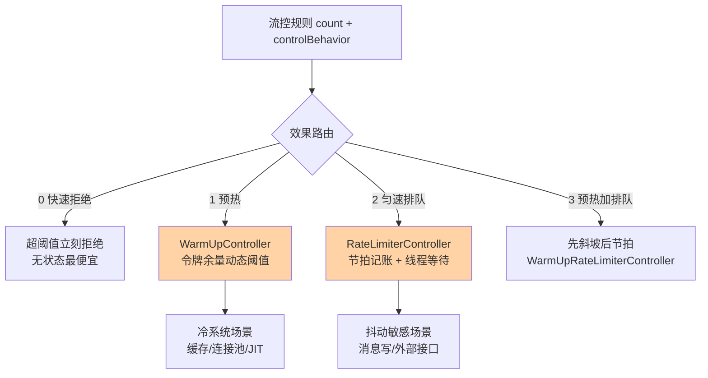
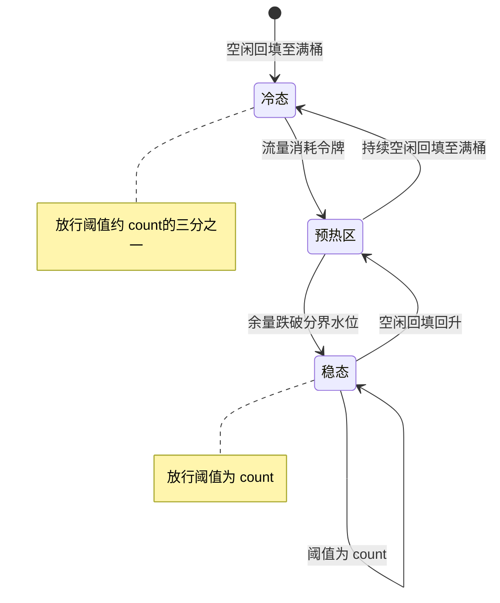
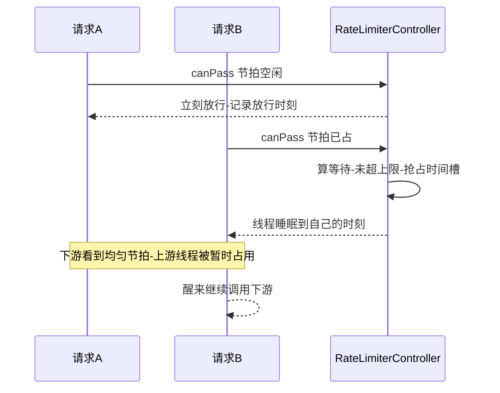

# 预热与匀速排队深读：WarmUp 与 RateLimiter 的实现账本

> **本文核心**：快速拒绝（默认效果）解决「超了怎么办」，预热与匀速排队解决「没超但也不能全放」的平滑问题——**两者本质都是把「阈值」从一个静态数字变成随时间演化的曲线**。WarmUp 把放行阈值做成从冷态阈值（约 count/3）随令牌消耗爬升到稳态 count 的斜坡，治「冷系统被洪峰打死」；匀速排队把 QPS 摊成固定间隔的请求节拍，超出节拍的请求在调用线程上排队等待而非立刻拒绝，治「下游扛得住平均但扛不住抖动」。**机制链**：规则 controlBehavior 选择效果 → FlowSlot 路由到对应 TrafficShapingController → WarmUp 用令牌余量动态压低/抬高放行阈值 → 匀速排队用「最近放行时间 + 单请求成本」算等待量并线程睡眠 → 超过等待上限退回拒绝。

## 一句话摘要

「预热就是慢慢放量、排队就是慢慢放行」这句直觉话里藏着两个完全不同的实现账本：WarmUp 的成本是**一个常驻的令牌记账结构**（空闲回填、突发消耗、斜率换算，无锁读为主），匀速排队的成本是**调用线程的真实睡眠**（把下游的平滑转嫁给上游的线程池）。读懂两本账就懂了它们的适用边界——预热配冷启动慢的系统（缓存、连接池、JIT），排队配抖动敏感的下游（消息写、外部接口），**配错方向的代价都是把保护组件变成故障放大器**。

## 前置阅读

- 本系列篇 1《滑动窗口 LeapArray 与统计结构》（读数从哪来）
- 入门层篇 3《流控规则》（controlBehavior 四种效果的概念）
- 本仓库 RPC 域限流熔断篇（docs/architecture/service-governance/rpc/入门层/从零开始认识RPC系列/10_限流熔断降级-入门.md）

## 目标导向

本文是什么：WarmUp 与匀速排队两种流控效果的实现原理深读。功能：拆解令牌余量斜坡公式、排队等待时间线、优先级占额机制，给出两种效果的参数与场景对账。收益：能按下游特征选效果、能解释「开了排队后线程池告警」这类生产现象、能算预热期的实际放行量。必看场景：大促预热预案、下游抖动治理、流控效果选型评审。

## 5W 速记卡

| 维度 | 一句话 |
|---|---|
| What | WarmUp 令牌斜坡与匀速排队节拍两种流控效果的实现 |
| Why | 静态阈值无法表达「冷系统怕洪峰、下游怕抖动」的时间维度 |
| When | 冷启动放量、大促预热、下游需要平滑节拍时 |
| Where | FlowSlot 路由到的 TrafficShapingController 实现 |
| How | 效果选择 → 令牌记账或时间记账 → 动态阈值或线程等待 → 超限退回拒绝 |

## 一、效果路由：controlBehavior 是分流开关

流控规则里的 controlBehavior 字段决定阈值语义：0 快速拒绝（超阈值立刻抛 FlowException）、1 预热（WarmUpController）、2 匀速排队（RateLimiterController）、3 预热+排队（WarmUpRateLimiterController，先用预热曲线压阈值、再按节拍排队）。FlowSlot 判定时按规则构造出对应的 TrafficShapingController，**同一个 count 数字在四种效果下是完全不同的物理含义**——快速拒绝里它是「一秒最多放几个」，预热里它是「最终爬到的稳态值」，排队里它是「节拍周期的倒数」。规则评审时只对数字不看效果，是新人最常见的低级错误：把快速拒绝的阈值原样抄进预热规则，冷启动期的实际放行量只有预期三分之一。



## 二、WarmUp 关键路径：令牌余量换算成放行阈值

WarmUp 的实现原理直接继承了 Guava SmoothRateLimiter 的预热模型：系统空闲时令牌桶被回填到上限，令牌越满代表系统越「冷」；流量来临消耗令牌，令牌水位决定当前放行阈值——**令牌是「冷度」的记账，放行阈值是「冷度」的函数**。源码里三个换算式构成全部骨架（coldFactor 默认 3）：

```java
// WarmUpController 构造期换算（warmUpPeriodSec 默认 10）
warningToken = (int)(warmUpPeriodSec * count);                    // 预热分界水位
maxToken = (int)(warningToken + 2 * warningToken / (1.0 + coldFactor)); // 桶容量上限
slope = (coldFactor - 1.0) / count;                               // 阈值斜率

// canPass 判定：余量高于分界走冷路径，低于走稳态路径
long restToken = storedTokens.get();
if (restToken >= warningToken) {
    long aboveToken = restToken - warningToken;                  // 高出分界的冷量
    double warningQps = 1.0 / (aboveToken * slope + 1.0 / count); // 冷态放行阈值
    return passQps + acquireCount <= warningQps;
}
return passQps + acquireCount <= count;                          // 稳态阈值
```

读这段代码要抓住三个行为特征。**特征一：冷态阈值下限是 count 的 1/3**——桶全满时 aboveToken 最大、分母最大、放行阈值最低，代入 slope 可算出满桶时阈值趋近 count/coldFactor；随着流量持续消耗令牌跌破分界水位，阈值线性爬回 count。**特征二：回填只发生在低水位期**——空闲检测发现上一秒放行量低于阈值时，按 count 的速率把令牌回填到 maxToken；也就是说**预热的「热」不是定时器烧出来的，是空闲期攒出来的**，回填速率天然等于稳态速率，不需要额外参数。**特征三：全程无锁**——令牌水位是一个 AtomicLong，回填与消耗都是原子读写，判定路径没有共享锁，这与本系列篇 1 的统计层是同一个成本哲学。

业内惯例里 WarmUp 最常见的落地是缓存服务与数据库代理的发布窗口：新实例刚起时本地缓存空、连接池未建、JIT 未热，真实洪峰进来首先表现为 RT 毛刺，然后连锁触发线程池堆积。预热让新实例在低水位档位先跑起来，用三五分钟爬到满阈值——**爬坡期的「限流」其实是给系统内部各类惰性资源的初始化买时间**。把令牌桶的水位变化画成状态线，冷热两区的阈值语义一目了然：



## 三、匀速排队关键路径：把 QPS 换算成节拍与等待

匀速排队（漏桶思想）的实现更简单也更"危险"：它维护一个「最近一次放行时刻」，把 count 换算成单请求成本（1000/count 毫秒），每个请求按节拍顺序分配放行时刻，落到未来时刻的请求**在调用线程上直接睡眠**到自己的时刻：

```java
// RateLimiterController.canPass 关键路径
double costTime = Math.round(1.0 / count * 1000) * acquireCount;  // 本批请求的节拍成本
long expectedTime = costTime + latestPassedTime.get();            // 预计放行时刻
if (expectedTime <= currentTime) {                                // 节拍空闲：立刻过
    latestPassedTime.set(currentTime);
    return true;
}
long waitTime = costTime + latestPassedTime.get() - currentTime;  // 需要等待的时长
if (waitTime >= maxQueueingTimeMs) {                              // 超等待上限：拒绝
    return false;
}
long oldTime = latestPassedTime.addAndGet(costTime);              // 抢占未来时刻
waitTime = oldTime - TimeUtil.currentTimeMillis();
if (waitTime >= maxQueueingTimeMs) {
    latestPassedTime.addAndGet(-costTime);                        // 回滚抢占
    return false;
}
Thread.sleep(waitTime);                                           // 调用线程睡眠
return true;
```

三个行为细节决定它能不能用对。**细节一：等待发生在业务线程上**——Thread.sleep 挂起的是 Tomcat/业务线程池的工作线程，排队量大时下游确实平滑了，但上游线程池先被占满，这是匀速排队最经典的事故形态（见事故叙事一）。**细节二：抢占与回滚**——并发线程用 addAndGet 抢占各自的时间槽，发现超出等待上限再把槽位退回，保证「被拒绝的请求不留空洞」；但退回也是 addAndGet，高并发下 latestPassedTime 是全局竞争点，极端并发时这里会看到 CAS 热点。**细节三：优先级请求借未来的额度**——带优先级标记的请求（prioritized）在配额用尽时可以「占用未来时间片」提前放行，记账走统计层的 OCCUPIED 计数（互指本系列篇 1）；这让关键流量（如交易主链路）在匀速体系中插队，但占的额度要从后续流量里扣回来。



## 四、与 Guava RateLimiter 的区别：库内构件与链路闸门的分野

| 维度 | Sentinel 匀速排队 | Guava RateLimiter |
|---|---|---|
| 定位 | 资源防护闸门，拒绝走异常通道 | 进程内限速构件，调用方自行等待 |
| 等待位置 | 判定时在调用线程睡眠 | acquire 返回前阻塞 |
| 规则动态性 | 控制台热更新规则 | 构造期定死参数 |
| 生态位 | 与统计层/规则体系/集群流控配套 | 单体进程内的限速工具 |

Guava 的预热模型是 Sentinel WarmUp 的思想源头，但落点不同：Guava RateLimiter 是**库内构件**——调用方主动 acquire、参数静态、无全局规则视角；Sentinel 把同一套数学搬进**链路闸门**——判定嵌入 Slot 责任链、规则热更新、与统计读数联动。**同样的公式，生态位决定了工程约束**：Guava 可以慢悠悠地按需发放许可，Sentinel 必须在判定路径上做到无锁，因为它挡的是全站流量。理解这层分野，比记住公式更重要——**选型时问的不是「哪个公式好」，而是「我要闸门还是构件」**。

## 五、不同量级的思考：两种效果随规模的换挡

两种效果的判定读数都来自同一套统计层，跨量级变的是平滑代价的承担方。每一档的核心问题是「谁为平滑买单」，而不是「曲线画得好不好看」。

- **十万级（单机 QPS 十万以内）**：约束来源是单机线程池与下游承受力——这一档的核心问题是「平滑的代价由谁承担」，而不是「节拍算得准不准」。匀速排队的睡眠发生在业务线程，量大先压垮上游线程池，思考方式是成本驱动：只在「请求处理本身很轻、下游明确怕抖动」的小范围资源上开排队；预热则是低成本标配，一个 AtomicLong 的记账换冷启动安全。自下而上收尾：预热的记账成本与 QPS 无关，这档可以放心用；向上触发升级的条件是流量分布到多机——单机各自的节拍对下游仍是叠加洪峰。
- **百万级（集群流量百万 QPS 量级）**：约束来源是「单机匀速对下游仍是并发叠加」——这一档的核心问题是全局节拍的一致性，而不是单机节拍的精度。思考方式是架构驱动：把节拍判定上收到集群流控 Token Server（互指整合层全景篇），由集中点发放令牌、各机器排队消费，下游看到的全局节拍才真正平滑。向上触发升级的条件是多活多地域——集中节拍点的容灾成为新命题。
- **亿级（入口日请求亿级）**：约束来源是排队等待对用户体验与线程资源的双重侵蚀——这一档的核心问题是「哪些流量值得等」，而不是「怎么让大家都等」。思考方式是治理驱动：按流量分级配效果，交易主链路优先级占额插队、浏览类流量快速拒绝快速失败，匀速排队只留给明确有节拍契约的下游；配合网关层预分流（互指专题层大促防护篇），让等待发生在离用户最近的、可降级的层。自下而上收尾：每一档的判定读数仍来自同一套统计层——底层稳定让治理策略可以随量级自由重组。

## 六、典型场景与误区

**典型场景**：发布窗口新实例预热（WarmUp 配合摘流量灰度）；定时任务突发写消息的节拍控制（匀速排队保护 MQ 写入）；大促开门红前的整体爬坡预案（预热+排队组合效果）；外部合作接口的调用平滑（对方限速场景下主动节拍）。

**常见误区**：① **把匀速排队当「万能平滑」**——它平滑的是下游、代价是上游线程，高 QPS 入口开排队等于主动给自己制造线程饥饿，生产实践中排队效果只能配在处理轻、并发小的调用上；② **预热阈值抄快速拒绝的数字**——冷启动期实际放行只有阈值约三分之一，容量评审要按冷态档位对账；③ **以为预热曲线是定时器控制的**——回填靠空闲检测，持续压着阈值跑的系统令牌永远空着，其实际效果退化为「阈值略低的快速拒绝」；④ **优先级占额滥用**——交易链路插队记账 OCCUPIED，滥用会让普通流量的判定窗口失真，占额要有明确白名单纪律。

## 七、事故与实践叙事

**事故一：匀速排队拖垮上游线程池**。某团队给消息投递接口开了匀速排队（count 设下游承诺值，maxQueueingTimeMs 用默认 500 毫秒），大促期间上游并发突增，瞬间数百线程同时进入 sleep 等待，Web 容器线程池打满，全站接口包括与该下游无关的接口集体超时——下游毫发无损，上游自己倒下了。复盘结论写进了团队规范：**排队效果只允许出现在「并发度天然受控」的调用点**（如定时任务批处理、单线程消费者），Web 入口同步链路一律禁用，需要平滑改用 MQ 异步削峰。**教训**：匀速排队把「下游的平滑」建立在「上游线程的占用」上，评审时必须先问等待发生在谁的线程上。

**事故二：预热规则上线后仍然冷启动超时**。某缓存服务发布时配了预热规则，发布后仍出现批量超时。排查发现该服务的健康检查就绪探针在端口可通后立即放行流量，而此时预热令牌刚被回填、放行阈值处于最低档——大量请求被预热规则拒绝，调用方重试放大了压力。改造：发布脚本把「摘流量→启动→预热小流量爬坡→探针就绪→回流量」串成显式步骤，并给调用方配置重试退避。**教训**：预热不是单点开关，它是「发布编排 + 流量爬坡 + 调用方退避」的组合拳里的一环，单独开启反而制造了新的失败模式。

**实践叙事：用预热+排队组合守住开门红**。某交易前置系统在大促零点预案里用效果 3（预热+排队）：门线前系统空闲令牌满桶、阈值压在低档，零点流量先被温和放行爬坡，爬到稳态阈值后剩余突发按节拍排队等待、超时快速拒绝。压测对比显示稳态阈值不变的前提下，开门红前三十秒的下游错误率明显低于此前纯快速拒绝方案。**组合效果的价值在「爬坡期保下游、稳态期保吞吐」的两段式语义**——这正是效果 3 存在的理由。

## 八、设计思想：把时间维度引入阈值语义

静态阈值回答「多少算超」，预热与排队回答「什么时候、以什么节奏放」——**两者共同的设计思想是承认「系统的承受力是时间的函数」**：刚启动的承受力低（要预热）、瞬时承受力高于持续承受力（可排队缓冲）。WarmUp 用令牌记账把承受力的恢复过程显式建模，匀速排队用时间槽记账把「短时超量可容忍」显式建模。更深的取舍在于**代价的转嫁方向**：预热把成本付在「放得少」（业务侧感知限流），排队把成本付在「等得久」（上游线程侧感知延迟）——**保护组件不创造容量，它只能选择把不舒服转嫁给谁**，这条判断适用于一切流控设计。

## 九、追问链

**质疑者第一层：为什么预热回填不用定时器而用空闲检测？**——定时器需要常驻线程与唤醒成本，且「该不该回填」本质取决于「上一秒有没有跑满」，空闲检测用一个读数判断就能完成；更关键的是定时器会把「回填速率」和「真实空闲率」解耦，空闲检测天然让回填只在真实空闲时发生。**让记账跟随事实而不是跟随时间**，是无状态高并发组件的通用偏好。

**质疑者第二层：排队为什么不用异步挂起（如 Servlet 异步）而用同步睡眠？**——异步挂起要求整个调用链路（容器、框架、业务代码）配合改造，Sentinel 作为嵌入库无法假定宿主具备异步栈；同步睡眠对嵌入方零侵入，代价是占用线程。这是「组件通用性」对「单点最优」的权衡——想要异步平滑，正确位置是网关层或消息层，不是进程内闸门。

**质疑者第三层：coldFactor 为什么默认 3、maxQueueingTimeMs 为什么默认 500 毫秒？**——coldFactor=3 意味着冷态阈值约三分之一稳态值，与「预热期用低量跑通冷路径」的发布实践匹配，调大爬坡更保守、调小近似关闭预热；500 毫秒等待上限来自「同步链路可感知延迟」的人类工程学边界——超过半秒的同步等待，调用方 RT 与线程占用的账就开始难看。**两个默认值都是经验甜点，都该按自己的链路预算复核**而不是照抄。

## 十、你们可能会问

**Q1：预热的「预热时长」参数在哪？**
warmUpPeriodSec（默认 10）参与计算预热分界水位与桶容量，它决定令牌桶形状进而影响爬坡节奏；但爬坡的实际时长由流量强度决定（流量越猛消耗令牌越快、爬得越快），不是精确的定时器。规则评审时把它理解为「预热力度」而非「预热秒数」。

**Q2：排队效果下被拒绝和被等待的请求怎么区分？**
未超等待上限的请求睡眠后放行（统计上算通过），超上限的抛 FlowException（统计上算拒绝）。观测排队压力看「拒绝量 + 等待时长分布」，后者需要链路侧 RT 监控配合——Sentinel 统计层不记睡眠时长，睡眠体现在调用方 RT 里。

**Q3：效果 3（预热+排队）的判定顺序是什么？**
先过预热阈值检查（令牌余量决定当前阈值），通过后再进入排队节拍记账；两段都有独立的参数来源。适合「冷启动 + 下游抖动敏感」双重约束的资源，参数最多也最容易配错，上线前必须压测对账。

**Q4：集群流控下这些效果还有效吗？**
集群模式下阈值判定上收 Token Server，单机侧按集群分配的额度执行本地效果逻辑；预热曲线在集群语义下的「冷度记账」复杂度上升，生产实践里集群流控多与快速拒绝搭配，预热留在单机场景（互指整合层全景篇）。

## 💡 实战提示

- 💡 排队效果评审第一问：等待发生在谁的线程上——Web 同步链路禁用，平滑需求交给 MQ 或网关层
- 💡 预热阈值对账按冷态档位（约稳态三分之一）算容量，发布编排要串「摘流量→爬坡→回流」显式步骤
- 💡 决策口径：冷启动慢的系统选预热、抖动敏感的下游选排队、两者兼具选效果 3——按下游与冷启动特征选，不按个人口味选
- 💡 选型推荐：进程内平滑优先 Sentinel 自带效果；需要异步平滑或全局节拍时，把位置上移到消息层或集群流控，而不是硬改效果参数

## 十一、自测三问

1. WarmUp 的令牌桶里记的是什么、阈值怎么随它变？（答：记「冷度」——空闲回填、流量消耗；余量高于分界水位时放行阈值线性压低，满桶约 count/3，跌破分界回到 count）
2. 匀速排队的等待发生在哪里、超时怎么处理？（答：调用线程 Thread.sleep；等待时长超 maxQueueingTimeMs 时回滚时间槽抢占并拒绝）
3. 预热回填为什么不用定时器？（答：空闲检测让回填跟随真实水位、免常驻线程；记账跟随事实而非时间，判定路径保持无锁）

## 十二、开放问题

- 异步栈下的原生排队：Servlet 异步/响应式栈普及后，「不占线程的排队」该由闸门组件原生提供还是留在容器层，业界仍在演化。
- 集群语义的预热记账：多机令牌池的全局冷度建模（谁冷谁多接流量）还没有成熟的开源实现。

## 📎 核心带走

- **核心一句话**：预热与匀速排队把静态阈值升级为时间函数——WarmUp 用令牌余量记账冷度、放行阈值从 count/3 爬向 count；匀速排队用时间槽记账节拍、让调用线程睡眠换下游平滑
- **机制链**：controlBehavior 效果路由 → WarmUp 令牌余量换算阈值 / RateLimiter 节拍记账加线程等待 → 优先级占额 OCCUPIED 记账 → 超限退回快速拒绝
- **失效点/边界**：排队占用上游线程（Web 链路禁用）；预热靠空闲回填（持续压载时退化为低阈值拒绝）；冷态放行只有稳态约三分之一；两者都不创造容量，只选择把不舒服转嫁给谁

## 📌 数据与事实声明

- 写于 2026-09-23，机制与公式以 Sentinel 1.8.10 官方源码 flow 包（WarmUpController / RateLimiterController）与官方 wiki 为基准（公开口径）；coldFactor=3、warmUpPeriodSec=10、maxQueueingTimeMs=500 为源码默认值
- 免责：具体行为以所用版本源码为准，以官方文档为准

## 📚 参考资料

| 类型 | 标题 | 来源 |
|---|---|---|
| 官方源码 | WarmUpController / RateLimiterController / WarmUpRateLimiterController | github.com/alibaba/Sentinel |
| 官方文档 | Sentinel Wiki：流量整形（流控效果） | github.com/alibaba/Sentinel/wiki |
| 思想源头 | Guava SmoothRateLimiter 预热模型（公开设计文档） | github.com/google/guava |
| 关联文章 | 本系列篇 1（统计结构）、整合层全景篇（集群流控） | 本仓库 middleware/sentinel |
