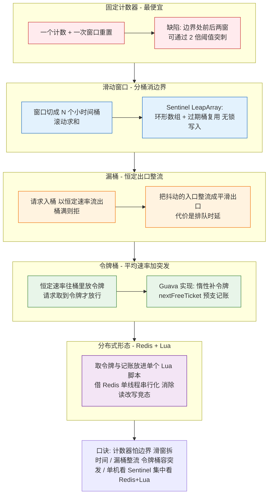
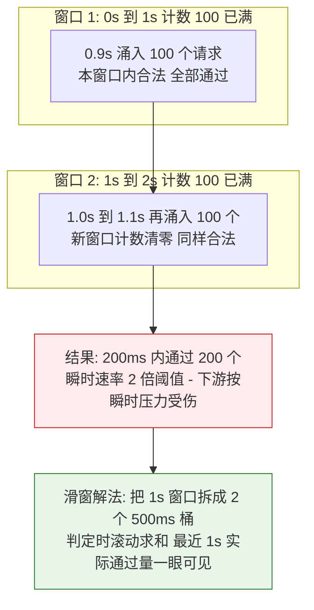
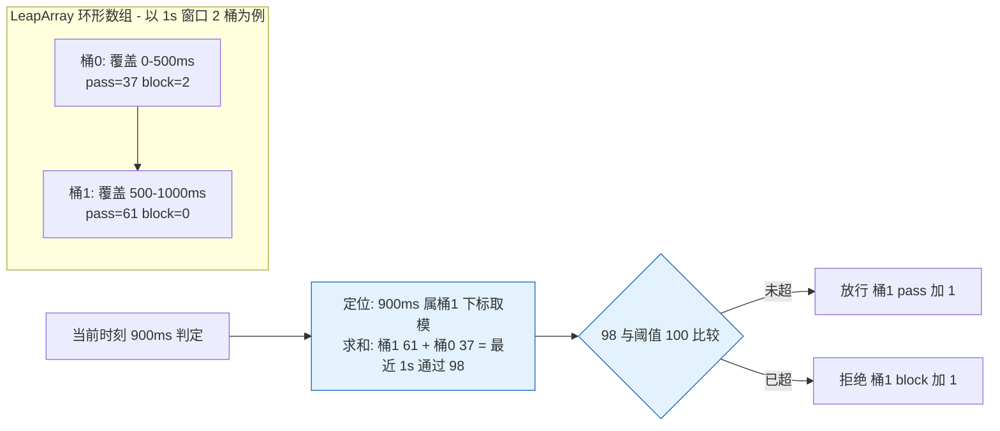

# 四大限流算法源码级穿透

> **本文核心**：计数器、滑动窗口、漏桶、令牌桶不是四个平行选项，而是**「精度-成本」连续谱上的四次换挡**——固定计数器最便宜但窗口边界会漏进双倍突刺；滑动窗口用分桶统计消除边界（Sentinel LeapArray 的环形数组实现）；漏桶把出口整流成恒定速率；令牌桶在平均速率之上保留突发额度（Guava RateLimiter 的惰性补齐与预支语义）。**机制链**：判定在哪一层做（单机内存 → 分布式 Redis）决定成本结构，判定用什么时间观（窗口统计 → 速率记账）决定行为形态；单机滑动窗口 + 集中式令牌桶的 Redis+Lua 组合是生产常见形态。

## 一图看懂



## 一句话摘要

四大算法回答同一个问题的四种定价：**限流 = 用多少内存与计算，换取多精确的速率控制与多合理的突发容忍**。固定计数器一个变量搞定但边界漏突刺；滑动窗口把一个窗口拆成 N 桶逼近精确；漏桶换时延买整流；令牌桶换记账复杂度买突发容忍——读懂 Guava 的令牌记账与 Redis+Lua 的原子化，单机与分布式两层就都通了。

## 前置阅读

- [滑动窗口 LeapArray 与统计结构](1_滑动窗口LeapArray与统计结构-深度.md)：本系列第 1 篇，LeapArray 三层结构的完整源码级拆解
- [WarmUp 预热与匀速排队实现](2_WarmUp预热与匀速排队实现-深度.md)：本系列第 2 篇，令牌桶家族在 Sentinel 的两支变体
- [网关限流与高可用架构](../../../../architecture/service-governance/gateway/特性层/深入理解网关机制系列/2_网关限流与高可用架构-深度.md)：限流在网关层的部署视角

## 5W 速记卡

| 维度 | 一句话 |
|---|---|
| What | 计数器/滑动窗口/漏桶/令牌桶的原理、临界问题与代表实现源码 |
| Why | 限流算法选错形态，表现为「明明限了还是被打挂」或「没超阈值却大量拒绝」 |
| How | 窗口统计（计数器/滑窗）管瞬时判定，速率记账（漏桶/令牌桶）管时间维度整形 |
| When | 接口保护、下游保护、削峰整流、突发容忍度设计时逐一对号 |
| Where | 单机看 Sentinel/Guava 实现，分布式看 Redis+Lua 脚本形态 |

## 一、问题起点：限流到底在限什么

先立住两个被混用的概念：**限流（rate limiting）**限的是单位时间的请求量，**流量整形（traffic shaping）**管的是请求离去的时序形态。四大算法里，计数器与滑窗属于前者（判定型：超没超，超了就拒），漏桶属于后者（整形型：排队走匀速），令牌桶介于两者（平均速率 + 受控突发）。所有实现还要回答两个工程问题：**时间从哪来**（本地时钟 vs 集中服务）与**状态放哪**（进程内存 vs 共享存储）——后文每款实现的差异都能拆到这四个维度上。

## 二、固定计数器：最便宜的实现与最贵的边界

原理一句话：每个窗口一个计数器，超阈值即拒。代价最低（一个原子变量），但有一个结构性缺陷——**窗口边界突刺**：限 100 QPS 时，前一个窗口的最后 100ms 涌入 100 个请求、后一个窗口的最前 100ms 再涌入 100 个，两个窗口各自合法，但 200ms 内实际通过 200 个——瞬时速率达到阈值 2 倍（业内认知的通称「临界问题」）。



**为什么不选它还要学它？** 因为它在 Redis 里只需要 `INCR + EXPIRE` 两个命令，是实现成本的下限；且下游若对 200ms 的 2 倍突刺不敏感（比如自身有队列缓冲），这个缺陷就不是问题。**算法没有缺陷表，只有场景匹配表**——但选它之前必须能算出边界突刺的幅度。

## 三、滑动窗口：分桶统计如何消除边界

把窗口切成 N 个小桶（Sentinel 默认 1 秒切 2 桶、可调 sampleCount），判定时对「最近一个完整窗口」内的桶求和。边界突刺被压制到桶粒度：桶越细越精确，内存与求和成本线性上涨——**这就是「精度-成本」换挡的第一次显式化**。

Sentinel 的 LeapArray 实现要点（完整源码级拆解见本系列第 1 篇，这里给判读所需的骨架）：

- **定位**：时间戳除以桶长取整得桶起点，对桶数取模得数组下标——`O(1)` 定位，无哈希无查找；
- **复用**：环形数组固定 N 个桶对象，过期桶被 CAS 抢占后整体重置复用，运行期零分配；
- **读取**：收集「未过期」的桶求和，过期桶不计入——读侧天然过滤脏数据。



关键路径上真正贵的是「过期判断与抢占」：读多写少靠 CAS 成功即走，写冲突才退化为加锁——这套无锁写入是单机十万级 QPS 下统计开销与业务同数量级的底层前提（细节与参数推导见第 1 篇）。

## 四、漏桶：把时延换出去的整流器

漏桶有两种工程形态，混为一谈会出事故级误判：

1. **漏桶作为队列（整流语义）**：请求先入队，出口以恒定速率放行，队满拒绝。出口绝对平滑，但请求要排队——**用时延换平滑**。Nginx 的 `limit_req` 带 burst 参数的形态接近此语义（公开文档口径）。
2. **漏桶作为计量器（判定语义）**：不做队列，只按恒速「漏水」计算当前余量判定放行与否。实现上与令牌桶趋同（把「漏水余量」换成「令牌余量」即是）。


漏桶适合的场景边界很清楚：**下游只吃得下恒速**（第三方接口有严格速率配额）时用它；下游扛得住突发只是总量受限时，漏桶白白支付时延——这种错配是排队时延事故的常见根源。

## 五、令牌桶：Guava RateLimiter 的记账艺术

### 核心机制：惰性补齐 + 预支记账

Guava RateLimiter 的令牌桶没有后台线程定时放令牌，而是**记账制**：记录 `nextFreeTicketMicros`（下一个令牌可用的时刻），每次 acquire 时按流逝时间一次性补齐（`resync`），再判断要等多久。

```java
// Guava RateLimiter 关键路径（java 简化骨架，字段名为源码原名）
private void resync(long nowMicros) {
    // if nextFreeTicket 已过期: 补齐这段时间应产生的令牌 - 上限 maxPermits
    if (nowMicros > nextFreeTicketMicros) {
        double newPermits = (nowMicros - nextFreeTicketMicros) / stableIntervalMicros;
        storedPermits = min(maxPermits, storedPermits + newPermits);
        nextFreeTicketMicros = nowMicros;   // 追平到当前时刻
    }
}

@Override
final double acquire(int permits) {
    long nowMicros = stopwatch.readMicros();
    resync(nowMicros);                       // 先补齐令牌
    double storedPermitsToSpend = min(permits, this.storedPermits);
    long waitMicros = ...;                   // 缺额部分按 stableInterval 折算等待
    long newNextFree = nextFreeTicketMicros + waitMicros;
    // 预支语义: 本次的等待时间按旧 nextFreeTicket 计, 并把 nextFreeTicket 推到未来
    nextFreeTicketMicros = newNextFree;
    stopwatch.sleepMicrosUninterruptibly(waitMicros);  // 睡到可走
    return waitMicros;                       // 返回的是"本次实际睡的时间"
}
```

两处反直觉的源码事实值得单独划线：

- **「本次返回的等待时间，买的是上一次的账」**：`acquire` 先拿到的是按**旧** `nextFreeTicketMicros` 算出的等待，然后把 nextFreeTicket 推向未来——后来的请求替先来的请求「垫付」了排队时间。突发请求连发时，第一个近乎立即通过，后续每个都按 `stableInterval` 递增等待——这就是「平滑突发限流」（SmoothBursty）的行为根源。
- **空闲令牌不无限累积**：`storedPermits` 封顶在 `maxPermits`（由 permitsPerSecond 与突发容量决定），空闲再久也只攒一桶——**突发容忍有明确额度**，不会把长时间空闲折算成一次洪水放行。

### 与 Sentinel 匀速排队的血缘

Sentinel 的匀速排队（RateLimiterController）与 WarmUp（第 2 篇已拆）是同一思想的两支变体：前者把请求按 `latestPassedTime + stableInterval` 排队戳，后者在冷启动期动态抬高 `stableInterval`（等效于把令牌桶的「满桶」解释成需要预热的水位）。三个实现共享一个底层转换：**把速率控制翻译成时间记账**——这是理解全部令牌桶家族的钥匙。

## 六、分布式限流：Redis+Lua 的原子化形态

单机限流各有各的活法，一旦需要「全集群共享一个阈值」，状态必须外置到 Redis。核心难点只有一个：**「读余量-判断-扣减」三步在分布式并发下必须是原子的**，否则 N 个节点同时读到同一余量、同时通过，阈值被放大 N 倍。解法是把三步放进单个 Lua 脚本——Redis 单线程执行脚本，天然串行化（`lua`）：

```lua
-- 令牌桶限流 Lua 骨架: KEYS[1]=桶key, ARGV: rate, capacity, now_ts, requested, 归档键
local key       = KEYS[1]
local rate      = tonumber(ARGV[1])      -- 每秒补几个令牌
local capacity  = tonumber(ARGV[2])      -- 桶容量 - 突发上限
local now       = tonumber(ARGV[3])      -- 秒级时间戳
local requested = tonumber(ARGV[4])      -- 本次申请令牌数

local bucket   = redis.call('HMGET', key, 'tokens', 'ts')
local tokens   = tonumber(bucket[1]) or capacity   -- 首次访问视为满桶
local last_ts  = tonumber(bucket[2]) or now

-- 惰性补齐: 与 Guava resync 同构 - 按流逝时间补令牌 上限 capacity
tokens = math.min(capacity, tokens + (now - last_ts) * rate)

local allowed = 0
if tokens >= requested then
    tokens   = tokens - requested
    allowed  = 1
end
redis.call('HMSET', key, 'tokens', tokens, 'ts', now)
redis.call('EXPIRE', key, math.ceil(capacity / rate) * 2)  -- 冷桶自动回收
return allowed
```

骨架与 Guava 的 resync 同构——**同一算法在单机与分布式的两次落地**。工程要点三条：时间戳由客户端传入时必须容忍节点间时钟偏差（取 max 防回退）；热 key 是固有代价（阈值高的资源考虑本地滑窗挡第一道、Redis 只做配额协调）；Lua 脚本保持纯函数（只碰 KEYS/ARGV），否则集群模式跨槽不可用（公开文档口径）。

**追问：为什么不用 Redis 事务（MULTI/EXEC）替代 Lua？** 再追问：MULTI 排队执行时不也是原子的吗？——原子但不带逻辑：HMGET 读出的余量无法在事务内参与判断再决定 HMSET 的值，逻辑必须回到客户端，竞态原样回归。打破砂锅：那 Redis 7 的 Functions 与 Lua 的差别？——载体升级，原子性来源不变（仍是单线程串行执行），迁移成本与运维口径才是选型变量。

## 七、不同量级的思考：限流体系随规模的换挡

- **十万级 QPS**：约束来源是单机内存判定成本——限流必须快到可以内联在请求路径里。这一档的核心问题是**把判定压到 O(1) 且零分配**（Sentinel 滑窗的环形数组形态），而不是先考虑集中式配额。思考方式：**路径成本驱动**。
- **百万级 QPS**：约束来源是「单机阈值求和不等于集群全局可控」——扩容会摊薄单机阈值，集群总量失控。这一档的核心问题是**本地挡突刺 + 集中管配额**的两层架构（本地滑窗第一道，Redis/集中协调第二道），而不是把所有判定都推给中心。思考方式：**两层判定驱动**。
- **千万级 QPS**：约束来源是集中配额点的容量与热 key——所有节点的扣减打同一个 Redis key。这一档的核心问题是**配额分片**（按节点/机房分桶发配额，令牌批发代替逐个取），而不是给 Redis 无限加资源。思考方式：**配额分发驱动**。
- **亿级 QPS**：约束来源是可用性与限流本身的矛盾——限流组件故障会放大成全站不可用。这一档的核心问题是**降级默认值**（协调层失联时本地阈值自动兜底放行，宁可粗不可死），而不是追求集中判定的强一致。思考方式：**失效安全驱动**。

自下而上串起演进线：路径成本 → 两层判定 → 配额分发 → 失效安全，每档都是上一档方案触到新约束来源后的换挡；触发升级的信号依次是：扩容后总量超标 → 集中点 CPU/带宽告警 → 热 key 打满协调层 → 协调层故障演练发现放大效应。

## 八、业内惯例与生产实践

- **算法混用是常态**：网关层（对外接口）常用漏桶整流或令牌桶控突发，应用内（Sentinel）用滑窗做细粒度判定，存储层再有自己的连接池上限——三层各限各的，口径不同（业内惯例）。
- **单机阈值必须随实例数联动**：用「全局阈值 ÷ 当前实例数」动态算单机阈值（Sentinel 集群流控解决同一问题），扩缩容不重算阈值是最常见的误限流来源（公开文档口径）。
- **拒绝要分型**：可重试请求返回明确的重试语义（限流头/重试间隔），不可重试直接快速失败——把「被限流」从故障降级为可协商的节流。

## 九、事故与实践叙事（匿名化）

**事故一：固定窗口边界突刺击穿下游。** 某调用方按 1000 QPS 限流自认安全，下游却在整秒附近周期性毛刺告警。排查发现调用方用 Redis `INCR+EXPIRE` 固定窗口，下游无缓冲能力，边界 2 倍突刺正好压过其线程池上限。复盘动作：换成滑窗判定 + 把突刺幅度写进容量评估模板。教训：**限流阈值是对平均值承诺的，下游容量却要按瞬时峰值预留**——两者必须显式对齐。

**事故二：Guava RateLimiter 预支语义被当 bug 修。** 某团队观察到「第一个请求零等待、第二个开始排队越来越久」，误判为实现缺陷，叠加了自己的一层「并发全放行」包装，等效于把限流拆掉，下游被打挂。复盘时回到源码的 nextFreeTicket 预支机制才理解行为是设计使然。教训：**使用记账型限流器前，先读它的等待时间分配模型**，行为解释权在源码里。

**实践复盘：集中式限流的热 key 迁移。** 某资源阈值调高后，Redis 限流脚本 CPU 陡增成为新瓶颈。排查确认是逐请求取令牌的形态放大了单 key 读写。复盘改造为令牌批发（每个节点一次取 100 个本地慢慢用），Redis 压力降一个数量级（业内同型改造的公开经验口径）。教训：**分布式的瓶颈常不在算法而在交互粒度**。

## 十、设计思想

**把速率控制翻译成记账问题。** 无论是 Guava 的 nextFreeTicket 还是 Lua 里的 tokens/ts 二元组，本质都是「把时间折算成额度、把额度增减变成纯算术」——一旦控制问题变成记账问题，原子性、可测试性、可组合性全都回来了。这是「控制与记账分离」思想的又一实例，与熔断器的状态记账、重试的退避记账同构。

**精度按需购买。** 从一个计数器到 N 桶滑窗再到逐请求记账，精度每升一级都伴随内存/计算/协调成本的升档。四大算法的共存正说明：**工程选型的成熟标志不是找到最优解，而是为每个精度需求找到最便宜的实现**。

## 十一、追问链

- **追问：滑动窗口的桶数怎么定？越细越好吗？** 再追问：桶数翻倍，统计精度翻倍，代价是什么？——内存翻倍、求和翻倍，且桶长低于心跳/采样粒度后精度不再提升（桶内事件分布已不可分辨）。打破砂锅：Sentinel 默认 1 秒 2 桶为什么敢这么粗？——它的判定对象是「秒级阈值」而非毫秒级整形，2 桶已把边界突刺压到窗口粒度的一半；要做毫秒级整形就该换令牌桶家族，而不是加密桶数。
- **追问：令牌桶允许突发，会不会把下游打挂？** 再追问：突发额度应该给多大？——额度 = 下游能吸收的瞬时余量（连接池余量、队列缓冲），与平均速率无关；Guava 用 maxPermits 显式定价这个额度。打破砂锅：既怕突发又怕时延怎么办？——这正是漏桶与令牌桶的分界问题：给突发定价（额度小 = 接近漏桶），给时延定价（可排队 = 漏桶语义）；两个都付不起时，答案不在算法层，在下游扩容。

## 十二、你们可能会问

**Q1：Sentinel 滑窗和 Nginx limit_req 是什么关系？** 一个在应用内做秒级判定（判定型），一个在接入层做请求整形（整形型），位置不同、职责不同，生产上经常同时存在——外层整流平峰，内层精细判定。

**Q2：Redis 挂了限流怎么办？** 预设失效安全策略：取不到配额时按「本地兜底阈值」放行（宁可粗放不可全死），并降级告警——集中式限流的可用性设计比精度更优先。

**Q3：限流、熔断、削峰怎么分工？** 限流是事前的资源保护（按容量拒绝超额），熔断是事中的依赖保护（按错误率切断），削峰是事前的时序搬运（队列缓冲把瞬时峰摊平）；三者经常叠加，选型讨论见本仓库稳定性系列。

## 什么时候用 / 不用

| 场景 | 推荐度 | 说明 |
|---|---|---|
| 接口秒级防刷、应用内自我保护 | 推荐 Sentinel 滑窗 | 判定快、成本 O(1)、生态齐全 |
| 对下游严格速率配额（第三方接口） | 推荐漏桶/匀速排队 | 下游只吃恒速时，时延换平滑值得 |
| 允许突发但控平均速率 | 推荐令牌桶 | Guava/Sentinel WarmUp 家族 |
| 集群共享阈值 | 推荐 Redis+Lua 两层 | 本地挡突刺 + 集中管配额 |
| 纯离线批处理内部 | 不推荐 | 批处理有队列天然削峰，限流徒增复杂度 |

## Trade-off

四大算法的取舍可以压成一张账单：计数器省下一切，账单是边界突刺；滑窗付内存与求和，买回窗口内精度；漏桶付出排队时延，买回绝对平滑；令牌桶付出记账复杂度与「预支」的认知成本，买回突发容忍。分布式化的账单再叠一层：Redis+Lua 买回集群一致阈值，付的是热 key、时钟依赖与协调层可用性风险——且这笔账单随 QPS 线性增长，逼出配额分片与两层判定。**限流没有免费精度，选型就是给自己的流量形态与容量预算下订单。**

## 💡 实战提示

- 💡 限流阈值上线前先答两问：下游按瞬时峰值还是平均值设计容量？阈值随实例数怎么联动？两问答不清，任何算法都救不了。
- 💡 用 Guava RateLimiter 必须理解预支语义：它返回的等待时间买的是上一笔账，突发下的排队形态是设计使然，别当 bug 包一层破坏它。
- 💡 Redis+Lua 限流脚本是热 key 高危区：调高阈值前先估单 key 的脚本 QPS，超过单 key 承载就上令牌批发或配额分片。
- 💡 集中式限流必须配失效安全：协调层不可用时按本地兜底阈值放行并告警，让限流系统自身的故障不放大为全站故障。

## 自测三问

1. 固定窗口的边界突刺幅度上限是多少？滑动窗口把突刺压到什么粒度？
2. Guava RateLimiter 的 acquire 返回的等待时间对应哪一笔账？
3. Redis+Lua 令牌桶与 Guava resync 的同构点在哪？分布式下多了哪个风险维度？

## 开放问题

- 集中式配额在极端规模下的形态仍在演进：令牌批发粒度、机房就近配额、与容量预测联动的动态阈值，公开实践分散在各厂博客口径中，尚无收敛的标准架构。
- 限流与自动扩缩容的联动（被限流触发的扩容 vs 扩容后的阈值重算）存在闭环震荡风险，如何定义稳定的协同协议仍是开放问题。

## 📎 核心带走

- **一句话**：四大限流算法是精度与成本连续谱上的四次换挡——计数器怕边界、滑窗拆时间、漏桶整流、令牌桶容突发；单机看记账（Guava），分布式看原子化（Redis+Lua）。
- **链条复述**：判定型（计数器/滑窗）管「超没超」，记账型（漏桶/令牌桶）管「以什么时序走」；分布式形态把记账搬进 Redis 用 Lua 串行化，再用批发与分片控制交互粒度。
- **哪里会坏**：阈值不随实例数联动（误限流/漏放行）、固定窗口突刺超下游瞬时容量、记账语义被误改（限流失效）、集中点热 key（限流组件先挂）。
- **失效边界**：限流承诺的是平均速率，下游容量必须按瞬时峰值预留；集中限流失效安全优先于精度。

## 📌 数据与事实声明

- Sentinel LeapArray 结构与默认桶参数、Guava RateLimiter 字段与行为、Nginx limit_req 语义、Redis 脚本原子性原理，均来自各自官方文档与开源代码公开口径。
- 事故叙事为公开工程经验的匿名化改写，主体与数值全部泛化，不指向任何真实公司、系统与内部数据。
- 「业内认知」「业内惯例」标注处为工程社区普遍接受的量级与做法，非精确统计。

## 📚 参考资料

| 资料 | 说明 |
|---|---|
| Sentinel 官方文档与源码（github.com/alibaba/Sentinel） | LeapArray、匀速排队、WarmUp 的实现与默认参数 |
| Guava RateLimiter 源码与 Javadoc（github.com/google/guava） | SmoothBursty/SmoothWarmingUp 的记账模型 |
| Redis 官方文档（Lua 脚本） | EVAL 原子性与集群模式脚本约束 |
| Nginx 官方文档 limit_req | 接入层漏桶整流形态的公开口径 |
| 本系列第 1/2 篇 | LeapArray 源码级拆解、WarmUp 与匀速排队实现 |
