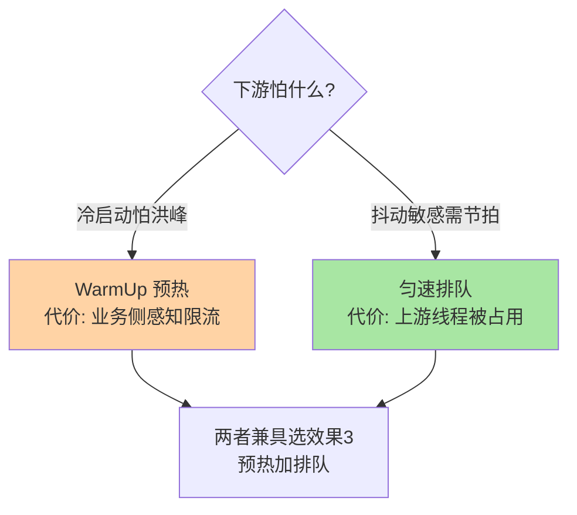
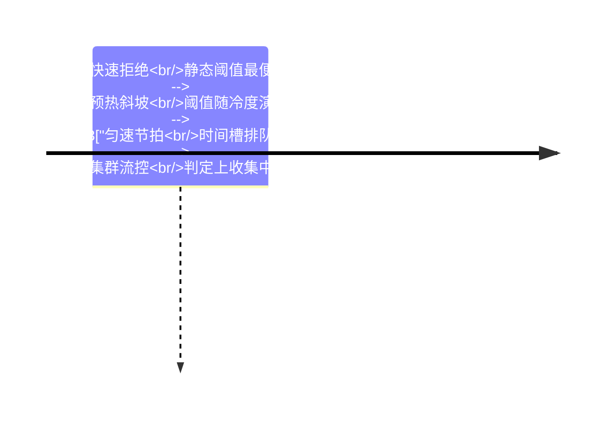

# 深入理解流控算法系列总览：从统计结构到流量整形

> **本文核心**：流控算法系列沿「读数 → 判定 → 整形」的机制链展开——先讲清 Sentinel 怎么用 LeapArray 把「过去一秒」变成低开销读数（篇 1），再讲清阈值怎么从静态数字变成随时间演化的曲线（篇 2 的预热斜坡与匀速节拍）。两篇合起来回答一个判断题：**限流组件的全部行为，都是统计成本与整形代价的取舍结果**。

## 一句话摘要

篇 1 拆统计层的地基（WindowWrap + MetricBucket + LeapArray 的取模定位与过期复用），篇 2 拆两种流量整形效果的实现账本（WarmUp 令牌冷度记账、匀速排队节拍记账）——统计决定「读数多准多便宜」，整形决定「平滑的代价由谁承担」。

## 系列导航

| 篇目 | 深挖点 | 核心结论 |
|---|---|---|
| 1_滑动窗口LeapArray与统计结构-深度 | 取模定位 / 过期复用 / 无锁读写 | 桶数是精度与成本的旋钮，默认配置取最便宜档 |
| 2_WarmUp预热与匀速排队实现-深度 | 令牌冷度记账 / 节拍与线程等待 | 两者不创造容量，只选择把不舒服转嫁给谁 |

## 两种整形的取舍图

## 与相邻层的关系

入门层篇 3 给规则与效果的概念语义，本系列给实现原理与参数账本；集群流控的 Token Server 演进收束在整合层全景篇，机制定义的正源在稳定性工程系列（architecture/system-design/stability）。

## 📌 数据与事实声明

- 写于 2026-09-23，机制口径以 Sentinel 1.8.10 官方源码与官方 wiki 为基准（公开口径）
- 免责：以各篇参考资料与所用版本源码为准

## 📚 参考资料

| 类型 | 标题 | 来源 |
|---|---|---|
| 系列入口 | Sentinel 入门层系列（篇 3 流控规则） | 本仓库 middleware/sentinel/入门层 |

