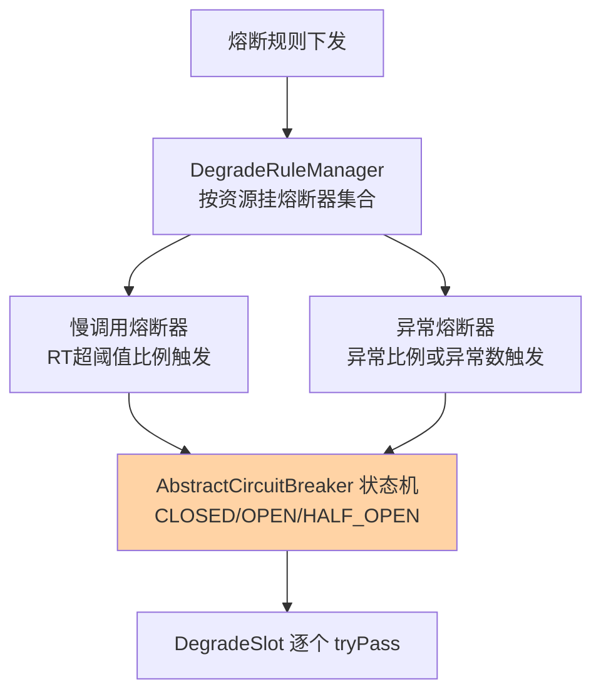
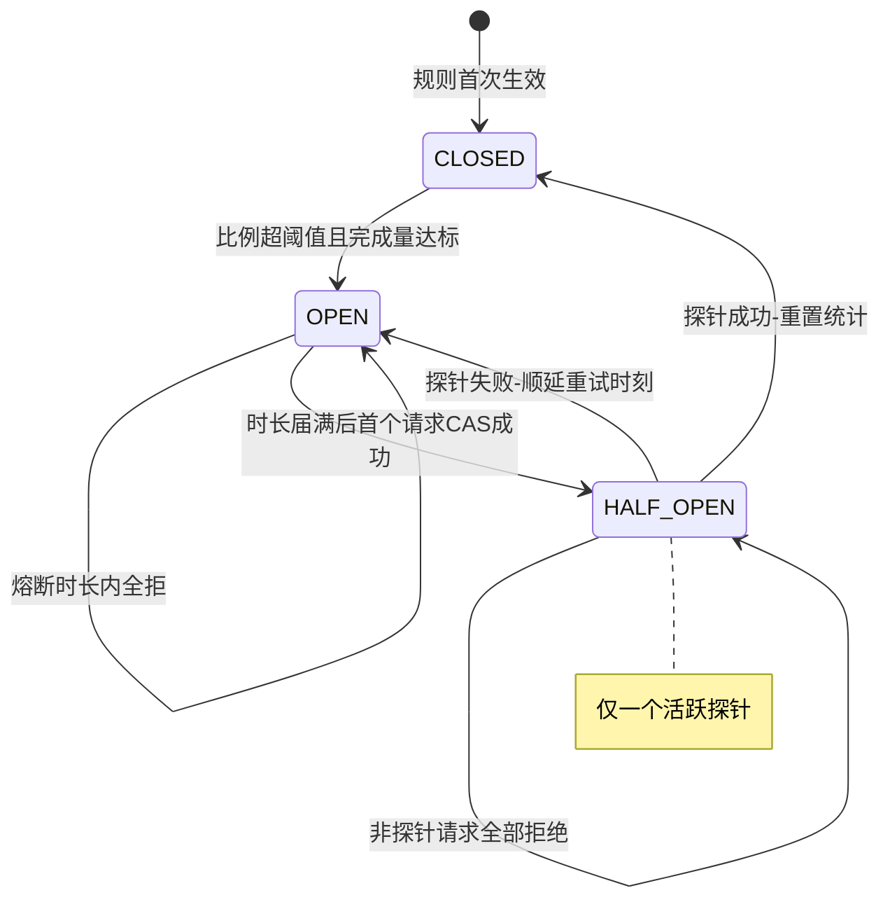
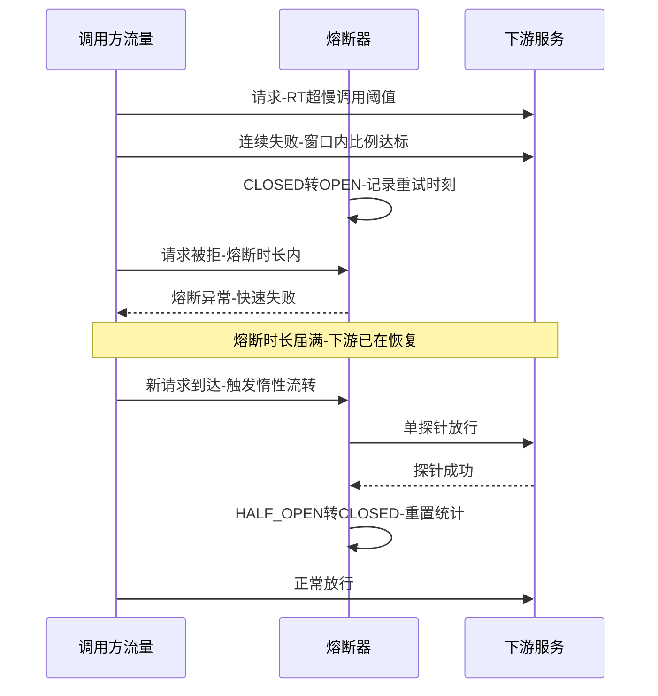

# 熔断器状态机深读：Sentinel 的三态流转与半开探测实现

> **本文核心**：Sentinel 1.8 把熔断从「规则扫描」重构为「每条规则一个熔断器实例」——`AbstractCircuitBreaker` 持有 CLOSED / OPEN / HALF_OPEN 三态，慢调用比例与异常比例各自派生一个实现，判定逻辑收敛到状态机里。最有味道的是两个工程决策：**状态流转是惰性的**（OPEN 回到 HALF_OPEN 没有后台定时器，靠下一个请求到达时 CAS 竞争触发），**半开探测是单请求的**（半开期第一个请求成为探针、其余全部拒绝，探针成败决定闭合或重新熔断）——前者省掉了全量熔断器的巡检成本，后者用最小流量验证下游恢复，两者共同把「探测」的代价压到最低。**机制链**：请求进入 DegradeSlot → 取该资源的熔断器集合 → 状态机 tryPass（CLOSED 放行并记账 / OPEN 判重试超时转半开 / HALF_OPEN 判是否探针）→ 探针结果回写状态（成功闭合、失败重开并顺延重试时间）。

## 一句话摘要

「熔断器」三个字背后是一台被工程化削砍到极限的状态机：统计窗口挂在规则上（默认统计时长 1000 毫秒、最小请求数 5），触发条件挂在比例上（慢调用比例 / 异常比例 / 异常数），恢复挂在单探针上。**读懂「惰性流转 + 单探针」这两个决策，就能预判熔断在生产中的全部怪行为**——为什么熔断结束的时刻不由系统决定而由流量决定、为什么半开期只有一个请求能看到下游、为什么低峰期反而容易误熔断。

## 前置阅读

- 入门层篇 4《熔断降级与系统自适应保护》（三种熔断策略的概念）
- 本系列流控算法篇 1《滑动窗口 LeapArray 与统计结构》（统计读数的来源）
- 本仓库稳定性工程系列（docs/architecture/system-design/stability/，熔断机制的跨实现定义）

## 目标导向

本文是什么：Sentinel 1.8 熔断器实现的结构与状态流转深读。功能：拆解规则到熔断器实例的映射、三态 CAS 流转、单探针语义与统计口径。收益：能配置出「触发准、恢复稳」的熔断参数，能解释熔断日志里的时间线，能区分 Sentinel 熔断与限流的工程边界。必看场景：熔断参数评审、故障恢复复盘、熔断误触发排障。

## 5W 速记卡

| 维度 | 一句话 |
|---|---|
| What | CLOSED/OPEN/HALF_OPEN 三态状态机 + 惰性流转 + 单探针恢复 |
| Why | 用最小探测流量与零巡检成本实现「坏了挡住、好了放行」 |
| When | 下游持续报错或变慢时熔断、等待熔断时长后探测恢复 |
| Where | DegradeSlot 与其背后的熔断器集合（每条规则一个实例） |
| How | 比例超阈值开闸 → 熔断时长内全拒 → 请求触发 CAS 转半开 → 单探针定去向 |

## 一、从规则扫描到熔断器实例：1.8 的结构变化

旧版实现里熔断是「每来一个请求，扫一遍规则、查一遍统计」的过程式判定；1.8 重构后，每条熔断规则在首次使用时实例化为一个熔断器对象，挂在资源维度管理——**规则是声明，熔断器是会记状态的对象**。这次重构的结构意义在于：状态（开着还是闭着）、统计（窗口内完成了多少请求）、时间（下次探测时刻）都有了明确的归属，不再散落在判定函数的局部变量里。三个参数从此有了稳定语义：统计时长 statIntervalMs（默认 1000 毫秒，比例统计的窗口）、最小请求数 minRequestAmount（默认 5，窗口内完成量不足则不判定，防低峰误杀）、熔断时长 timeWindow（开闸后全拒的持续时间）。

两个派生实现各管一种触发语义：慢调用熔断器（ResponseTimeCircuitBreaker）数「RT 超过慢调用阈值的比例」，异常熔断器（ExceptionCircuitBreaker）数「异常比例或异常绝对数」。**触发阈值全部是比例（或计数）而不是 RT 均值**——均值会被长尾稀释，比例直接表达「坏的占多少」，这是熔断语义与性能观测语义的分野（观测看均值分位，熔断看坏比例）。



## 二、状态机关键路径：CAS 流转与惰性半开

状态机的全部判定收敛在 tryPass 里，三个分支对应三种状态（代码为关键路径简化注释版）：

```java
public boolean tryPass(Context ctx) {
    if (state.get() == State.CLOSED) return true;          // 闭合：放行
    if (state.get() == State.OPEN) {                       // 开启：判重试超时
        return retryTimeoutElapse() && tryTransformToHalfOpen(); // 惰性转半开
    }
    return false;                                          // HALF_OPEN：交给探针判定
}
```

三个工程决策藏在短短几行里。**决策一：OPEN 到 HALF_OPEN 是惰性的**——没有后台线程盯着「熔断时长到了没有」，而是熔断时长届满后的**下一个请求**触发 CAS（OPEN→HALF_OPEN），抢到的那个请求顺便成为探针。零巡检成本换来的行为特征是：**没有流量就没有恢复**——一个被熔断的冷门接口，熔断时长过了之后要等到下一个用户请求才进入半开探测，熔断恢复时刻由流量驱动而非时钟驱动。排查「为什么熔断一直不恢复」时先看流量：没流量不是没恢复，是没机会恢复。

**决策二：半开只放一个探针**——进入半开后，第一个请求被标记为活跃探针放行，其余请求一律拒绝（抛熔断异常）；探针返回成功则闭合（CLOSED）并重置统计，失败则重新开闸并顺延下一个重试时刻。单探针的取舍很清晰：**用最小流量验证恢复，下游还在病中时绝不加压**。代价是探测结论受单请求方差影响——探针恰好撞上一个超时重试包就误判「没恢复」，所以要配合熔断时长的重试顺延（失败重开，时长重新计时）形成多次机会。业内惯例里，Resilience4j 选择了另一极（半开放行 N 个并发探测，见本系列篇 2），两派都是「探测流量」与「探测置信度」之间不同档位的权衡。

**决策三：状态流转全部走 CAS**——CLOSED→OPEN（比例触发时）、OPEN→HALF_OPEN（重试超时时）、HALF_OPEN→CLOSED 或 OPEN（探针结算时）都是原子比较交换，并发请求抢不到流转权就按当前状态继续走——状态机无锁，判定路径保持与统计层一致的低开销。



## 三、探针的时间线：一次恢复的全过程

把一次「下游抖动→熔断→恢复」画成时间线，参数的行为立刻具体化：



这条时间线上有三个参数联动的细节值得盯住。**统计窗口与最小请求数的配合**决定触发灵敏度：窗口内完成量不足最小请求数时比例再高也不触发——这是防低峰误杀的关键闸门，但设得太大又会漏掉小流量的真故障（低峰期一个下游死了，每秒只有两三个请求，默认 5 的门槛可能永远凑不齐）。**熔断时长决定恢复节奏**：太短会形成「开闸→探针失败→再开闸」的反复抖动（下游恢复慢于熔断时长时），业内叫熔断风暴；太长则下游已恢复却持续拒绝，白白损失容量。**慢调用阈值必须小于调用方的超时**：设得比上游超时还大，慢请求早已被上游掐死，熔断器永远统计不到「坏请求」，整条规则形同虚设——这是配置评审里的第一核对项。

## 四、与静态健康检查的区别：会自己关掉的保险丝

| 维度 | Sentinel 熔断状态机 | 静态健康检查（摘实例） |
|---|---|---|
| 触发依据 | 实时比例统计（秒级窗口） | 周期探活（心跳/探针间隔） |
| 恢复方式 | 单探针自动探测闭合 | 探活通过后整实例回流量 |
| 粒度 | 资源加规则级（一个接口一个策略） | 实例级（整机进出） |
| 恢复风险 | 探针失败立即重开闸 | 回流瞬间可能二次压垮 |

熔断与「健康检查摘节点」常被混为一谈，机制差异在三处：**粒度**（熔断可以只针对一个接口，健康检查动的是整个实例）、**恢复语义**（熔断用单探针试水，健康检查通过后流量整批回流）、**响应速度**（熔断统计窗口秒级，健康检查周期通常十秒级起步）。生产实践里两者是互补关系：健康检查挡「实例死亡」，熔断挡「实例活着但某个接口病了」——后者恰恰是健康检查的盲区，也是最常见的慢性故障形态。

## 五、不同量级的思考：熔断粒度随规模的换挡

- **十万级（单机 QPS 十万以内、服务数十个下游）**：约束来源是配置与认知成本——这一档的核心问题是「别把熔断配成故障源」，而不是「覆盖所有下游」。只给强依赖、已知脆弱的下游配熔断，参数用默认档起步（统计 1 秒、最小请求 5），思考方式是风险驱动：熔断本身有误触发风险，保护范围要按「下游挂掉的爆炸半径」排序。自下而上收尾：默认参数在稳态流量下表现良好；向上触发升级的条件是下游数量与流量分层——配置面开始爆炸。
- **百万级（集群聚合、下游上百）**：约束来源是熔断参数的逐资源治理——这一档的核心问题是「参数分层的纪律」，而不是「要不要开熔断」。按下游等级配参数档（核心下游熔断时长短、探针勤；边缘下游熔断时长长、宁可保守），思考方式是治理驱动：参数模板化下发（互指专题层规则持久化篇），避免一百个下游一百套手写参数。向上触发升级的条件是多机房多活——跨机房熔断与流量切换联动成为新命题。
- **亿级（入口日请求亿级、链路纵深多层）**：约束来源是级联熔断与恢复风暴——这一档的核心问题是「熔断的宏观行为可预测」，而不是「单点判定准」。多层熔断叠加会在恢复期形成「同时放行」的同步效应（各层熔断同时闭合、积压重试叠加冲击底层），思考方式是架构驱动：恢复期限流衔接（熔断闭合后接预热效果，互指本系列流控篇 2）、重试预算全局对账，把熔断从「单点保险丝」纳入全链路恢复编排。自下而上收尾：每一层的判定仍是一台三态状态机——稳定的局部语义让宏观编排有可靠的积木。

## 六、典型场景与误区

**典型场景**：调用不稳定第三方接口（异常比例熔断，快速失败保线程）；数据库慢查询防护（慢调用熔断，阈值低于调用方超时）；发布窗口的异常兜底（新版本异常比例超阈值自动挡住，避免全量扩散）；弱依赖降级前置（熔断触发后走降级逻辑，互指 RPC 域限流熔断篇）。

**常见误区**：① **熔断时长拍脑袋设 1 秒**——下游恢复往往要数十秒，1 秒熔断就是一台「探针打桩机」，按下游真实恢复时间（复盘数据）定熔断时长；② **最小请求数照抄默认 5**——低频接口可能永远凑不齐门槛（漏保护），高频接口 5 个请求就能开闸（易误杀），按接口流量分档设定；③ **慢调用阈值设得比上游超时大**——统计不到坏请求，规则白配；④ **以为熔断恢复是准点的**——惰性流转下恢复时刻由下一个请求决定，冷门资源恢复延迟是机制内行为，自动化流程要按「探测成功」为准而不是按时钟；⑤ **把熔断异常当业务失败重试**——熔断期的快速失败被调用方无脑重试，等于绕过了熔断器的保护意图，重试策略要识别熔断异常并退避。

## 七、事故与实践叙事

**事故一：1 秒熔断时长造出的探针打桩机**。某团队给一个外部支付网关配了异常比例熔断，熔断时长用了默认的秒级短档。一次对方网关抖动持续约两分钟，期间熔断器每秒开合一次：开闸挡流量、届满放探针、探针撞上抖动再开闸——调用方日志里熔断异常与超时交替出现，探针流量本身成了对方故障期的一部分压力。复盘把熔断时长改为按对方历史恢复时间的中位数（数十秒档）配置，并在熔断闭合后接一档低阈值限流做恢复缓冲。**教训**：熔断时长的本质是「给下游的恢复时间预算」，预算低于真实恢复时间，熔断就退化为周期性探测攻击。

**事故二：低峰期 2 个异常触发的全站熔断**。某接口每秒个位数请求，凌晨批处理时段连续两个请求因数据问题抛异常，窗口内完成量恰好过了最小请求门槛，异常比例 100% 直接开闸——上游批任务整批失败重跑。复盘结论：该接口完成量长期贴着最小请求数门槛，比例语义在极小分母下方差极大，把 minRequestAmount 上调到覆盖批处理单批请求数，并把「数据性异常」与「依赖性异常」在业务层分类（前者不该计入熔断统计）。**教训**：比例熔断的分母过小时，统计口径会放大噪声——门槛参数不是防御性配置，是统计有效性的前提。

**实践叙事：用熔断时间线做故障复盘的时间轴**。某团队把熔断器状态流转事件（开闸时刻、探针时刻、闭合时刻）接入告警系统，一次下游缓存集群故障的复盘里，熔断时间线与下游自身的时间线逐帧对照：开闸比下游告警早了半分钟（熔断统计窗口更灵敏），闭合比下游恢复晚十秒（探针保守）。这组偏差反过来校准了两类系统的告警分级。**熔断器天然是一台「下游健康度」的秒级传感器——把它的时间线当数据用，是最便宜的稳定性观测设施**。

## 八、设计思想：探测成本的最小化原则

三态状态机的通用理论在各家实现里趋同，Sentinel 的差异化在于把两个「可以更聪明但会更贵」的地方刻意做笨：恢复不靠定时巡检（靠请求驱动），探测不放并发流量（放单探针）。**两处取舍都指向同一个设计目标——探测成本最小化**：巡检线程与并发探测都会让熔断器自身成为资源消耗方，而熔断器恰恰部署在最繁忙的调用路径上。更深一层，单探针把「恢复验证」从统计问题降级为单请求问题，牺牲置信度换取确定性——探针失败就重开，绝不含糊；配合熔断时长顺延，用「多次简单探测」替代「一次复杂评估」。**把恢复协议做成可枚举的简单状态迁移，而不是可调参的启发式评估**，是它在大流量场景下可被推理、可被复盘的根基。

## 九、追问链

**质疑者第一层：惰性流转省了巡检，但冷门接口恢复延迟由流量决定，这难道不是缺陷？**——对冷门接口，熔断期本来就没有流量损失（没人调用），延迟恢复的代价接近零；反之若用定时探测去恢复一个没人用的接口，探测流量本身才是净成本。**代价为零的地方延迟就不可怕**——惰性流转把恢复延迟精准地放在了不疼的位置。

**质疑者第二层：单探针撞上偶发超时就重开，会不会永远闭合不上？**——会形成抖动但不会死锁：每次探针失败熔断时长重新计时，下游持续不可用时反复开合本身就是正确行为（下游真的没好）；风险在「下游已恢复但探针连续撞霉运」，缓解手段是把慢调用阈值留出余量（贴近 P99 而不是均值）、并在闭合后接限流缓冲。**置信度不足的问题用重试结构补，不用探测并发补**——这是与 Resilience4j 分派的分水岭。

**质疑者第三层：熔断器状态在多实例间共享吗？**——不共享：每个应用实例各持一份状态机，各自独立开闸闭合。这意味着「部分实例熔断」是常态（流量倾斜时只有打中坏下游的实例先熔断），也意味着容量评估要按「熔断期间被拒流量会转移到健康实例」对账——状态不共享是分布式语义的诚实表达，集群级熔断需要外置判定点（互指整合层全景篇）。

## 十、你们可能会问

**Q1：同一条规则被熔断后，统计窗口里的旧数据还在吗？**
半开转闭合时会重置统计，避免旧窗口的坏比例立刻把刚闭合的熔断器再次打 open；开闸期间统计继续记账，保证重新判定时用的是最新窗口。

**Q2：异常数熔断（绝对数）和异常比例熔断怎么选？**
绝对数适合低频关键操作（完成量小、比例方差大，直接数异常个数）；比例适合高频链路（分母大、比例稳定）。两者共用同一台状态机，只有触发判定的统计口径不同。

**Q3：慢调用熔断的阈值怎么定？**
取调用方超时的八成上下留余量，参考下游 RT 的 P99 而非均值——阈值高于上游超时则永远统计不到坏请求，低于 P95 则常态误杀。上线后用「慢调用比例曲线」回归校准。

**Q4：熔断异常和限流异常怎么区分处理？**
两类 BlockException 类型不同（DegradeException 与 FlowException），调用方的降级分支应区分：限流异常走「排队/降级值」，熔断异常走「隔离/切换备路」。混在一个 catch 里无脑兜底，会把保护语义搅浑。

## 💡 实战提示

- 💡 参数评审三核对：慢调用阈值小于上游超时、最小请求数覆盖真实完成量分母、熔断时长对齐下游历史恢复时间
- 💡 熔断状态流转事件接告警——它是下游健康度最灵敏的秒级传感器，时间线是复盘金矿
- 💡 决策口径：低频关键操作用异常数熔断、高频链路用比例熔断、慢依赖用慢调用熔断——按统计口径的有效分母选
- 💡 选型推荐：进程内熔断用 Sentinel 三态机（探测成本最小）；需要并发探测与函数级装饰时看 Resilience4j（本系列篇 2 逐项对比）

## 十一、自测三问

1. OPEN 转半开由什么触发、谁来当探针？（答：熔断时长届满后的下一个请求 CAS 触发惰性流转；抢到流转权的请求即探针，半开期其余请求全部拒绝）
2. 探针失败后发生什么？（答：HALF_OPEN 转 OPEN、熔断时长重新计时顺延——用多次简单探测补单探针置信度，不死锁也不加压）
3. 为什么慢调用阈值必须小于调用方超时？（答：阈值更大时坏请求早被上游掐死、统计不到触发样本，规则形同虚设——评审第一核对项）

## 十二、开放问题

- 集群视图的熔断状态聚合（多实例状态合并判定）目前没有内建方案，外置判定点的代价与收益仍在实践探索。
- 探针置信度的自适应（按下游恢复曲线动态调整探测节奏）需要恢复模型的先验知识，工程化程度低。

## 📎 核心带走

- **核心一句话**：Sentinel 熔断器 = 每规则一台三态状态机 + 惰性流转（请求驱动恢复）+ 单探针验证（最小探测流量）——把恢复协议做成可枚举的简单状态迁移
- **机制链**：规则实例化为熔断器 → 秒级窗口比例统计（最小请求数守门）→ CLOSED 转 OPEN → 时长届满请求触发转半开 → 单探针结算（闭合重置 / 重开顺延）
- **失效点/边界**：恢复时刻由流量驱动（冷门接口延迟恢复）；单探针置信度有限（靠时长顺延补）；状态多实例不共享（集群语义需外置）；比例统计分母过小时噪声放大

## 📌 数据与事实声明

- 写于 2026-09-23，机制以 Sentinel 1.8.10 官方源码 degrade 包与官方 wiki 为基准（公开口径）；statIntervalMs 默认 1000 毫秒、minRequestAmount 默认 5 为源码默认值
- 免责：具体行为以所用版本源码为准，以官方文档为准

## 📚 参考资料

| 类型 | 标题 | 来源 |
|---|---|---|
| 官方源码 | sentinel-core degrade 包（AbstractCircuitBreaker 及派生实现） | github.com/alibaba/Sentinel |
| 官方文档 | Sentinel Wiki：熔断降级 | github.com/alibaba/Sentinel/wiki |
| 关联文章 | 本系列篇 2（异常统计与 Resilience4j 对比）、流控算法系列篇 1 | 本仓库 middleware/sentinel |
| 机制域 | 稳定性工程系列（熔断跨实现机制）、RPC 域限流熔断篇 | 本仓库 |
