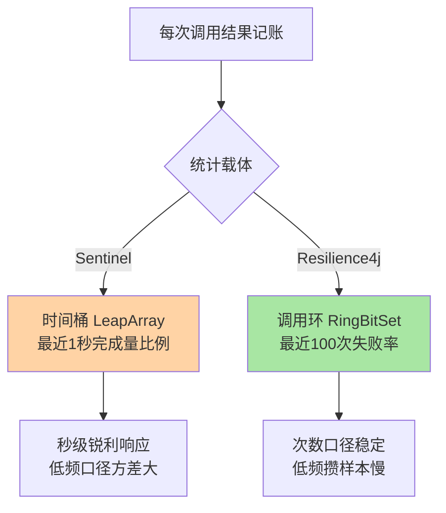
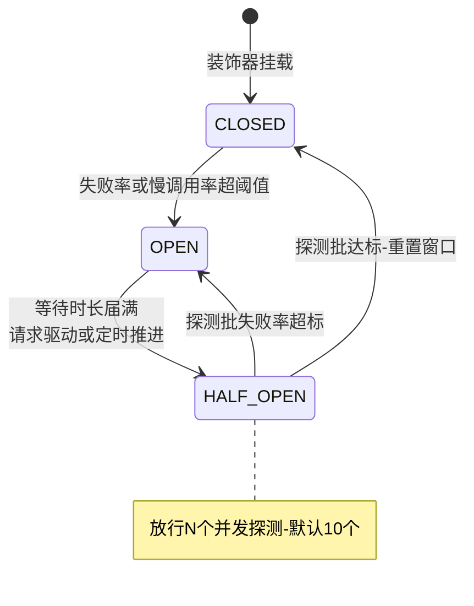
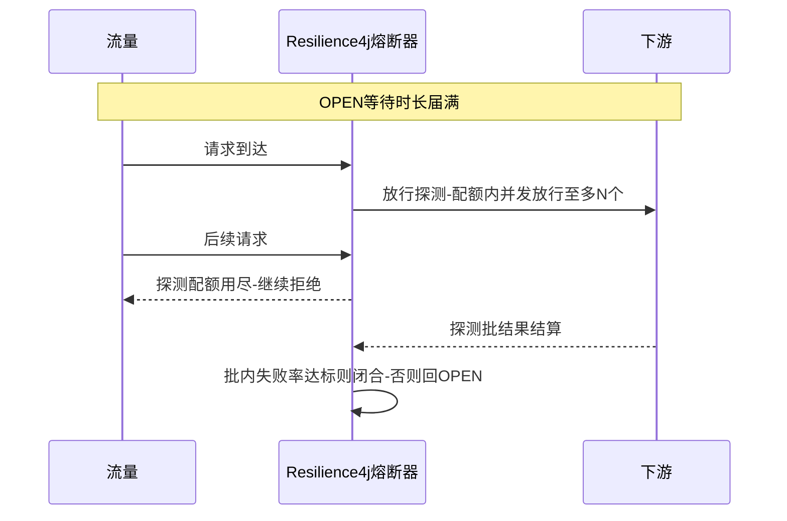

# 异常统计与状态机对比深读：Sentinel 窗口 vs Resilience4j

> **本文核心**：同一台三态状态机，两家实现把力气花在了完全不同的地方——**Sentinel 把统计做成时间桶**（LeapArray 滑动窗口，秒级窗口算异常比例与慢调用比例，统计结构与流控共享），**Resilience4j 把统计做成调用环**（基于环形位图的最近 N 次调用记录，失败率按次数算，统计结构只为熔断而生）。这个分野向上传导到全部行为差异：半开探测放一个请求还是 N 个并发、OPEN 转半开靠请求驱动还是靠定时线程、参数按时间窗定还是按调用数定。**机制链**：调用结果（成功/失败/慢）→ 统计载体（时间桶 or 调用环）→ 比例计算（窗口比例 or 环内失败率）→ 阈值判定 → 状态迁移（开闸的时机、半开的探测协议、闭合的结算）→ 上层语义（链路闸门 or 函数装饰器）。

## 一句话摘要

对比两家熔断实现不是为了选边，而是把「熔断器的可变维度」看全：统计载体（时间桶 vs 调用环）、探测协议（单探针 vs N 并发探测）、恢复驱动（请求惰性 vs 定时自动）、部署形态（链路 Slot vs 装饰器包裹）——**四个维度两两组合，就是评估任何熔断实现（包括自研）的完整坐标系**。

## 前置阅读

- 本系列篇 1《熔断器状态机与半开探测实现》（Sentinel 三态机与单探针）
- 本系列流控算法篇 1《滑动窗口 LeapArray 与统计结构》（时间桶统计的原理）
- Resilience4j 官方文档 CircuitBreaker 章节（公开口径）

## 目标导向

本文是什么：Sentinel 异常统计口径的拆解 + 与 Resilience4j 熔断实现的逐维对比。功能：讲清两种统计载体的账本差异、两种探测协议的取舍、各自参数族的语义。收益：能按团队形态（组件化平台 vs 代码内聚）选实现，能读懂两家的参数族并互译，能拿这套坐标系评估自研熔断器。必看场景：熔断组件选型评审、混合技术栈（Spring Cloud Alibaba 与纯 Spring Boot）治理、自研熔断方案设计。

## 5W 速记卡

| 维度 | 一句话 |
|---|---|
| What | 两种统计载体（时间桶/调用环）与两种探测协议（单探针/N 并发）的对比 |
| Why | 统计载体的分野决定了状态机全部行为差异的根源 |
| When | 熔断组件选型、参数互译、自研熔断器设计评审 |
| Where | Sentinel degrade 包与 Resilience4j circuitbreaker 模块 |
| How | 统计载体对比 → 比例口径对比 → 状态机协议对比 → 部署形态对比 → 选型坐标系 |

## 一、Sentinel 的异常统计口径：时间桶里的分子分母

Sentinel 熔断的统计消费的就是本系列篇 1 拆过的 LeapArray 时间桶：默认统计时长 1000 毫秒（窗口内完成量达到最小请求数 5 才开始判定），三个口径分别取数——**异常比例** = 窗口异常数 / 窗口完成量（成功加异常，阈值 0 到 1 的小数）；**异常数** = 窗口异常绝对数（低频关键操作用）；**慢调用比例** = 窗口内 RT 超过慢调用阈值的完成量占比。分母用「完成量」而不是「通过量」是口径设计的关键：被限流拒绝的请求没到下游、产生不了异常，计入分母只会稀释比例——**统计口径要贴合「下游健康度」这个被测对象，而不是贴合「入口流量」**。

这套统计的工程优势在复用与成本：时间桶与流控共享同一套 LeapArray 结构，读数零额外开销；秒级窗口让熔断响应极快（下游抖动一秒内比例就飙出来）。代价是窗口短带来的方差：窗口内就十几个请求时，两三个异常就把比例推到 20% 以上——最小请求数门槛是必须的，且低频接口要配合异常数口径（互指本系列篇 1 的低峰误杀事故）。

## 二、Resilience4j 的统计口径：环形位图的最近 N 次调用

Resilience4j 不用时间桶，用**滑动窗口按调用次数记账**（COUNT_BASED，默认最近 100 次调用）：环形位图数组记录每次调用的结果位（失败位、慢调用位），失败率 = 环内失败数 / 环内总次数，达到 minimumNumberOfCalls（默认 100）才开始判定。时间维度版（TIME_BASED）按秒分段记录，但**默认与主推形态是次数窗口**——这是与 Sentinel 最根本的分野：**Sentinel 回答「最近一秒坏得多」，Resilience4j 回答「最近一百次坏得多」**。

```java
// Resilience4j 熔断默认参数族（公开文档口径）
CircuitBreakerConfig.custom()
    .failureRateThreshold(50)              // 失败率阈值百分比
    .slowCallRateThreshold(100)            // 慢调用率阈值百分比
    .slowCallDurationThreshold(Duration.ofSeconds(1))  // 慢调用判定线
    .slidingWindowType(COUNT_BASED)        // 次数窗口（默认）
    .slidingWindowSize(100)                // 最近 100 次调用
    .minimumNumberOfCalls(100)             // 判定门槛
    .waitDurationInOpenState(Duration.ofSeconds(60))   // 熔断等待时长
    .permittedNumberOfCallsInHalfOpenState(10)         // 半开放行探测数
    .automaticTransitionFromOpenToHalfOpenEnabled(false) // 定时自动转半开（默认关）
    .build();
```

次数窗口的行为特征要算两笔账。**灵敏度账**：低频接口不需要「凑够窗口」等一秒——凑够 100 次调用就判定，对每秒一两个请求的接口，次数窗口要攒一两分钟，反而比时间窗口迟钝；高频接口则 100 次一眨眼就过，窗口反映的是「最近几十毫秒」的健康度，比秒级窗口更锐利。**内存账**：位图记账每个调用一位，固定 100 次的窗口内存恒定且极小，无锁位运算为主——成本哲学与 Sentinel 的时间桶殊途同归（恒定内存、无锁热路径），只是记账的维度不同。



## 三、状态机协议对比：探测与恢复的两个分水岭

状态机三态两家同构（CLOSED/OPEN/HALF_OPEN），分水岭在探测与恢复协议上。**分水岭一：半开放行量**——Sentinel 单探针（最小验证流量，置信度靠熔断时长顺延补），Resilience4j 半开放行 permittedNumberOfCallsInHalfOpenState（默认 10 个）并发探测、按这批样本重新算失败率定去留——探测置信度高，但下游未恢复时一批探测就是一批真实伤害。**分水岭二：OPEN 转半开的驱动**——Sentinel 惰性（届满后下一个请求 CAS 触发，互指本系列篇 1），Resilience4j 可选定时自动转（automaticTransition 参数打开后由定时调度推进，默认关闭时同样请求驱动）。**分水岭三：闭合结算**——Sentinel 探针成功即闭合重置，Resilience4j 半开批结束后按批内失败率重算（超阈值回 OPEN）。



把半开批的时间线画出来，两家协议的差异一目了然：



## 四、与 Sentinel 熔断状态机的区别：坐标系的四根轴

| 维度 | Sentinel | Resilience4j |
|---|---|---|
| 统计载体 | 时间桶（默认 1 秒窗口） | 调用环（默认 100 次） |
| 半开探测 | 单探针 | N 个并发（默认 10） |
| 恢复驱动 | 请求惰性触发 | 默认请求驱动-可选定时 |
| 部署形态 | Slot 链路闸门 + 控制台规则 | 函数装饰器 + 代码内配置 |

这张表是选型的四根轴，但比表格更重要的是**轴背后的团队形态匹配**：业内惯例是按治理面归属站队——Sentinel 的 Slot 闸门形态把熔断做成「平台能力」——规则控制台热下发、全应用统一治理、与流控热点系统规则同域管理，适合有中间件团队的组件化平台；Resilience4j 的装饰器形态把熔断做成「代码能力」——随代码走、随应用部署、无外部依赖，适合团队自治度高、不想引入控制台基础设施的小型架构。**形态差异比参数差异更难折中**：装饰器要长出控制台，等于重新长出 Sentinel 的治理面；Sentinel 要内嵌到函数调用点，就丢掉了链路闸门的全局视角。

## 五、不同量级的思考：熔断实现随规模的换挡

- **十万级（单应用或小集群）**：约束来源是基础设施预算——这一档的核心问题是「治理面要不要建」，而不是「哪家算法强」。没有控制台运维预算就选装饰器形态（Resilience4j 或 Sentinel 本地规则），有平台化诉求就上 Slot 闸门形态，思考方式是成本驱动：熔断的算法两家都不弱，分差在治理基础设施的运维账上。自下而上收尾：小规模下两家的行为差异几乎感知不到；向上触发升级的条件是规则数量与应用数量——治理面成本开始超过算法收益。
- **百万级（平台化、应用数百）**：约束来源是规则治理的规模效应——这一档的核心问题是「参数与规则的统一治理」，而不是「单应用熔断准不准」。Sentinel 形态的优势兑现：规则集中下发、参数模板化、熔断事件统一观测（互指专题层规则持久化篇）；Resilience4j 要达到同等治理水平得自建配置分发层，思考方式是治理驱动。向上触发升级的条件是跨机房多活——熔断状态与流量调度的联动成为新维度。
- **亿级（全站链路纵深）**：约束来源是熔断的宏观协同——这一档的核心问题是「万级熔断器实例的宏观行为可预测」，而不是「单台状态机更聪明」。此时实现差异退居其次，思考方式是架构驱动：熔断事件汇入全局稳定性观测、恢复期与限流预热衔接（互指本系列篇 1 的恢复编排）、按依赖等级分域治理——**选型结论往往是「主形态统一 + 局部特例」，而不是一家通吃**。自下而上收尾：两家的单机语义都足够可靠，宏观层靠的是治理结构。

## 六、典型场景与误区

**典型场景**：Spring Cloud Alibaba 技术栈全站接入（Sentinel，与流控热点系统规则统一治理）；纯 Spring Boot 轻量应用加弹性（Resilience4j，零基础设施）；遗留 Hystrix 应用迁移（Resilience4j 为官方继承者，函数形态迁移成本最低，选型决策树收束在整合层全景篇）；函数式调用点精细控制（Resilience4j 装饰器按调用点粒度挂策略）。

**常见误区**：① **拿参数族直接互译**——Sentinel 的「统计时长 1 秒」与 Resilience4j 的「窗口 100 次」在高频接口上根本不是同一个窗口，迁移要按「最近多久的健康度」语义重新标定，不能数字对抄；② **以为半开探测数越多越稳**——探测批是对病中下游的真实加压，10 个并发探测对脆弱下游可能就是压死骆驼的最后一根稻草，探测数要与下游恢复期的残余容量对账；③ **把装饰器形态当「更轻的 Sentinel」**——丢掉的是治理面不是重量，应用数上百后自建配置分发的成本会追平引入控制台的投入；④ **混用两套熔断在同一条链路**——内外两层熔断的恢复节奏不同步会造成间歇性互锁，一条链路一台熔断裁判。

## 七、事故与实践叙事

**事故一：迁移时参数直抄导致的钝熔断**。某团队把应用从 Sentinel 迁到 Resilience4j，熔断参数按直觉直抄：统计时长 1 秒译成窗口 100 次、最小请求 5 译成 minimumNumberOfCalls 5。上线后大促压测发现异常熔断「迟钝」：高频接口窗口 100 次在毫秒级滚完，批处理重试风暴一波接一波；低频接口 5 次调用就判定，凌晨小流量又一次误杀重演。复盘重标定：高频接口窗口上调到覆盖「有意义的一段时间」的调用量，低频接口改用时间窗口类型并抬高门槛。**教训**：两家参数族的语义锚点不同（时间锚 vs 次数锚），迁移的本质是语义翻译而不是数字搬运。

**事故二：半开探测批压垮恢复中的下游**。某下游服务内存回收抖动后进入缓慢恢复期，上游 Resilience4j 熔断器等待时长（60 秒）届满自动转半开，10 个并发探测恰好撞上下游还在 Full GC 的窗口，全部超时回 OPEN；但探测批本身又给下游的恢复路径加了一层负载，形成「探测-压垮-再探测」的循环，恢复时间比下游自身需要的时间长了数倍。复盘把探测数降到 2、等待时长改为指数退避（连续探测失败逐步拉长），并在下游侧加了恢复期的准入限流。**教训**：半开探测不是免费的——探测协议的参数要对「下游恢复期的残余容量」负责，这在两家实现里都成立。

**实践叙事：混合栈用同一套坐标系治理**。某公司中间件团队接管了 Sentinel 主力栈与若干 Resilience4j 遗留应用，治理动作不是强行统一，而是把四根轴的坐标系写进规范：所有熔断器（无论哪家）必须注册「统计口径（时间/次数）、探测协议、恢复驱动、告警事件」四项元数据到统一观测层。一次下游故障的复盘里，两栈的熔断时间线在同一时间轴上对照，恢复了各自的探测节奏差异。**选型可以混合，观测口径必须统一——这是混合栈治理的关键纪律**。

## 八、设计思想：统计载体的选择暴露了对「健康」的定义

时间桶与调用环的分野，本质是两家对「下游健康度」定义的分野：**Sentinel 定义健康为「此刻的坏比例」**（时间锚——健康是系统的即时状态），**Resilience4j 定义健康为「最近的坏频率」**（次数锚——健康是交互的统计规律）。两种定义没有对错，适用性取决于故障形态：瞬时抖动（GC、网络毛刺）用时间锚更灵敏（一秒窗口立刻反映），渐进劣化（连接泄漏、容量耗尽）用次数锚更稳健（不受请求速率波动影响）。**统计载体的选择是熔断设计里最接近「世界观」的一次决策**——它决定了后面所有参数的语义空间，做自研熔断方案时应该先回答「我们的健康定义是时间锚还是次数锚」，再谈参数。

## 九、追问链

**质疑者第一层：次数窗口在高频接口上实际反映的是毫秒级健康度，这么锐利不会抖动吗？**——会，所以 Resilience4j 的判定门槛 minimumNumberOfCalls 默认与窗口等长（100 次），且失败率阈值通常留缓冲（默认 50%）；锐利是特性也是风险，防抖的旋钮在「阈值余量」而不是「窗口加长」——**锐利度问题用判定余量对冲，保住窗口的响应性**。

**质疑者第二层：时间窗口的低频方差问题（篇 1 的低峰误杀），Resilience4j 真的解决了吗？**——部分解决：次数口径分母可控（凑够 N 次才判定，比例的统计有效性有保证）；但代价是低频场景的响应延迟（攒样本慢）。两家的低频短板只是换了位置——**没有免费的统计口径，只有取舍位置的挪移**，评审时问「低频接口在你的场景里多不多」。

**质疑者第三层：为什么不干脆两家融合——时间桶统计加 N 探测协议？**——工程上有人这么组（其他框架有类似组合），但每多一个自由度，参数空间就指数膨胀：窗口形状、阈值口径、探测数、恢复节奏四组参数的组合矩阵，没有治理平台兜底时极易配错。**协议的简洁性本身就是正确性的来源**——Sentinel 单探针与 Resilience4j 批探测各自克制，都是在「可推理的参数空间」里收敛。

## 十、你们可能会问

**Q1：混用技术栈的公司怎么选主形态？**
按治理面归属选：已有 Sentinel 控制台与规则治理体系的应用走 Sentinel，独立部署无平台依赖的应用可保留 Resilience4j——统一观测层（四项元数据）比强行统一实现更务实（见实践叙事）。

**Q2：两家的事件告警怎么对齐？**
Sentinel 有熔断状态流转事件可接入告警；Resilience4j 有状态转换事件订阅。对齐口径建议统一到「开闸时刻 / 恢复时刻 / 当前状态」三元组，这是复盘时间轴的最小集。

**Q3：Resilience4j 的时间窗口类型什么时候用？**
流量速率波动大、次数口径失真的场景（比如低峰高峰悬殊的接口），TIME_BASED 按秒记账更贴近「最近一段时间」的语义；但内存与计算成本略高于次数窗口，默认场景用次数窗口即可。

**Q4：自研熔断器该抄哪家的协议？**
先回答健康定义（时间锚还是次数锚），再按部署形态定协议骨架（链路闸门抄 Sentinel 的惰性加单探针、调用点装饰抄 Resilience4j 的批探测）——**协议抄谁是末位决策，健康定义与形态匹配才是前置决策**。

## 💡 实战提示

- 💡 迁移不是数字搬运：时间锚参数与次数锚参数要按「最近多久的健康度」语义重新标定，压测回归必须做
- 💡 半开探测批是对病中下游的真实加压——探测数与恢复期残余容量对账，必要时指数退避
- 💡 决策口径：平台化治理选 Slot 闸门形态（Sentinel）、代码内聚零依赖选装饰器形态（Resilience4j）——按治理面归属选，不按算法宣传选
- 💡 选型推荐：混合栈统一观测元数据（口径/协议/驱动/事件四项），实现可以混、观测口径必须一

## 十一、自测三问

1. 两家统计载体的本质分野是什么？（答：时间桶回答「最近一秒坏得多」、调用环回答「最近一百次坏得多」——时间锚 vs 次数锚的健康定义）
2. 半开探测协议两家的差异与各自代价？（答：Sentinel 单探针最小流量但置信度靠顺延补；Resilience4j 批探测默认 10 个置信度高但对恢复中下游是真实加压）
3. 参数族互译为什么危险？（答：语义锚点不同——1 秒窗口与 100 次窗口在高频接口不是同一个时间跨度，迁移必须语义重标定加压测回归）

## 十二、开放问题

- 统计载体的自适应切换（低频自动转次数锚、高频自动转时间锚）需要在线识别流量形态，尚无成熟开源实现。
- 熔断状态的跨实例聚合视图（同资源多实例状态合并）两家都缺位，属于集群层课题（互指整合层全景篇）。

## 📎 核心带走

- **核心一句话**：统计载体（时间桶 vs 调用环）的分野决定熔断器全部行为差异——评估任何熔断实现用四根轴：统计口径、探测协议、恢复驱动、部署形态
- **机制链**：调用结果记账 → 时间桶比例 or 环内失败率 → 阈值判定 → 开闸（比例触发）→ 恢复（单探针 or 批探测，请求驱动 or 定时推进）→ 结算（闭合重置 or 回开闸）
- **失效点/边界**：时间锚低频方差大（门槛守门）、次数锚低频迟钝（攒样本慢）；探测批对恢复中下游是真实加压；参数族不可数字直抄；形态差异（治理面 vs 代码能力）比参数差异更难折中

## 📌 数据与事实声明

- 写于 2026-09-23，Sentinel 机制以 1.8.10 官方源码为基准，Resilience4j 参数默认值以其官方文档为基准（均为公开口径）
- 免责：版本行为以各自官方文档为准，以官方文档为准

## 📚 参考资料

| 类型 | 标题 | 来源 |
|---|---|---|
| 官方文档 | Resilience4j CircuitBreaker（参数族与状态机） | resilience4j.readme.io |
| 官方源码 | Sentinel degrade 包 / Resilience4j circuitbreaker 模块 | github.com |
| 关联文章 | 本系列篇 1（三态机与单探针）、整合层全景篇（三框架选型决策树） | 本仓库 middleware/sentinel |
| 机制域 | 稳定性工程系列（熔断机制跨实现定义） | 本仓库 architecture/system-design/stability |
