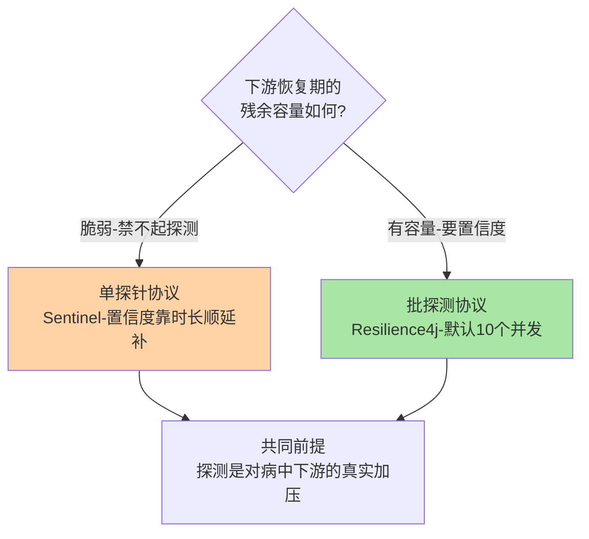
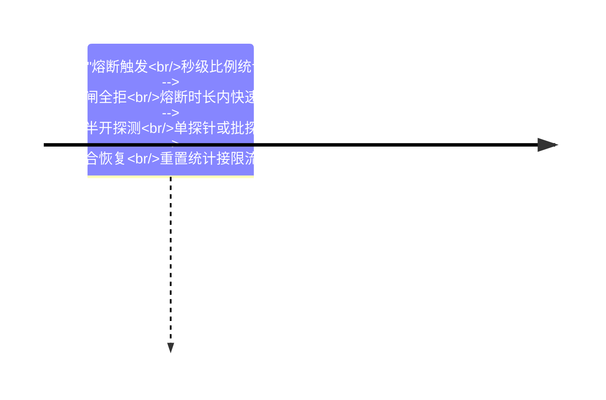

# 深入理解熔断器实现系列总览：状态机、探测与横向对比

> **本文核心**：熔断器实现系列沿「状态机 → 对比坐标系」两篇展开——篇 1 拆 Sentinel 1.8 的三态状态机（每规则一个熔断器实例、惰性流转、单探针恢复），篇 2 把异常统计口径与 Resilience4j 状态机逐维对比（时间桶 vs 调用环、单探针 vs 批探测），给出评估任何熔断实现的四根轴。两篇合起来回答一个判断题：**熔断器的差异不在三态理论，而在统计载体与探测协议这两个工程决策上**。

## 一句话摘要

篇 1 讲透 Sentinel 三态机的两个关键决策（恢复由请求驱动、探测只放一个请求），篇 2 讲透它与 Resilience4j 的分野根源（时间锚 vs 次数锚的健康定义）——读懂这两篇，任何熔断器在你眼里都只剩四个可变维度。

## 系列导航

| 篇目 | 深挖点 | 核心结论 |
|---|---|---|
| 1_熔断器状态机与半开探测实现-深度 | 三态 CAS 流转 / 单探针协议 / 参数联动 | 熔断时长是给下游的恢复时间预算，不是拍脑袋数字 |
| 2_异常统计窗口与Resilience4j状态机对比-深度 | 统计载体 / 探测协议 / 形态匹配 | 评估熔断实现用四根轴，参数族不可数字直抄 |

## 两种探测协议的取舍图

## 与相邻层的关系

入门层篇 4 给三种熔断策略的概念语义，本系列给状态机实现与横向对比；机制的正源（熔断器通用理论）在稳定性工程系列，三框架的最终选型决策树收束在整合层全景篇。

## 📌 数据与事实声明

- 写于 2026-09-23，机制口径以 Sentinel 1.8.10 官方源码与 Resilience4j 官方文档为基准（公开口径）
- 免责：以各篇参考资料与所用版本源码为准

## 📚 参考资料

| 类型 | 标题 | 来源 |
|---|---|---|
| 系列入口 | Sentinel 入门层系列（篇 4 熔断降级） | 本仓库 middleware/sentinel/入门层 |

